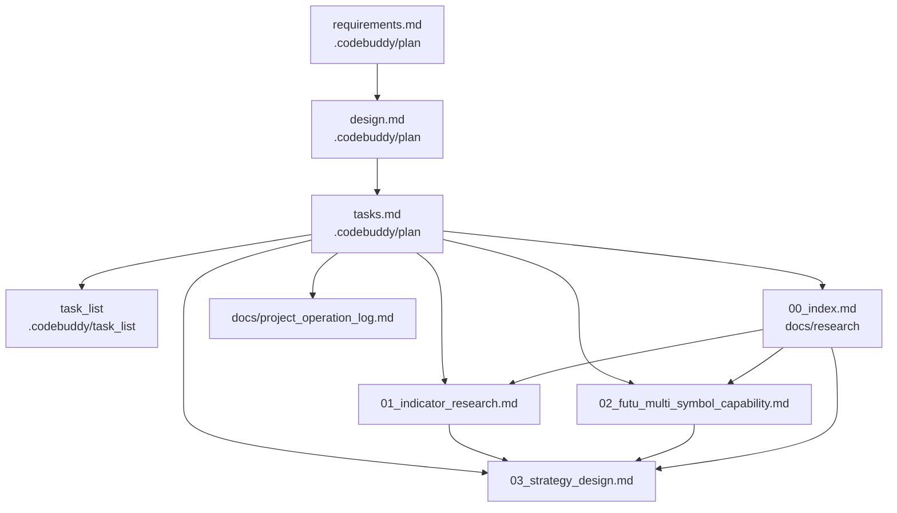

# 设计文档

## 概述

本设计面向"美股多标的量化策略研究 + 方案设计"任务，目标是按 [requirements.md](/projects/vnpy/.codebuddy/plan/us_multi_symbol_quant/requirements.md) 五大需求，产出一组互相链接的研究文档与一份策略方案设计，**不引入任何可运行代码改动**，不影响现有策略与运行入口。

整体产物分为两类：

1. **plan 类（流程文件）**：放在 `.codebuddy/plan/us_multi_symbol_quant/`，含 `requirements.md / design.md / tasks.md`，以及对应的 `.codebuddy/task_list/us_multi_symbol_quant.md` 进度文件。
2. **研究/方案文档（交付物）**：放在 `docs/research/us_multi_symbol_quant/`，含 4 份 markdown：
   - `00_index.md`：汇总入口
   - `01_indicator_research.md`：美股有效指标调研
   - `02_futu_multi_symbol_capability.md`：Futu 多标的能力评估
   - `03_strategy_design.md`：多标的策略方案

最终在 `docs/project_operation_log.md` 追加一条变更摘要，并在交互层根据"实际执行前确认规则"拒绝任何会触发回测/下单/git 推送的动作，除非用户明确确认。

## 架构

研究产物间的引用关系如下：



数据来源仅限三处：

- 平台 API/能力：[futu_quant.md](/projects/vnpy/tmp/futu_quant.md)（355.8 KB，事实唯一来源）。
- 现有策略上下文：[us_nvda_1d_strategy_multifactor.py](/projects/vnpy/tmp/strategy/us_nvda_1d_strategy_multifactor.py)、[strategy_classic_multifactor.py](/projects/vnpy/tmp/strategy/strategy_classic_multifactor.py)、[run_local_backtest.py](/projects/vnpy/tmp/run_local_backtest.py)。
- 项目现状：`docs/system_integration_guide.md`、`docs/adaptive_quant_engine_design.md`（仅作引用对齐，本任务不修改）。

## 组件和接口

由于本任务无代码产出，"组件"以**文档章节模板**与**评审清单**形式表达，确保后续撰写时结构稳定、口径一致。

### 组件 1：指标调研报告 `01_indicator_research.md`

固定章节结构：

1. **摘要**：本报告涵盖范围、阅读路径。
2. **维度划分**：趋势 / 动量 / 波动率 / 量能 / 横截面，5 个一级章节。
3. **每个指标条目模板（强约束）**：
   - 名称与英文缩写
   - 计算口径（公式或文字描述）
   - 典型参数（日线、小时线两套）
   - 适用市场状态：✅ 趋势 / ⚠️ 震荡 / ❌ 极端事件 …
   - 常见组合伙伴
   - 已知陷阱（前视、过拟合、横盘失效等）
   - **Futu 平台映射**：内建 API 名（如 `rsi`、`macd_dif`、`atr_atr`、`boll_upper/mid/lower`、`vwap`、`obv`、`get_MyLang_indicator`）+ 是否需要麦语言自实现 + 自实现成本评级（低/中/高）
4. **短名单**：在末尾给出 8–15 个核心指标，按"日线优先"和"小时线优先"两栏列出。

依据 [futu_quant.md](/projects/vnpy/tmp/futu_quant.md) 已确认的内建指标位置（用于报告内引用，避免编造）：

| 类别 | 指标 | Futu 内建 API | futu_quant.md 行号 |
|------|------|---------------|--------------------|
| 趋势 | MA / EMA | `ma()` / `ema()` | 33 / 153 |
| 趋势 | MACD | `macd_dif/dea/macd`、`is_macd_golden_cross/...` | 979 / 1099 |
| 趋势 | SAR | `sar()`、`is_sar_up_trend/...` | 273 / 433 |
| 趋势 | DMI/ADX | `get_MyLang_indicator('DMI', ...)` | 1311 |
| 动量 | RSI | `rsi()` | 3014 |
| 动量 | KDJ | `is_kdj_*` | 2426 |
| 动量 | CCI | (章节 # CCI) | 2710 |
| 动量 | ROC | (章节 # ROC) | 3376 |
| 动量 | AROON | `get_MyLang_indicator('AROON', ...)` | 2086 |
| 波动率 | ATR | `atr_tr` / `atr_atr` | 1625 / 1663 |
| 波动率 | BOLL | `boll_upper / boll_mid / boll_lower / is_boll_*` | 4985 / 5024 / 5063 |
| 波动率 | HV | `historical_volatility()` | 935 |
| 量能 | OBV | (章节 # OBV) | 4216 |
| 量能 | VWAP | `vwap()` | 4017 |
| 量能 | VMACD | `get_MyLang_indicator('VMACD', ...)` | 1403 |

### 组件 2：Futu 多标的能力评估 `02_futu_multi_symbol_capability.md`

固定章节：

1. **结论摘要表（能力矩阵）**

   | 能力项 | Futu 内建 | 麦语言自实现 | 外部补齐 | 备注 |
   |--------|-----------|---------------|----------|------|
   | 多标的驱动（≤50） | ✅ | – | – | 文档行 14629/14853 |
   | 跨 symbol 调用同一指标 | ✅ | – | – | 所有指标 API 含 `symbol=Contract(...)` |
   | 横截面排序选股 | ⚠️ | ⚠️ | ✅ 可用本地预处理 | 需 handle_data 内自循环遍历 trig 标的并排序 |
   | 多 symbol 同时下单 | ⚠️ | – | – | 需考虑资金竞争与订单幂等 |
   | 多市场（US+HK）混合回测 | ⚠️ | – | – | 需用文档行号与配置项确认 |
   | 麦语言注册→多 symbol 复用 | ✅ | – | – | `register_indicator` 一次注册，按 symbol 调用 |

2. **关键事实清单（带 futu_quant.md 引用）**：单策略最多 50 个 trig 标的、`handle_data` 由所有 trig 行情驱动、内建指标 API 形参均含 `symbol=Contract('US.XXXX')`、麦语言通过 `register_indicator + get_MyLang_indicator` 调用。
3. **多标的策略风险点**：资金竞争、同 K 线多 symbol 信号冲突、回测对齐、跨市场时区。
4. **能力差异（Futu 平台 vs 本地 [run_local_backtest.py](/projects/vnpy/tmp/run_local_backtest.py)）**：列出回测语义、滑点、成交模型、撮合精度差异。
5. **是否阻塞需求 3 方案**：逐条标注。

### 组件 3：多标的策略方案 `03_strategy_design.md`

固定章节：

1. **目标与约束**：年化、Sharpe、最大回撤、单标的最大暴露等数值化目标（建议数值，待回测校准）。
2. **标的池**：5–20 只美股大盘流动股 + NVDA，给出候选清单与"为什么不超过 50"的说明。
3. **信号体系（4 因子组合）**：
   - 趋势：MA20/MA60 多头排列、MACD 金叉
   - 动量：RSI 从超卖回升、KDJ 低位金叉
   - 波动率：ATR 区间过滤（避免极端）、BOLL 中轨支撑
   - 量能：VWAP/OBV 同向、量比 ≥ 1.2
   - **横截面打分**：各因子 0–100 分加权，日线收盘后选 top-N 进入候选池
4. **仓位与资金管理**（份制扩展）：
   - 单标的最大 5 份（沿用 NVDA 多因子策略经验）
   - 组合层面最大持仓 = top-N × 1 份（首仓）
   - 单标的首仓基于"组合本金锁定值"切片，避免随浮盈漂移（与 NVDA 策略修复后的 base_capital 思路一致）
5. **风控规则**（≥4 条）：
   - 单标的止损 5%（对齐现有策略）
   - 组合层面回撤熔断 ≥ 12% 暂停加仓
   - ATR 极端过滤：当日 ATR/价格 > 阈值不开新仓
   - 相关性过滤：候选 top-N 中两两相关性 > 0.85 仅保留分高者
6. **回测与评估**：
   - **双轨回测**：① Futu 平台回测（贴近实盘撮合）② 本地 [run_local_backtest.py](/projects/vnpy/tmp/run_local_backtest.py) 交叉验证
   - 评估指标：年化、Sharpe、Sortino、最大回撤、Calmar、胜率、PF、平均持仓天数、与 SPY/QQQ 基准对齐
7. **上线路径（3 阶段）**：
   - 阶段 ①：单标的多因子（已有 NVDA 策略，作基线）
   - 阶段 ②：固定股票池多标的，相同规则跑 N 个 symbol
   - 阶段 ③：横截面排序选股，每根 K 线动态选 top-N
8. **降级/风险标记**：每条规则若 Futu 平台不直接支持，标注降级方案。
9. **与现有策略的关系**：明确不修改 [us_nvda_1d_strategy_multifactor.py](/projects/vnpy/tmp/strategy/us_nvda_1d_strategy_multifactor.py) 与 [strategy_classic_multifactor.py](/projects/vnpy/tmp/strategy/strategy_classic_multifactor.py)；本方案为后续阶段 ②/③ 的设计预案。

### 组件 4：汇总入口 `00_index.md`

- 列出 3 份子文档与跳转链接
- 给出阅读顺序建议（指标 → 平台 → 方案）
- 列出本研究的边界与非目标（与 `requirements.md` 的需求 5 对齐）

### 组件 5：项目操作日志同步

在 `docs/project_operation_log.md` 末尾追加一条记录：

```
## 2026-05-20  美股多标的量化策略研究文档
- 变更范围：新增 docs/research/us_multi_symbol_quant/ 下 4 份研究/设计文档；新增 .codebuddy/plan/us_multi_symbol_quant/ 与 .codebuddy/task_list/us_multi_symbol_quant.md
- 关键文件：00_index.md / 01_indicator_research.md / 02_futu_multi_symbol_capability.md / 03_strategy_design.md
- 影响摘要：仅文档，不改代码、不触发回测/下单/远端推送；为后续多标的策略落地提供研究基线
```

## 数据模型

本任务无代码 / 数据库 / 接口定义。"数据模型"约束体现为研究文档中的两个标准化表格结构：

1. **指标条目表**（用于 `01_indicator_research.md`）：
   ```
   | 字段 | 含义 |
   |------|------|
   | name | 指标名 |
   | dimension | 趋势/动量/波动率/量能/横截面 |
   | params_daily | 日线常用参数 |
   | params_hourly | 小时线常用参数 |
   | regime_fit | 适用市场状态 |
   | partners | 常见组合伙伴 |
   | pitfalls | 已知陷阱 |
   | futu_api | Futu API 名或"麦语言自实现" |
   | futu_ref_line | 在 futu_quant.md 中的行号 |
   | self_impl_cost | 低/中/高 |
   ```

2. **能力矩阵表**（用于 `02_futu_multi_symbol_capability.md`）：见组件 2 中的能力矩阵示例结构。

## 错误处理

文档级风险与对策：

| 风险 | 对策 |
|------|------|
| 引用 `futu_quant.md` 行号或 API 名不准确 | 任何 API 名/行号在写入文档前必须经 `grep_search` 二次校验，禁止凭记忆填写 |
| 指标推荐落地不可行（Futu 不支持） | 在指标条目表的 `futu_api` 字段必须明确标注，并给出降级方案 |
| 方案规则越过当前研究边界（误导用户当作可执行策略） | `03_strategy_design.md` 顶部加显著说明："本文为设计文档，不含可直接运行代码；落地需按 plan 流程发起" |
| 误触发交易/回测/git 推送 | 严格遵守"实际执行前确认规则"：本任务全程只做文档写入，不执行 backtest 脚本、不连接 OpenD、不 `git push` |
| 文档与现有 `docs/` 风格不一致 | 沿用现有 markdown 风格（标题层级、表格、引用路径），并在 `00_index.md` 中关联 `system_integration_guide.md` |

## 测试策略

文档型产出无单元测试，但需通过以下"自检清单"：

1. **完备性自检**：
   - `requirements.md` 中需求 1–5 的每个 AC 是否在 `01/02/03/00` 文档中有对应章节或表格条目。
2. **事实一致性自检**：
   - 指标调研中所有 Futu API 名 / 行号 → 用 `grep_search` 在 `futu_quant.md` 中二次确认存在。
   - 能力矩阵中"≤50 个 trig 标的"等关键论点 → 必须有 `futu_quant.md` 行号引用。
3. **文档可读性自检**：
   - 4 份 markdown 之间链接全部可点击（相对路径）。
   - `00_index.md` 列出阅读路径与边界。
4. **流程合规自检**：
   - 不执行任何 backtest/下单/git 推送命令。
   - 完成后在 `docs/project_operation_log.md` 追加一条记录。
   - 更新 `.codebuddy/task_list/us_multi_symbol_quant.md` 的完成状态。
5. **敏感信息自检**：
   - 不出现真实账号、完整资金、密钥；资金示例使用脱敏占位符或区间。
