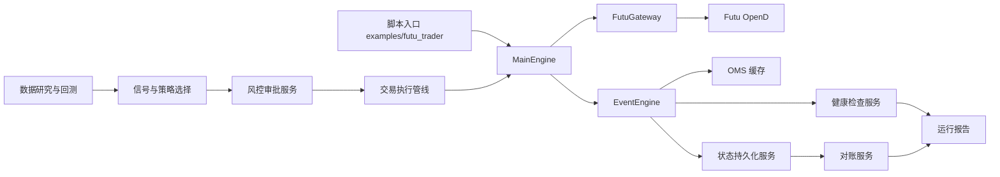
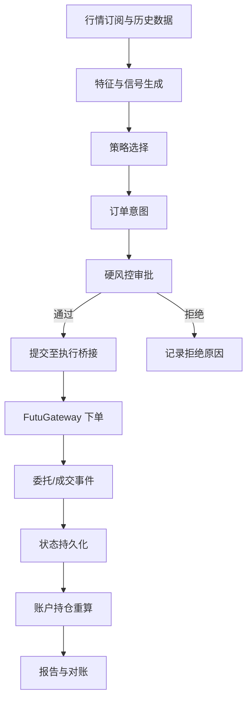
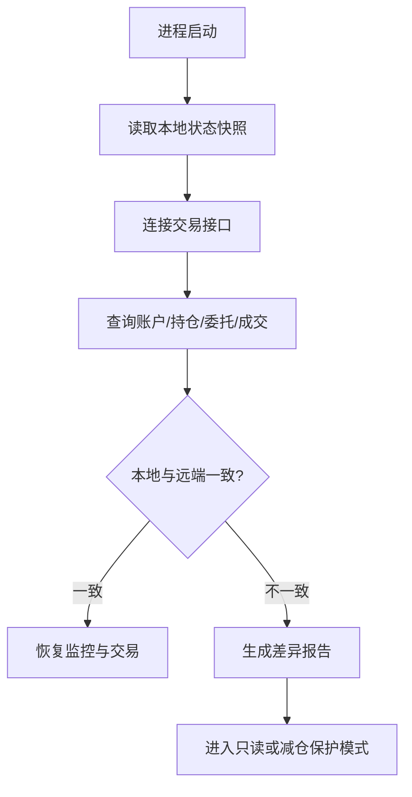

## Product Overview

面向美股/港股的量化交易系统，围绕行情订阅、模拟交易、风控执行、状态沉淀、研究评估和实盘运行形成分阶段建设计划。系统以脚本、日志、报告和监控摘要为主要呈现形式，不新增前端界面。

## Core Features

- **模拟盘闭环**：支持从行情订阅、信号生成、下单、撤单、成交回报到账户/持仓更新的完整验证流程。
- **风控执行链路**：在交易前、中、后加入资金、仓位、标的、交易频率、环境开关、异常熔断等控制。
- **状态持久化**：沉淀账户、持仓、委托、成交、信号、审批和运行快照，支持重启恢复与审计追踪。
- **数据研究与回测**：接入历史行情、因子研究、策略筛选和回测评估，形成候选标的与策略组合。
- **实盘可靠性**：覆盖连接健康检查、重连、对账、报告、告警、灰度上线和真实交易保护。
- **阶段化交付**：每个阶段都有可验证产物，先完成模拟可控闭环，再逐步推进小资金实盘与稳定运行。

## Tech Stack

- **语言与运行环境**：Python 3.10+，沿用当前项目类型标注与 dataclass 风格。
- **核心框架**：复用现有事件驱动交易框架，包括 `EventEngine`、`MainEngine`、`BaseGateway`、OMS 缓存和标准交易对象。
- **交易网关**：复用 `vnpy_futu/futu_gateway.py` 已有 Futu OpenD 行情、交易、订阅、下单、撤单、账户、持仓、委托、成交和历史 K 线能力。
- **数据与研究**：复用 `pandas`、`numpy`、`ta-lib`、`plotly` 及 `vnpy/alpha/` 中的研究、因子和回测基础。
- **LLM 辅助模块**：复用 `vnpy_llm/` 中已有信号、评分、风控、报告和脚本能力，但保持其作为辅助决策输入，不直接绕过硬风控。
- **日志与质量工具**：沿用 `loguru`、ruff、mypy 配置；新增模块应保持小范围、强类型、可测试。

## Existing Code Findings

- `pyproject.toml` 当前 wheel 包只包含 `vnpy`，后续若要正式发布应纳入 `vnpy_futu`、`vnpy_llm` 及必要服务模块。
- `vnpy_futu/futu_gateway.py` 已支持 HK、US、CN、HK_FUTURE 市场及模拟/真实环境，当前以限价单为主，已有定时查询账户/持仓能力。
- `AccountData` 等标准对象较通用，仅包含基础资金字段；多币种、交易日历、审批记录、运行健康状态宜优先放入服务层扩展模型，避免大改核心对象。
- `services/` 与 `execution/` 目录已预留领域边界，适合承载模拟账户、风控、状态、健康检查、报告和执行桥接。
- `examples/futu_trader/` 当前为空，适合作为模拟盘闭环、手动验收和回归脚本入口。
- `vnpy_llm/` 已有 `risk.py`、`scoring.py`、`signal_store.py`、`report.py`、`strategy_selector.py`，可接入交易前摘要、软信号和风险说明。

## System Architecture

系统应遵循当前事件驱动架构，不引入新的大型框架。新增服务以“脚本入口 + 执行管线 + 风控服务 + 状态仓库 + 报告健康检查”的方式接入现有交易引擎。



## Module Division

### 1. Futu 执行桥接模块

- **目录建议**：`execution/futu_bridge/`
- **职责**：封装连接、订阅、下单、撤单、查询和环境保护，统一模拟/真实环境行为。
- **依赖**：`vnpy_futu.futu_gateway.FutuGateway`、`MainEngine`、标准请求对象。
- **接口**：连接配置加载、订阅标的、提交订单意图、撤单、查询账户/持仓。

### 2. 模拟盘会话模块

- **目录建议**：`services/futu_sim_trade/`、`examples/futu_trader/`
- **职责**：运行美股/港股模拟交易会话，验证行情、订单、成交、状态更新和报告生成。
- **依赖**：执行桥接、风控、状态仓库、报告服务。
- **接口**：启动模拟会话、加载观察列表、生成测试订单、输出会话摘要。

### 3. 风控执行模块

- **目录建议**：`services/risk_engine/`、`services/execution_guard/`、`services/approval_gate/`
- **职责**：交易前审批、交易中熔断、交易后风险复核；覆盖多币种、市场、交易时段、仓位和订单频率。
- **依赖**：账户/持仓快照、信号决策、配置策略、交易日历。
- **接口**：`check_order(intent)`、`approve(decision)`、`should_halt(reason)`。

### 4. 状态持久化模块

- **目录建议**：`services/trade_state/`
- **职责**：保存账户、持仓、委托、成交、信号、审批、运行快照和断点恢复信息。
- **依赖**：事件引擎、标准数据对象、文件/SQLite 等轻量存储。
- **接口**：写入事件、读取最新状态、恢复活跃委托、导出审计日志。

### 5. 数据研究与策略评估模块

- **目录建议**：`services/candidate_engine/`、`services/evaluation_hub/`、`services/backtest/`
- **职责**：拉取历史数据、计算因子、生成候选标的、策略选择和回测评估。
- **依赖**：`vnpy/alpha/`、Futu 历史 K 线、`vnpy_llm/strategy_selector.py`。
- **接口**：候选生成、特征计算、策略评分、回测报告。

### 6. 可靠性与报告模块

- **目录建议**：`services/healthcheck/`、`services/reporting/`
- **职责**：连接心跳、延迟监控、异常记录、日终对账、运行报告和实盘准备检查。
- **依赖**：状态仓库、Gateway 日志、账户/持仓/委托查询。
- **接口**：健康探测、对账摘要、日报/盘前报告、异常告警钩子。

## Data Flow

### 模拟盘与实盘统一执行流



### 重启恢复与对账流



## Core Directory Structure

仅展示后续阶段计划中需要新增或修改的关键路径：

```text
project-root/
├── docs/
│   └── futu-us-hk-quant-trading-system-plan.md      # 保存分阶段建设计划
├── pyproject.toml                                   # 后续纳入 vnpy_futu/vnpy_llm/服务模块打包
├── vnpy_futu/
│   └── futu_gateway.py                              # 增强连接、元数据、异常恢复和查询可靠性
├── examples/
│   └── futu_trader/
│       ├── run_paper_session.py                     # 模拟盘闭环入口
│       ├── run_live_readiness_check.py              # 实盘准备检查入口
│       └── config.example.json                      # 示例配置
├── execution/
│   ├── futu_bridge/                                 # Futu 执行适配
│   ├── paper_bridge/                                # 模拟执行约束
│   └── live_bridge/                                 # 实盘保护开关
├── services/
│   ├── futu_sim_trade/                              # 模拟盘会话编排
│   ├── risk_engine/                                 # 硬风控规则
│   ├── execution_guard/                             # 下单前拦截与熔断
│   ├── trade_state/                                 # 状态持久化与恢复
│   ├── candidate_engine/                            # 候选标的与特征
│   ├── evaluation_hub/                              # 回测与评估汇总
│   ├── healthcheck/                                 # 连接与运行健康检查
│   └── reporting/                                   # 盘前、盘后、异常报告
└── vnpy_llm/
    ├── risk.py                                      # 作为软风控输入复用
    ├── strategy_selector.py                         # 作为策略选择辅助复用
    └── report.py                                    # 作为报告输出能力复用
```

## Key Code Structures

### 交易会话配置

```python
from dataclasses import dataclass
from typing import Literal

@dataclass(frozen=True)
class TradingSessionConfig:
    gateway_name: str
    market: Literal["US", "HK"]
    environment: Literal["SIMULATE", "REAL"]
    symbols: list[str]
    base_currency: str
    max_order_value: float
    dry_run: bool = True
```

### 订单意图与风控结果

```python
from dataclasses import dataclass
from enum import Enum

class RiskLevel(str, Enum):
    PASS = "pass"
    WARN = "warn"
    BLOCK = "block"

@dataclass(frozen=True)
class OrderIntent:
    vt_symbol: str
    direction: str
    volume: float
    price: float
    strategy_name: str
    reason: str

@dataclass(frozen=True)
class RiskCheckResult:
    level: RiskLevel
    allowed: bool
    adjusted_volume: float
    reasons: list[str]
    require_manual_approval: bool = False
```

### 状态仓库接口

```python
from typing import Protocol, Any

class TradeStateStore(Protocol):
    def append_event(self, event_type: str, payload: dict[str, Any]) -> None: ...
    def save_snapshot(self, snapshot_type: str, payload: dict[str, Any]) -> None: ...
    def load_latest_snapshot(self, snapshot_type: str) -> dict[str, Any] | None: ...
    def list_audit_events(self, session_id: str) -> list[dict[str, Any]]: ...
```

## Technical Implementation Plan

### 阶段一：现状固化与计划文档

- **问题**：已有框架、网关和服务目录分散，需要形成明确边界和后续执行顺序。
- **方案**：保存计划文档，补充当前能力清单、风险清单、阶段验收标准。
- **步骤**：

1. 梳理 `vnpy/` 核心交易链路和 `vnpy_futu/` 网关能力。
2. 明确 `services/`、`execution/`、`examples/futu_trader/` 的职责边界。
3. 写入阶段计划、依赖顺序和验收口径。

- **测试策略**：文档评审，确认每阶段都有可验证脚本或报告产物。

### 阶段二：模拟盘闭环

- **问题**：需要先证明行情、信号、风控、订单和状态更新能在模拟环境闭环运行。
- **方案**：新增模拟盘会话脚本，优先使用小范围标的和限价单，所有交易经过风控。
- **步骤**：

1. 构建配置加载和 Futu 模拟环境连接。
2. 订阅美股/港股观察列表行情。
3. 生成最小订单意图并经过风控审批。
4. 下单、撤单、接收委托/成交事件并输出会话报告。

- **测试策略**：使用模拟环境执行单标的、小数量、可撤单测试；验证日志、状态和报告一致。

### 阶段三：硬风控与执行保护

- **问题**：实盘前必须阻断错误环境、超额订单、非交易时段、重复下单和异常状态。
- **方案**：建立执行拦截层，所有订单意图先通过硬风控，再进入 Gateway。
- **步骤**：

1. 实现账户资金、单笔金额、标的白名单、日内次数、最大仓位规则。
2. 引入市场交易时段和节假日校验。
3. 建立熔断状态，异常后切换只读或减仓模式。
4. 接入 `vnpy_llm.risk` 作为软风控补充，但不替代硬风控。

- **测试策略**：构造通过、警告、拒绝和熔断用例；验证拒绝订单不会触达 Gateway。

### 阶段四：状态持久化与恢复

- **问题**：交易系统重启后需要恢复账户、持仓、活跃委托和审计链路。
- **方案**：通过事件订阅写入本地状态仓库，启动时先本地恢复再远端查询对账。
- **步骤**：

1. 订阅订单、成交、账户、持仓和日志事件。
2. 保存事件流和最新快照。
3. 实现启动恢复和远端对账。
4. 生成差异报告并进入保护模式。

- **测试策略**：模拟重启、漏事件、重复成交、委托状态变化，验证恢复结果稳定。

### 阶段五：数据研究与回测评估

- **问题**：实盘策略需要由历史数据、候选标的和回测表现支撑。
- **方案**：复用历史 K 线和研究模块，建立候选生成、特征计算、策略选择和回测摘要。
- **步骤**：

1. 批量拉取美股/港股历史 K 线并标准化。
2. 计算趋势、波动、成交量、风险和资金特征。
3. 接入策略选择器形成候选池。
4. 输出回测和实盘观察报告。

- **测试策略**：使用固定时间窗口和固定标的回归，验证指标、候选和报告可复现。

### 阶段六：实盘可靠性与灰度上线

- **问题**：真实交易需要健康检查、对账、告警、手动确认和小资金灰度。
- **方案**：将真实环境默认保护为只读/干跑，逐步开放小额交易，并要求每次上线前通过检查清单。
- **步骤**：

1. 实现连接心跳、行情延迟、委托回报延迟监控。
2. 增加盘前准备检查和盘后对账报告。
3. 建立真实环境二次确认与开关文件。
4. 先小资金、单标的、低频策略灰度运行。

- **测试策略**：使用只读真实环境验证查询；模拟断线、拒单、延迟和对账差异。

## Integration Points

- **Futu OpenD**：行情、交易、账户、持仓、委托、成交和历史 K 线查询。
- **交易事件系统**：通过 `EventEngine` 订阅标准事件，避免直接耦合 Gateway 内部实现。
- **OMS 缓存**：通过 `MainEngine.get_all_orders()`、`get_all_positions()`、`get_all_accounts()` 获取当前状态。
- **LLM 模块**：仅提供信号评分、策略建议和报告说明，最终交易权限由硬风控决定。
- **报告输出**：Markdown、JSON、JSONL 审计日志，便于本地查看、版本追踪和后续告警集成。
- **认证与密钥**：Futu 密码、LLM API Key 和真实交易开关应从本地配置或环境变量读取，不写入代码。

## Technical Considerations

### Logging

- 沿用现有 `write_log`、`LogData` 和项目日志风格。
- 所有拒单、熔断、实盘开关变化、对账差异必须写入审计日志。
- 日志中禁止输出交易密码、API Key 和完整敏感配置。

### Performance

- 行情事件高频进入时，状态持久化应批量写入或异步缓冲，避免阻塞事件分发。
- 历史 K 线拉取应分页、缓存，并控制 Futu API 调用频率。
- 报告生成与研究任务不应运行在交易事件主线程。

### Security

- 真实环境默认只读或干跑，必须显式开启交易。
- 订单必须经过标的白名单、金额、数量、价格偏离和交易时段校验。
- 配置文件应提供示例，不提交真实账户、密码和密钥。
- 异常或状态不一致时优先 fail-closed，阻止新开仓。

### Scalability

- 服务层以清晰接口隔离，可后续替换存储、告警、数据源或增加券商网关。
- 风控规则采用可组合规则集，便于增加市场、币种和策略维度。
- 研究与交易运行解耦，避免回测任务影响实盘执行。

## Agent Extensions

### SubAgent

- **code-explorer**
- Purpose: 在后续实施前复核现有仓库中核心交易链路、Futu 网关、服务目录和相关脚本边界。
- Expected outcome: 形成准确的文件级影响清单，避免误改核心框架或重复建设已有能力。