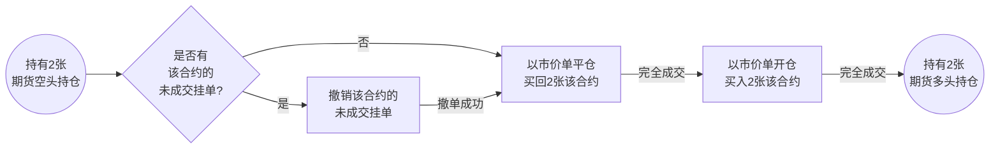
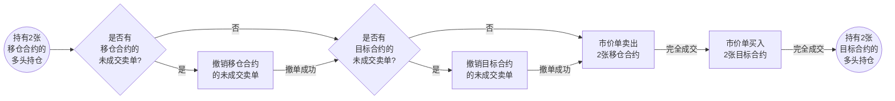
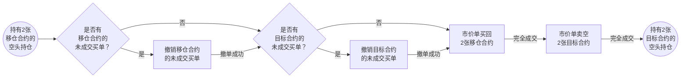

# MA

## ma

### 接口说明

获取指定标的指定 K 线周期下的 MA 值。

```
ma(symbol, period=5, bar_type=BarType.K_60M, data_type=DataType.CLOSE, select=2, session_type = THType.ALL)
```

### 参数

| 参数名 | 类型 | 说明 | 默认值 | 范围 |
|-----|-----|-----|-----|-----|
| symbol | [Contract](Contract "Contract") | 标的 | -- | -- |
| period | int | 移动平均周期 | 5 | 1-500 |
| bar_type | [BarType](BarType "BarType") | K 线周期 | BarType.K_60M | -- |
| data_type | [DataType](DataType "DataType") | 数据类型 | DataType.CLOSE | -- |
| select | int | 选取倒数第几根 K 线数据 | 2 | 1-500 |
| session_type  |  [THType](THType "THType") | 时段类型（仅对美股市场生效） | THType.ALL | -- |

### 返回

返回类型： float

### 示例说明

获取苹果的倒数第 2 根 1 小时 K 线上收盘价在移动平均周期为 5 的 MA 值。

```
ma(bar_type=BarType.K_60M, symbol=Contract("US.AAPL"), data_type=DataType.CLOSE, period=5, select=2, session_type = THType.RTH)
```

示例返回值

```
155.18492
```

## is_ma_bullish_alignment

### 接口说明

判断指定标的的 MA 形态是否是多头排列。

```
is_ma_bullish_alignment(symbol, bar_type=BarType.K_60M, data_type=DataType.CLOSE, session_type = THType.ALL, select = 2)
```

### 参数

| 参数名 | 类型 | 说明 | 默认值 | 范围 |
|-----|-----|-----|-----|-----|
| symbol | [Contract](Contract "Contract") | 标的 | -- | -- |
| bar_type | [BarType](BarType "BarType") | K 线周期 | BarType.K_60M | -- |
| data_type | [DataType](DataType "DataType") | 数据类型 | DataType.CLOSE | -- |
| session_type  |  [THType](THType "THType") | 时段类型（仅对美股市场生效） | THType.ALL | -- |
| select | int | 选取倒数第几根 K 线数据 | 2 | 1-500 |


### 返回

返回类型： Boolean

### 示例说明

判断苹果的 1 小时 K 线收盘价 MA 形态是否是多头排列。

```
is_ma_bullish_alignment(bar_type=BarType.K_60M, symbol=Contract("US.AAPL"), data_type=DataType.CLOSE, session_type = THType.RTH, select = 2)
```

示例返回值

```
True
```

## is_ma_bearish_alignment

### 接口说明

判断指定标的的 MA 形态是否是空头排列。

```
is_ma_bearish_alignment(symbol, bar_type=BarType.K_60M, data_type=DataType.CLOSE, session_type = THType.ALL, select = 2)
```

### 参数

| 参数名 | 类型 | 说明 | 默认值 | 范围 |
|-----|-----|-----|-----|-----|
| symbol | [Contract](Contract "Contract") | 标的 | -- | -- |
| bar_type | [BarType](BarType "BarType") | K 线周期 | BarType.K_60M | -- |
| data_type | [DataType](DataType "DataType") | 数据类型 | DataType.CLOSE | -- |
| session_type  |  [THType](THType "THType") | 时段类型（仅对美股市场生效） | THType.ALL | -- |
| select | int | 选取倒数第几根 K 线数据 | 2 | 1-500 |

### 返回

返回类型： Boolean

### 示例说明

判断苹果的 1 小时 K 线收盘价 MA 形态是否是空头排列。

```
is_ma_bearish_alignment(bar_type=BarType.K_60M, symbol=Contract("US.AAPL"), data_type=DataType.CLOSE, session_type = THType.RTH, select = 2)
```

示例返回值

```
False
```

---

# EMA

## ema

### 接口说明

获取指定标的指定 K 线周期下的 EMA 值。

```
ema(symbol, period=5, bar_type=BarType.K_60M, data_type=DataType.CLOSE, select=2, session_type = THType.ALL)
```

### 参数

| 参数名 | 类型 | 说明 | 默认值 | 范围 |
|-----|-----|-----|-----|-----|
| symbol | [Contract](Contract "Contract") | 标的 | -- | -- |
| period | int | 移动平均周期 | 5 | 1-500 |
| bar_type | [BarType](BarType "BarType") | K 线周期 | BarType.K_60M  | -- |
| data_type | [DataType](DataType "DataType") | 数据类型 | DataType.CLOSE | -- |
| select | int | 选取倒数第几根 K 线数据 | 2 | 1-500 |
| session_type  |  [THType](THType "THType") | 时段类型（仅对美股市场生效） | THType.ALL | -- |

### 返回

返回类型： float

### 示例说明

获取苹果的倒数第 2 根 1 小时 K 线上收盘价在移动平均周期为 5 的 EMA 值。

```
ema(bar_type=BarType.K_60M, symbol=Contract("US.AAPL"), data_type=DataType.CLOSE, period=5, select=2, session_type = THType.RTH)
```

示例返回值

```
154.72797
```

## is_ema_bullish_alignment

### 接口说明

判断指定标的的 EMA 形态是否是多头排列。

```
is_ema_bullish_alignment(symbol, bar_type=BarType.K_60M, data_type=DataType.CLOSE, session_type = THType.ALL, select = 2)
```

### 参数

| 参数名 | 类型 | 说明 | 默认值 | 范围 |
|-----|-----|-----|-----|-----|
| symbol | [Contract](Contract "Contract") | 标的 | -- | -- |
| bar_type | [BarType](BarType "BarType") | K 线周期 | BarType.K_60M  | -- |
| data_type | [DataType](DataType "DataType") | 数据类型 | DataType.CLOSE | -- |
| session_type  |  [THType](THType "THType") | 时段类型（仅对美股市场生效） | THType.ALL | -- |
| select | int | 选取倒数第几根 K 线数据 | 2 | 1-500 |

### 返回

返回类型： Boolean

### 示例说明

判断苹果的 1 小时 K 线收盘价 EMA 形态是否是多头排列。

```
is_ema_bullish_alignment(bar_type=BarType.K_60M, symbol=Contract("US.AAPL"), data_type=DataType.CLOSE, session_type = THType.RTH, select = 2)
```

示例返回值

```
True
```

## is_ema_bearish_alignment

### 接口说明

判断指定标的的 EMA 形态是否是空头排列。

```
is_ema_bearish_alignment(symbol, bar_type=BarType.K_60M, data_type=DataType.CLOSE, session_type = THType.ALL, select = 2)
```

### 参数

| 参数名 | 类型 | 说明 | 默认值 | 范围 |
|-----|-----|-----|-----|-----|
| symbol | [Contract](Contract "Contract") | 标的 | -- | -- |
| bar_type | [BarType](BarType "BarType") | K 线周期 | BarType.K_60M  | -- |
| data_type | [DataType](DataType "DataType") | 数据类型 | DataType.CLOSE | -- |
| session_type  |  [THType](THType "THType") | 时段类型（仅对美股市场生效） | THType.ALL | -- |
| select | int | 选取倒数第几根 K 线数据 | 2 | 1-500 |

### 返回

返回类型： Boolean

### 示例说明

判断苹果的 1 小时 K 线收盘价 EMA 形态是否是空头排列。

```
is_ema_bearish_alignment(bar_type=BarType.K_60M, symbol=Contract("US.AAPL"), data_type=DataType.CLOSE, session_type = THType.RTH, select = 2)
```

示例返回值

```
False
```

---

# SAR 停损点转向指标

## is_sar_up_trend

### 接口说明

判断指定标的的 SAR 是否满足上涨趋势。

```
is_sar_up_trend(symbol, period=4, step=2, maximum=20, bar_type=BarType.K_60M, session_type = THType.ALL, select = 2)
```

### 参数

| 参数名 | 类型 | 说明 | 默认值 | 范围 |
|-----|-----|-----|-----|-----|
| symbol | [Contract](Contract "Contract") | 标的 | -- | -- |
| period | int | 计算周期 | 4 | 1-100 |
| step | float | 步长 | 2 | 1-100 |
| maximum | float | 极限值 | 20 | 1-100 |
| bar_type | [BarType](BarType "BarType") | K 线周期 | BarType.K_60M | -- |
| session_type  |  [THType](THType "THType") | 时段类型（仅对美股市场生效） | THType.ALL | -- |
| select | int | 选取倒数第几根 K 线数据 | 2 | 1-500 |

### 返回

返回类型： Boolean

### 示例说明

判断苹果 1 小时 K 线的 SAR 在停损点是否满足上涨趋势。

```
is_sar_up_trend(symbol=Contract("US.AAPL"), period=4, step=2, maximum=20, bar_type=BarType.K_60M, session_type = THType.RTH, select = 2)
```

示例返回值

```
True
```

## is_sar_down_trend

### 接口说明

判断指定标的的 SAR 是否满足下跌趋势。

```
is_sar_down_trend(symbol, period=4, step=2, maximum=20, bar_type=BarType.K_60M, session_type = THType.ALL, select = 2)
```

### 参数

| 参数名 | 类型 | 说明 | 默认值 | 范围 |
|-----|-----|-----|-----|-----|
| symbol | [Contract](Contract "Contract") | 标的 | -- | -- |
| period | int | 计算周期 | 4 | 1-100 |
| step | float | 步长 | 2 | 1-100 |
| maximum | float | 极限值 | 20 | 1-100 |
| bar_type | [BarType](BarType "BarType") | K 线周期 | BarType.K_60M | -- |
| session_type  |  [THType](THType "THType") | 时段类型（仅对美股市场生效） | THType.ALL | -- |
| select | int | 选取倒数第几根 K 线数据 | 2 | 1-500 |

### 返回

返回类型： Boolean

### 示例说明

判断苹果 1 小时 K 线的 SAR 在停损点是否满足下跌趋势。

```
is_sar_down_trend(symbol=Contract("US.AAPL"), period=4, step=2, maximum=20, bar_type=BarType.K_60M, session_type = THType.RTH, select = 2)
```

示例返回值

```
True
```

## is_sar_bullish_reversal

### 接口说明

判断指定标的的 SAR 是否是由涨转跌。

```
is_sar_bullish_reversal(symbol, period=4, step=2, maximum=20, bar_type=BarType.K_60M, session_type = THType.ALL, select = 2)
```

### 参数

| 参数名 | 类型 | 说明 | 默认值 | 范围 |
|-----|-----|-----|-----|-----|
| symbol | [Contract](Contract "Contract") | 标的 | -- | -- |
| period | int | 计算周期 | 4 | 1-100 |
| step | float | 步长 | 2 | 1-100 |
| maximum | float | 极限值 | 20 | 1-100 |
| bar_type | [BarType](BarType "BarType") | K 线周期 | BarType.K_60M | -- |
| session_type  |  [THType](THType "THType") | 时段类型（仅对美股市场生效） | THType.ALL | -- |
| select | int | 选取倒数第几根 K 线数据 | 2 | 1-500 |

### 返回

返回类型： Boolean

### 示例说明

判断苹果 1 小时 K 线的 SAR 在停损点是否是由涨转跌。

```
is_sar_bullish_reversal(symbol=Contract("US.AAPL"), period=4, step=2, maximum=20, bar_type=BarType.K_60M, session_type = THType.RTH, select = 2)
```

示例返回值

```
False
```

## is_sar_bearish_reversal

### 接口说明

判断指定标的的 SAR 是否是由跌转涨。

```
is_sar_bearish_reversal(symbol, period=4, step=2, maximum=20, bar_type=BarType.K_60M, session_type = THType.ALL, select = 2)
```

### 参数

| 参数名 | 类型 | 说明 | 默认值 | 范围 |
|-----|-----|-----|-----|-----|
| symbol | [Contract](Contract "Contract") | 标的 | -- | -- |
| period | int | 计算周期 | 4 | 1-100 |
| step | float | 步长 | 2 | 1-100 |
| maximum | float | 极限值 | 20 | 1-100 |
| bar_type | [BarType](BarType "BarType") | K 线周期 | BarType.K_60M | -- |
| session_type  |  [THType](THType "THType") | 时段类型（仅对美股市场生效） | THType.ALL | -- |
| select | int | 选取倒数第几根 K 线数据 | 2 | 1-500 |

### 返回

返回类型： Boolean

### 示例说明

判断苹果 1 小时 K 线的 SAR 在停损点是否是由跌转涨。

```
is_sar_bearish_reversal(symbol=Contract("US.AAPL"), period=4, step=2, maximum=20, bar_type=BarType.K_60M, session_type = THType.RTH, select = 2)
```

示例返回值

```
False
```

## sar

### 接口说明

获取指定标的 SAR 的 BB 值。

```
sar(symbol, period=4, step=2, maximum=20, bar_type=BarType.K_60M, select=2, session_type = THType.ALL)
```

### 参数

| 参数名 | 类型 | 说明 | 默认值 | 范围 |
|-----|-----|-----|-----|-----|
| symbol | [Contract](Contract "Contract") | 标的 | -- | -- |
| period | int | 计算周期 | 4 | 1-100 |
| step | float | 步长 | 2 | 1-100 |
| maximum | float | 极限值 | 20 | 1-100 |
| bar_type | [BarType](BarType "BarType") | K 线周期 | BarType.K_60M | -- |
| select | int | 选取倒数第几根 K 线数据 | 2 | 1-500 |
| session_type  |  [THType](THType "THType") | 时段类型（仅对美股市场生效） | THType.ALL | -- |

### 返回

返回类型： float

### 示例说明

获取苹果在计算周期为 4，步长为 2，极限值为 20 时， 1 小时 K 线的 SAR 的 BB 值。

```
sar(symbol=Contract("US.AAPL"), period=4, step=2, maximum=20, bar_type=BarType.K_60M, select=2, session_type = THType.RTH)
```

示例返回值

```
151.30567
```

---

# BBI

## get_MyLang_indicator

### 接口说明

获取指定标的指定 K 线周期下的 BBI 值。

```
get_MyLang_indicator(indicator_name, variable_name, symbol, params, bar_type=BarType.K_60M,select=2, session_type = THType.ALL)
```

> 纯代码策略中，需要自行调用 register_indicator 接口，将策略的麦语言脚本写到代码策略中，才能正常使用该指标。具体操作参考 [register_indicator](/Src/Page/#07#其他#241785/#15#注册指标#232501@233717.md)

### 参数

| 参数名 | 类型 | 说明 | 默认值 | 范围 |
|-----|-----|-----|-----|-----|
| indicator_name | str | 指定指标名 | -- | None |
| variable_name | str | 指定指标的一个变量 | -- | None |
| symbol | [Contract](Contract "Contract") | 标的 | -- | None |
| params | dict | 指标参数 | {} | None |
| bar_type | [BarType](BarType "BarType") | K 线周期 | BarType.K_60M | None |
| select | int | 选取倒数第几根 K 线数据 | 2 | 1-500 |
| session_type  |  [THType](THType "THType") | 时段类型（仅对美股市场生效） | THType.ALL | -- |

### 返回

返回类型： float

### 示例说明

获取苹果倒数第二根 1 小时 K 线的 BBI 指标的 BBI 值。

```
get_MyLang_indicator(indicator_name='BBI', variable_name='BBI', symbol=Contract('US.AAPL'), params={"M1": 3.000, "M2": 6.000, "M3": 12.000, "M4": 24.000}, bar_type=BarType.K_60M, select=2, session_type = THType.RTH)
```

示例返回值

```
151.30567
```

---

# ALLIGAT

## get_MyLang_indicator

### 接口说明

获取指定标的指定 K 线周期下的 ALLIGAT 指标。

```
get_MyLang_indicator(indicator_name, variable_name, symbol, params, bar_type=BarType.K_60M,select=2, session_type = THType.ALL)
```
> 纯代码策略中，需要自行调用 register_indicator 接口，将策略的麦语言脚本写到代码策略中，才能正常使用该指标。具体操作参考 [register_indicator](/Src/Page/#07#其他#241785/#15#注册指标#232501@233717.md)

### 参数

| 参数名 | 类型 | 说明 | 默认值 | 范围 |
|-----|-----|-----|-----|-----|
| indicator_name | str | 指定指标名 | -- | None |
| variable_name | str | 指定指标的一个变量 | -- | None |
| symbol | [Contract](Contract "Contract") | 标的 | -- | None |
| params | dict | 指标参数 | {} | None |
| bar_type | [BarType](BarType "BarType") | K 线周期 | BarType.K_60M | None |
| select | int | 选取倒数第几根 K 线数据 | 2 | 1-500 |
| session_type  |  [THType](THType "THType") | 时段类型（仅对美股市场生效） | THType.ALL | -- |

### 返回

返回类型： float

### 示例说明

获取苹果倒数第二根 1 小时 K 线的 ALLIGAT 指标的 JAW 值。

```
get_MyLang_indicator(indicator_name='ALLIGAT', variable_name='JAW', symbol=Contract('US.AAPL'), params={"JAWLEN": 13.000, "JAWREF": 8.000}, bar_type=BarType.K_60M, select=2, session_type = THType.RTH)
```

示例返回值

```
151.30567
```

---

# TEMA

## get_MyLang_indicator

### 接口说明

获取指定标的指定 K 线周期下的 TEMA 值。

```
get_MyLang_indicator(indicator_name, variable_name, symbol, params, bar_type=BarType.K_60M,select=2, session_type = THType.ALL)
```

> 纯代码策略中，需要自行调用 register_indicator 接口，将策略的麦语言脚本写到代码策略中，才能正常使用该指标。具体操作参考 [register_indicator](/Src/Page/#07#其他#241785/#15#注册指标#232501@233717.md)

### 参数

| 参数名 | 类型 | 说明 | 默认值 | 范围 |
|-----|-----|-----|-----|-----|
| indicator_name | str | 指定指标名 | -- | None |
| variable_name | str | 指定指标的一个变量 | -- | None |
| symbol | [Contract](Contract "Contract") | 标的 | -- | None |
| params | dict | 指标参数 | {} | None |
| bar_type | [BarType](BarType "BarType") | K 线周期 | BarType.K_60M | None |
| select | int | 选取倒数第几根 K 线数据 | 2 | 1-500 |
| session_type  |  [THType](THType "THType") | 时段类型（仅对美股市场生效） | THType.ALL | -- |

### 返回

返回类型： float

### 示例说明

获取苹果最新一根 1 小时 K 线的 TEMA 指标的 TEMA 值。

```
get_MyLang_indicator(indicator_name='TEMA', variable_name='TEMA', symbol=Contract('US.AAPL'), params={"N": 9.000}, bar_type=BarType.K_60M, select=1, session_type = THType.RTH)
```

示例返回值

```
151.30567
```

---

# DEMA

## get_MyLang_indicator

### 接口说明

获取指定标的指定 K 线周期下的 DEMA 值。

```
get_MyLang_indicator(indicator_name, variable_name, symbol, params, bar_type=BarType.K_60M,select=2, session_type = THType.ALL)
```

> 纯代码策略中，需要自行调用 register_indicator 接口，将策略的麦语言脚本写到代码策略中，才能正常使用该指标。具体操作参考 [register_indicator](/Src/Page/#07#其他#241785/#15#注册指标#232501@233717.md)

### 参数

| 参数名 | 类型 | 说明 | 默认值 | 范围 |
|-----|-----|-----|-----|-----|
| indicator_name | str | 指定指标名 | -- | None |
| variable_name | str | 指定指标的一个变量 | -- | None |
| symbol | [Contract](Contract "Contract") | 标的 | -- | None |
| params | dict | 指标参数 | {} | None |
| bar_type | [BarType](BarType "BarType") | K 线周期 | BarType.K_60M | None |
| select | int | 选取倒数第几根 K 线数据 | 2 | 1-500 |
| session_type  |  [THType](THType "THType") | 时段类型（仅对美股市场生效） | THType.ALL | -- |

### 返回

返回类型： float

### 示例说明

获取苹果最新一根 1 小时 K 线的 DEMA 指标的 DEMA 值。

```
get_MyLang_indicator(indicator_name='DEMA', variable_name='DEMA', symbol=Contract('US.AAPL'), params={"N": 9.000}, bar_type=BarType.K_60M, select=1, session_type = THType.RTH)
```

示例返回值

```
151.30567
```

---

# TWAP

## get_MyLang_indicator

### 接口说明

获取指定标的指定 K 线周期下的 TWAP 指标。

```
get_MyLang_indicator(indicator_name, variable_name, symbol, params, bar_type=BarType.K_60M,select=2, session_type = THType.ALL)
```

> 纯代码策略中，需要自行调用 register_indicator 接口，将策略的麦语言脚本写到代码策略中，才能正常使用该指标。具体操作参考 [register_indicator](/Src/Page/#07#其他#241785/#15#注册指标#232501@233717.md)

### 参数

| 参数名 | 类型 | 说明 | 默认值 | 范围 |
|-----|-----|-----|-----|-----|
| indicator_name | str | 指定指标名 | -- | None |
| variable_name | str | 指定指标的一个变量 | -- | None |
| symbol | [Contract](Contract "Contract") | 标的 | -- | None |
| params | dict | 指标参数 | {} | None |
| bar_type | [BarType](BarType "BarType") | K 线周期 | BarType.K_60M | None |
| select | int | 选取倒数第几根 K 线数据 | 2 | 1-500 |
| session_type  |  [THType](THType "THType") | 时段类型（仅对美股市场生效） | THType.ALL | -- |

### 返回

返回类型： float

### 示例说明

获取苹果最新一根 1 小时 K 线的 TWAP 指标的 PRICE 值。

```
get_MyLang_indicator(indicator_name='TWAP', variable_name='PRICE', symbol=Contract('US.AAPL'), params={}, bar_type=BarType.K_60M, select=1, session_type = THType.RTH)
```

示例返回值

```
151.30567
```

---

# VWMA

## get_MyLang_indicator

### 接口说明

获取指定标的指定 K 线周期下的 VWMA 值。

```
get_MyLang_indicator(indicator_name, variable_name, symbol, params, bar_type=BarType.K_60M,select=2, session_type = THType.ALL)
```

> 纯代码策略中，需要自行调用 register_indicator 接口，将策略的麦语言脚本写到代码策略中，才能正常使用该指标。具体操作参考 [register_indicator](/Src/Page/#07#其他#241785/#15#注册指标#232501@233717.md)

### 参数

| 参数名 | 类型 | 说明 | 默认值 | 范围 |
|-----|-----|-----|-----|-----|
| indicator_name | str | 指定指标名 | -- | None |
| variable_name | str | 指定指标的一个变量 | -- | None |
| symbol | [Contract](Contract "Contract") | 标的 | -- | None |
| params | dict | 指标参数 | {} | None |
| bar_type | [BarType](BarType "BarType") | K 线周期 | BarType.K_60M | None |
| select | int | 选取倒数第几根 K 线数据 | 2 | 1-500 |
| session_type  |  [THType](THType "THType") | 时段类型（仅对美股市场生效） | THType.ALL | -- |

### 返回

返回类型： float

### 示例说明

获取苹果最新一根 1 小时 K 线的 VWMA 指标的 VWMA 值。

```
get_MyLang_indicator(indicator_name='VWMA', variable_name='VWMA', symbol=Contract('US.AAPL'), params={"N": 20.000}, bar_type=BarType.K_60M, select=1, session_type = THType.RTH)
```

示例返回值

```
151.30567
```

---

# WMA

## get_MyLang_indicator

### 接口说明

获取指定标的指定 K 线周期下的 WMA 值。

```
get_MyLang_indicator(indicator_name, variable_name, symbol, params, bar_type=BarType.K_60M,select=2, session_type = THType.ALL)
```

> 纯代码策略中，需要自行调用 register_indicator 接口，将策略的麦语言脚本写到代码策略中，才能正常使用该指标。具体操作参考 [register_indicator](/Src/Page/#07#其他#241785/#15#注册指标#232501@233717.md)

### 参数

| 参数名 | 类型 | 说明 | 默认值 | 范围 |
|-----|-----|-----|-----|-----|
| indicator_name | str | 指定指标名 | -- | None |
| variable_name | str | 指定指标的一个变量 | -- | None |
| symbol | [Contract](Contract "Contract") | 标的 | -- | None |
| params | dict | 指标参数 | {} | None |
| bar_type | [BarType](BarType "BarType") | K 线周期 | BarType.K_60M | None |
| select | int | 选取倒数第几根 K 线数据 | 2 | 1-500 |
| session_type  |  [THType](THType "THType") | 时段类型（仅对美股市场生效） | THType.ALL | -- |

### 返回

返回类型： float

### 示例说明

获取苹果最新一根 1 小时 K 线的 WMA 指标的 WMA_LINE 值。

```
get_MyLang_indicator(indicator_name='WMA', variable_name='WMA_LINE', symbol=Contract('US.AAPL'), params={"N": 20.000}, bar_type=BarType.K_60M, select=1, session_type = THType.RTH)
```

示例返回值

```
151.30567
```

---

# HMA

## get_MyLang_indicator

### 接口说明

获取指定标的指定 K 线周期下的 HMA 值。

```
get_MyLang_indicator(indicator_name, variable_name, symbol, params, bar_type=BarType.K_60M,select=2, session_type = THType.ALL)
```

> 纯代码策略中，需要自行调用 register_indicator 接口，将策略的麦语言脚本写到代码策略中，才能正常使用该指标。具体操作参考 [register_indicator](/Src/Page/#07#其他#241785/#15#注册指标#232501@233717.md)

### 参数

| 参数名 | 类型 | 说明 | 默认值 | 范围 |
|-----|-----|-----|-----|-----|
| indicator_name | str | 指定指标名 | -- | None |
| variable_name | str | 指定指标的一个变量 | -- | None |
| symbol | [Contract](Contract "Contract") | 标的 | -- | None |
| params | dict | 指标参数 | {} | None |
| bar_type | [BarType](BarType "BarType") | K 线周期 | BarType.K_60M | None |
| select | int | 选取倒数第几根 K 线数据 | 2 | 1-500 |
| session_type  |  [THType](THType "THType") | 时段类型（仅对美股市场生效） | THType.ALL | -- |

### 返回

返回类型： float

### 示例说明

获取苹果最新一根 1 小时 K 线的 HMA 指标的 HMA 值。

```
get_MyLang_indicator(indicator_name='HMA', variable_name='HMA', symbol=Contract('US.AAPL'), params={"N": 20.000}, bar_type=BarType.K_60M, select=1, session_type = THType.RTH)
```

示例返回值

```
151.30567
```

---

# LSMA

## get_MyLang_indicator

### 接口说明

获取指定标的指定 K 线周期下的 LSMA 值。

```
get_MyLang_indicator(indicator_name, variable_name, symbol, params, bar_type=BarType.K_60M,select=2, session_type = THType.ALL)
```

> 纯代码策略中，需要自行调用 register_indicator 接口，将策略的麦语言脚本写到代码策略中，才能正常使用该指标。具体操作参考 [register_indicator](/Src/Page/#07#其他#241785/#15#注册指标#232501@233717.md)

### 参数

| 参数名 | 类型 | 说明 | 默认值 | 范围 |
|-----|-----|-----|-----|-----|
| indicator_name | str | 指定指标名 | -- | None |
| variable_name | str | 指定指标的一个变量 | -- | None |
| symbol | [Contract](Contract "Contract") | 标的 | -- | None |
| params | dict | 指标参数 | {} | None |
| bar_type | [BarType](BarType "BarType") | K 线周期 | BarType.K_60M | None |
| select | int | 选取倒数第几根 K 线数据 | 2 | 1-500 |
| session_type  |  [THType](THType "THType") | 时段类型（仅对美股市场生效） | THType.ALL | -- |

### 返回

返回类型： float

### 示例说明

获取苹果最新一根 1 小时 K 线的 LSMA 指标的 LSMA 值。

```
get_MyLang_indicator(indicator_name='LSMA', variable_name='LSMA', symbol=Contract('US.AAPL'), params={"N": 20.000}, bar_type=BarType.K_60M, select=1, session_type = THType.RTH)
```

示例返回值

```
151.30567
```

---

# TSF

## get_MyLang_indicator

### 接口说明

获取指定标的指定 K 线周期下的 TSF 值。

```
get_MyLang_indicator(indicator_name, variable_name, symbol, params, bar_type=BarType.K_60M,select=2, session_type = THType.ALL)
```

> 纯代码策略中，需要自行调用 register_indicator 接口，将策略的麦语言脚本写到代码策略中，才能正常使用该指标。具体操作参考 [register_indicator](/Src/Page/#07#其他#241785/#15#注册指标#232501@233717.md)


### 参数

| 参数名 | 类型 | 说明 | 默认值 | 范围 |
|-----|-----|-----|-----|-----|
| indicator_name | str | 指定指标名 | -- | None |
| variable_name | str | 指定指标的一个变量 | -- | None |
| symbol | [Contract](Contract "Contract") | 标的 | -- | None |
| params | dict | 指标参数 | {} | None |
| bar_type | [BarType](BarType "BarType") | K 线周期 | BarType.K_60M | None |
| select | int | 选取倒数第几根 K 线数据 | 2 | 1-500 |
| session_type  |  [THType](THType "THType") | 时段类型（仅对美股市场生效） | THType.ALL | -- |

### 返回

返回类型： float

### 示例说明

获取苹果最新一根 1 小时 K 线的 TSF 指标的 TSF 值。

```
get_MyLang_indicator(indicator_name='TSF', variable_name='TSF', symbol=Contract('US.AAPL'), params={"N1": 9.000, "N2": 7.000}, bar_type=BarType.K_60M, select=1, session_type = THType.RTH)
```

示例返回值

```
151.30567
```

---

# VOLAT 历史波动率

## historical_volatility

### 接口说明

获取指定标的指定 K 线周期下的 VOLAT。

```
historical_volatility(symbol, period=20, bar_type=BarType.K_60M, select=2, session_type = THType.ALL)
```

### 参数

| 参数名 | 类型 | 说明 | 默认值 | 范围 |
|-----|-----|-----|-----|-----|
| symbol | [Contract](Contract "Contract") | 标的 | -- | -- |
| period | int | 移动平均周期 | 20 | 1-500 |
| bar_type | [BarType](BarType "BarType") | K 线周期 | BarType.K_60M | -- |
| select | int | 选取倒数第几根 K 线数据 | 2 | 1-500 |
| session_type  |  [THType](THType "THType") | 时段类型（仅对美股市场生效） | THType.ALL | -- |

### 返回

返回类型： float

### 示例说明

获取苹果 1 小时 K 线的 VOLAT。

```
historical_volatility(symbol=Contract("US.AAPL"), period=20, bar_type=BarType.K_60M, select=1, session_type = THType.RTH)
```

示例返回值

```
84.10564
```

---

# MACD

## macd_dif

### 接口说明

获取指定标的的 MACD 的 DIF 值。

```
macd_dif(symbol, fast_period=12, slow_period=26, signal_period=9, bar_type=BarType.K_60M, select=2, session_type = THType.ALL)
```

### 参数

| 参数名 | 类型 | 说明 | 默认值 | 范围 |
|-----|-----|-----|-----|-----|
| symbol | [Contract](Contract "Contract") | 标的 | -- | -- |
| fast_period | int | 短周期 | 12 | 1-500 |
| slow_period | int | 长周期 | 26 | 1-500 |
| signal_period | int | 移动平均周期 | 9 | 1-500 |
| bar_type | [BarType](BarType "BarType") | K 线周期 | BarType.K_60M | -- |
| select | int | 选取倒数第几根 K 线数据 | 2 | 1-500 |
| session_type  |  [THType](THType "THType") | 时段类型（仅对美股市场生效） | THType.ALL | -- |

### 返回

返回类型： float

### 示例说明

获取苹果 1 小时 K 线的 MACD 的 DIF 值。

```
macd_dif(symbol=Contract("US.AAPL"), fast_period=12, slow_period=26, signal_period=9, bar_type=BarType.K_60M, select=1, session_type = THType.RTH)
```

示例返回值

```
3.01245
```

## macd_dea

### 接口说明

获取指定标的的 MACD 的 DEA 值。

```
macd_dea(symbol, fast_period=12, slow_period=26, signal_period=9, bar_type=BarType.K_60M, select=2, session_type = THType.ALL)
```

### 参数

| 参数名 | 类型 | 说明 | 默认值 | 范围 |
|-----|-----|-----|-----|-----|
| symbol | [Contract](Contract "Contract") | 标的 | -- | -- |
| fast_period | int | 短周期 | 12 | 1-500 |
| slow_period | int | 长周期 | 26 | 1-500 |
| signal_period | int | 移动平均周期 | 9 | 1-500 |
| bar_type | [BarType](BarType "BarType") | K 线周期 | BarType.K_60M | -- |
| select | int | 选取倒数第几根 K 线数据 | 2 | 1-500 |
| session_type  |  [THType](THType "THType") | 时段类型（仅对美股市场生效） | THType.ALL | -- |

### 返回

返回类型： float

### 示例说明

获取苹果 1 小时 K 线的 MACD 的 DEA 值。

```
macd_dea(symbol=Contract("US.AAPL"), fast_period=12, slow_period=26, signal_period=9, bar_type=BarType.K_60M, select=1, session_type = THType.RTH)
```

示例返回值

```
2.63327
```

## macd_macd

### 接口说明

获取指定标的的 MACD 的 MACD 值。

```
macd_macd(symbol, fast_period=12, slow_period=26, signal_period=9, bar_type=BarType.K_60M, select=2, session_type = THType.ALL)
```

### 参数

| 参数名 | 类型 | 说明 | 默认值 | 范围 |
|-----|-----|-----|-----|-----|
| symbol | [Contract](Contract "Contract") | 标的 | -- | -- |
| fast_period | int | 短周期 | 12 | 1-500 |
| slow_period | int | 长周期 | 26 | 1-500 |
| signal_period | int | 移动平均周期 | 9 | 1-500 |
| bar_type | [BarType](BarType "BarType") | K 线周期 | BarType.K_60M | -- |
| select | int | 选取倒数第几根 K 线数据 | 2 | 1-500 |
| session_type  |  [THType](THType "THType") | 时段类型（仅对美股市场生效） | THType.ALL | -- |

### 返回

返回类型： float

### 示例说明

获取苹果 1 小时 K 线的 MACD 的 MACD 值。

```
macd_macd(symbol=Contract("US.AAPL"), fast_period=12, slow_period=26, signal_period=9, bar_type=BarType.K_60M, select=1, session_type = THType.RTH)
```

示例返回值

```
0.75837
```

## is_macd_golden_cross

### 接口说明

判断指定标的的 MACD 形态是否是金叉。

```
is_macd_golden_cross(symbol, fast_period=12, slow_period=26, signal_period=9, bar_type=BarType.K_60M, session_type = THType.ALL, select = 2)
```

### 参数

| 参数名 | 类型 | 说明 | 默认值 | 范围 |
|-----|-----|-----|-----|-----|
| symbol | [Contract](Contract "Contract") | 标的 | -- | -- |
| fast_period | int | 短周期 | 12 | 1-500 |
| slow_period | int | 长周期 | 26 | 1-500 |
| signal_period | int | 移动平均周期 | 9 | 1-500 |
| bar_type | [BarType](BarType "BarType") | K 线周期 | BarType.K_60M | -- |
| session_type  |  [THType](THType "THType") | 时段类型（仅对美股市场生效） | THType.ALL | -- |
| select | int | 选取倒数第几根 K 线数据 | 2 | 1-500 |

### 返回

返回类型： Boolean

### 示例说明

判断苹果 1 小时 K 线的 MACD 形态（短周期 12，长周期 26，移动平均周期 9）是否为金叉。

```
is_macd_golden_cross(symbol=Contract("US.AAPL"), fast_period=12, slow_period=26, signal_period=9, bar_type=BarType.K_60M, session_type = THType.RTH, select = 2)
```

示例返回值

```
True
```

## is_macd_death_cross

### 接口说明

判断指定标的的 MACD 形态是否是死叉。

```
is_macd_death_cross(symbol, fast_period=12, slow_period=26, signal_period=9, bar_type=BarType.K_60M, session_type = THType.ALL, select = 2)
```

### 参数

| 参数名 | 类型 | 说明 | 默认值 | 范围 |
|-----|-----|-----|-----|-----|
| symbol | [Contract](Contract "Contract") | 标的 | -- | -- |
| fast_period | int | 短周期 | 12 | 1-500 |
| slow_period | int | 长周期 | 26 | 1-500 |
| signal_period | int | 移动平均周期 | 9 | 1-500 |
| bar_type | [BarType](BarType "BarType") | K 线周期 | BarType.K_60M | -- |
| session_type  |  [THType](THType "THType") | 时段类型（仅对美股市场生效） | THType.ALL | -- |
| select | int | 选取倒数第几根 K 线数据 | 2 | 1-500 |

### 返回

返回类型： Boolean

### 示例说明

判断苹果 1 小时 K 线的 MACD 形态（短周期 12，长周期 26，移动平均周期 9）是否为死叉。

```
is_macd_death_cross(symbol=Contract("US.AAPL"), fast_period=12, slow_period=26, signal_period=9, bar_type=BarType.K_60M, session_type = THType.RTH, select = 2)
```

示例返回值

```
True
```

## is_macd_top_divergence

### 接口说明

判断指定标的的 MACD 形态是否是顶背离。

```
is_macd_top_divergence(symbol, fast_period=12, slow_period=26, signal_period=9, bar_type=BarType.K_60M, session_type = THType.ALL, select = 2)
```

### 参数

| 参数名 | 类型 | 说明 | 默认值 | 范围 |
|-----|-----|-----|-----|-----|
| symbol | [Contract](Contract "Contract") | 标的 | -- | -- |
| fast_period | int | 短周期 | 12 | 1-500 |
| slow_period | int | 长周期 | 26 | 1-500 |
| signal_period | int | 移动平均周期 | 9 | 1-500 |
| bar_type | [BarType](BarType "BarType") | K 线周期 | BarType.K_60M | -- |
| session_type  |  [THType](THType "THType") | 时段类型（仅对美股市场生效） | THType.ALL | -- |
| select | int | 选取倒数第几根 K 线数据 | 2 | 1-500 |

### 返回

返回类型： Boolean

### 示例说明

判断苹果 1 小时 K 线的 MACD 形态（短周期 12，长周期 26，移动平均周期 9）是否为顶背离。

```
is_macd_top_divergence(symbol=Contract("US.AAPL"), fast_period=12, slow_period=26, signal_period=9, bar_type=BarType.K_60M, session_type = THType.RTH, select = 2)
```

示例返回值

```
False
```

## is_macd_bottom_divergence

### 接口说明

判断指定标的的 MACD 形态是否是底背离。

```
is_macd_bottom_divergence(symbol, fast_period=12, slow_period=26, signal_period=9, bar_type=BarType.K_60M, session_type = THType.ALL, select = 2)
```

### 参数

| 参数名 | 类型 | 说明 | 默认值 | 范围 |
|-----|-----|-----|-----|-----|
| symbol | [Contract](Contract "Contract") | 标的 | -- | -- |
| fast_period | int | 短周期 | 12 | 1-500 |
| slow_period | int | 长周期 | 26 | 1-500 |
| signal_period | int | 移动平均周期 | 9 | 1-500 |
| bar_type | [BarType](BarType "BarType") | K 线周期 | BarType.K_60M | -- |
| session_type  |  [THType](THType "THType") | 时段类型（仅对美股市场生效） | THType.ALL | -- |
| select | int | 选取倒数第几根 K 线数据 | 2 | 1-500 |

### 返回

返回类型： Boolean

### 示例说明

判断苹果 1 小时 K 线的 MACD 形态（短周期 12，长周期 26，移动平均周期 9）是否为底背离。

```
is_macd_bottom_divergence(symbol=Contract("US.AAPL"), fast_period=12, slow_period=26, signal_period=9, bar_type=BarType.K_60M, session_type = THType.RTH, select = 2)
```

示例返回值

```
False
```

---

# DMA

## get_MyLang_indicator

### 接口说明

获取指定标的指定 K 线周期下的 DMA 指标。

```
get_MyLang_indicator(indicator_name, variable_name, symbol, params, bar_type=BarType.K_60M,select=2, session_type = THType.ALL)
```

> 纯代码策略中，需要自行调用 register_indicator 接口，将策略的麦语言脚本写到代码策略中，才能正常使用该指标。具体操作参考 [register_indicator](/Src/Page/#07#其他#241785/#15#注册指标#232501@233717.md)

### 参数

| 参数名 | 类型 | 说明 | 默认值 | 范围 |
|-----|-----|-----|-----|-----|
| indicator_name | str | 指定指标名 | -- | None |
| variable_name | str | 指定指标的一个变量 | -- | None |
| symbol | [Contract](Contract "Contract") | 标的 | -- | None |
| params | dict | 指标参数 | {} | None |
| bar_type | [BarType](BarType "BarType") | K 线周期 | BarType.K_60M | None |
| select | int | 选取倒数第几根 K 线数据 | 2 | 1-500 |
| session_type  |  [THType](THType "THType") | 时段类型（仅对美股市场生效） | THType.ALL | -- |

### 返回

返回类型： float

### 示例说明

获取苹果最新一根 1 小时 K 线的 DMA 指标的 DDD 值。

```
get_MyLang_indicator(indicator_name='DMA', variable_name='DDD', symbol=Contract('US.AAPL'), params={"LONG": 50.000, "SHORT": 10.000}, bar_type=BarType.K_60M, select=1, session_type = THType.RTH)
```

示例返回值

```
151.30567
```

---

# DMI

## get_MyLang_indicator

### 接口说明

获取指定标的指定 K 线周期下的 DMI 指标。

```
get_MyLang_indicator(indicator_name, variable_name, symbol, params, bar_type=BarType.K_60M,select=2, session_type = THType.ALL)
```

> 纯代码策略中，需要自行调用 register_indicator 接口，将策略的麦语言脚本写到代码策略中，才能正常使用该指标。具体操作参考 [register_indicator](/Src/Page/#07#其他#241785/#15#注册指标#232501@233717.md)

### 参数

| 参数名 | 类型 | 说明 | 默认值 | 范围 |
|-----|-----|-----|-----|-----|
| indicator_name | str | 指定指标名 | -- | None |
| variable_name | str | 指定指标的一个变量 | -- | None |
| symbol | [Contract](Contract "Contract") | 标的 | -- | None |
| params | dict | 指标参数 | {} | None |
| bar_type | [BarType](BarType "BarType") | K 线周期 | BarType.K_60M | None |
| select | int | 选取倒数第几根 K 线数据 | 2 | 1-500 |
| session_type  |  [THType](THType "THType") | 时段类型（仅对美股市场生效） | THType.ALL | -- |

### 返回

返回类型： float

### 示例说明

获取苹果最新一根 1 小时 K 线的 DMI 指标的 PDI 值。

```
get_MyLang_indicator(indicator_name='DMI', variable_name='PDI', symbol=Contract('US.AAPL'), params={"N": 20.000}, bar_type=BarType.K_60M, select=1, session_type = THType.RTH)
```

示例返回值

```
151.30567
```

---

# EMV

## get_MyLang_indicator

### 接口说明

获取指定标的指定 K 线周期下的 EMV 值。

```
get_MyLang_indicator(indicator_name, variable_name, symbol, params, bar_type=BarType.K_60M,select=2, session_type = THType.ALL)
```

> 纯代码策略中，需要自行调用 register_indicator 接口，将策略的麦语言脚本写到代码策略中，才能正常使用该指标。具体操作参考 [register_indicator](/Src/Page/#07#其他#241785/#15#注册指标#232501@233717.md)

### 参数

| 参数名 | 类型 | 说明 | 默认值 | 范围 |
|-----|-----|-----|-----|-----|
| indicator_name | str | 指定指标名 | -- | None |
| variable_name | str | 指定指标的一个变量 | -- | None |
| symbol | [Contract](Contract "Contract") | 标的 | -- | None |
| params | dict | 指标参数 | {} | None |
| bar_type | [BarType](BarType "BarType") | K 线周期 | BarType.K_60M | None |
| select | int | 选取倒数第几根 K 线数据 | 2 | 1-500 |
| session_type  |  [THType](THType "THType") | 时段类型（仅对美股市场生效） | THType.ALL | -- |

### 返回

返回类型： float

### 示例说明

获取苹果最新一根 1 小时 K 线的 EMV 指标的 EMV 值。

```
get_MyLang_indicator(indicator_name='EMV', variable_name='EMV', symbol=Contract('US.AAPL'), params={"N": 20.000}, bar_type=BarType.K_60M, select=1, session_type = THType.RTH)
```

示例返回值

```
151.30567
```

---

# VMACD

## get_MyLang_indicator

### 接口说明

获取指定标的指定 K 线周期下的 VMACD 指标。

```
get_MyLang_indicator(indicator_name, variable_name, symbol, params, bar_type=BarType.K_60M,select=2, session_type = THType.ALL)
```

> 纯代码策略中，需要自行调用 register_indicator 接口，将策略的麦语言脚本写到代码策略中，才能正常使用该指标。具体操作参考 [register_indicator](/Src/Page/#07#其他#241785/#15#注册指标#232501@233717.md)

### 参数

| 参数名 | 类型 | 说明 | 默认值 | 范围 |
|-----|-----|-----|-----|-----|
| indicator_name | str | 指定指标名 | -- | None |
| variable_name | str | 指定指标的一个变量 | -- | None |
| symbol | [Contract](Contract "Contract") | 标的 | -- | None |
| params | dict | 指标参数 | {} | None |
| bar_type | [BarType](BarType "BarType") | K 线周期 | BarType.K_60M | None |
| select | int | 选取倒数第几根 K 线数据 | 2 | 1-500 |
| session_type  |  [THType](THType "THType") | 时段类型（仅对美股市场生效） | THType.ALL | -- |

### 返回

返回类型： float

### 示例说明

获取苹果最新一根 1 小时 K 线的 VMACD 指标的 DIFF 值。

```
get_MyLang_indicator(indicator_name='VMACD', variable_name='DIFF', symbol=Contract('US.AAPL'), params={"LONG": 50.000, "SHORT": 10.000}, bar_type=BarType.K_60M, select=1, session_type = THType.RTH)
```

示例返回值

```
151.30567
```

---

# TRIX

## get_MyLang_indicator

### 接口说明

获取指定标的指定 K 线周期下的 TRIX 值。

```
get_MyLang_indicator(indicator_name, variable_name, symbol, params, bar_type=BarType.K_60M,select=2, session_type = THType.ALL)
```
> 纯代码策略中，需要自行调用 register_indicator 接口，将策略的麦语言脚本写到代码策略中，才能正常使用该指标。具体操作参考 [register_indicator](/Src/Page/#07#其他#241785/#15#注册指标#232501@233717.md)

### 参数

| 参数名 | 类型 | 说明 | 默认值 | 范围 |
|-----|-----|-----|-----|-----|
| indicator_name | str | 指定指标名 | -- | None |
| variable_name | str | 指定指标的一个变量 | -- | None |
| symbol | [Contract](Contract "Contract") | 标的 | -- | None |
| params | dict | 指标参数 | {} | None |
| bar_type | [BarType](BarType "BarType") | K 线周期 | BarType.K_60M | None |
| select | int | 选取倒数第几根 K 线数据 | 2 | 1-500 |
| session_type  |  [THType](THType "THType") | 时段类型（仅对美股市场生效） | THType.ALL | -- |

### 返回

返回类型： float

### 示例说明

获取苹果最新一根 1 小时 K 线的 TRIX 指标的 TRIX 值。

```
get_MyLang_indicator(indicator_name='TRIX', variable_name='TRIX', symbol=Contract('US.AAPL'), params={"P": 20.000}, bar_type=BarType.K_60M, select=1, session_type = THType.RTH)
```

示例返回值

```
151.30567
```

---

# PRICEOSC

## get_MyLang_indicator

### 接口说明

获取指定标的指定 K 线周期下的 PRICEOSC 指标。

```
get_MyLang_indicator(indicator_name, variable_name, symbol, params, bar_type=BarType.K_60M,select=2, session_type = THType.ALL)
```
> 纯代码策略中，需要自行调用 register_indicator 接口，将策略的麦语言脚本写到代码策略中，才能正常使用该指标。具体操作参考 [register_indicator](/Src/Page/#07#其他#241785/#15#注册指标#232501@233717.md)

### 参数

| 参数名 | 类型 | 说明 | 默认值 | 范围 |
|-----|-----|-----|-----|-----|
| indicator_name | str | 指定指标名 | -- | None |
| variable_name | str | 指定指标的一个变量 | -- | None |
| symbol | [Contract](Contract "Contract") | 标的 | -- | None |
| params | dict | 指标参数 | {} | None |
| bar_type | [BarType](BarType "BarType") | K 线周期 | BarType.K_60M | None |
| select | int | 选取倒数第几根 K 线数据 | 2 | 1-500 |
| session_type  |  [THType](THType "THType") | 时段类型（仅对美股市场生效） | THType.ALL | -- |

### 返回

返回类型： float

### 示例说明

获取苹果最新一根 1 小时 K 线的 PRICEOSC 指标的 PRICEOSC 值。

```
get_MyLang_indicator(indicator_name='PRICEOSC', variable_name='PRICEOSC', symbol=Contract('US.AAPL'), params={"LONG": 50.000, "SHORT": 10.000}, bar_type=BarType.K_60M, select=1, session_type = THType.RTH)
```

示例返回值

```
151.30567
```

---

# DDI

## get_MyLang_indicator

### 接口说明

获取指定标的指定 K 线周期下的 DDI 值。

```
get_MyLang_indicator(indicator_name, variable_name, symbol, params, bar_type=BarType.K_60M,select=2, session_type = THType.ALL)
```
> 纯代码策略中，需要自行调用 register_indicator 接口，将策略的麦语言脚本写到代码策略中，才能正常使用该指标。具体操作参考 [register_indicator](/Src/Page/#07#其他#241785/#15#注册指标#232501@233717.md)

### 参数

| 参数名 | 类型 | 说明 | 默认值 | 范围 |
|-----|-----|-----|-----|-----|
| indicator_name | str | 指定指标名 | -- | None |
| variable_name | str | 指定指标的一个变量 | -- | None |
| symbol | [Contract](Contract "Contract") | 标的 | -- | None |
| params | dict | 指标参数 | {} | None |
| bar_type | [BarType](BarType "BarType") | K 线周期 | BarType.K_60M | None |
| select | int | 选取倒数第几根 K 线数据 | 2 | 1-500 |
| session_type  |  [THType](THType "THType") | 时段类型（仅对美股市场生效） | THType.ALL | -- |

### 返回

返回类型： float

### 示例说明

获取苹果最新一根 1 小时 K 线的 DDI 指标的 DDI 值。

```
get_MyLang_indicator(indicator_name='DDI', variable_name='DDI', symbol=Contract('US.AAPL'), params={"N": 20.000}, bar_type=BarType.K_60M, select=1, session_type = THType.RTH)
```

示例返回值

```
151.30567
```

---

# MI

## get_MyLang_indicator

### 接口说明

获取指定标的指定 K 线周期下的 MI 指标。

```
get_MyLang_indicator(indicator_name, variable_name, symbol, params, bar_type=BarType.K_60M,select=2, session_type = THType.ALL)
```
> 纯代码策略中，需要自行调用 register_indicator 接口，将策略的麦语言脚本写到代码策略中，才能正常使用该指标。具体操作参考 [register_indicator](/Src/Page/#07#其他#241785/#15#注册指标#232501@233717.md)

### 参数

| 参数名 | 类型 | 说明 | 默认值 | 范围 |
|-----|-----|-----|-----|-----|
| indicator_name | str | 指定指标名 | -- | None |
| variable_name | str | 指定指标的一个变量 | -- | None |
| symbol | [Contract](Contract "Contract") | 标的 | -- | None |
| params | dict | 指标参数 | {} | None |
| bar_type | [BarType](BarType "BarType") | K 线周期 | BarType.K_60M | None |
| select | int | 选取倒数第几根 K 线数据 | 2 | 1-500 |
| session_type  |  [THType](THType "THType") | 时段类型（仅对美股市场生效） | THType.ALL | -- |

### 返回

返回类型： float

### 示例说明

获取苹果最新一根 1 小时 K 线的 MI 指标的 AA 值。

```
get_MyLang_indicator(indicator_name='MI', variable_name='AA', symbol=Contract('US.AAPL'), params={"M": 20.000}, bar_type=BarType.K_60M, select=1, session_type = THType.RTH)
```

示例返回值

```
151.30567
```

---

# ATR 真实波幅

## atr_tr

### 接口说明

获取指定标的的 ATR 的 TR 值。

```
atr_tr(symbol, period=14, bar_type=BarType.K_60M, select=2, session_type = THType.ALL)
```

### 参数

| 参数名 | 类型 | 说明 | 默认值 | 范围 |
|-----|-----|-----|-----|-----|
| symbol | [Contract](Contract "Contract") | 标的 | -- | -- |
| period | int | 移动平均周期 | 14 | 1-500 |
| bar_type | [BarType](BarType "BarType") | K 线周期 | BarType.K_60M | -- |
| select | int | 选取倒数第几根 K 线数据 | 2 | 1-500 |
| session_type  |  [THType](THType "THType") | 时段类型（仅对美股市场生效） | THType.ALL | -- |

### 返回

返回类型： float

### 示例说明

获取苹果 1 小时 K 线的 ATR 的 TR 值。

```
atr_tr(symbol=Contract("US.AAPL"), period=14, bar_type=BarType.K_60M, select=1, session_type = THType.RTH)
```

示例返回值

```
0.85
```

## atr_atr

### 接口说明

获取指定标的的 ATR 的 ATR 值。

```
atr_atr(symbol, period=14, bar_type=BarType.K_60M, select=2, session_type = THType.ALL)
```

### 参数

| 参数名 | 类型 | 说明 | 默认值 | 范围 |
|-----|-----|-----|-----|-----|
| symbol | [Contract](Contract "Contract") | 标的 | -- | -- |
| period | int | 移动平均周期 | 14 | 1-500 |
| bar_type | [BarType](BarType "BarType") | K 线周期 | BarType.K_60M | -- |
| select | int | 选取倒数第几根 K 线数据 | 2 | 1-500 |
| session_type  |  [THType](THType "THType") | 时段类型（仅对美股市场生效） | THType.ALL | -- |

### 返回

返回类型： float

### 示例说明

获取苹果 1 小时 K 线的 ATR 的 ATR 值。

```
atr_atr(symbol=Contract("US.AAPL"), period=14, bar_type=BarType.K_60M, select=1, session_type = THType.RTH)
```

示例返回值

```
2.17159
```

---

# SI

## get_MyLang_indicator

### 接口说明

获取指定标的指定 K 线周期下的 SI 值。

```
get_MyLang_indicator(indicator_name, variable_name, symbol, params, bar_type=BarType.K_60M,select=2, session_type = THType.ALL)
```

> 纯代码策略中，需要自行调用 register_indicator 接口，将策略的麦语言脚本写到代码策略中，才能正常使用该指标。具体操作参考 [register_indicator](/Src/Page/#07#其他#241785/#15#注册指标#232501@233717.md)


### 参数

| 参数名 | 类型 | 说明 | 默认值 | 范围 |
|-----|-----|-----|-----|-----|
| indicator_name | str | 指定指标名 | -- | None |
| variable_name | str | 指定指标的一个变量 | -- | None |
| symbol | [Contract](Contract "Contract") | 标的 | -- | None |
| params | dict | 指标参数 | {} | None |
| bar_type | [BarType](BarType "BarType") | K 线周期 | BarType.K_60M | None |
| select | int | 选取倒数第几根 K 线数据 | 2 | 1-500 |
| session_type  |  [THType](THType "THType") | 时段类型（仅对美股市场生效） | THType.ALL | -- |

### 返回

返回类型： float

### 示例说明

获取苹果最新一根 1 小时 K 线的 SI 指标的 SI 值。

```
get_MyLang_indicator(indicator_name='SI', variable_name='SI', symbol=Contract('US.AAPL'), params={"N": 20.000}, bar_type=BarType.K_60M, select=1, session_type = THType.RTH)
```

示例返回值

```
151.30567
```

---

# TOWER

## get_MyLang_indicator

### 接口说明

获取指定标的指定 K 线周期下的 TOWER 指标。

```
get_MyLang_indicator(indicator_name, variable_name, symbol, params, bar_type=BarType.K_60M,select=2, session_type = THType.ALL)
```

> 纯代码策略中，需要自行调用 register_indicator 接口，将策略的麦语言脚本写到代码策略中，才能正常使用该指标。具体操作参考 [register_indicator](/Src/Page/#07#其他#241785/#15#注册指标#232501@233717.md)


### 参数

| 参数名 | 类型 | 说明 | 默认值 | 范围 |
|-----|-----|-----|-----|-----|
| indicator_name | str | 指定指标名 | -- | None |
| variable_name | str | 指定指标的一个变量 | -- | None |
| symbol | [Contract](Contract "Contract") | 标的 | -- | None |
| params | dict | 指标参数 | {} | None |
| bar_type | [BarType](BarType "BarType") | K 线周期 | BarType.K_60M | None |
| select | int | 选取倒数第几根 K 线数据 | 2 | 1-500 |
| session_type  |  [THType](THType "THType") | 时段类型（仅对美股市场生效） | THType.ALL | -- |

### 返回

返回类型： float

### 示例说明

获取苹果最新一根 1 小时 K 线的 TOWER 指标的 CONTRISE 值。

```
get_MyLang_indicator(indicator_name='TOWER', variable_name='CONTRISE', symbol=Contract('US.AAPL'), params={}, bar_type=BarType.K_60M, select=1, session_type = THType.RTH)
```

示例返回值

```
151.30567
```

---

# EWO

## get_MyLang_indicator

### 接口说明

获取指定标的指定 K 线周期下的 EWO 值。

```
get_MyLang_indicator(indicator_name, variable_name, symbol, params, bar_type=BarType.K_60M,select=2, session_type = THType.ALL)
```

> 纯代码策略中，需要自行调用 register_indicator 接口，将策略的麦语言脚本写到代码策略中，才能正常使用该指标。具体操作参考 [register_indicator](/Src/Page/#07#其他#241785/#15#注册指标#232501@233717.md)


### 参数

| 参数名 | 类型 | 说明 | 默认值 | 范围 |
|-----|-----|-----|-----|-----|
| indicator_name | str | 指定指标名 | -- | None |
| variable_name | str | 指定指标的一个变量 | -- | None |
| symbol | [Contract](Contract "Contract") | 标的 | -- | None |
| params | dict | 指标参数 | {} | None |
| bar_type | [BarType](BarType "BarType") | K 线周期 | BarType.K_60M | None |
| select | int | 选取倒数第几根 K 线数据 | 2 | 1-500 |
| session_type  |  [THType](THType "THType") | 时段类型（仅对美股市场生效） | THType.ALL | -- |

### 返回

返回类型： float

### 示例说明

获取苹果最新一根 1 小时 K 线的 EWO 指标的 EWO 值。

```
get_MyLang_indicator(indicator_name='EWO', variable_name='EWO', symbol=Contract('US.AAPL'), params={"N1": 5.000, "N2": 34.000}, bar_type=BarType.K_60M, select=1, session_type = THType.RTH)
```

示例返回值

```
151.30567
```

---

# RVI

## get_MyLang_indicator

### 接口说明

获取指定标的指定 K 线周期下的 RVI 值。

```
get_MyLang_indicator(indicator_name, variable_name, symbol, params, bar_type=BarType.K_60M,select=2, session_type = THType.ALL)
```

> 纯代码策略中，需要自行调用 register_indicator 接口，将策略的麦语言脚本写到代码策略中，才能正常使用该指标。具体操作参考 [register_indicator](/Src/Page/#07#其他#241785/#15#注册指标#232501@233717.md)


### 参数

| 参数名 | 类型 | 说明 | 默认值 | 范围 |
|-----|-----|-----|-----|-----|
| indicator_name | str | 指定指标名 | -- | None |
| variable_name | str | 指定指标的一个变量 | -- | None |
| symbol | [Contract](Contract "Contract") | 标的 | -- | None |
| params | dict | 指标参数 | {} | None |
| bar_type | [BarType](BarType "BarType") | K 线周期 | BarType.K_60M | None |
| select | int | 选取倒数第几根 K 线数据 | 2 | 1-500 |
| session_type  |  [THType](THType "THType") | 时段类型（仅对美股市场生效） | THType.ALL | -- |

### 返回

返回类型： float

### 示例说明

获取苹果最新一根 1 小时 K 线的 RVI 指标的 RVI 值。

```
get_MyLang_indicator(indicator_name='RVI', variable_name='RVI', symbol=Contract('US.AAPL'), params={"N1": 5.000, "N2": 34.000}, bar_type=BarType.K_60M, select=1, session_type = THType.RTH)
```

示例返回值

```
151.30567
```

---

# HLVOL

## get_MyLang_indicator

### 接口说明

获取指定标的指定 K 线周期下的 HLVOL 指标。

```
get_MyLang_indicator(indicator_name, variable_name, symbol, params, bar_type=BarType.K_60M,select=2, session_type = THType.ALL)
```

> 纯代码策略中，需要自行调用 register_indicator 接口，将策略的麦语言脚本写到代码策略中，才能正常使用该指标。具体操作参考 [register_indicator](/Src/Page/#07#其他#241785/#15#注册指标#232501@233717.md)


### 参数

| 参数名 | 类型 | 说明 | 默认值 | 范围 |
|-----|-----|-----|-----|-----|
| indicator_name | str | 指定指标名 | -- | None |
| variable_name | str | 指定指标的一个变量 | -- | None |
| symbol | [Contract](Contract "Contract") | 标的 | -- | None |
| params | dict | 指标参数 | {} | None |
| bar_type | [BarType](BarType "BarType") | K 线周期 | BarType.K_60M | None |
| select | int | 选取倒数第几根 K 线数据 | 2 | 1-500 |
| session_type  |  [THType](THType "THType") | 时段类型（仅对美股市场生效） | THType.ALL | -- |

### 返回

返回类型： float

### 示例说明

获取苹果最新一根 1 小时 K 线的 HLVOL 指标的 HLV 值。

```
get_MyLang_indicator(indicator_name='HLVOL', variable_name='HLV', symbol=Contract('US.AAPL'), params={"N": 20.000}, bar_type=BarType.K_60M, select=1, session_type = THType.RTH)
```

示例返回值

```
151.30567
```

---

# RMI

## get_MyLang_indicator

### 接口说明

获取指定标的指定 K 线周期下的 RMI 值。

```
get_MyLang_indicator(indicator_name, variable_name, symbol, params, bar_type=BarType.K_60M,select=2, session_type = THType.ALL)
```

> 纯代码策略中，需要自行调用 register_indicator 接口，将策略的麦语言脚本写到代码策略中，才能正常使用该指标。具体操作参考 [register_indicator](/Src/Page/#07#其他#241785/#15#注册指标#232501@233717.md)


### 参数

| 参数名 | 类型 | 说明 | 默认值 | 范围 |
|-----|-----|-----|-----|-----|
| indicator_name | str | 指定指标名 | -- | None |
| variable_name | str | 指定指标的一个变量 | -- | None |
| symbol | [Contract](Contract "Contract") | 标的 | -- | None |
| params | dict | 指标参数 | {} | None |
| bar_type | [BarType](BarType "BarType") | K 线周期 | BarType.K_60M | None |
| select | int | 选取倒数第几根 K 线数据 | 2 | 1-500 |
| session_type  |  [THType](THType "THType") | 时段类型（仅对美股市场生效） | THType.ALL | -- |

### 返回

返回类型： float

### 示例说明

获取苹果最新一根 1 小时 K 线的 RMI 指标的 RMI 值。

```
get_MyLang_indicator(indicator_name='RMI', variable_name='RMI', symbol=Contract('US.AAPL'), params={"N1": 5.000, "N2": 34.000}, bar_type=BarType.K_60M, select=1, session_type = THType.RTH)
```

示例返回值

```
151.30567
```

---

# SMIE

## get_MyLang_indicator

### 接口说明

获取指定标的指定 K 线周期下的 SMIE 指标。

```
get_MyLang_indicator(indicator_name, variable_name, symbol, params, bar_type=BarType.K_60M,select=2, session_type = THType.ALL)
```

> 纯代码策略中，需要自行调用 register_indicator 接口，将策略的麦语言脚本写到代码策略中，才能正常使用该指标。具体操作参考 [register_indicator](/Src/Page/#07#其他#241785/#15#注册指标#232501@233717.md)


### 参数

| 参数名 | 类型 | 说明 | 默认值 | 范围 |
|-----|-----|-----|-----|-----|
| indicator_name | str | 指定指标名 | -- | None |
| variable_name | str | 指定指标的一个变量 | -- | None |
| symbol | [Contract](Contract "Contract") | 标的 | -- | None |
| params | dict | 指标参数 | {} | None |
| bar_type | [BarType](BarType "BarType") | K 线周期 | BarType.K_60M | None |
| select | int | 选取倒数第几根 K 线数据 | 2 | 1-500 |
| session_type  |  [THType](THType "THType") | 时段类型（仅对美股市场生效） | THType.ALL | -- |

### 返回

返回类型： float

### 示例说明

获取苹果最新一根 1 小时 K 线的 SMIE 指标的 SMI 值。

```
get_MyLang_indicator(indicator_name='SMIE', variable_name='SMI', symbol=Contract('US.AAPL'), params={"N1": 5.000, "N2": 34.000}, bar_type=BarType.K_60M, select=1, session_type = THType.RTH)
```

示例返回值

```
151.30567
```

---

# SMIEO

## get_MyLang_indicator

### 接口说明

获取指定标的指定 K 线周期下的 SMIEO 值。

```
get_MyLang_indicator(indicator_name, variable_name, symbol, params, bar_type=BarType.K_60M,select=2, session_type = THType.ALL)
```

> 纯代码策略中，需要自行调用 register_indicator 接口，将策略的麦语言脚本写到代码策略中，才能正常使用该指标。具体操作参考 [register_indicator](/Src/Page/#07#其他#241785/#15#注册指标#232501@233717.md)


### 参数

| 参数名 | 类型 | 说明 | 默认值 | 范围 |
|-----|-----|-----|-----|-----|
| indicator_name | str | 指定指标名 | -- | None |
| variable_name | str | 指定指标的一个变量 | -- | None |
| symbol | [Contract](Contract "Contract") | 标的 | -- | None |
| params | dict | 指标参数 | {} | None |
| bar_type | [BarType](BarType "BarType") | K 线周期 | BarType.K_60M | None |
| select | int | 选取倒数第几根 K 线数据 | 2 | 1-500 |
| session_type  |  [THType](THType "THType") | 时段类型（仅对美股市场生效） | THType.ALL | -- |

### 返回

返回类型： float

### 示例说明

获取苹果最新一根 1 小时 K 线的 SMIEO 指标的 SMIEO 值。

```
get_MyLang_indicator(indicator_name='SMIEO', variable_name='SMIEO', symbol=Contract('US.AAPL'), params={"F": 20.000, "N": 5.000, "S": 5.000}, bar_type=BarType.K_60M, select=1, session_type = THType.RTH)
```

示例返回值

```
151.30567
```

---

# AROON

## get_MyLang_indicator

### 接口说明

获取指定标的指定 K 线周期下的 AROON 指标。

```
get_MyLang_indicator(indicator_name, variable_name, symbol, params, bar_type=BarType.K_60M,select=2, session_type = THType.ALL)
```

> 纯代码策略中，需要自行调用 register_indicator 接口，将策略的麦语言脚本写到代码策略中，才能正常使用该指标。具体操作参考 [register_indicator](/Src/Page/#07#其他#241785/#15#注册指标#232501@233717.md)


### 参数

| 参数名 | 类型 | 说明 | 默认值 | 范围 |
|-----|-----|-----|-----|-----|
| indicator_name | str | 指定指标名 | -- | None |
| variable_name | str | 指定指标的一个变量 | -- | None |
| symbol | [Contract](Contract "Contract") | 标的 | -- | None |
| params | dict | 指标参数 | {} | None |
| bar_type | [BarType](BarType "BarType") | K 线周期 | BarType.K_60M | None |
| select | int | 选取倒数第几根 K 线数据 | 2 | 1-500 |
| session_type  |  [THType](THType "THType") | 时段类型（仅对美股市场生效） | THType.ALL | -- |

### 返回

返回类型： float

### 示例说明

获取苹果最新一根 1 小时 K 线的 AROON 指标的 AROON_UP 值。

```
get_MyLang_indicator(indicator_name='AROON', variable_name='AROON_UP', symbol=Contract('US.AAPL'), params={"N": 20.000}, bar_type=BarType.K_60M, select=1, session_type = THType.RTH)
```

示例返回值

```
151.30567
```

---

# CHOP

## get_MyLang_indicator

### 接口说明

获取指定标的指定 K 线周期下的 CHOP 指标。

```
get_MyLang_indicator(indicator_name, variable_name, symbol, params, bar_type=BarType.K_60M,select=2, session_type = THType.ALL)
```

> 纯代码策略中，需要自行调用 register_indicator 接口，将策略的麦语言脚本写到代码策略中，才能正常使用该指标。具体操作参考 [register_indicator](/Src/Page/#07#其他#241785/#15#注册指标#232501@233717.md)


### 参数

| 参数名 | 类型 | 说明 | 默认值 | 范围 |
|-----|-----|-----|-----|-----|
| indicator_name | str | 指定指标名 | -- | None |
| variable_name | str | 指定指标的一个变量 | -- | None |
| symbol | [Contract](Contract "Contract") | 标的 | -- | None |
| params | dict | 指标参数 | {} | None |
| bar_type | [BarType](BarType "BarType") | K 线周期 | BarType.K_60M | None |
| select | int | 选取倒数第几根 K 线数据 | 2 | 1-500 |
| session_type  |  [THType](THType "THType") | 时段类型（仅对美股市场生效） | THType.ALL | -- |

### 返回

返回类型： float

### 示例说明

获取苹果最新一根 1 小时 K 线的 CHOP 指标的 CI 值。

```
get_MyLang_indicator(indicator_name='CHOP', variable_name='CI', symbol=Contract('US.AAPL'), params={"N": 20.000}, bar_type=BarType.K_60M, select=1, session_type = THType.RTH)
```

示例返回值

```
151.30567
```

---

# HADIFF

## get_MyLang_indicator

### 接口说明

获取指定标的指定 K 线周期下的 HADIFF 指标。

```
get_MyLang_indicator(indicator_name, variable_name, symbol, params, bar_type=BarType.K_60M,select=2, session_type = THType.ALL)
```

> 纯代码策略中，需要自行调用 register_indicator 接口，将策略的麦语言脚本写到代码策略中，才能正常使用该指标。具体操作参考 [register_indicator](/Src/Page/#07#其他#241785/#15#注册指标#232501@233717.md)


### 参数

| 参数名 | 类型 | 说明 | 默认值 | 范围 |
|-----|-----|-----|-----|-----|
| indicator_name | str | 指定指标名 | -- | None |
| variable_name | str | 指定指标的一个变量 | -- | None |
| symbol | [Contract](Contract "Contract") | 标的 | -- | None |
| params | dict | 指标参数 | {} | None |
| bar_type | [BarType](BarType "BarType") | K 线周期 | BarType.K_60M | None |
| select | int | 选取倒数第几根 K 线数据 | 2 | 1-500 |
| session_type  |  [THType](THType "THType") | 时段类型（仅对美股市场生效） | THType.ALL | -- |

### 返回

返回类型： float

### 示例说明

获取苹果最新一根 1 小时 K 线的 HADIFF 指标的 HADIFF 值。

```
get_MyLang_indicator(indicator_name='HADIFF', variable_name='HADIFF', symbol=Contract('US.AAPL'), params={}, bar_type=BarType.K_60M, select=1, session_type = THType.RTH)
```

示例返回值

```
151.30567
```

---

# ER

## get_MyLang_indicator

### 接口说明

获取指定标的指定 K 线周期下的 ER 值。

```
get_MyLang_indicator(indicator_name, variable_name, symbol, params, bar_type=BarType.K_60M,select=2, session_type = THType.ALL)
```

> 纯代码策略中，需要自行调用 register_indicator 接口，将策略的麦语言脚本写到代码策略中，才能正常使用该指标。具体操作参考 [register_indicator](/Src/Page/#07#其他#241785/#15#注册指标#232501@233717.md)


### 参数

| 参数名 | 类型 | 说明 | 默认值 | 范围 |
|-----|-----|-----|-----|-----|
| indicator_name | str | 指定指标名 | -- | None |
| variable_name | str | 指定指标的一个变量 | -- | None |
| symbol | [Contract](Contract "Contract") | 标的 | -- | None |
| params | dict | 指标参数 | {} | None |
| bar_type | [BarType](BarType "BarType") | K 线周期 | BarType.K_60M | None |
| select | int | 选取倒数第几根 K 线数据 | 2 | 1-500 |
| session_type  |  [THType](THType "THType") | 时段类型（仅对美股市场生效） | THType.ALL | -- |

### 返回

返回类型： float

### 示例说明

获取苹果最新一根 1 小时 K 线的 ER 指标的 ER 值。

```
get_MyLang_indicator(indicator_name='ER', variable_name='ER', symbol=Contract('US.AAPL'), params={"N": 20.000}, bar_type=BarType.K_60M, select=1, session_type = THType.RTH)
```

示例返回值

```
151.30567
```

---

# FISHER

## get_MyLang_indicator

### 接口说明

获取指定标的指定 K 线周期下的 FISHER 值。

```
get_MyLang_indicator(indicator_name, variable_name, symbol, params, bar_type=BarType.K_60M,select=2, session_type = THType.ALL)
```

> 纯代码策略中，需要自行调用 register_indicator 接口，将策略的麦语言脚本写到代码策略中，才能正常使用该指标。具体操作参考 [register_indicator](/Src/Page/#07#其他#241785/#15#注册指标#232501@233717.md)


### 参数

| 参数名 | 类型 | 说明 | 默认值 | 范围 |
|-----|-----|-----|-----|-----|
| indicator_name | str | 指定指标名 | -- | None |
| variable_name | str | 指定指标的一个变量 | -- | None |
| symbol | [Contract](Contract "Contract") | 标的 | -- | None |
| params | dict | 指标参数 | {} | None |
| bar_type | [BarType](BarType "BarType") | K 线周期 | BarType.K_60M | None |
| select | int | 选取倒数第几根 K 线数据 | 2 | 1-500 |
| session_type  |  [THType](THType "THType") | 时段类型（仅对美股市场生效） | THType.ALL | -- |

### 返回

返回类型： float

### 示例说明

获取苹果最新一根 1 小时 K 线的 FISHER 指标的 FISHER 值。

```
get_MyLang_indicator(indicator_name='FISHER', variable_name='FISHER', symbol=Contract('US.AAPL'), params={"N": 20.000}, bar_type=BarType.K_60M, select=1, session_type = THType.RTH)
```

示例返回值

```
151.30567
```

---

# SQUEEZE

## get_MyLang_indicator

### 接口说明

获取指定标的指定 K 线周期下的 SQUEEZE 指标。

```
get_MyLang_indicator(indicator_name, variable_name, symbol, params, bar_type=BarType.K_60M,select=2, session_type = THType.ALL)
```

> 纯代码策略中，需要自行调用 register_indicator 接口，将策略的麦语言脚本写到代码策略中，才能正常使用该指标。具体操作参考 [register_indicator](/Src/Page/#07#其他#241785/#15#注册指标#232501@233717.md)


### 参数

| 参数名 | 类型 | 说明 | 默认值 | 范围 |
|-----|-----|-----|-----|-----|
| indicator_name | str | 指定指标名 | -- | None |
| variable_name | str | 指定指标的一个变量 | -- | None |
| symbol | [Contract](Contract "Contract") | 标的 | -- | None |
| params | dict | 指标参数 | {} | None |
| bar_type | [BarType](BarType "BarType") | K 线周期 | BarType.K_60M | None |
| select | int | 选取倒数第几根 K 线数据 | 2 | 1-500 |
| session_type  |  [THType](THType "THType") | 时段类型（仅对美股市场生效） | THType.ALL | -- |

### 返回

返回类型： float

### 示例说明

获取苹果最新一根 1 小时 K 线的 SQUEEZE 指标的 OSC 值。

```
get_MyLang_indicator(indicator_name='SQUEEZE', variable_name='OSC', symbol=Contract('US.AAPL'), params={"N": 20.000}, bar_type=BarType.K_60M, select=1, session_type = THType.RTH)
```

示例返回值

```
151.30567
```

---

# FO

## get_MyLang_indicator

### 接口说明

获取指定标的指定 K 线周期下的 FO 指标。

```
get_MyLang_indicator(indicator_name, variable_name, symbol, params, bar_type=BarType.K_60M,select=2, session_type = THType.ALL)
```

> 纯代码策略中，需要自行调用 register_indicator 接口，将策略的麦语言脚本写到代码策略中，才能正常使用该指标。具体操作参考 [register_indicator](/Src/Page/#07#其他#241785/#15#注册指标#232501@233717.md)


### 参数

| 参数名 | 类型 | 说明 | 默认值 | 范围 |
|-----|-----|-----|-----|-----|
| indicator_name | str | 指定指标名 | -- | None |
| variable_name | str | 指定指标的一个变量 | -- | None |
| symbol | [Contract](Contract "Contract") | 标的 | -- | None |
| params | dict | 指标参数 | {} | None |
| bar_type | [BarType](BarType "BarType") | K 线周期 | BarType.K_60M | None |
| select | int | 选取倒数第几根 K 线数据 | 2 | 1-500 |
| session_type  |  [THType](THType "THType") | 时段类型（仅对美股市场生效） | THType.ALL | -- |

### 返回

返回类型： float

### 示例说明

获取苹果最新一根 1 小时 K 线的 FO 指标的 FOSC 值。

```
get_MyLang_indicator(indicator_name='FO', variable_name='FOSC', symbol=Contract('US.AAPL'), params={"N": 20.000}, bar_type=BarType.K_60M, select=1, session_type = THType.RTH)
```

示例返回值

```
151.30567
```

---

# MFI

## get_MyLang_indicator

### 接口说明

获取指定标的指定 K 线周期下的 MFI 值。

```
get_MyLang_indicator(indicator_name, variable_name, symbol, params, bar_type=BarType.K_60M,select=2, session_type = THType.ALL)
```

> 纯代码策略中，需要自行调用 register_indicator 接口，将策略的麦语言脚本写到代码策略中，才能正常使用该指标。具体操作参考 [register_indicator](/Src/Page/#07#其他#241785/#15#注册指标#232501@233717.md)


### 参数

| 参数名 | 类型 | 说明 | 默认值 | 范围 |
|-----|-----|-----|-----|-----|
| indicator_name | str | 指定指标名 | -- | None |
| variable_name | str | 指定指标的一个变量 | -- | None |
| symbol | [Contract](Contract "Contract") | 标的 | -- | None |
| params | dict | 指标参数 | {} | None |
| bar_type | [BarType](BarType "BarType") | K 线周期 | BarType.K_60M | None |
| select | int | 选取倒数第几根 K 线数据 | 2 | 1-500 |
| session_type  |  [THType](THType "THType") | 时段类型（仅对美股市场生效） | THType.ALL | -- |

### 返回

返回类型： float

### 示例说明

获取苹果最新一根 1 小时 K 线的 MFI 指标的 MFI 值。

```
get_MyLang_indicator(indicator_name='MFI', variable_name='MFI', symbol=Contract('US.AAPL'), params={"N": 20.000}, bar_type=BarType.K_60M, select=1, session_type = THType.RTH)
```

示例返回值

```
151.30567
```

---

# KDJ

## is_kdj_golden_cross

### 接口说明

判断指定标的的 KDJ 形态是否低位金叉。

```
is_kdj_golden_cross(symbol, k_period=9, d_period=3, slowing=3, bar_type=BarType.K_60M, session_type = THType.ALL, select = 2)
```

### 参数

| 参数名 | 类型 | 说明 | 默认值 | 范围 |
|-----|-----|-----|-----|-----|
| symbol | [Contract](Contract "Contract") | 标的 | -- | -- |
| k_period | int | 计算周期 | 9 | 1-500 |
| d_period | int | 移动平均周期 | 3 | 1-500 |
| slowing | int | 移动平均周期 | 3 | 1-500 |
| bar_type | [BarType](BarType "BarType") | K 线周期 | BarType.K_60M | -- |
| session_type  |  [THType](THType "THType") | 时段类型（仅对美股市场生效） | THType.ALL | -- |
| select | int | 选取倒数第几根 K 线数据 | 2 | 1-500 |

### 返回

返回类型： Boolean

### 示例说明

判断苹果以 1 小时 K 线为周期的 KDJ 形态是否是低位金叉。

```
is_kdj_golden_cross(bar_type=BarType.K_60M, symbol=Contract("US.AAPL"), d_period=3, k_period=9, slowing=3, session_type = THType.RTH, select = 2)
```

示例返回值

```
True
```

## is_kdj_death_cross

### 接口说明

判断指定标的的 KDJ 形态是否高位死叉。

```
is_kdj_death_cross(symbol, k_period=9, d_period=3, slowing=3, bar_type=BarType.K_60M, session_type = THType.ALL, select = 2)
```

### 参数

| 参数名 | 类型 | 说明 | 默认值 | 范围 |
|-----|-----|-----|-----|-----|
| symbol | [Contract](Contract "Contract") | 标的 | -- | -- |
| k_period | int | 计算周期 | 9 | 1-500 |
| d_period | int | 移动平均周期 | 3 | 1-500 |
| slowing | int | 移动平均周期 | 3 | 1-500 |
| bar_type | [BarType](BarType "BarType") | K 线周期 | BarType.K_60M | -- |
| session_type  |  [THType](THType "THType") | 时段类型（仅对美股市场生效） | THType.ALL | -- |
| select | int | 选取倒数第几根 K 线数据 | 2 | 1-500 |

### 返回

返回类型： Boolean

### 示例说明

判断苹果以 1 小时 K 线为周期的 KDJ 形态是否是高位死叉。

```
is_kdj_death_cross(bar_type=BarType.K_60M, symbol=Contract("US.AAPL"), d_period=3, k_period=9, slowing=3, session_type = THType.RTH, select = 2)
```

示例返回值

```
True
```

## is_kdj_top_divergence

### 接口说明

判断指定标的的 KDJ 形态是否顶背离。

```
is_kdj_top_divergence(symbol, k_period=9, d_period=3, slowing=3, bar_type=BarType.K_60M, session_type = THType.ALL, select = 2)
```

### 参数

| 参数名 | 类型 | 说明 | 默认值 | 范围 |
|-----|-----|-----|-----|-----|
| symbol | [Contract](Contract "Contract") | 标的 | -- | -- |
| k_period | int | 计算周期 | 9 | 1-500 |
| d_period | int | 移动平均周期 | 3 | 1-500 |
| slowing | int | 移动平均周期 | 3 | 1-500 |
| bar_type | [BarType](BarType "BarType") | K 线周期 | BarType.K_60M | -- |
| session_type  |  [THType](THType "THType") | 时段类型（仅对美股市场生效） | THType.ALL | -- |
| select | int | 选取倒数第几根 K 线数据 | 2 | 1-500 |

### 返回

返回类型： Boolean

### 示例说明

判断苹果以 1 小时 K 线为周期的 KDJ 形态是否是顶背离。

```
is_kdj_top_divergence(bar_type=BarType.K_60M, symbol=Contract("US.AAPL"), d_period=3, k_period=9, slowing=3, session_type = THType.RTH, select = 2)
```

示例返回值

```
True
```

## is_kdj_bottom_divergence

### 接口说明

判断指定标的的 KDJ 形态是否底背离。

```
is_kdj_bottom_divergence(symbol, k_period=9, d_period=3, slowing=3, bar_type=BarType.K_60M, session_type = THType.ALL, select = 2)
```

### 参数

| 参数名 | 类型 | 说明 | 默认值 | 范围 |
|-----|-----|-----|-----|-----|
| symbol | [Contract](Contract "Contract") | 标的 | -- | -- |
| k_period | int | 计算周期 | 9 | 1-500 |
| d_period | int | 移动平均周期 | 3 | 1-500 |
| slowing | int | 移动平均周期 | 3 | 1-500 |
| bar_type | [BarType](BarType "BarType") | K 线周期 | BarType.K_60M | -- |
| session_type  |  [THType](THType "THType") | 时段类型（仅对美股市场生效） | THType.ALL | -- |
| select | int | 选取倒数第几根 K 线数据 | 2 | 1-500 |

### 返回

返回类型： Boolean

### 示例说明

判断苹果以 1 小时 K 线为周期的 KDJ 形态是否是底背离。

```
is_kdj_bottom_divergence(bar_type=BarType.K_60M, symbol=Contract("US.AAPL"), d_period=3, k_period=9, slowing=3, session_type = THType.RTH, select = 2)
```

示例返回值

```
True
```

## kdj_k

### 接口说明

获取指定标的的 KDJ 的 K 值。

```
kdj_k(symbol, k_period=9, d_period=3, slowing=3, bar_type=BarType.K_60M, select=2, session_type = THType.ALL)
```

### 参数

| 参数名 | 类型 | 说明 | 默认值 | 范围 |
|-----|-----|-----|-----|-----|
| symbol | [Contract](Contract "Contract") | 标的 | -- | -- |
| k_period | int | 计算周期 | 9 | 1-500 |
| d_period | int | 移动平均周期 | 3 | 1-500 |
| slowing | int | 移动平均周期 | 3 | 1-500 |
| bar_type | [BarType](BarType "BarType") | K 线周期 | BarType.K_60M | -- |
| select | int | 选取倒数第几根 K 线数据 | 2 | 1-500 |
| session_type  |  [THType](THType "THType") | 时段类型（仅对美股市场生效） | THType.ALL | -- |

### 返回

返回类型： float

### 示例说明

获取苹果以 1 小时 K 线为周期的 KDJ 的 K 值。

```
kdj_k(bar_type=BarType.K_60M, symbol=Contract("US.AAPL"), d_period=3, k_period=9, select=1, slowing=3, session_type = THType.RTH)
```

示例返回值

```
76.48813
```

## kdj_d

### 接口说明

获取指定标的的 KDJ 的 D 值。

```
kdj_d(symbol, k_period=9, d_period=3, slowing=3, bar_type=BarType.K_60M, select=2, session_type = THType.ALL)
```

### 参数

| 参数名 | 类型 | 说明 | 默认值 | 范围 |
|-----|-----|-----|-----|-----|
| symbol | [Contract](Contract "Contract") | 标的 | -- | -- |
| k_period | int | 计算周期 | 9 | 1-500 |
| d_period | int | 移动平均周期 | 3 | 1-500 |
| slowing | int | 移动平均周期 | 3 | 1-500 |
| bar_type | [BarType](BarType "BarType") | K 线周期 | BarType.K_60M | -- |
| select | int | 选取倒数第几根 K 线数据 | 2 | 1-500 |
| session_type  |  [THType](THType "THType") | 时段类型（仅对美股市场生效） | THType.ALL | -- |

### 返回

返回类型： float

### 示例说明

获取苹果以 1 小时 K 线为周期的 KDJ 的 D 值。

```
kdj_d(bar_type=BarType.K_60M, symbol=Contract("US.AAPL"), d_period=3, k_period=9, select=1, slowing=3, session_type = THType.RTH)
```

示例返回值

```
81.55649
```

## kdj_j

### 接口说明

获取指定标的的 KDJ 的 J 值。

```
kdj_j(symbol, k_period=9, d_period=3, slowing=3, bar_type=BarType.K_60M, select=2, session_type = THType.ALL)
```

### 参数

| 参数名 | 类型 | 说明 | 默认值 | 范围 |
|-----|-----|-----|-----|-----|
| symbol | [Contract](Contract "Contract") | 标的 | -- | -- |
| k_period | int | 计算周期 | 9 | 1-500 |
| d_period | int | 移动平均周期 | 3 | 1-500 |
| slowing | int | 移动平均周期 | 3 | 1-500 |
| bar_type | [BarType](BarType "BarType") | K 线周期 | BarType.K_60M | -- |
| select | int | 选取倒数第几根 K 线数据 | 2 | 1-500 |
| session_type  |  [THType](THType "THType") | 时段类型（仅对美股市场生效） | THType.ALL | -- |

### 返回

返回类型： float

### 示例说明

获取苹果以 1 小时 K 线为周期的 KDJ 的 J 值。

```
kdj_j(bar_type=BarType.K_60M, symbol=Contract("US.AAPL"), d_period=3, k_period=9, select=1, slowing=3, session_type = THType.RTH)
```

示例返回值

```
66.35139
```

---

# CCI

## get_MyLang_indicator

### 接口说明

获取指定标的指定 K 线周期下的 CCI 值。

```
get_MyLang_indicator(indicator_name, variable_name, symbol, params, bar_type=BarType.K_60M,select=2, session_type = THType.ALL)
```

> 纯代码策略中，需要自行调用 register_indicator 接口，将策略的麦语言脚本写到代码策略中，才能正常使用该指标。具体操作参考 [register_indicator](/Src/Page/#07#其他#241785/#15#注册指标#232501@233717.md)


### 参数

| 参数名 | 类型 | 说明 | 默认值 | 范围 |
|-----|-----|-----|-----|-----|
| indicator_name | str | 指定指标名 | -- | None |
| variable_name | str | 指定指标的一个变量 | -- | None |
| symbol | [Contract](Contract "Contract") | 标的 | -- | None |
| params | dict | 指标参数 | {} | None |
| bar_type | [BarType](BarType "BarType") | K 线周期 | BarType.K_60M | None |
| select | int | 选取倒数第几根 K 线数据 | 2 | 1-500 |
| session_type  |  [THType](THType "THType") | 时段类型（仅对美股市场生效） | THType.ALL | -- |

### 返回

返回类型： float

### 示例说明

获取苹果最新一根 1 小时 K 线的 CCI 指标的 CCI 值。

```
get_MyLang_indicator(indicator_name='CCI', variable_name='CCI', symbol=Contract('US.AAPL'), params={"N": 20.000}, bar_type=BarType.K_60M, select=1, session_type = THType.RTH)
```

示例返回值

```
151.30567
```

---

# MTM

## get_MyLang_indicator

### 接口说明

获取指定标的指定 K 线周期下的 MTM 值。

```
get_MyLang_indicator(indicator_name, variable_name, symbol, params, bar_type=BarType.K_60M,select=2, session_type = THType.ALL)
```

> 纯代码策略中，需要自行调用 register_indicator 接口，将策略的麦语言脚本写到代码策略中，才能正常使用该指标。具体操作参考 [register_indicator](/Src/Page/#07#其他#241785/#15#注册指标#232501@233717.md)


### 参数

| 参数名 | 类型 | 说明 | 默认值 | 范围 |
|-----|-----|-----|-----|-----|
| indicator_name | str | 指定指标名 | -- | None |
| variable_name | str | 指定指标的一个变量 | -- | None |
| symbol | [Contract](Contract "Contract") | 标的 | -- | None |
| params | dict | 指标参数 | {} | None |
| bar_type | [BarType](BarType "BarType") | K 线周期 | BarType.K_60M | None |
| select | int | 选取倒数第几根 K 线数据 | 2 | 1-500 |
| session_type  |  [THType](THType "THType") | 时段类型（仅对美股市场生效） | THType.ALL | -- |

### 返回

返回类型： float

### 示例说明

获取苹果最新一根 1 小时 K 线的 MTM 指标的 MTM 值。

```
get_MyLang_indicator(indicator_name='MTM', variable_name='MTM', symbol=Contract('US.AAPL'), params={"N": 20.000}, bar_type=BarType.K_60M, select=1, session_type = THType.RTH)
```

示例返回值

```
151.30567
```

---

# OSC

## get_MyLang_indicator

### 接口说明

获取指定标的指定 K 线周期下的 OSC 值。

```
get_MyLang_indicator(indicator_name, variable_name, symbol, params, bar_type=BarType.K_60M,select=2, session_type = THType.ALL)
```

> 纯代码策略中，需要自行调用 register_indicator 接口，将策略的麦语言脚本写到代码策略中，才能正常使用该指标。具体操作参考 [register_indicator](/Src/Page/#07#其他#241785/#15#注册指标#232501@233717.md)


### 参数

| 参数名 | 类型 | 说明 | 默认值 | 范围 |
|-----|-----|-----|-----|-----|
| indicator_name | str | 指定指标名 | -- | None |
| variable_name | str | 指定指标的一个变量 | -- | None |
| symbol | [Contract](Contract "Contract") | 标的 | -- | None |
| params | dict | 指标参数 | {} | None |
| bar_type | [BarType](BarType "BarType") | K 线周期 | BarType.K_60M | None |
| select | int | 选取倒数第几根 K 线数据 | 2 | 1-500 |
| session_type  |  [THType](THType "THType") | 时段类型（仅对美股市场生效） | THType.ALL | -- |

### 返回

返回类型： float

### 示例说明

获取苹果最新一根 1 小时 K 线的 OSC 指标的 OSC 值。

```
get_MyLang_indicator(indicator_name='OSC', variable_name='OSC', symbol=Contract('US.AAPL'), params={"N": 20.000}, bar_type=BarType.K_60M, select=1, session_type = THType.RTH)
```

示例返回值

```
151.30567
```

---

# RSI

## is_rsi_golden_cross

### 接口说明

判断指定标的的 RSI 形态是否低位金叉。

```
is_rsi_golden_cross(symbol, fast_period=6, slow_period=12, bar_type=BarType.K_60M, session_type = THType.ALL, select = 2)
```

### 参数

| 参数名 | 类型 | 说明 | 默认值 | 范围 |
|-----|-----|-----|-----|-----|
| symbol | [Contract](Contract "Contract") | 标的 | -- | -- |
| fast_period | int | 移动平均周期 | 6 | 1-500 |
| slow_period | int | 移动平均周期 | 12 | 1-500 |
| bar_type | [BarType](BarType "BarType") | K 线周期 | BarType.K_60M | -- |
| session_type  |  [THType](THType "THType") | 时段类型（仅对美股市场生效） | THType.ALL | -- |
| select | int | 选取倒数第几根 K 线数据 | 2 | 1-500 |

### 返回

返回类型： Boolean

### 示例说明

判断苹果 1 小时 K 线的 RSI 形态是否低位金叉。

```
is_rsi_golden_cross(symbol=Contract("US.AAPL"), fast_period=6, slow_period=12, bar_type=BarType.K_60M, session_type = THType.RTH, select = 2)
```

示例返回值

```
True
```

## is_rsi_death_cross

### 接口说明

判断指定标的的 RSI 形态是否高位死叉。

```
is_rsi_death_cross(symbol, fast_period=6, slow_period=12, bar_type=BarType.K_60M, session_type = THType.ALL, select = 2)
```

### 参数

| 参数名 | 类型 | 说明 | 默认值 | 范围 |
|-----|-----|-----|-----|-----|
| symbol | [Contract](Contract "Contract") | 标的 | -- | -- |
| fast_period | int | 移动平均周期 | 6 | 1-500 |
| slow_period | int | 移动平均周期 | 12 | 1-500 |
| bar_type | [BarType](BarType "BarType") | K 线周期 | BarType.K_60M | -- |
| session_type  |  [THType](THType "THType") | 时段类型（仅对美股市场生效） | THType.ALL | -- |
| select | int | 选取倒数第几根 K 线数据 | 2 | 1-500 |

### 返回

返回类型： Boolean

### 示例说明

判断苹果 1 小时 K 线的 RSI 形态是否高位死叉。

```
is_rsi_death_cross(symbol=Contract("US.AAPL"), fast_period=6, slow_period=12, bar_type=BarType.K_60M, session_type = THType.RTH, select = 2)
```

示例返回值

```
True
```

## is_rsi_top_divergence

### 接口说明

判断指定标的的 RSI 形态是否顶背离。

```
is_rsi_top_divergence(symbol, period=12, bar_type=BarType.K_60M, session_type = THType.ALL, select = 2)
```

### 参数

| 参数名 | 类型 | 说明 | 默认值 | 范围 |
|-----|-----|-----|-----|-----|
| symbol | [Contract](Contract "Contract") | 标的 | -- | -- |
| period | int | 移动平均周期 | 12 | 1-500 |
| bar_type | [BarType](BarType "BarType") | K 线周期 | BarType.K_60M | -- |
| session_type  |  [THType](THType "THType") | 时段类型（仅对美股市场生效） | THType.ALL | -- |
| select | int | 选取倒数第几根 K 线数据 | 2 | 1-500 |

### 返回

返回类型： Boolean

### 示例说明

判断苹果 1 小时 K 线的 RSI 形态是否顶背离。

```
is_rsi_top_divergence(symbol=Contract("US.AAPL"), period=12, bar_type=BarType.K_60M, session_type = THType.RTH, select = 2)
```

示例返回值

```
False
```

## is_rsi_bottom_divergence

### 接口说明

判断指定标的的 RSI 形态是否底背离。

```
is_rsi_bottom_divergence(symbol, period=12, bar_type=BarType.K_60M, session_type = THType.ALL, select = 2)
```

### 参数

| 参数名 | 类型 | 说明 | 默认值 | 范围 |
|-----|-----|-----|-----|-----|
| symbol | [Contract](Contract "Contract") | 标的 | -- | -- |
| period | int | 移动平均周期 | 12 | 1-500 |
| bar_type | [BarType](BarType "BarType") | K 线周期 | BarType.K_60M | -- |
| session_type  |  [THType](THType "THType") | 时段类型（仅对美股市场生效） | THType.ALL | -- |
| select | int | 选取倒数第几根 K 线数据 | 2 | 1-500 |

### 返回

返回类型： Boolean

### 示例说明

判断苹果 1 小时 K 线的 RSI 形态是否底背离。

```
is_rsi_bottom_divergence(symbol=Contract("US.AAPL"), period=12, bar_type=BarType.K_60M, session_type = THType.RTH, select = 2)
```

示例返回值

```
False
```

## rsi

### 接口说明

获取指定标的的 RSI 值。

```
rsi(symbol, period=12, bar_type=BarType.K_60M, select=2, session_type = THType.ALL)
```

### 参数

| 参数名 | 类型 | 说明 | 默认值 | 范围 |
|-----|-----|-----|-----|-----|
| symbol | [Contract](Contract "Contract") | 标的 | -- | -- |
| period | int | 移动平均周期 | 12 | 1-500 |
| bar_type | [BarType](BarType "BarType") | K 线周期 | BarType.K_60M | -- |
| select | int | 选取倒数第几根 K 线数据 | 2 | 1-500 |
| session_type  |  [THType](THType "THType") | 时段类型（仅对美股市场生效） | THType.ALL | -- |

### 返回

返回类型： float

### 示例说明

判断苹果 1 小时 K 线的 RSI 值。

```
rsi(symbol=Contract("US.AAPL"), period=12, bar_type=BarType.K_60M, select=1, session_type = THType.RTH)
```

示例返回值

```
71.03763
```

---

# WMSR

## get_MyLang_indicator

### 接口说明

获取指定标的指定 K 线周期下的 WMSR 指标。

```
get_MyLang_indicator(indicator_name, variable_name, symbol, params, bar_type=BarType.K_60M,select=2, session_type = THType.ALL)
```

> 纯代码策略中，需要自行调用 register_indicator 接口，将策略的麦语言脚本写到代码策略中，才能正常使用该指标。具体操作参考 [register_indicator](/Src/Page/#07#其他#241785/#15#注册指标#232501@233717.md)


### 参数

| 参数名 | 类型 | 说明 | 默认值 | 范围 |
|-----|-----|-----|-----|-----|
| indicator_name | str | 指定指标名 | -- | None |
| variable_name | str | 指定指标的一个变量 | -- | None |
| symbol | [Contract](Contract "Contract") | 标的 | -- | None |
| params | dict | 指标参数 | {} | None |
| bar_type | [BarType](BarType "BarType") | K 线周期 | BarType.K_60M | None |
| select | int | 选取倒数第几根 K 线数据 | 2 | 1-500 |
| session_type  |  [THType](THType "THType") | 时段类型（仅对美股市场生效） | THType.ALL | -- |

### 返回

返回类型： float

### 示例说明

获取苹果最新一根 1 小时 K 线的 WMSR 指标的 WR 值。

```
get_MyLang_indicator(indicator_name='WMSR', variable_name='WR', symbol=Contract('US.AAPL'), params={"N": 20.000}, bar_type=BarType.K_60M, select=1, session_type = THType.RTH)
```

示例返回值

```
151.30567
```

---

# BIAS

## get_MyLang_indicator

### 接口说明

获取指定标的指定 K 线周期下的 BIAS 指标。

```
get_MyLang_indicator(indicator_name, variable_name, symbol, params, bar_type=BarType.K_60M,select=2, session_type = THType.ALL)
```

> 纯代码策略中，需要自行调用 register_indicator 接口，将策略的麦语言脚本写到代码策略中，才能正常使用该指标。具体操作参考 [register_indicator](/Src/Page/#07#其他#241785/#15#注册指标#232501@233717.md)


### 参数

| 参数名 | 类型 | 说明 | 默认值 | 范围 |
|-----|-----|-----|-----|-----|
| indicator_name | str | 指定指标名 | -- | None |
| variable_name | str | 指定指标的一个变量 | -- | None |
| symbol | [Contract](Contract "Contract") | 标的 | -- | None |
| params | dict | 指标参数 | {} | None |
| bar_type | [BarType](BarType "BarType") | K 线周期 | BarType.K_60M | None |
| select | int | 选取倒数第几根 K 线数据 | 2 | 1-500 |
| session_type  |  [THType](THType "THType") | 时段类型（仅对美股市场生效） | THType.ALL | -- |

### 返回

返回类型： float

### 示例说明

获取苹果最新一根 1 小时 K 线的 BIAS 指标的 BIAS1 值。

```
get_MyLang_indicator(indicator_name='BIAS', variable_name='BIAS1', symbol=Contract('US.AAPL'), params={"N1": 20.000}, bar_type=BarType.K_60M, select=1, session_type = THType.RTH)
```

示例返回值

```
151.30567
```

---

# ADTM

## get_MyLang_indicator

### 接口说明

获取指定标的指定 K 线周期下的 ADTM 值。

```
get_MyLang_indicator(indicator_name, variable_name, symbol, params, bar_type=BarType.K_60M,select=2, session_type = THType.ALL)
```

> 纯代码策略中，需要自行调用 register_indicator 接口，将策略的麦语言脚本写到代码策略中，才能正常使用该指标。具体操作参考 [register_indicator](/Src/Page/#07#其他#241785/#15#注册指标#232501@233717.md)


### 参数

| 参数名 | 类型 | 说明 | 默认值 | 范围 |
|-----|-----|-----|-----|-----|
| indicator_name | str | 指定指标名 | -- | None |
| variable_name | str | 指定指标的一个变量 | -- | None |
| symbol | [Contract](Contract "Contract") | 标的 | -- | None |
| params | dict | 指标参数 | {} | None |
| bar_type | [BarType](BarType "BarType") | K 线周期 | BarType.K_60M | None |
| select | int | 选取倒数第几根 K 线数据 | 2 | 1-500 |
| session_type  |  [THType](THType "THType") | 时段类型（仅对美股市场生效） | THType.ALL | -- |

### 返回

返回类型： float

### 示例说明

获取苹果最新一根 1 小时 K 线的 ADTM 指标的 ADTM 值。

```
get_MyLang_indicator(indicator_name='ADTM', variable_name='ADTM', symbol=Contract('US.AAPL'), params={"N": 20.000}, bar_type=BarType.K_60M, select=1, session_type = THType.RTH)
```

示例返回值

```
151.30567
```

---

# B3612

## get_MyLang_indicator

### 接口说明

获取指定标的指定 K 线周期下的 B3612 指标。

```
get_MyLang_indicator(indicator_name, variable_name, symbol, params, bar_type=BarType.K_60M,select=2, session_type = THType.ALL)
```

> 纯代码策略中，需要自行调用 register_indicator 接口，将策略的麦语言脚本写到代码策略中，才能正常使用该指标。具体操作参考 [register_indicator](/Src/Page/#07#其他#241785/#15#注册指标#232501@233717.md)


### 参数

| 参数名 | 类型 | 说明 | 默认值 | 范围 |
|-----|-----|-----|-----|-----|
| indicator_name | str | 指定指标名 | -- | None |
| variable_name | str | 指定指标的一个变量 | -- | None |
| symbol | [Contract](Contract "Contract") | 标的 | -- | None |
| params | dict | 指标参数 | {} | None |
| bar_type | [BarType](BarType "BarType") | K 线周期 | BarType.K_60M | None |
| select | int | 选取倒数第几根 K 线数据 | 2 | 1-500 |
| session_type  |  [THType](THType "THType") | 时段类型（仅对美股市场生效） | THType.ALL | -- |

### 返回

返回类型： float

### 示例说明

获取苹果最新一根 1 小时 K 线的 B3612 指标的 B36 值。

```
get_MyLang_indicator(indicator_name='B3612', variable_name='B36', symbol=Contract('US.AAPL'), params={}, bar_type=BarType.K_60M, select=1, session_type = THType.RTH)
```

示例返回值

```
151.30567
```

---

# SLOWKD

## get_MyLang_indicator

### 接口说明

获取指定标的指定 K 线周期下的 SLOWKD 指标。

```
get_MyLang_indicator(indicator_name, variable_name, symbol, params, bar_type=BarType.K_60M,select=2, session_type = THType.ALL)
```

> 纯代码策略中，需要自行调用 register_indicator 接口，将策略的麦语言脚本写到代码策略中，才能正常使用该指标。具体操作参考 [register_indicator](/Src/Page/#07#其他#241785/#15#注册指标#232501@233717.md)


### 参数

| 参数名 | 类型 | 说明 | 默认值 | 范围 |
|-----|-----|-----|-----|-----|
| indicator_name | str | 指定指标名 | -- | None |
| variable_name | str | 指定指标的一个变量 | -- | None |
| symbol | [Contract](Contract "Contract") | 标的 | -- | None |
| params | dict | 指标参数 | {} | None |
| bar_type | [BarType](BarType "BarType") | K 线周期 | BarType.K_60M | None |
| select | int | 选取倒数第几根 K 线数据 | 2 | 1-500 |
| session_type  |  [THType](THType "THType") | 时段类型（仅对美股市场生效） | THType.ALL | -- |

### 返回

返回类型： float

### 示例说明

获取苹果最新一根 1 小时 K 线的 SLOWKD 指标的 K 值。

```
get_MyLang_indicator(indicator_name='SLOWKD', variable_name='K', symbol=Contract('US.AAPL'), params={"N": 9.000, "P1": 3.000, "P2": 3.000}, bar_type=BarType.K_60M, select=1, session_type = THType.RTH)
```

示例返回值

```
151.30567
```

---

# DBCD

## get_MyLang_indicator

### 接口说明

获取指定标的指定 K 线周期下的 DBCD 值。

```
get_MyLang_indicator(indicator_name, variable_name, symbol, params, bar_type=BarType.K_60M,select=2, session_type = THType.ALL)
```

> 纯代码策略中，需要自行调用 register_indicator 接口，将策略的麦语言脚本写到代码策略中，才能正常使用该指标。具体操作参考 [register_indicator](/Src/Page/#07#其他#241785/#15#注册指标#232501@233717.md)


### 参数

| 参数名 | 类型 | 说明 | 默认值 | 范围 |
|-----|-----|-----|-----|-----|
| indicator_name | str | 指定指标名 | -- | None |
| variable_name | str | 指定指标的一个变量 | -- | None |
| symbol | [Contract](Contract "Contract") | 标的 | -- | None |
| params | dict | 指标参数 | {} | None |
| bar_type | [BarType](BarType "BarType") | K 线周期 | BarType.K_60M | None |
| select | int | 选取倒数第几根 K 线数据 | 2 | 1-500 |
| session_type  |  [THType](THType "THType") | 时段类型（仅对美股市场生效） | THType.ALL | -- |

### 返回

返回类型： float

### 示例说明

获取苹果最新一根 1 小时 K 线的 DBCD 指标的 DBCD 值。

```
get_MyLang_indicator(indicator_name='DBCD', variable_name='DBCD', symbol=Contract('US.AAPL'), params={"N": 16.000, "P": 5.000, "W": 76.000}, bar_type=BarType.K_60M, select=1, session_type = THType.RTH)
```

示例返回值

```
151.30567
```

---

# VROC

## get_MyLang_indicator

### 接口说明

获取指定标的指定 K 线周期下的 VROC 值。

```
get_MyLang_indicator(indicator_name, variable_name, symbol, params, bar_type=BarType.K_60M,select=2, session_type = THType.ALL)
```

> 纯代码策略中，需要自行调用 register_indicator 接口，将策略的麦语言脚本写到代码策略中，才能正常使用该指标。具体操作参考 [register_indicator](/Src/Page/#07#其他#241785/#15#注册指标#232501@233717.md)


### 参数

| 参数名 | 类型 | 说明 | 默认值 | 范围 |
|-----|-----|-----|-----|-----|
| indicator_name | str | 指定指标名 | -- | None |
| variable_name | str | 指定指标的一个变量 | -- | None |
| symbol | [Contract](Contract "Contract") | 标的 | -- | None |
| params | dict | 指标参数 | {} | None |
| bar_type | [BarType](BarType "BarType") | K 线周期 | BarType.K_60M | None |
| select | int | 选取倒数第几根 K 线数据 | 2 | 1-500 |
| session_type  |  [THType](THType "THType") | 时段类型（仅对美股市场生效） | THType.ALL | -- |

### 返回

返回类型： float

### 示例说明

获取苹果最新一根 1 小时 K 线的 VROC 指标的 VROC 值。

```
get_MyLang_indicator(indicator_name='VROC', variable_name='VROC', symbol=Contract('US.AAPL'), params={"N": 20.000}, bar_type=BarType.K_60M, select=1, session_type = THType.RTH)
```

示例返回值

```
151.30567
```

---

# ROC

## get_MyLang_indicator

### 接口说明

获取指定标的指定 K 线周期下的 ROC 值。

```
get_MyLang_indicator(indicator_name, variable_name, symbol, params, bar_type=BarType.K_60M,select=2, session_type = THType.ALL)
```

> 纯代码策略中，需要自行调用 register_indicator 接口，将策略的麦语言脚本写到代码策略中，才能正常使用该指标。具体操作参考 [register_indicator](/Src/Page/#07#其他#241785/#15#注册指标#232501@233717.md)


### 参数

| 参数名 | 类型 | 说明 | 默认值 | 范围 |
|-----|-----|-----|-----|-----|
| indicator_name | str | 指定指标名 | -- | None |
| variable_name | str | 指定指标的一个变量 | -- | None |
| symbol | [Contract](Contract "Contract") | 标的 | -- | None |
| params | dict | 指标参数 | {} | None |
| bar_type | [BarType](BarType "BarType") | K 线周期 | BarType.K_60M | None |
| select | int | 选取倒数第几根 K 线数据 | 2 | 1-500 |
| session_type  |  [THType](THType "THType") | 时段类型（仅对美股市场生效） | THType.ALL | -- |

### 返回

返回类型： float

### 示例说明

获取苹果最新一根 1 小时 K 线的 ROC 指标的 ROC 值。

```
get_MyLang_indicator(indicator_name='ROC', variable_name='ROC', symbol=Contract('US.AAPL'), params={"N": 20.000}, bar_type=BarType.K_60M, select=1, session_type = THType.RTH)
```

示例返回值

```
151.30567
```

---

# SRDM

## get_MyLang_indicator

### 接口说明

获取指定标的指定 K 线周期下的 SRDM 值。

```
get_MyLang_indicator(indicator_name, variable_name, symbol, params, bar_type=BarType.K_60M,select=2, session_type = THType.ALL)
```

> 纯代码策略中，需要自行调用 register_indicator 接口，将策略的麦语言脚本写到代码策略中，才能正常使用该指标。具体操作参考 [register_indicator](/Src/Page/#07#其他#241785/#15#注册指标#232501@233717.md)


### 参数

| 参数名 | 类型 | 说明 | 默认值 | 范围 |
|-----|-----|-----|-----|-----|
| indicator_name | str | 指定指标名 | -- | None |
| variable_name | str | 指定指标的一个变量 | -- | None |
| symbol | [Contract](Contract "Contract") | 标的 | -- | None |
| params | dict | 指标参数 | {} | None |
| bar_type | [BarType](BarType "BarType") | K 线周期 | BarType.K_60M | None |
| select | int | 选取倒数第几根 K 线数据 | 2 | 1-500 |
| session_type  |  [THType](THType "THType") | 时段类型（仅对美股市场生效） | THType.ALL | -- |

### 返回

返回类型： float

### 示例说明

获取苹果最新一根 1 小时 K 线的 SRDM 指标的 SRDM 值。

```
get_MyLang_indicator(indicator_name='SRDM', variable_name='SRDM', symbol=Contract('US.AAPL'), params={}, bar_type=BarType.K_60M, select=1, session_type = THType.RTH)
```

示例返回值

```
151.30567
```

---

# DPO

## get_MyLang_indicator

### 接口说明

获取指定标的指定 K 线周期下的 DPO 值。

```
get_MyLang_indicator(indicator_name, variable_name, symbol, params, bar_type=BarType.K_60M,select=2, session_type = THType.ALL)
```

> 纯代码策略中，需要自行调用 register_indicator 接口，将策略的麦语言脚本写到代码策略中，才能正常使用该指标。具体操作参考 [register_indicator](/Src/Page/#07#其他#241785/#15#注册指标#232501@233717.md)


### 参数

| 参数名 | 类型 | 说明 | 默认值 | 范围 |
|-----|-----|-----|-----|-----|
| indicator_name | str | 指定指标名 | -- | None |
| variable_name | str | 指定指标的一个变量 | -- | None |
| symbol | [Contract](Contract "Contract") | 标的 | -- | None |
| params | dict | 指标参数 | {} | None |
| bar_type | [BarType](BarType "BarType") | K 线周期 | BarType.K_60M | None |
| select | int | 选取倒数第几根 K 线数据 | 2 | 1-500 |
| session_type  |  [THType](THType "THType") | 时段类型（仅对美股市场生效） | THType.ALL | -- |

### 返回

返回类型： float

### 示例说明

获取苹果最新一根 1 小时 K 线的 DPO 指标的 DPO 值。

```
get_MyLang_indicator(indicator_name='DPO', variable_name='DPO', symbol=Contract('US.AAPL'), params={"N": 20.000}, bar_type=BarType.K_60M, select=1, session_type = THType.RTH)
```

示例返回值

```
151.30567
```

---

# VRSI

## get_MyLang_indicator

### 接口说明

获取指定标的指定 K 线周期下的 VRSI 指标。

```
get_MyLang_indicator(indicator_name, variable_name, symbol, params, bar_type=BarType.K_60M,select=2, session_type = THType.ALL)
```

> 纯代码策略中，需要自行调用 register_indicator 接口，将策略的麦语言脚本写到代码策略中，才能正常使用该指标。具体操作参考 [register_indicator](/Src/Page/#07#其他#241785/#15#注册指标#232501@233717.md)


### 参数

| 参数名 | 类型 | 说明 | 默认值 | 范围 |
|-----|-----|-----|-----|-----|
| indicator_name | str | 指定指标名 | -- | None |
| variable_name | str | 指定指标的一个变量 | -- | None |
| symbol | [Contract](Contract "Contract") | 标的 | -- | None |
| params | dict | 指标参数 | {} | None |
| bar_type | [BarType](BarType "BarType") | K 线周期 | BarType.K_60M | None |
| select | int | 选取倒数第几根 K 线数据 | 2 | 1-500 |
| session_type  |  [THType](THType "THType") | 时段类型（仅对美股市场生效） | THType.ALL | -- |

### 返回

返回类型： float

### 示例说明

获取苹果最新一根 1 小时 K 线的 VRSI 指标的 RSI1 值。

```
get_MyLang_indicator(indicator_name='VRSI', variable_name='RSI1', symbol=Contract('US.AAPL'), params={"N1": 20.000}, bar_type=BarType.K_60M, select=1, session_type = THType.RTH)
```

示例返回值

```
151.30567
```

---

# MASS

## get_MyLang_indicator

### 接口说明

获取指定标的指定 K 线周期下的 MASS 指标。

```
get_MyLang_indicator(indicator_name, variable_name, symbol, params, bar_type=BarType.K_60M,select=2, session_type = THType.ALL)
```

> 纯代码策略中，需要自行调用 register_indicator 接口，将策略的麦语言脚本写到代码策略中，才能正常使用该指标。具体操作参考 [register_indicator](/Src/Page/#07#其他#241785/#15#注册指标#232501@233717.md)


### 参数

| 参数名 | 类型 | 说明 | 默认值 | 范围 |
|-----|-----|-----|-----|-----|
| indicator_name | str | 指定指标名 | -- | None |
| variable_name | str | 指定指标的一个变量 | -- | None |
| symbol | [Contract](Contract "Contract") | 标的 | -- | None |
| params | dict | 指标参数 | {} | None |
| bar_type | [BarType](BarType "BarType") | K 线周期 | BarType.K_60M | None |
| select | int | 选取倒数第几根 K 线数据 | 2 | 1-500 |
| session_type  |  [THType](THType "THType") | 时段类型（仅对美股市场生效） | THType.ALL | -- |

### 返回

返回类型： float

### 示例说明

获取苹果最新一根 1 小时 K 线的 MASS 指标的 MI 值。

```
get_MyLang_indicator(indicator_name='MASS', variable_name='MI', symbol=Contract('US.AAPL'), params={"N": 5.000, "M": 34.000}, bar_type=BarType.K_60M, select=1, session_type = THType.RTH)
```

示例返回值

```
151.30567
```

---

# SRSI

## get_MyLang_indicator

### 接口说明

获取指定标的指定 K 线周期下的 SRSI 指标。

```
get_MyLang_indicator(indicator_name, variable_name, symbol, params, bar_type=BarType.K_60M,select=2, session_type = THType.ALL)
```

> 纯代码策略中，需要自行调用 register_indicator 接口，将策略的麦语言脚本写到代码策略中，才能正常使用该指标。具体操作参考 [register_indicator](/Src/Page/#07#其他#241785/#15#注册指标#232501@233717.md)


### 参数

| 参数名 | 类型 | 说明 | 默认值 | 范围 |
|-----|-----|-----|-----|-----|
| indicator_name | str | 指定指标名 | -- | None |
| variable_name | str | 指定指标的一个变量 | -- | None |
| symbol | [Contract](Contract "Contract") | 标的 | -- | None |
| params | dict | 指标参数 | {} | None |
| bar_type | [BarType](BarType "BarType") | K 线周期 | BarType.K_60M | None |
| select | int | 选取倒数第几根 K 线数据 | 2 | 1-500 |
| session_type  |  [THType](THType "THType") | 时段类型（仅对美股市场生效） | THType.ALL | -- |

### 返回

返回类型： float

### 示例说明

获取苹果最新一根 1 小时 K 线的 SRSI 指标的 SLOW_RSI 值。

```
get_MyLang_indicator(indicator_name='SRSI', variable_name='SLOW_RSI', symbol=Contract('US.AAPL'), params={"EL": 5.000, "RL": 34.000}, bar_type=BarType.K_60M, select=1, session_type = THType.RTH)
```

示例返回值

```
151.30567
```

---

# TSI

## get_MyLang_indicator

### 接口说明

获取指定标的指定 K 线周期下的 TSI 值。

```
get_MyLang_indicator(indicator_name, variable_name, symbol, params, bar_type=BarType.K_60M,select=2, session_type = THType.ALL)
```

> 纯代码策略中，需要自行调用 register_indicator 接口，将策略的麦语言脚本写到代码策略中，才能正常使用该指标。具体操作参考 [register_indicator](/Src/Page/#07#其他#241785/#15#注册指标#232501@233717.md)


### 参数

| 参数名 | 类型 | 说明 | 默认值 | 范围 |
|-----|-----|-----|-----|-----|
| indicator_name | str | 指定指标名 | -- | None |
| variable_name | str | 指定指标的一个变量 | -- | None |
| symbol | [Contract](Contract "Contract") | 标的 | -- | None |
| params | dict | 指标参数 | {} | None |
| bar_type | [BarType](BarType "BarType") | K 线周期 | BarType.K_60M | None |
| select | int | 选取倒数第几根 K 线数据 | 2 | 1-500 |
| session_type  |  [THType](THType "THType") | 时段类型（仅对美股市场生效） | THType.ALL | -- |

### 返回

返回类型： float

### 示例说明

获取苹果最新一根 1 小时 K 线的 TSI 指标的 TSI 值。

```
get_MyLang_indicator(indicator_name='TSI', variable_name='TSI', symbol=Contract('US.AAPL'), params={"N1": 5.000, "N2": 34.000}, bar_type=BarType.K_60M, select=1, session_type = THType.RTH)
```

示例返回值

```
151.30567
```

---

# STOCHRSI

## get_MyLang_indicator

### 接口说明

获取指定标的指定 K 线周期下的 STOCHRSI 指标。

```
get_MyLang_indicator(indicator_name, variable_name, symbol, params, bar_type=BarType.K_60M,select=2, session_type = THType.ALL)
```

> 纯代码策略中，需要自行调用 register_indicator 接口，将策略的麦语言脚本写到代码策略中，才能正常使用该指标。具体操作参考 [register_indicator](/Src/Page/#07#其他#241785/#15#注册指标#232501@233717.md)


### 参数

| 参数名 | 类型 | 说明 | 默认值 | 范围 |
|-----|-----|-----|-----|-----|
| indicator_name | str | 指定指标名 | -- | None |
| variable_name | str | 指定指标的一个变量 | -- | None |
| symbol | [Contract](Contract "Contract") | 标的 | -- | None |
| params | dict | 指标参数 | {} | None |
| bar_type | [BarType](BarType "BarType") | K 线周期 | BarType.K_60M | None |
| select | int | 选取倒数第几根 K 线数据 | 2 | 1-500 |
| session_type  |  [THType](THType "THType") | 时段类型（仅对美股市场生效） | THType.ALL | -- |

### 返回

返回类型： float

### 示例说明

获取苹果最新一根 1 小时 K 线的 STOCHRSI 指标的 K 值。

```
get_MyLang_indicator(indicator_name='STOCHRSI', variable_name='K', symbol=Contract('US.AAPL'), params={"STOCHLEN": 5.000, "RSILEN": 34.000, "P1": 3.000}, bar_type=BarType.K_60M, select=1, session_type = THType.RTH)
```

示例返回值

```
151.30567
```

---

# BOP

## get_MyLang_indicator

### 接口说明

获取指定标的指定 K 线周期下的 BOP 指标。

```
get_MyLang_indicator(indicator_name, variable_name, symbol, params, bar_type=BarType.K_60M,select=2, session_type = THType.ALL)
```

> 纯代码策略中，需要自行调用 register_indicator 接口，将策略的麦语言脚本写到代码策略中，才能正常使用该指标。具体操作参考 [register_indicator](/Src/Page/#07#其他#241785/#15#注册指标#232501@233717.md)


### 参数

| 参数名 | 类型 | 说明 | 默认值 | 范围 |
|-----|-----|-----|-----|-----|
| indicator_name | str | 指定指标名 | -- | None |
| variable_name | str | 指定指标的一个变量 | -- | None |
| symbol | [Contract](Contract "Contract") | 标的 | -- | None |
| params | dict | 指标参数 | {} | None |
| bar_type | [BarType](BarType "BarType") | K 线周期 | BarType.K_60M | None |
| select | int | 选取倒数第几根 K 线数据 | 2 | 1-500 |
| session_type  |  [THType](THType "THType") | 时段类型（仅对美股市场生效） | THType.ALL | -- |

### 返回

返回类型： float

### 示例说明

获取苹果最新一根 1 小时 K 线的 BOP 指标的 BOP 值。

```
get_MyLang_indicator(indicator_name='BOP', variable_name='BOP', symbol=Contract('US.AAPL'), params={}, bar_type=BarType.K_60M, select=1, session_type = THType.RTH)
```

示例返回值

```
151.30567
```

---

# CMO

## get_MyLang_indicator

### 接口说明

获取指定标的指定 K 线周期下的 CMO 值。

```
get_MyLang_indicator(indicator_name, variable_name, symbol, params, bar_type=BarType.K_60M,select=2, session_type = THType.ALL)
```

> 纯代码策略中，需要自行调用 register_indicator 接口，将策略的麦语言脚本写到代码策略中，才能正常使用该指标。具体操作参考 [register_indicator](/Src/Page/#07#其他#241785/#15#注册指标#232501@233717.md)


### 参数

| 参数名 | 类型 | 说明 | 默认值 | 范围 |
|-----|-----|-----|-----|-----|
| indicator_name | str | 指定指标名 | -- | None |
| variable_name | str | 指定指标的一个变量 | -- | None |
| symbol | [Contract](Contract "Contract") | 标的 | -- | None |
| params | dict | 指标参数 | {} | None |
| bar_type | [BarType](BarType "BarType") | K 线周期 | BarType.K_60M | None |
| select | int | 选取倒数第几根 K 线数据 | 2 | 1-500 |
| session_type  |  [THType](THType "THType") | 时段类型（仅对美股市场生效） | THType.ALL | -- |

### 返回

返回类型： float

### 示例说明

获取苹果最新一根 1 小时 K 线的 CMO 指标的 CMO 值。

```
get_MyLang_indicator(indicator_name='CMO', variable_name='CMO', symbol=Contract('US.AAPL'), params={"N": 20.000}, bar_type=BarType.K_60M, select=1, session_type = THType.RTH)
```

示例返回值

```
151.30567
```

---

# CRSI

## get_MyLang_indicator

### 接口说明

获取指定标的指定 K 线周期下的 CRSI 值。

```
get_MyLang_indicator(indicator_name, variable_name, symbol, params, bar_type=BarType.K_60M,select=2, session_type = THType.ALL)
```

> 纯代码策略中，需要自行调用 register_indicator 接口，将策略的麦语言脚本写到代码策略中，才能正常使用该指标。具体操作参考 [register_indicator](/Src/Page/#07#其他#241785/#15#注册指标#232501@233717.md)


### 参数

| 参数名 | 类型 | 说明 | 默认值 | 范围 |
|-----|-----|-----|-----|-----|
| indicator_name | str | 指定指标名 | -- | None |
| variable_name | str | 指定指标的一个变量 | -- | None |
| symbol | [Contract](Contract "Contract") | 标的 | -- | None |
| params | dict | 指标参数 | {} | None |
| bar_type | [BarType](BarType "BarType") | K 线周期 | BarType.K_60M | None |
| select | int | 选取倒数第几根 K 线数据 | 2 | 1-500 |
| session_type  |  [THType](THType "THType") | 时段类型（仅对美股市场生效） | THType.ALL | -- |

### 返回

返回类型： float

### 示例说明

获取苹果最新一根 1 小时 K 线的 CRSI 指标的 CRSI 值。

```
get_MyLang_indicator(indicator_name='CRSI', variable_name='CRSI', symbol=Contract('US.AAPL'), params={"N1": 3.000, "N2": 2.000, "N3": 100.000}, bar_type=BarType.K_60M, select=1, session_type = THType.RTH)
```

示例返回值

```
151.30567
```

---

# RVGI

## get_MyLang_indicator

### 接口说明

获取指定标的指定 K 线周期下的 RVGI 值。

```
get_MyLang_indicator(indicator_name, variable_name, symbol, params, bar_type=BarType.K_60M,select=2, session_type = THType.ALL)
```

> 纯代码策略中，需要自行调用 register_indicator 接口，将策略的麦语言脚本写到代码策略中，才能正常使用该指标。具体操作参考 [register_indicator](/Src/Page/#07#其他#241785/#15#注册指标#232501@233717.md)


### 参数

| 参数名 | 类型 | 说明 | 默认值 | 范围 |
|-----|-----|-----|-----|-----|
| indicator_name | str | 指定指标名 | -- | None |
| variable_name | str | 指定指标的一个变量 | -- | None |
| symbol | [Contract](Contract "Contract") | 标的 | -- | None |
| params | dict | 指标参数 | {} | None |
| bar_type | [BarType](BarType "BarType") | K 线周期 | BarType.K_60M | None |
| select | int | 选取倒数第几根 K 线数据 | 2 | 1-500 |
| session_type  |  [THType](THType "THType") | 时段类型（仅对美股市场生效） | THType.ALL | -- |

### 返回

返回类型： float

### 示例说明

获取苹果最新一根 1 小时 K 线的 RVGI 指标的 RVGI 值。

```
get_MyLang_indicator(indicator_name='RVGI', variable_name='RVGI', symbol=Contract('US.AAPL'), params={"N": 20.000}, bar_type=BarType.K_60M, select=1, session_type = THType.RTH)
```

示例返回值

```
151.30567
```

---

# RCI

## get_MyLang_indicator

### 接口说明

获取指定标的指定 K 线周期下的 RCI 指标。

```
get_MyLang_indicator(indicator_name, variable_name, symbol, params, bar_type=BarType.K_60M,select=2, session_type = THType.ALL)
```

> 纯代码策略中，需要自行调用 register_indicator 接口，将策略的麦语言脚本写到代码策略中，才能正常使用该指标。具体操作参考 [register_indicator](/Src/Page/#07#其他#241785/#15#注册指标#232501@233717.md)


### 参数

| 参数名 | 类型 | 说明 | 默认值 | 范围 |
|-----|-----|-----|-----|-----|
| indicator_name | str | 指定指标名 | -- | None |
| variable_name | str | 指定指标的一个变量 | -- | None |
| symbol | [Contract](Contract "Contract") | 标的 | -- | None |
| params | dict | 指标参数 | {} | None |
| bar_type | [BarType](BarType "BarType") | K 线周期 | BarType.K_60M | None |
| select | int | 选取倒数第几根 K 线数据 | 2 | 1-500 |
| session_type  |  [THType](THType "THType") | 时段类型（仅对美股市场生效） | THType.ALL | -- |

### 返回

返回类型： float

### 示例说明

获取苹果最新一根 1 小时 K 线的 RCI 指标的 RCI1 值。

```
get_MyLang_indicator(indicator_name='RCI', variable_name='RCI1', symbol=Contract('US.AAPL'), params={"N": 20.000}, bar_type=BarType.K_60M, select=1, session_type = THType.RTH)
```

示例返回值

```
151.30567
```

---

# VWAP 成交量加权平均价

## vwap

### 接口说明

获取指定标的指定 K 线周期下的 VWAP。

```
vwap(symbol, bar_type=BarType.K_60M, select=2, session_type = THType.ALL)
```

### 参数

| 参数名 | 类型 | 说明 | 默认值 | 范围 |
|-----|-----|-----|-----|-----|
| symbol | [Contract](Contract "Contract") | 标的 | -- | -- |
| bar_type | [BarType](BarType "BarType") | K 线周期 | BarType.K_60M | -- |
| select | int | 选取倒数第几根 K 线数据 | 2 | 1-500 |
| session_type  |  [THType](THType "THType") | 时段类型（仅对美股市场生效） | THType.ALL | -- |

### 返回

返回类型： float

### 示例说明

获取苹果 1 小时 K 线的 VWAP。

```
vwap(symbol=Contract("US.AAPL"), bar_type=BarType.K_60M, select=1, session_type = THType.RTH)
```

示例返回值

```
154.25685
```

---

# ARBR

## get_MyLang_indicator

### 接口说明

获取指定标的指定 K 线周期下的 ARBR 指标。

```
get_MyLang_indicator(indicator_name, variable_name, symbol, params, bar_type=BarType.K_60M,select=2, session_type = THType.ALL)
```

> 纯代码策略中，需要自行调用 register_indicator 接口，将策略的麦语言脚本写到代码策略中，才能正常使用该指标。具体操作参考 [register_indicator](/Src/Page/#07#其他#241785/#15#注册指标#232501@233717.md)


### 参数

| 参数名 | 类型 | 说明 | 默认值 | 范围 |
|-----|-----|-----|-----|-----|
| indicator_name | str | 指定指标名 | -- | None |
| variable_name | str | 指定指标的一个变量 | -- | None |
| symbol | [Contract](Contract "Contract") | 标的 | -- | None |
| params | dict | 指标参数 | {} | None |
| bar_type | [BarType](BarType "BarType") | K 线周期 | BarType.K_60M | None |
| select | int | 选取倒数第几根 K 线数据 | 2 | 1-500 |
| session_type  |  [THType](THType "THType") | 时段类型（仅对美股市场生效） | THType.ALL | -- |

### 返回

返回类型： float

### 示例说明

获取苹果最新一根 1 小时 K 线的 ARBR 指标的 AR 值。

```
get_MyLang_indicator(indicator_name='ARBR', variable_name='AR', symbol=Contract('US.AAPL'), params={"N": 20.000}, bar_type=BarType.K_60M, select=1, session_type = THType.RTH)
```

示例返回值

```
151.30567
```

---

# CR

## get_MyLang_indicator

### 接口说明

获取指定标的指定 K 线周期下的 CR 指标。

```
get_MyLang_indicator(indicator_name, variable_name, symbol, params, bar_type=BarType.K_60M,select=2, session_type = THType.ALL)
```

> 纯代码策略中，需要自行调用 register_indicator 接口，将策略的麦语言脚本写到代码策略中，才能正常使用该指标。具体操作参考 [register_indicator](/Src/Page/#07#其他#241785/#15#注册指标#232501@233717.md)


### 参数

| 参数名 | 类型 | 说明 | 默认值 | 范围 |
|-----|-----|-----|-----|-----|
| indicator_name | str | 指定指标名 | -- | None |
| variable_name | str | 指定指标的一个变量 | -- | None |
| symbol | [Contract](Contract "Contract") | 标的 | -- | None |
| params | dict | 指标参数 | {} | None |
| bar_type | [BarType](BarType "BarType") | K 线周期 | BarType.K_60M | None |
| select | int | 选取倒数第几根 K 线数据 | 2 | 1-500 |
| session_type  |  [THType](THType "THType") | 时段类型（仅对美股市场生效） | THType.ALL | -- |

### 返回

返回类型： float

### 示例说明

获取苹果最新一根 1 小时 K 线的 CR 指标的 CR 值。

```
get_MyLang_indicator(indicator_name='CR', variable_name='CR', symbol=Contract('US.AAPL'), params={"N": 20.000}, bar_type=BarType.K_60M, select=1, session_type = THType.RTH)
```

示例返回值

```
151.30567
```

---

# PSY

## get_MyLang_indicator

### 接口说明

获取指定标的指定 K 线周期下的 PSY 指标。

```
get_MyLang_indicator(indicator_name, variable_name, symbol, params, bar_type=BarType.K_60M,select=2, session_type = THType.ALL)
```

> 纯代码策略中，需要自行调用 register_indicator 接口，将策略的麦语言脚本写到代码策略中，才能正常使用该指标。具体操作参考 [register_indicator](/Src/Page/#07#其他#241785/#15#注册指标#232501@233717.md)


### 参数

| 参数名 | 类型 | 说明 | 默认值 | 范围 |
|-----|-----|-----|-----|-----|
| indicator_name | str | 指定指标名 | -- | None |
| variable_name | str | 指定指标的一个变量 | -- | None |
| symbol | [Contract](Contract "Contract") | 标的 | -- | None |
| params | dict | 指标参数 | {} | None |
| bar_type | [BarType](BarType "BarType") | K 线周期 | BarType.K_60M | None |
| select | int | 选取倒数第几根 K 线数据 | 2 | 1-500 |
| session_type  |  [THType](THType "THType") | 时段类型（仅对美股市场生效） | THType.ALL | -- |

### 返回

返回类型： float

### 示例说明

获取苹果最新一根 1 小时 K 线的 PSY 指标的 PSY 值。

```
get_MyLang_indicator(indicator_name='PSY', variable_name='PSY', symbol=Contract('US.AAPL'), params={"N": 20.000}, bar_type=BarType.K_60M, select=1, session_type = THType.RTH)
```

示例返回值

```
151.30567
```

---

# VR

## get_MyLang_indicator

### 接口说明

获取指定标的指定 K 线周期下的 VR 指标。

```
get_MyLang_indicator(indicator_name, variable_name, symbol, params, bar_type=BarType.K_60M,select=2, session_type = THType.ALL)
```

> 纯代码策略中，需要自行调用 register_indicator 接口，将策略的麦语言脚本写到代码策略中，才能正常使用该指标。具体操作参考 [register_indicator](/Src/Page/#07#其他#241785/#15#注册指标#232501@233717.md)


### 参数

| 参数名 | 类型 | 说明 | 默认值 | 范围 |
|-----|-----|-----|-----|-----|
| indicator_name | str | 指定指标名 | -- | None |
| variable_name | str | 指定指标的一个变量 | -- | None |
| symbol | [Contract](Contract "Contract") | 标的 | -- | None |
| params | dict | 指标参数 | {} | None |
| bar_type | [BarType](BarType "BarType") | K 线周期 | BarType.K_60M | None |
| select | int | 选取倒数第几根 K 线数据 | 2 | 1-500 |
| session_type  |  [THType](THType "THType") | 时段类型（仅对美股市场生效） | THType.ALL | -- |

### 返回

返回类型： float

### 示例说明

获取苹果最新一根 1 小时 K 线的 VR 指标的 VR 值。

```
get_MyLang_indicator(indicator_name='VR', variable_name='VR', symbol=Contract('US.AAPL'), params={"N": 20.000}, bar_type=BarType.K_60M, select=1, session_type = THType.RTH)
```

示例返回值

```
151.30567
```

---

# OBV

## get_MyLang_indicator

### 接口说明

获取指定标的指定 K 线周期下的 OBV 值。

```
get_MyLang_indicator(indicator_name, variable_name, symbol, params, bar_type=BarType.K_60M,select=2, session_type = THType.ALL)
```

> 纯代码策略中，需要自行调用 register_indicator 接口，将策略的麦语言脚本写到代码策略中，才能正常使用该指标。具体操作参考 [register_indicator](/Src/Page/#07#其他#241785/#15#注册指标#232501@233717.md)


### 参数

| 参数名 | 类型 | 说明 | 默认值 | 范围 |
|-----|-----|-----|-----|-----|
| indicator_name | str | 指定指标名 | -- | None |
| variable_name | str | 指定指标的一个变量 | -- | None |
| symbol | [Contract](Contract "Contract") | 标的 | -- | None |
| params | dict | 指标参数 | {} | None |
| bar_type | [BarType](BarType "BarType") | K 线周期 | BarType.K_60M | None |
| select | int | 选取倒数第几根 K 线数据 | 2 | 1-500 |
| session_type  |  [THType](THType "THType") | 时段类型（仅对美股市场生效） | THType.ALL | -- |

### 返回

返回类型： float

### 示例说明

获取苹果最新一根 1 小时 K 线的 OBV 指标的 OBV 值。

```
get_MyLang_indicator(indicator_name='OBV', variable_name='OBV', symbol=Contract('US.AAPL'), params={}, bar_type=BarType.K_60M, select=1, session_type = THType.RTH)
```

示例返回值

```
151.30567
```

---

# PER

## get_MyLang_indicator

### 接口说明

获取指定标的指定 K 线周期下的 PER 指标。

```
get_MyLang_indicator(indicator_name, variable_name, symbol, params, bar_type=BarType.K_60M,select=2, session_type = THType.ALL)
```

> 纯代码策略中，需要自行调用 register_indicator 接口，将策略的麦语言脚本写到代码策略中，才能正常使用该指标。具体操作参考 [register_indicator](/Src/Page/#07#其他#241785/#15#注册指标#232501@233717.md)


### 参数

| 参数名 | 类型 | 说明 | 默认值 | 范围 |
|-----|-----|-----|-----|-----|
| indicator_name | str | 指定指标名 | -- | None |
| variable_name | str | 指定指标的一个变量 | -- | None |
| symbol | [Contract](Contract "Contract") | 标的 | -- | None |
| params | dict | 指标参数 | {} | None |
| bar_type | [BarType](BarType "BarType") | K 线周期 | BarType.K_60M | None |
| select | int | 选取倒数第几根 K 线数据 | 2 | 1-500 |
| session_type  |  [THType](THType "THType") | 时段类型（仅对美股市场生效） | THType.ALL | -- |

### 返回

返回类型： float

### 示例说明

获取苹果最新一根 1 小时 K 线的 PER 指标的 PE 值。

```
get_MyLang_indicator(indicator_name='PER', variable_name='PE', symbol=Contract('US.AAPL'), params={}, bar_type=BarType.K_60M, select=1, session_type = THType.RTH)
```

示例返回值

```
151.30567
```

---

# TOR

## get_MyLang_indicator

### 接口说明

获取指定标的指定 K 线周期下的 TOR 值。

```
get_MyLang_indicator(indicator_name, variable_name, symbol, params, bar_type=BarType.K_60M,select=2, session_type = THType.ALL)
```

> 纯代码策略中，需要自行调用 register_indicator 接口，将策略的麦语言脚本写到代码策略中，才能正常使用该指标。具体操作参考 [register_indicator](/Src/Page/#07#其他#241785/#15#注册指标#232501@233717.md)


### 参数

| 参数名 | 类型 | 说明 | 默认值 | 范围 |
|-----|-----|-----|-----|-----|
| indicator_name | str | 指定指标名 | -- | None |
| variable_name | str | 指定指标的一个变量 | -- | None |
| symbol | [Contract](Contract "Contract") | 标的 | -- | None |
| params | dict | 指标参数 | {} | None |
| bar_type | [BarType](BarType "BarType") | K 线周期 | BarType.K_60M | None |
| select | int | 选取倒数第几根 K 线数据 | 2 | 1-500 |
| session_type  |  [THType](THType "THType") | 时段类型（仅对美股市场生效） | THType.ALL | -- |

### 返回

返回类型： float

### 示例说明

获取苹果最新一根 1 小时 K 线的 TOR 指标的 TOR 值。

```
get_MyLang_indicator(indicator_name='TOR', variable_name='TOR', symbol=Contract('US.AAPL'), params={}, bar_type=BarType.K_60M, select=1, session_type = THType.RTH)
```

示例返回值

```
151.30567
```

---

# WVAD

## get_MyLang_indicator

### 接口说明

获取指定标的指定 K 线周期下的 WVAD 值。

```
get_MyLang_indicator(indicator_name, variable_name, symbol, params, bar_type=BarType.K_60M,select=2, session_type = THType.ALL)
```

> 纯代码策略中，需要自行调用 register_indicator 接口，将策略的麦语言脚本写到代码策略中，才能正常使用该指标。具体操作参考 [register_indicator](/Src/Page/#07#其他#241785/#15#注册指标#232501@233717.md)


### 参数

| 参数名 | 类型 | 说明 | 默认值 | 范围 |
|-----|-----|-----|-----|-----|
| indicator_name | str | 指定指标名 | -- | None |
| variable_name | str | 指定指标的一个变量 | -- | None |
| symbol | [Contract](Contract "Contract") | 标的 | -- | None |
| params | dict | 指标参数 | {} | None |
| bar_type | [BarType](BarType "BarType") | K 线周期 | BarType.K_60M | None |
| select | int | 选取倒数第几根 K 线数据 | 2 | 1-500 |
| session_type  |  [THType](THType "THType") | 时段类型（仅对美股市场生效） | THType.ALL | -- |

### 返回

返回类型： float

### 示例说明

获取苹果最新一根 1 小时 K 线的 WVAD 指标的 WVAD 值。

```
get_MyLang_indicator(indicator_name='WVAD', variable_name='WVAD', symbol=Contract('US.AAPL'), params={}, bar_type=BarType.K_60M, select=1, session_type = THType.RTH)
```

示例返回值

```
151.30567
```

---

# VOLTDX

## get_MyLang_indicator

### 接口说明

获取指定标的指定 K 线周期下的 VOLTDX 指标。

```
get_MyLang_indicator(indicator_name, variable_name, symbol, params, bar_type=BarType.K_60M,select=2, session_type = THType.ALL)
```

> 纯代码策略中，需要自行调用 register_indicator 接口，将策略的麦语言脚本写到代码策略中，才能正常使用该指标。具体操作参考 [register_indicator](/Src/Page/#07#其他#241785/#15#注册指标#232501@233717.md)


### 参数

| 参数名 | 类型 | 说明 | 默认值 | 范围 |
|-----|-----|-----|-----|-----|
| indicator_name | str | 指定指标名 | -- | None |
| variable_name | str | 指定指标的一个变量 | -- | None |
| symbol | [Contract](Contract "Contract") | 标的 | -- | None |
| params | dict | 指标参数 | {} | None |
| bar_type | [BarType](BarType "BarType") | K 线周期 | BarType.K_60M | None |
| select | int | 选取倒数第几根 K 线数据 | 2 | 1-500 |
| session_type  |  [THType](THType "THType") | 时段类型（仅对美股市场生效） | THType.ALL | -- |

### 返回

返回类型： float

### 示例说明

获取苹果最新一根 1 小时 K 线的 VOLTDX 指标的 VVOL 值。

```
get_MyLang_indicator(indicator_name='VOLTDX', variable_name='VVOL', symbol=Contract('US.AAPL'), params={}, bar_type=BarType.K_60M, select=1, session_type = THType.RTH)
```

示例返回值

```
151.30567
```

---

# CYC

## get_MyLang_indicator

### 接口说明

获取指定标的指定 K 线周期下的 CYC 指标。

```
get_MyLang_indicator(indicator_name, variable_name, symbol, params, bar_type=BarType.K_60M,select=2, session_type = THType.ALL)
```

> 纯代码策略中，需要自行调用 register_indicator 接口，将策略的麦语言脚本写到代码策略中，才能正常使用该指标。具体操作参考 [register_indicator](/Src/Page/#07#其他#241785/#15#注册指标#232501@233717.md)


### 参数

| 参数名 | 类型 | 说明 | 默认值 | 范围 |
|-----|-----|-----|-----|-----|
| indicator_name | str | 指定指标名 | -- | None |
| variable_name | str | 指定指标的一个变量 | -- | None |
| symbol | [Contract](Contract "Contract") | 标的 | -- | None |
| params | dict | 指标参数 | {} | None |
| bar_type | [BarType](BarType "BarType") | K 线周期 | BarType.K_60M | None |
| select | int | 选取倒数第几根 K 线数据 | 2 | 1-500 |
| session_type  |  [THType](THType "THType") | 时段类型（仅对美股市场生效） | THType.ALL | -- |

### 返回

返回类型： float

### 示例说明

获取苹果最新一根 1 小时 K 线的 CYC 指标的 CYC1 值。

```
get_MyLang_indicator(indicator_name='CYC', variable_name='CYC1', symbol=Contract('US.AAPL'), params={"P1": 20.000}, bar_type=BarType.K_60M, select=1, session_type = THType.RTH)
```

示例返回值

```
151.30567
```

---

# MAVOL

## get_MyLang_indicator

### 接口说明

获取指定标的指定 K 线周期下的 MAVOL 指标。

```
get_MyLang_indicator(indicator_name, variable_name, symbol, params, bar_type=BarType.K_60M,select=2, session_type = THType.ALL)
```

> 纯代码策略中，需要自行调用 register_indicator 接口，将策略的麦语言脚本写到代码策略中，才能正常使用该指标。具体操作参考 [register_indicator](/Src/Page/#07#其他#241785/#15#注册指标#232501@233717.md)


### 参数

| 参数名 | 类型 | 说明 | 默认值 | 范围 |
|-----|-----|-----|-----|-----|
| indicator_name | str | 指定指标名 | -- | None |
| variable_name | str | 指定指标的一个变量 | -- | None |
| symbol | [Contract](Contract "Contract") | 标的 | -- | None |
| params | dict | 指标参数 | {} | None |
| bar_type | [BarType](BarType "BarType") | K 线周期 | BarType.K_60M | None |
| select | int | 选取倒数第几根 K 线数据 | 2 | 1-500 |
| session_type  |  [THType](THType "THType") | 时段类型（仅对美股市场生效） | THType.ALL | -- |

### 返回

返回类型： float

### 示例说明

获取苹果最新一根 1 小时 K 线的 MAVOL 指标的 VOL1 值。

```
get_MyLang_indicator(indicator_name='MAVOL', variable_name='VOL1', symbol=Contract('US.AAPL'), params={}, bar_type=BarType.K_60M, select=1, session_type = THType.RTH)
```

示例返回值

```
151.30567
```

---

# VSTD

## get_MyLang_indicator

### 接口说明

获取指定标的指定 K 线周期下的 VSTD 值。

```
get_MyLang_indicator(indicator_name, variable_name, symbol, params, bar_type=BarType.K_60M,select=2, session_type = THType.ALL)
```

> 纯代码策略中，需要自行调用 register_indicator 接口，将策略的麦语言脚本写到代码策略中，才能正常使用该指标。具体操作参考 [register_indicator](/Src/Page/#07#其他#241785/#15#注册指标#232501@233717.md)


### 参数

| 参数名 | 类型 | 说明 | 默认值 | 范围 |
|-----|-----|-----|-----|-----|
| indicator_name | str | 指定指标名 | -- | None |
| variable_name | str | 指定指标的一个变量 | -- | None |
| symbol | [Contract](Contract "Contract") | 标的 | -- | None |
| params | dict | 指标参数 | {} | None |
| bar_type | [BarType](BarType "BarType") | K 线周期 | BarType.K_60M | None |
| select | int | 选取倒数第几根 K 线数据 | 2 | 1-500 |
| session_type  |  [THType](THType "THType") | 时段类型（仅对美股市场生效） | THType.ALL | -- |

### 返回

返回类型： float

### 示例说明

获取苹果最新一根 1 小时 K 线的 VSTD 指标的 VSTD 值。

```
get_MyLang_indicator(indicator_name='VSTD', variable_name='VSTD', symbol=Contract('US.AAPL'), params={"N": 20.000}, bar_type=BarType.K_60M, select=1, session_type = THType.RTH)
```

示例返回值

```
151.30567
```

---

# VOSC

## get_MyLang_indicator

### 接口说明

获取指定标的指定 K 线周期下的 VOSC 值。

```
get_MyLang_indicator(indicator_name, variable_name, symbol, params, bar_type=BarType.K_60M,select=2, session_type = THType.ALL)
```

> 纯代码策略中，需要自行调用 register_indicator 接口，将策略的麦语言脚本写到代码策略中，才能正常使用该指标。具体操作参考 [register_indicator](/Src/Page/#07#其他#241785/#15#注册指标#232501@233717.md)


### 参数

| 参数名 | 类型 | 说明 | 默认值 | 范围 |
|-----|-----|-----|-----|-----|
| indicator_name | str | 指定指标名 | -- | None |
| variable_name | str | 指定指标的一个变量 | -- | None |
| symbol | [Contract](Contract "Contract") | 标的 | -- | None |
| params | dict | 指标参数 | {} | None |
| bar_type | [BarType](BarType "BarType") | K 线周期 | BarType.K_60M | None |
| select | int | 选取倒数第几根 K 线数据 | 2 | 1-500 |
| session_type  |  [THType](THType "THType") | 时段类型（仅对美股市场生效） | THType.ALL | -- |

### 返回

返回类型： float

### 示例说明

获取苹果最新一根 1 小时 K 线的 VOSC 指标的 VOSC 值。

```
get_MyLang_indicator(indicator_name='VOSC', variable_name='VOSC', symbol=Contract('US.AAPL'), params={"LONG": 26.000, "SHORT": 12.000}, bar_type=BarType.K_60M, select=1, session_type = THType.RTH)
```

示例返回值

```
151.30567
```

---

# VOL

## get_MyLang_indicator

### 接口说明

获取指定标的指定 K 线周期下的 VOL 指标。

```
get_MyLang_indicator(indicator_name, variable_name, symbol, params, bar_type=BarType.K_60M,select=2, session_type = THType.ALL)
```

> 纯代码策略中，需要自行调用 register_indicator 接口，将策略的麦语言脚本写到代码策略中，才能正常使用该指标。具体操作参考 [register_indicator](/Src/Page/#07#其他#241785/#15#注册指标#232501@233717.md)


### 参数

| 参数名 | 类型 | 说明 | 默认值 | 范围 |
|-----|-----|-----|-----|-----|
| indicator_name | str | 指定指标名 | -- | None |
| variable_name | str | 指定指标的一个变量 | -- | None |
| symbol | [Contract](Contract "Contract") | 标的 | -- | None |
| params | dict | 指标参数 | {} | None |
| bar_type | [BarType](BarType "BarType") | K 线周期 | BarType.K_60M | None |
| select | int | 选取倒数第几根 K 线数据 | 2 | 1-500 |
| session_type  |  [THType](THType "THType") | 时段类型（仅对美股市场生效） | THType.ALL | -- |

### 返回

返回类型： float

### 示例说明

获取苹果最新一根 1 小时 K 线的 VOL 指标的 VOL1 值。

```
get_MyLang_indicator(indicator_name='VOL', variable_name='VOL1', symbol=Contract('US.AAPL'), params={}, bar_type=BarType.K_60M, select=1, session_type = THType.RTH)
```

示例返回值

```
151.30567
```

---

# NVOL

## get_MyLang_indicator

### 接口说明

获取指定标的指定 K 线周期下的 NVOL 指标。

```
get_MyLang_indicator(indicator_name, variable_name, symbol, params, bar_type=BarType.K_60M,select=2, session_type = THType.ALL)
```

> 纯代码策略中，需要自行调用 register_indicator 接口，将策略的麦语言脚本写到代码策略中，才能正常使用该指标。具体操作参考 [register_indicator](/Src/Page/#07#其他#241785/#15#注册指标#232501@233717.md)


### 参数

| 参数名 | 类型 | 说明 | 默认值 | 范围 |
|-----|-----|-----|-----|-----|
| indicator_name | str | 指定指标名 | -- | None |
| variable_name | str | 指定指标的一个变量 | -- | None |
| symbol | [Contract](Contract "Contract") | 标的 | -- | None |
| params | dict | 指标参数 | {} | None |
| bar_type | [BarType](BarType "BarType") | K 线周期 | BarType.K_60M | None |
| select | int | 选取倒数第几根 K 线数据 | 2 | 1-500 |
| session_type  |  [THType](THType "THType") | 时段类型（仅对美股市场生效） | THType.ALL | -- |

### 返回

返回类型： float

### 示例说明

获取苹果最新一根 1 小时 K 线的 NVOL 指标的 NV 值。

```
get_MyLang_indicator(indicator_name='NVOL', variable_name='NV', symbol=Contract('US.AAPL'), params={}, bar_type=BarType.K_60M, select=1, session_type = THType.RTH)
```

示例返回值

```
151.30567
```

---

# EFI

## get_MyLang_indicator

### 接口说明

获取指定标的指定 K 线周期下的 EFI 值。

```
get_MyLang_indicator(indicator_name, variable_name, symbol, params, bar_type=BarType.K_60M,select=2, session_type = THType.ALL)
```

> 纯代码策略中，需要自行调用 register_indicator 接口，将策略的麦语言脚本写到代码策略中，才能正常使用该指标。具体操作参考 [register_indicator](/Src/Page/#07#其他#241785/#15#注册指标#232501@233717.md)


### 参数

| 参数名 | 类型 | 说明 | 默认值 | 范围 |
|-----|-----|-----|-----|-----|
| indicator_name | str | 指定指标名 | -- | None |
| variable_name | str | 指定指标的一个变量 | -- | None |
| symbol | [Contract](Contract "Contract") | 标的 | -- | None |
| params | dict | 指标参数 | {} | None |
| bar_type | [BarType](BarType "BarType") | K 线周期 | BarType.K_60M | None |
| select | int | 选取倒数第几根 K 线数据 | 2 | 1-500 |
| session_type  |  [THType](THType "THType") | 时段类型（仅对美股市场生效） | THType.ALL | -- |

### 返回

返回类型： float

### 示例说明

获取苹果最新一根 1 小时 K 线的 EFI 指标的 EFI 值。

```
get_MyLang_indicator(indicator_name='EFI', variable_name='EFI', symbol=Contract('US.AAPL'), params={"N": 20.000}, bar_type=BarType.K_60M, select=1, session_type = THType.RTH)
```

示例返回值

```
151.30567
```

---

# KO

## get_MyLang_indicator

### 接口说明

获取指定标的指定 K 线周期下的 KO 指标。

```
get_MyLang_indicator(indicator_name, variable_name, symbol, params, bar_type=BarType.K_60M,select=2, session_type = THType.ALL)
```

> 纯代码策略中，需要自行调用 register_indicator 接口，将策略的麦语言脚本写到代码策略中，才能正常使用该指标。具体操作参考 [register_indicator](/Src/Page/#07#其他#241785/#15#注册指标#232501@233717.md)


### 参数

| 参数名 | 类型 | 说明 | 默认值 | 范围 |
|-----|-----|-----|-----|-----|
| indicator_name | str | 指定指标名 | -- | None |
| variable_name | str | 指定指标的一个变量 | -- | None |
| symbol | [Contract](Contract "Contract") | 标的 | -- | None |
| params | dict | 指标参数 | {} | None |
| bar_type | [BarType](BarType "BarType") | K 线周期 | BarType.K_60M | None |
| select | int | 选取倒数第几根 K 线数据 | 2 | 1-500 |
| session_type  |  [THType](THType "THType") | 时段类型（仅对美股市场生效） | THType.ALL | -- |

### 返回

返回类型： float

### 示例说明

获取苹果最新一根 1 小时 K 线的 KO 指标的 KVO 值。

```
get_MyLang_indicator(indicator_name='KO', variable_name='KVO', symbol=Contract('US.AAPL'), params={"N1": 5.000, "N2": 34.000}, bar_type=BarType.K_60M, select=1, session_type = THType.RTH)
```

示例返回值

```
151.30567
```

---

# BOLL

## is_boll_cross_above_upper

### 接口说明

判断指定标的的 Boll 形态是否突破上轨。

```
is_boll_cross_above_upper(symbol, period=20, deviation=2,bar_type=BarType.K_60M, session_type = THType.ALL, select = 2)
```

### 参数

| 参数名 | 类型 | 说明 | 默认值 | 范围 |
|-----|-----|-----|-----|-----|
| symbol | [Contract](Contract "Contract") | 标的 | -- | -- |
| period | int | 计算周期 | 20 | 1-500 |
| deviation | float | 股票特性参数 | 2 | 0-5 |
| bar_type | [BarType](BarType "BarType") | K 线周期 | BarType.K_60M | -- |
| session_type  |  [THType](THType "THType") | 时段类型（仅对美股市场生效） | THType.ALL | -- |
| select | int | 选取倒数第几根 K 线数据 | 2 | 1-500 |

### 返回

返回类型： Boolean

### 示例说明

判断苹果的 1 小时 K 线的 Boll 形态是否突破上轨。

```
is_boll_cross_above_upper(bar_type=BarType.K_60M, symbol=Contract("US.AAPL"), deviation=2, period=20, session_type = THType.RTH, select = 2)
```

示例返回值

```
True
```

## is_boll_cross_below_lower

### 接口说明

判断指定标的的 Boll 形态是否突破下轨。

```
is_boll_cross_below_lower(symbol, period=20, deviation=2,bar_type=BarType.K_60M, session_type = THType.ALL, select = 2)
```

### 参数

| 参数名 | 类型 | 说明 | 默认值 | 范围 |
|-----|-----|-----|-----|-----|
| symbol | [Contract](Contract "Contract") | 标的 | -- | -- |
| period | int | 计算周期 | 20 | 1-500 |
| deviation | float | 股票特性参数 | 2 | 0-5 |
| bar_type | [BarType](BarType "BarType") | K 线周期 | BarType.K_60M | -- |
| session_type  |  [THType](THType "THType") | 时段类型（仅对美股市场生效） | THType.ALL | -- |
| select | int | 选取倒数第几根 K 线数据 | 2 | 1-500 |

### 返回

返回类型： Boolean

### 示例说明

判断苹果的 1 小时 K 线的 Boll 形态是否突破下轨。

```
is_boll_cross_below_lower(bar_type=BarType.K_60M, symbol=Contract("US.AAPL"), deviation=2, period=20, session_type = THType.RTH, select = 2)
```

示例返回值

```
True
```

## is_boll_cross_above_middle

### 接口说明

判断指定标的的 Boll 形态是否向上突破中轨。

```
is_boll_cross_above_middle(symbol, period=20, deviation=2,bar_type=BarType.K_60M, session_type = THType.ALL, select = 2)
```

### 参数

| 参数名 | 类型 | 说明 | 默认值 | 范围 |
|-----|-----|-----|-----|-----|
| symbol | [Contract](Contract "Contract") | 标的 | -- | -- |
| period | int | 计算周期 | 20 | 1-500 |
| deviation | float | 股票特性参数 | 2 | 0-5 |
| bar_type | [BarType](BarType "BarType") | K 线周期 | BarType.K_60M | -- |
| session_type  |  [THType](THType "THType") | 时段类型（仅对美股市场生效） | THType.ALL | -- |
| select | int | 选取倒数第几根 K 线数据 | 2 | 1-500 |

### 返回

返回类型： Boolean

### 示例说明

判断苹果的 1 小时 K 线的 Boll 形态是否向上突破中轨。

```
is_boll_cross_above_middle(bar_type=BarType.K_60M, symbol=Contract("US.AAPL"), deviation=2, period=20, session_type = THType.RTH, select = 2)
```

示例返回值

```
True
```

## is_boll_cross_below_middle

### 接口说明

判断指定标的的 Boll 形态是否向下突破中轨。

```
is_boll_cross_below_middle(symbol, period=20, deviation=2,bar_type=BarType.K_60M, session_type = THType.ALL, select = 2)
```

### 参数

| 参数名 | 类型 | 说明 | 默认值 | 范围 |
|-----|-----|-----|-----|-----|
| symbol | [Contract](Contract "Contract") | 标的 | -- | -- |
| period | int | 计算周期 | 20 | 1-500 |
| deviation | float | 股票特性参数 | 2 | 0-5 |
| bar_type | [BarType](BarType "BarType") | K 线周期 | BarType.K_60M | -- |
| session_type  |  [THType](THType "THType") | 时段类型（仅对美股市场生效） | THType.ALL | -- |
| select | int | 选取倒数第几根 K 线数据 | 2 | 1-500 |

### 返回

返回类型： Boolean

### 示例说明

判断苹果的 1 小时 K 线的 Boll 形态是否向下突破中轨。

```
is_boll_cross_below_middle(bar_type=BarType.K_60M, symbol=Contract("US.AAPL"), deviation=2, period=20, session_type = THType.RTH, select = 2)
```

示例返回值

```
True
```

## boll_upper

### 接口说明

获取指定标的的 Boll 上轨值。

```
boll_upper(symbol, period=20, deviation=2,bar_type=BarType.K_60M, select=2, session_type = THType.ALL)
```

### 参数

| 参数名 | 类型 | 说明 | 默认值 | 范围 |
|-----|-----|-----|-----|-----|
| symbol | [Contract](Contract "Contract") | 标的 | -- | -- |
| period | int | 计算周期 | 20 | 1-500 |
| deviation | float | 股票特性参数 | 2 | 0-500 |
| bar_type | [BarType](BarType "BarType") | K 线周期 | BarType.K_60M | -- |
| select | int | 选取倒数第几根 K 线数据 | 2 | 1-500 |
| session_type  |  [THType](THType "THType") | 时段类型（仅对美股市场生效） | THType.ALL | -- |

### 返回

返回类型： float

### 示例说明

获取苹果的最新 1 根 1 小时 K 线的 Boll 的 upper 值。

```
boll_upper(bar_type=BarType.K_60M, symbol=Contract("US.AAPL"), deviation=2, period=20, select=1, session_type = THType.RTH)
```

示例返回值

```
159.88273
```

## boll_mid

### 接口说明

获取指定标的的 Boll 中轨值。

```
boll_mid(symbol, period=20, deviation=2,bar_type=BarType.K_60M, select=2, session_type = THType.ALL)
```

### 参数

| 参数名 | 类型 | 说明 | 默认值 | 范围 |
|-----|-----|-----|-----|-----|
| symbol | [Contract](Contract "Contract") | 标的 | -- | -- |
| period | int | 计算周期 | 20 | 1-500 |
| deviation | float | 股票特性参数 | 2 | 0-500 |
| bar_type | [BarType](BarType "BarType") | K 线周期 | BarType.K_60M | -- |
| select | int | 选取倒数第几根 K 线数据 | 2 | 1-500 |
| session_type  |  [THType](THType "THType") | 时段类型（仅对美股市场生效） | THType.ALL | -- |

### 返回

返回类型： float

### 示例说明

获取苹果的最新 1 根 1 小时 K 线的 Boll 的 mid 值。

```
boll_mid(bar_type=BarType.K_60M, symbol=Contract("US.AAPL"), deviation=2, period=20, select=1, session_type = THType.RTH)
```

示例返回值

```
149.91906
```

## boll_lower

### 接口说明

获取指定标的的 Boll 下轨值。

```
boll_lower(symbol, period=20, deviation=2,bar_type=BarType.K_60M, select=2, session_type = THType.ALL)
```

### 参数

| 参数名 | 类型 | 说明 | 默认值 | 范围 |
|-----|-----|-----|-----|-----|
| symbol | [Contract](Contract "Contract") | 标的 | -- | -- |
| period | int | 计算周期 | 20 | 1-500 |
| deviation | float | 股票特性参数 | 2 | 0-500 |
| bar_type | [BarType](BarType "BarType") | K 线周期 | BarType.K_60M | -- |
| select | int | 选取倒数第几根 K 线数据 | 2 | 1-500 |
| session_type  |  [THType](THType "THType") | 时段类型（仅对美股市场生效） | THType.ALL | -- |

### 返回

返回类型： float

### 示例说明

获取苹果的最新 1 根 1 小时 K 线的 Boll 的 lower 值。

```
boll_lower(bar_type=BarType.K_60M, symbol=Contract("US.AAPL"), deviation=2, period=20, select=1, session_type = THType.RTH)
```

示例返回值

```
139.9554
```

---

# CDP

## get_MyLang_indicator

### 接口说明

获取指定标的指定 K 线周期下的 CDP 指标。

```
get_MyLang_indicator(indicator_name, variable_name, symbol, params, bar_type=BarType.K_60M,select=2, session_type = THType.ALL)
```

> 纯代码策略中，需要自行调用 register_indicator 接口，将策略的麦语言脚本写到代码策略中，才能正常使用该指标。具体操作参考 [register_indicator](/Src/Page/#07#其他#241785/#15#注册指标#232501@233717.md)


### 参数

| 参数名 | 类型 | 说明 | 默认值 | 范围 |
|-----|-----|-----|-----|-----|
| indicator_name | str | 指定指标名 | -- | None |
| variable_name | str | 指定指标的一个变量 | -- | None |
| symbol | [Contract](Contract "Contract") | 标的 | -- | None |
| params | dict | 指标参数 | {} | None |
| bar_type | [BarType](BarType "BarType") | K 线周期 | BarType.K_60M | None |
| select | int | 选取倒数第几根 K 线数据 | 2 | 1-500 |
| session_type  |  [THType](THType "THType") | 时段类型（仅对美股市场生效） | THType.ALL | -- |

### 返回

返回类型： float

### 示例说明

获取苹果最新一根 1 小时 K 线的 CDP 指标的 CDP 值。

```
get_MyLang_indicator(indicator_name='CDP', variable_name='CDP', symbol=Contract('US.AAPL'), params={}, bar_type=BarType.K_60M, select=1, session_type = THType.RTH)
```

示例返回值

```
151.30567
```

---

# ENE

## get_MyLang_indicator

### 接口说明

获取指定标的指定 K 线周期下的 ENE 指标。

```
get_MyLang_indicator(indicator_name, variable_name, symbol, params, bar_type=BarType.K_60M,select=2, session_type = THType.ALL)
```

> 纯代码策略中，需要自行调用 register_indicator 接口，将策略的麦语言脚本写到代码策略中，才能正常使用该指标。具体操作参考 [register_indicator](/Src/Page/#07#其他#241785/#15#注册指标#232501@233717.md)


### 参数

| 参数名 | 类型 | 说明 | 默认值 | 范围 |
|-----|-----|-----|-----|-----|
| indicator_name | str | 指定指标名 | -- | None |
| variable_name | str | 指定指标的一个变量 | -- | None |
| symbol | [Contract](Contract "Contract") | 标的 | -- | None |
| params | dict | 指标参数 | {} | None |
| bar_type | [BarType](BarType "BarType") | K 线周期 | BarType.K_60M | None |
| select | int | 选取倒数第几根 K 线数据 | 2 | 1-500 |
| session_type  |  [THType](THType "THType") | 时段类型（仅对美股市场生效） | THType.ALL | -- |

### 返回

返回类型： float

### 示例说明

获取苹果最新一根 1 小时 K 线的 ENE 指标的 UPPER 值。

```
get_MyLang_indicator(indicator_name='ENE', variable_name='UPPER', symbol=Contract('US.AAPL'), params={"N": 5.000, "M": 34.000}, bar_type=BarType.K_60M, select=1, session_type = THType.RTH)
```

示例返回值

```
151.30567
```

---

# MIKE

## get_MyLang_indicator

### 接口说明

获取指定标的指定 K 线周期下的 MIKE 指标。

```
get_MyLang_indicator(indicator_name, variable_name, symbol, params, bar_type=BarType.K_60M,select=2, session_type = THType.ALL)
```

> 纯代码策略中，需要自行调用 register_indicator 接口，将策略的麦语言脚本写到代码策略中，才能正常使用该指标。具体操作参考 [register_indicator](/Src/Page/#07#其他#241785/#15#注册指标#232501@233717.md)


### 参数

| 参数名 | 类型 | 说明 | 默认值 | 范围 |
|-----|-----|-----|-----|-----|
| indicator_name | str | 指定指标名 | -- | None |
| variable_name | str | 指定指标的一个变量 | -- | None |
| symbol | [Contract](Contract "Contract") | 标的 | -- | None |
| params | dict | 指标参数 | {} | None |
| bar_type | [BarType](BarType "BarType") | K 线周期 | BarType.K_60M | None |
| select | int | 选取倒数第几根 K 线数据 | 2 | 1-500 |
| session_type  |  [THType](THType "THType") | 时段类型（仅对美股市场生效） | THType.ALL | -- |

### 返回

返回类型： float

### 示例说明

获取苹果最新一根 1 小时 K 线的 MIKE 指标的 WR 值。

```
get_MyLang_indicator(indicator_name='MIKE', variable_name='WR', symbol=Contract('US.AAPL'), params={"M": 20.000}, bar_type=BarType.K_60M, select=1, session_type = THType.RTH)
```

示例返回值

```
151.30567
```

---

# BBIBOLL

## get_MyLang_indicator

### 接口说明

获取指定标的指定 K 线周期下的 BBIBOLL 指标。

```
get_MyLang_indicator(indicator_name, variable_name, symbol, params, bar_type=BarType.K_60M,select=2, session_type = THType.ALL)
```

> 纯代码策略中，需要自行调用 register_indicator 接口，将策略的麦语言脚本写到代码策略中，才能正常使用该指标。具体操作参考 [register_indicator](/Src/Page/#07#其他#241785/#15#注册指标#232501@233717.md)


### 参数

| 参数名 | 类型 | 说明 | 默认值 | 范围 |
|-----|-----|-----|-----|-----|
| indicator_name | str | 指定指标名 | -- | None |
| variable_name | str | 指定指标的一个变量 | -- | None |
| symbol | [Contract](Contract "Contract") | 标的 | -- | None |
| params | dict | 指标参数 | {} | None |
| bar_type | [BarType](BarType "BarType") | K 线周期 | BarType.K_60M | None |
| select | int | 选取倒数第几根 K 线数据 | 2 | 1-500 |
| session_type  |  [THType](THType "THType") | 时段类型（仅对美股市场生效） | THType.ALL | -- |

### 返回

返回类型： float

### 示例说明

获取苹果最新一根 1 小时 K 线的 BBIBOLL 指标的 BBIBOLL 值。

```
get_MyLang_indicator(indicator_name='BBIBOLL', variable_name='BBIBOLL', symbol=Contract('US.AAPL'), params={}, bar_type=BarType.K_60M, select=1, session_type = THType.RTH)
```

示例返回值

```
151.30567
```

---

# KC

## get_MyLang_indicator

### 接口说明

获取指定标的指定 K 线周期下的 KC 指标。

```
get_MyLang_indicator(indicator_name, variable_name, symbol, params, bar_type=BarType.K_60M,select=2, session_type = THType.ALL)
```

> 纯代码策略中，需要自行调用 register_indicator 接口，将策略的麦语言脚本写到代码策略中，才能正常使用该指标。具体操作参考 [register_indicator](/Src/Page/#07#其他#241785/#15#注册指标#232501@233717.md)


### 参数

| 参数名 | 类型 | 说明 | 默认值 | 范围 |
|-----|-----|-----|-----|-----|
| indicator_name | str | 指定指标名 | -- | None |
| variable_name | str | 指定指标的一个变量 | -- | None |
| symbol | [Contract](Contract "Contract") | 标的 | -- | None |
| params | dict | 指标参数 | {} | None |
| bar_type | [BarType](BarType "BarType") | K 线周期 | BarType.K_60M | None |
| select | int | 选取倒数第几根 K 线数据 | 2 | 1-500 |
| session_type  |  [THType](THType "THType") | 时段类型（仅对美股市场生效） | THType.ALL | -- |

### 返回

返回类型： float

### 示例说明

获取苹果最新一根 1 小时 K 线的 KC 指标的 ML 值。

```
get_MyLang_indicator(indicator_name='KC', variable_name='ML', symbol=Contract('US.AAPL'), params={"P1": 20.000}, bar_type=BarType.K_60M, select=1, session_type = THType.RTH)
```

示例返回值

```
151.30567
```

---

# DC

## get_MyLang_indicator

### 接口说明

获取指定标的指定 K 线周期下的 DC 指标。

```
get_MyLang_indicator(indicator_name, variable_name, symbol, params, bar_type=BarType.K_60M,select=2, session_type = THType.ALL)
```

> 纯代码策略中，需要自行调用 register_indicator 接口，将策略的麦语言脚本写到代码策略中，才能正常使用该指标。具体操作参考 [register_indicator](/Src/Page/#07#其他#241785/#15#注册指标#232501@233717.md)


### 参数

| 参数名 | 类型 | 说明 | 默认值 | 范围 |
|-----|-----|-----|-----|-----|
| indicator_name | str | 指定指标名 | -- | None |
| variable_name | str | 指定指标的一个变量 | -- | None |
| symbol | [Contract](Contract "Contract") | 标的 | -- | None |
| params | dict | 指标参数 | {} | None |
| bar_type | [BarType](BarType "BarType") | K 线周期 | BarType.K_60M | None |
| select | int | 选取倒数第几根 K 线数据 | 2 | 1-500 |
| session_type  |  [THType](THType "THType") | 时段类型（仅对美股市场生效） | THType.ALL | -- |

### 返回

返回类型： float

### 示例说明

获取苹果最新一根 1 小时 K 线的 DC 指标的 UP 值。

```
get_MyLang_indicator(indicator_name='DC', variable_name='UP', symbol=Contract('US.AAPL'), params={"N": 20.000}, bar_type=BarType.K_60M, select=1, session_type = THType.RTH)
```

示例返回值

```
151.30567
```

---

# PPSW

## get_MyLang_indicator

### 接口说明

获取指定标的指定 K 线周期下的 PPSW 指标。

```
get_MyLang_indicator(indicator_name, variable_name, symbol, params, bar_type=BarType.K_60M,select=2, session_type = THType.ALL)
```

> 纯代码策略中，需要自行调用 register_indicator 接口，将策略的麦语言脚本写到代码策略中，才能正常使用该指标。具体操作参考 [register_indicator](/Src/Page/#07#其他#241785/#15#注册指标#232501@233717.md)


### 参数

| 参数名 | 类型 | 说明 | 默认值 | 范围 |
|-----|-----|-----|-----|-----|
| indicator_name | str | 指定指标名 | -- | None |
| variable_name | str | 指定指标的一个变量 | -- | None |
| symbol | [Contract](Contract "Contract") | 标的 | -- | None |
| params | dict | 指标参数 | {} | None |
| bar_type | [BarType](BarType "BarType") | K 线周期 | BarType.K_60M | None |
| select | int | 选取倒数第几根 K 线数据 | 2 | 1-500 |
| session_type  |  [THType](THType "THType") | 时段类型（仅对美股市场生效） | THType.ALL | -- |

### 返回

返回类型： float

### 示例说明

获取苹果最新一根 1 小时 K 线的 PPSW 指标的 PP 值。

```
get_MyLang_indicator(indicator_name='PPSW', variable_name='PP', symbol=Contract('US.AAPL'), params={}, bar_type=BarType.K_60M, select=1, session_type = THType.RTH)
```

示例返回值

```
151.30567
```

---

# CKS

## get_MyLang_indicator

### 接口说明

获取指定标的指定 K 线周期下的 CKS 指标。

```
get_MyLang_indicator(indicator_name, variable_name, symbol, params, bar_type=BarType.K_60M,select=2, session_type = THType.ALL)
```

> 纯代码策略中，需要自行调用 register_indicator 接口，将策略的麦语言脚本写到代码策略中，才能正常使用该指标。具体操作参考 [register_indicator](/Src/Page/#07#其他#241785/#15#注册指标#232501@233717.md)


### 参数

| 参数名 | 类型 | 说明 | 默认值 | 范围 |
|-----|-----|-----|-----|-----|
| indicator_name | str | 指定指标名 | -- | None |
| variable_name | str | 指定指标的一个变量 | -- | None |
| symbol | [Contract](Contract "Contract") | 标的 | -- | None |
| params | dict | 指标参数 | {} | None |
| bar_type | [BarType](BarType "BarType") | K 线周期 | BarType.K_60M | None |
| select | int | 选取倒数第几根 K 线数据 | 2 | 1-500 |
| session_type  |  [THType](THType "THType") | 时段类型（仅对美股市场生效） | THType.ALL | -- |

### 返回

返回类型： float

### 示例说明

获取苹果最新一根 1 小时 K 线的 CKS 指标的 STOP_SHORT 值。

```
get_MyLang_indicator(indicator_name='CKS', variable_name='STOP_SHORT', symbol=Contract('US.AAPL'), params={"P": 10.000, "Q": 9.000, "X": 1.000}, bar_type=BarType.K_60M, select=1, session_type = THType.RTH)
```

示例返回值

```
151.30567
```

---

# BBW

## get_MyLang_indicator

### 接口说明

获取指定标的指定 K 线周期下的 BBW 值。

```
get_MyLang_indicator(indicator_name, variable_name, symbol, params, bar_type=BarType.K_60M,select=2, session_type = THType.ALL)
```

> 纯代码策略中，需要自行调用 register_indicator 接口，将策略的麦语言脚本写到代码策略中，才能正常使用该指标。具体操作参考 [register_indicator](/Src/Page/#07#其他#241785/#15#注册指标#232501@233717.md)


### 参数

| 参数名 | 类型 | 说明 | 默认值 | 范围 |
|-----|-----|-----|-----|-----|
| indicator_name | str | 指定指标名 | -- | None |
| variable_name | str | 指定指标的一个变量 | -- | None |
| symbol | [Contract](Contract "Contract") | 标的 | -- | None |
| params | dict | 指标参数 | {} | None |
| bar_type | [BarType](BarType "BarType") | K 线周期 | BarType.K_60M | None |
| select | int | 选取倒数第几根 K 线数据 | 2 | 1-500 |
| session_type  |  [THType](THType "THType") | 时段类型（仅对美股市场生效） | THType.ALL | -- |

### 返回

返回类型： float

### 示例说明

获取苹果最新一根 1 小时 K 线的 BBW 指标的 BBW 值。

```
get_MyLang_indicator(indicator_name='BBW', variable_name='BBW', symbol=Contract('US.AAPL'), params={"SD": 20.000, "WIDTH": 2.000}, bar_type=BarType.K_60M, select=1, session_type = THType.RTH)
```

示例返回值

```
151.30567
```

---

# IC

## get_MyLang_indicator

### 接口说明

获取指定标的指定 K 线周期下的 IC 指标。

```
get_MyLang_indicator(indicator_name, variable_name, symbol, params, bar_type=BarType.K_60M,select=2, session_type = THType.ALL)
```

> 纯代码策略中，需要自行调用 register_indicator 接口，将策略的麦语言脚本写到代码策略中，才能正常使用该指标。具体操作参考 [register_indicator](/Src/Page/#07#其他#241785/#15#注册指标#232501@233717.md)


### 参数

| 参数名 | 类型 | 说明 | 默认值 | 范围 |
|-----|-----|-----|-----|-----|
| indicator_name | str | 指定指标名 | -- | None |
| variable_name | str | 指定指标的一个变量 | -- | None |
| symbol | [Contract](Contract "Contract") | 标的 | -- | None |
| params | dict | 指标参数 | {} | None |
| bar_type | [BarType](BarType "BarType") | K 线周期 | BarType.K_60M | None |
| select | int | 选取倒数第几根 K 线数据 | 2 | 1-500 |
| session_type  |  [THType](THType "THType") | 时段类型（仅对美股市场生效） | THType.ALL | -- |

### 返回

返回类型： float

### 示例说明

获取苹果最新一根 1 小时 K 线的 IC 指标的 CL 值。

```
get_MyLang_indicator(indicator_name='IC', variable_name='CL', symbol=Contract('US.AAPL'), params={"SHORT": 20.000}, bar_type=BarType.K_60M, select=1, session_type = THType.RTH)
```

示例返回值

```
151.30567
```

---

# NINE 神奇九转

## is_nine_up_structure

### 接口说明

判断指定标的的 NINE 是否满足上涨 9 结构。

```
is_nine_up_structure(symbol, bar_type=BarType.K_60M, session_type = THType.ALL, select = 2)
```

### 参数

| 参数名 | 类型 | 说明 | 默认值 | 范围 |
|-----|-----|-----|-----|-----|
| symbol | [Contract](Contract "Contract") | 标的 | -- | -- |
| bar_type | [BarType](BarType "BarType") | K 线周期 | BarType.K_60M | -- |
| session_type  |  [THType](THType "THType") | 时段类型（仅对美股市场生效） | THType.ALL | -- |
| select | int | 选取倒数第几根 K 线数据 | 2 | 1-500 |

### 返回

返回类型： Boolean

### 示例说明

判断苹果 1 小时 K 线的形态是否满足上涨 9 结构。

```
is_nine_up_structure(symbol=Contract("US.AAPL"), bar_type=BarType.K_60M, session_type = THType.RTH, select = 2)
```

示例返回值

```
True
```

## is_nine_down_structure

### 接口说明

判断指定标的的 NINE 是否满足下跌 9 结构。

```
is_nine_down_structure(symbol, bar_type=BarType.K_60M, session_type = THType.ALL, select = 2)
```

### 参数

| 参数名 | 类型 | 说明 | 默认值 | 范围 |
|-----|-----|-----|-----|-----|
| symbol | [Contract](Contract "Contract") | 标的 | -- | -- |
| bar_type | [BarType](BarType "BarType") | K 线周期 | BarType.K_60M | -- |
| session_type  |  [THType](THType "THType") | 时段类型（仅对美股市场生效） | THType.ALL | -- |
| select | int | 选取倒数第几根 K 线数据 | 2 | 1-500 |

### 返回

返回类型： Boolean

### 示例说明

判断苹果 1 小时 K 线的形态是否满足下跌 9 结构。

```
is_nine_down_structure(symbol=Contract("US.AAPL"), bar_type=BarType.K_60M, session_type = THType.RTH, select = 2)
```

示例返回值

```
False
```

---

# RC

## get_MyLang_indicator

### 接口说明

获取指定标的指定 K 线周期下的 RC 指标。

```
get_MyLang_indicator(indicator_name, variable_name, symbol, params, bar_type=BarType.K_60M,select=2, session_type = THType.ALL)
```

> 纯代码策略中，需要自行调用 register_indicator 接口，将策略的麦语言脚本写到代码策略中，才能正常使用该指标。具体操作参考 [register_indicator](/Src/Page/#07#其他#241785/#15#注册指标#232501@233717.md)


### 参数

| 参数名 | 类型 | 说明 | 默认值 | 范围 |
|-----|-----|-----|-----|-----|
| indicator_name | str | 指定指标名 | -- | None |
| variable_name | str | 指定指标的一个变量 | -- | None |
| symbol | [Contract](Contract "Contract") | 标的 | -- | None |
| params | dict | 指标参数 | {} | None |
| bar_type | [BarType](BarType "BarType") | K 线周期 | BarType.K_60M | None |
| select | int | 选取倒数第几根 K 线数据 | 2 | 1-500 |
| session_type  |  [THType](THType "THType") | 时段类型（仅对美股市场生效） | THType.ALL | -- |

### 返回

返回类型： float

### 示例说明

获取苹果最新一根 1 小时 K 线的 RC 指标的 ARC 值。

```
get_MyLang_indicator(indicator_name='RC', variable_name='ARC', symbol=Contract('US.AAPL'), params={"M": 20.000}, bar_type=BarType.K_60M, select=1, session_type = THType.RTH)
```

示例返回值

```
151.30567
```

---

# SRMI

## get_MyLang_indicator

### 接口说明

获取指定标的指定 K 线周期下的 SRMI 值。

```
get_MyLang_indicator(indicator_name, variable_name, symbol, params, bar_type=BarType.K_60M,select=2, session_type = THType.ALL)
```

> 纯代码策略中，需要自行调用 register_indicator 接口，将策略的麦语言脚本写到代码策略中，才能正常使用该指标。具体操作参考 [register_indicator](/Src/Page/#07#其他#241785/#15#注册指标#232501@233717.md)


### 参数

| 参数名 | 类型 | 说明 | 默认值 | 范围 |
|-----|-----|-----|-----|-----|
| indicator_name | str | 指定指标名 | -- | None |
| variable_name | str | 指定指标的一个变量 | -- | None |
| symbol | [Contract](Contract "Contract") | 标的 | -- | None |
| params | dict | 指标参数 | {} | None |
| bar_type | [BarType](BarType "BarType") | K 线周期 | BarType.K_60M | None |
| select | int | 选取倒数第几根 K 线数据 | 2 | 1-500 |
| session_type  |  [THType](THType "THType") | 时段类型（仅对美股市场生效） | THType.ALL | -- |

### 返回

返回类型： float

### 示例说明

获取苹果最新一根 1 小时 K 线的 SRMI 指标的 SRMI 值。

```
get_MyLang_indicator(indicator_name='SRMI', variable_name='SRMI', symbol=Contract('US.AAPL'), params={"M": 20.000}, bar_type=BarType.K_60M, select=1, session_type = THType.RTH)
```

示例返回值

```
151.30567
```

---

# MICD

## get_MyLang_indicator

### 接口说明

获取指定标的指定 K 线周期下的 MICD 指标。

```
get_MyLang_indicator(indicator_name, variable_name, symbol, params, bar_type=BarType.K_60M,select=2, session_type = THType.ALL)
```

> 纯代码策略中，需要自行调用 register_indicator 接口，将策略的麦语言脚本写到代码策略中，才能正常使用该指标。具体操作参考 [register_indicator](/Src/Page/#07#其他#241785/#15#注册指标#232501@233717.md)


### 参数

| 参数名 | 类型 | 说明 | 默认值 | 范围 |
|-----|-----|-----|-----|-----|
| indicator_name | str | 指定指标名 | -- | None |
| variable_name | str | 指定指标的一个变量 | -- | None |
| symbol | [Contract](Contract "Contract") | 标的 | -- | None |
| params | dict | 指标参数 | {} | None |
| bar_type | [BarType](BarType "BarType") | K 线周期 | BarType.K_60M | None |
| select | int | 选取倒数第几根 K 线数据 | 2 | 1-500 |
| session_type  |  [THType](THType "THType") | 时段类型（仅对美股市场生效） | THType.ALL | -- |

### 返回

返回类型： float

### 示例说明

获取苹果最新一根 1 小时 K 线的 MICD 指标的 DIF 值。

```
get_MyLang_indicator(indicator_name='MICD', variable_name='DIF', symbol=Contract('US.AAPL'), params={"M1": 10.000, "M2": 20.000, "P": 3.000}, bar_type=BarType.K_60M, select=1, session_type = THType.RTH)
```

示例返回值

```
151.30567
```

---

# RCCD

## get_MyLang_indicator

### 接口说明

获取指定标的指定 K 线周期下的 RCCD 指标。

```
get_MyLang_indicator(indicator_name, variable_name, symbol, params, bar_type=BarType.K_60M,select=2, session_type = THType.ALL)
```

> 纯代码策略中，需要自行调用 register_indicator 接口，将策略的麦语言脚本写到代码策略中，才能正常使用该指标。具体操作参考 [register_indicator](/Src/Page/#07#其他#241785/#15#注册指标#232501@233717.md)


### 参数

| 参数名 | 类型 | 说明 | 默认值 | 范围 |
|-----|-----|-----|-----|-----|
| indicator_name | str | 指定指标名 | -- | None |
| variable_name | str | 指定指标的一个变量 | -- | None |
| symbol | [Contract](Contract "Contract") | 标的 | -- | None |
| params | dict | 指标参数 | {} | None |
| bar_type | [BarType](BarType "BarType") | K 线周期 | BarType.K_60M | None |
| select | int | 选取倒数第几根 K 线数据 | 2 | 1-500 |
| session_type  |  [THType](THType "THType") | 时段类型（仅对美股市场生效） | THType.ALL | -- |

### 返回

返回类型： float

### 示例说明

获取苹果最新一根 1 小时 K 线的 RCCD 指标的 DIF 值。

```
get_MyLang_indicator(indicator_name='RCCD', variable_name='DIF', symbol=Contract('US.AAPL'), params={"M1": 10.000, "M2": 20.000, "P": 3.000}, bar_type=BarType.K_60M, select=1, session_type = THType.RTH)
```

示例返回值

```
151.30567
```

---

# CVLT

## get_MyLang_indicator

### 接口说明

获取指定标的指定 K 线周期下的 CVLT 值。

```
get_MyLang_indicator(indicator_name, variable_name, symbol, params, bar_type=BarType.K_60M,select=2, session_type = THType.ALL)
```

> 纯代码策略中，需要自行调用 register_indicator 接口，将策略的麦语言脚本写到代码策略中，才能正常使用该指标。具体操作参考 [register_indicator](/Src/Page/#07#其他#241785/#15#注册指标#232501@233717.md)


### 参数

| 参数名 | 类型 | 说明 | 默认值 | 范围 |
|-----|-----|-----|-----|-----|
| indicator_name | str | 指定指标名 | -- | None |
| variable_name | str | 指定指标的一个变量 | -- | None |
| symbol | [Contract](Contract "Contract") | 标的 | -- | None |
| params | dict | 指标参数 | {} | None |
| bar_type | [BarType](BarType "BarType") | K 线周期 | BarType.K_60M | None |
| select | int | 选取倒数第几根 K 线数据 | 2 | 1-500 |
| session_type  |  [THType](THType "THType") | 时段类型（仅对美股市场生效） | THType.ALL | -- |

### 返回

返回类型： float

### 示例说明

获取苹果最新一根 1 小时 K 线的 CVLT 指标的 CVLT 值。

```
get_MyLang_indicator(indicator_name='CVLT', variable_name='CVLT', symbol=Contract('US.AAPL'), params={"LEN": 10.000, "ROCLEN": 12.000}, bar_type=BarType.K_60M, select=1, session_type = THType.RTH)
```

示例返回值

```
151.30567
```

---

# HSLC

## get_MyLang_indicator

### 接口说明

获取指定标的指定 K 线周期下的 HSLC 指标。

```
get_MyLang_indicator(indicator_name, variable_name, symbol, params, bar_type=BarType.K_60M,select=2, session_type = THType.ALL)
```

> 纯代码策略中，需要自行调用 register_indicator 接口，将策略的麦语言脚本写到代码策略中，才能正常使用该指标。具体操作参考 [register_indicator](/Src/Page/#07#其他#241785/#15#注册指标#232501@233717.md)


### 参数

| 参数名 | 类型 | 说明 | 默认值 | 范围 |
|-----|-----|-----|-----|-----|
| indicator_name | str | 指定指标名 | -- | None |
| variable_name | str | 指定指标的一个变量 | -- | None |
| symbol | [Contract](Contract "Contract") | 标的 | -- | None |
| params | dict | 指标参数 | {} | None |
| bar_type | [BarType](BarType "BarType") | K 线周期 | BarType.K_60M | None |
| select | int | 选取倒数第几根 K 线数据 | 2 | 1-500 |
| session_type  |  [THType](THType "THType") | 时段类型（仅对美股市场生效） | THType.ALL | -- |

### 返回

返回类型： float

### 示例说明

获取苹果最新一根 1 小时 K 线的 HSLC 指标的 SOFTLIMITER 值。

```
get_MyLang_indicator(indicator_name='HSLC', variable_name='SOFTLIMITER', symbol=Contract('US.AAPL'), params={"RMSLEN": 20.000}, bar_type=BarType.K_60M, select=1, session_type = THType.RTH)
```

示例返回值

```
151.30567
```

---

# SVSI

## get_MyLang_indicator

### 接口说明

获取指定标的指定 K 线周期下的 SVSI 指标。

```
get_MyLang_indicator(indicator_name, variable_name, symbol, params, bar_type=BarType.K_60M,select=2, session_type = THType.ALL)
```

> 纯代码策略中，需要自行调用 register_indicator 接口，将策略的麦语言脚本写到代码策略中，才能正常使用该指标。具体操作参考 [register_indicator](/Src/Page/#07#其他#241785/#15#注册指标#232501@233717.md)


### 参数

| 参数名 | 类型 | 说明 | 默认值 | 范围 |
|-----|-----|-----|-----|-----|
| indicator_name | str | 指定指标名 | -- | None |
| variable_name | str | 指定指标的一个变量 | -- | None |
| symbol | [Contract](Contract "Contract") | 标的 | -- | None |
| params | dict | 指标参数 | {} | None |
| bar_type | [BarType](BarType "BarType") | K 线周期 | BarType.K_60M | None |
| select | int | 选取倒数第几根 K 线数据 | 2 | 1-500 |
| session_type  |  [THType](THType "THType") | 时段类型（仅对美股市场生效） | THType.ALL | -- |

### 返回

返回类型： float

### 示例说明

获取苹果最新一根 1 小时 K 线的 SVSI 指标的 VSI 值。

```
get_MyLang_indicator(indicator_name='SVSI', variable_name='VSI', symbol=Contract('US.AAPL'), params={"EL": 6.000, "VL": 14.000}, bar_type=BarType.K_60M, select=1, session_type = THType.RTH)
```

示例返回值

```
151.30567
```

---

# 限价单

## place_limit

### 接口说明

提交[限价单](urlid://202011258)

```
place_limit(symbol, price, qty, side=OrderSide.BUY, time_in_force=TimeInForce.DAY, order_trade_session_type=TSType.ALL)
```
> 每 30 秒最多下 15 笔订单。
> 美股市场全时段交易仅支持限价单。
### 参数

| 参数名 | 类型 | 说明 | 默认值 | 范围 |
|-----|-----|-----|-----|-----|
| symbol | [Contract](Contract "Contract") | 标的 | -- | -- |
| price | float | 价格 | -- | -- |
| qty | float | 数量 | -- | -- |
| side | [OrderSide](OrderSide "OrderSide") | 交易方向 | OrderSide.BUY | -- |
| time_in_force | [TimeInForce](TimeInForce "TimeInForce") | 订单期限 | TimeInForce.DAY | -- |
| order_trade_session_type | [TSType](TSType "TSType") | 交易时段（仅对美股市场生效）  | TSType.ALL | -- |
> 数量自动向下调整到可交易数量。

> 各券商针对不同交易品种，对单笔订单股数有所限制，超出限制会导致下单失败。详见下表：
    >| 券商 | 单笔订单的股数上限 |
    >|-----|-----|
    >| FUTU HK | * A股通：单笔订单数量不超过100万股，单笔订单金额不超过500万人民币 <br> * 美股：单笔订单数量不超过50万股，单笔订单金额不超过500万美元 <br> * 香港股票期货/期权：单笔订单数量不超过3,000手 |
    >| moomoo US | 美股：单笔订单数量不超过50万股，单笔订单金额不超过1,000万美元 |
    >| moomoo SG | 美股：单笔订单数量不超过50万股，单笔订单金额不超过500万美元 |
    >| moomoo AU | 美股：无限制 |


### 返回
| 返回类型 | 返回值说明 |
|-----|-----|
| string | 订单ID|

### 示例说明

提交限价单，以中间价买 1 手苹果，该订单当日有效

```
place_limit(symbol=Contract("US.AAPL"), price=mid_price(symbol=Contract("US.AAPL")), qty=(1*lot_size(symbol=Contract("US.AAPL"))), side=OrderSide.BUY, time_in_force=TimeInForce.DAY, order_trade_session_type=TSType.RTH)
```

示例返回值

```
"FT6644468615272262086"
```

---

# 市价单

## place_market

### 接口说明

提交[市价单](urlid://202011258)

```
place_market(symbol, qty, side=OrderSide.BUY, time_in_force=TimeInForce.DAY)
```
> 每 30 秒最多下 15 笔订单。
> 美股市场市价单交易仅支持盘中时段。


### 参数

| 参数名 | 类型 | 说明 | 默认值 | 范围 |
|-----|-----|-----|-----|-----|
| symbol | [Contract](Contract "Contract") | 标的 | -- | -- |
| qty | float | 数量 | -- | -- |
| side | [OrderSide](OrderSide "OrderSide") | 交易方向 | OrderSide.BUY | -- |
| time_in_force | [TimeInForce](TimeInForce "TimeInForce") | 订单期限 | TimeInForce.DAY | -- |
> 数量自动向下调整到可交易数量。

> 各券商针对不同交易品种，对单笔订单股数有所限制，超出限制会导致下单失败。详见下表：
    >| 券商 | 单笔订单的股数上限 |
    >|-----|-----|
    >| FUTU HK | * A股通：单笔订单数量不超过100万股，单笔订单金额不超过500万人民币 <br> * 美股：单笔订单数量不超过50万股，单笔订单金额不超过500万美元 <br> * 香港股票期货/期权：单笔订单数量不超过3,000手 |
    >| moomoo US | 美股：单笔订单数量不超过50万股，单笔订单金额不超过1,000万美元 |
    >| moomoo SG | 美股：单笔订单数量不超过50万股，单笔订单金额不超过500万美元 |
    >| moomoo AU | 美股：无限制 |


### 返回

| 返回类型 | 返回值说明 |
|-----|-----|
| string | 订单ID|

### 示例说明

提交市价单，以市价为价格买 100 股苹果，该订单当日有效

```
place_market(symbol=Contract("US.AAPL"), qty=100, side=OrderSide.BUY, time_in_force=TimeInForce.DAY)
```

示例返回值

```
"FT6644468615272262086"
```

---

# 止损限价单

## place_stop_limit

### 接口说明

提交[止损限价单](urlid://202011258)

```
place_stop_limit(symbol, aux_price, price, qty, side=OrderSide.BUY, time_in_force=TimeInForce.DAY, order_trade_session_type=TSType.AUTO)
```
> 每 30 秒最多下 15 笔订单。
### 参数

| 参数名 | 类型 | 说明 | 默认值 | 范围 |
|-----|-----|-----|-----|-----|
| symbol | [Contract](Contract "Contract") | 标的 | -- | -- |
| aux_price | float | 触发价格 | -- | -- |
| price | float | 价格 | -- | -- |
| qty | float | 数量 | -- | -- |
| side | [OrderSide](OrderSide "OrderSide") | 交易方向 | OrderSide.BUY | -- |
| time_in_force | [TimeInForce](TimeInForce "TimeInForce") | 订单期限 | TimeInForce.DAY | -- |
| order_trade_session_type | [TSType](TSType "TSType") | 交易时段 | TSType.AUTO | -- |
> 数量自动向下调整到可交易数量。

> 各券商针对不同交易品种，对单笔订单股数有所限制，超出限制会导致下单失败。详见下表：
    >| 券商 | 单笔订单的股数上限 |
    >|-----|-----|
    >| FUTU HK | * A股通：单笔订单数量不超过100万股，单笔订单金额不超过500万人民币 <br> * 美股：单笔订单数量不超过50万股，单笔订单金额不超过500万美元 <br> * 香港股票期货/期权：单笔订单数量不超过3,000手 |
    >| moomoo US | 美股：单笔订单数量不超过50万股，单笔订单金额不超过1,000万美元 |
    >| moomoo SG | 美股：单笔订单数量不超过50万股，单笔订单金额不超过500万美元 |
    >| moomoo AU | 美股：无限制 |


### 返回

| 返回类型 | 返回值说明 |
|-----|-----|
| string | 订单ID|

### 示例说明

提交止损限价单，触发价格为 140，当价格触发时，以指定价 150 买入 100 股苹果，该订单当日有效

```
place_stop_limit(symbol=Contract("US.AAPL"), aux_price=140, price=150, qty=100, side=OrderSide.BUY, time_in_force=TimeInForce.DAY, order_trade_session_type=TSType.RTH)
```

示例返回值

```
"FT6644468615272262086"
```

---

# 止损市价单

## place_stop

### 接口说明

提交[止损市价单](urlid://202011258)

```
place_stop(symbol, aux_price, qty, side=OrderSide.BUY, time_in_force=TimeInForce.DAY)
```
> 每 30 秒最多下 15 笔订单。
> 美股市场止损市价单交易仅支持盘中时段。

### 参数

| 参数名 | 类型 | 说明 | 默认值 | 范围 |
|-----|-----|-----|-----|-----|
| symbol | [Contract](Contract "Contract") | 标的 | -- | -- |
| aux_price | float | 触发价格 | -- | -- |
| qty | float | 数量 | -- | -- |
| side | [OrderSide](OrderSide "OrderSide") | 交易方向 | OrderSide.BUY | -- |
| time_in_force | [TimeInForce](TimeInForce "TimeInForce") | 订单期限 | TimeInForce.DAY | -- |
> 数量自动向下调整到可交易数量。

> 各券商针对不同交易品种，对单笔订单股数有所限制，超出限制会导致下单失败。详见下表：
    >| 券商 | 单笔订单的股数上限 |
    >|-----|-----|
    >| FUTU HK | * A股通：单笔订单数量不超过100万股，单笔订单金额不超过500万人民币 <br> * 美股：单笔订单数量不超过50万股，单笔订单金额不超过500万美元 <br> * 香港股票期货/期权：单笔订单数量不超过3,000手 |
    >| moomoo US | 美股：单笔订单数量不超过50万股，单笔订单金额不超过1,000万美元 |
    >| moomoo SG | 美股：单笔订单数量不超过50万股，单笔订单金额不超过500万美元 |
    >| moomoo AU | 美股：无限制 |


### 返回

| 返回类型 | 返回值说明 |
|-----|-----|
| string | 订单ID|

### 示例说明

提交止损市价单，触发价格为 140，当价格触发时，以市价买入 100 股苹果，该订单当日有效

```
place_stop(symbol=Contract("US.AAPL"), aux_price=140, qty=100, side=OrderSide.BUY, time_in_force=TimeInForce.DAY)
```

示例返回值

```
"FT6644468615272262086"
```

---

# 触及限价单（止盈）

## place_limit_if_touched

### 接口说明

提交[触及限价单（止盈）](urlid://202011258)。<br>
触及限价单（止盈）委托系统在市场价格达到用户指定的止盈触发价格时提交一份买或卖的限价单。触及限价单（止盈）不能保证某个特定的执行价格且有可能执行价格远离其止盈价格。触及限价单（止盈）与止损限价单类似，不同之处在于触及限价单（止盈）卖单是以高于当前市价下单，而止损限价单卖单是以低于当前市价下单。

```
place_limit_if_touched(symbol, aux_price, price, qty, side=OrderSide.BUY, time_in_force=TimeInForce.DAY, order_trade_session_type=TSType.AUTO)
```
> 每 30 秒最多下 15 笔订单。
### 参数

| 参数名 | 类型 | 说明 | 默认值 | 范围 |
|-----|-----|-----|-----|-----|
| symbol | [Contract](Contract "Contract") | 标的 | -- | -- |
| aux_price | float | 触发价格 | -- | -- |
| price | float | 价格 | -- | -- |
| qty | float | 数量 | -- | -- |
| side | [OrderSide](OrderSide "OrderSide") | 交易方向 | OrderSide.BUY | -- |
| time_in_force | [TimeInForce](TimeInForce "TimeInForce") | 订单期限 | TimeInForce.DAY | -- |
| order_trade_session_type | [TSType](TSType "TSType") | 交易时段 | TSType.AUTO | -- |
> 数量自动向下调整到可交易数量。

> 各券商针对不同交易品种，对单笔订单股数有所限制，超出限制会导致下单失败。详见下表：
    >| 券商 | 单笔订单的股数上限 |
    >|-----|-----|
    >| FUTU HK | * A股通：单笔订单数量不超过100万股，单笔订单金额不超过500万人民币 <br> * 美股：单笔订单数量不超过50万股，单笔订单金额不超过500万美元 <br> * 香港股票期货/期权：单笔订单数量不超过3,000手 |
    >| moomoo US | 美股：单笔订单数量不超过50万股，单笔订单金额不超过1,000万美元 |
    >| moomoo SG | 美股：单笔订单数量不超过50万股，单笔订单金额不超过500万美元 |
    >| moomoo AU | 美股：无限制 |


### 返回

| 返回类型 | 返回值说明 |
|-----|-----|
| string | 订单ID|

### 示例说明

提交触及限价单（止盈），触发价格为 140，当价格触发时，以指定价 150 卖出 100 股苹果，该订单当日有效。

```
place_limit_if_touched(symbol=Contract("US.AAPL"), aux_price=140, price=150, qty=100, side=OrderSide.SELL, time_in_force=TimeInForce.DAY, order_trade_session_type=TSType.RTH)
```

示例返回值

```
"FT6644468615272262086"
```

---

# 触及市价单（止盈）

## place_market_if_touched

### 接口说明

提交[触及市价单（止盈）](urlid://202011258)。<br>
触及市价单（止盈）委托系统在市场价格达到用户指定的止盈触发价格时提交一份买或卖的市价单。触及市价单（止盈）不能保证某个特定的执行价格且有可能执行价格远离其止盈触发价格。触及市价单（止盈）单与止损市价单类似，不同之处在于触及市价单（止盈）卖单是以高于当前市价下单，而止损市价单卖单是以低于当前市价下单。

```
place_market_if_touched(symbol, aux_price, qty, side=OrderSide.BUY, time_in_force=TimeInForce.DAY)
```
> 每 30 秒最多下 15 笔订单。
> 美股市场触及市价单（止盈）交易仅支持盘中时段。

### 参数

| 参数名 | 类型 | 说明 | 默认值 | 范围 |
|-----|-----|-----|-----|-----|
| symbol | [Contract](Contract "Contract") | 标的 | -- | -- |
| aux_price | float | 触发价格 | -- | -- |
| qty | float | 数量 | -- | -- |
| side | [OrderSide](OrderSide "OrderSide") | 交易方向 | OrderSide.BUY | -- |
| time_in_force | [TimeInForce](TimeInForce "TimeInForce") | 订单期限 | TimeInForce.DAY | -- |
> 数量自动向下调整到可交易数量

> 各券商针对不同交易品种，对单笔订单股数有所限制，超出限制会导致下单失败。详见下表：
    >| 券商 | 单笔订单的股数上限 |
    >|-----|-----|
    >| FUTU HK | * A股通：单笔订单数量不超过100万股，单笔订单金额不超过500万人民币 <br> * 美股：单笔订单数量不超过50万股，单笔订单金额不超过500万美元 <br> * 香港股票期货/期权：单笔订单数量不超过3,000手 |
    >| moomoo US | 美股：单笔订单数量不超过50万股，单笔订单金额不超过1,000万美元 |
    >| moomoo SG | 美股：单笔订单数量不超过50万股，单笔订单金额不超过500万美元 |
    >| moomoo AU | 美股：无限制 |


### 返回

| 返回类型 | 返回值说明 |
|-----|-----|
| string | 订单ID|

### 示例说明

提交触及市价单（止盈），触发价格为 140，当价格触发时，以市价买入 100 股苹果，该订单当日有效。

```
place_market_if_touched(symbol=Contract("US.AAPL"), aux_price=140, qty=100, side=OrderSide.BUY, time_in_force=TimeInForce.DAY)
```

示例返回值

```
"FT6644468615272262086"
```

---

# 跟踪止损限价单

## place_trailing_stop_limit

### 接口说明

提交[跟踪止损限价单](urlid://202011258)。<br>
跟踪止损限价单允许用户设定跟踪金额或跟踪比例，设定指定价差，系统根据市场价格的变化情况自动计算出止损触发价格。跟踪止损限价单委托系统在市场价格达到用户指定的止损触发价格时提交一份买或卖的平仓限价单。跟踪止损限价单保证某个特定的执行价格但是不保证一定会成交。<br>
跟踪止损限价单下单时遵循「高买低卖」规则，即跟踪金额或跟踪比例需要大于 0，指定价差也需要不小于 0。

```
place_trailing_stop_limit(symbol, trail_type, trail_value, trail_spread, qty, side=OrderSide.BUY, time_in_force=TimeInForce.DAY, order_trade_session_type=TSType.AUTO)
```
> 每 30 秒最多下 15 笔订单。

### 参数

| 参数名 | 类型 | 说明 | 默认值 | 范围 |
|-----|-----|-----|-----|-----|
| symbol | [Contract](Contract "Contract") | 标的 | -- | -- |
| trail_type | [TrailType](TrailType "TrailType") | 跟踪类型 | -- | -- |
| trail_value | float | 跟踪金额/百分比 | -- | -- |
| trail_spread | float | 指定价差 | -- | -- |
| qty | float | 数量 | -- | -- |
| side | [OrderSide](OrderSide "OrderSide") | 交易方向 | OrderSide.BUY | -- |
| time_in_force | [TimeInForce](TimeInForce "TimeInForce") | 订单期限 | TimeInForce.DAY | -- |
| order_trade_session_type | [TSType](TSType "TSType") | 交易时段 | TSType.AUTO | -- |
> 数量自动向下调整到可交易数量

> 各券商针对不同交易品种，对单笔订单股数有所限制，超出限制会导致下单失败。详见下表：
    >| 券商 | 单笔订单的股数上限 |
    >|-----|-----|
    >| FUTU HK | &emsp;A股通：单笔订单数量不超过100万股，单笔订单金额不超过500万人民币 <br> &emsp;美股：单笔订单数量不超过50万股，单笔订单金额不超过500万美元 <br> &emsp;香港股票期货/期权：单笔订单数量不超过3,000手 |
    >| moomoo US | &emsp;美股：单笔订单数量不超过50万股，单笔订单金额不超过1,000万美元 |
    >| moomoo SG | &emsp;美股：单笔订单数量不超过50万股，单笔订单金额不超过500万美元 |
    >| moomoo AU | &emsp;美股：无限制 |

> 跟踪止损限价单的跟踪金额/比例需要符合一定的精度规范，详见下表：
    >| 参数 | 整数位数 | 小数位数 |
    >|-----|-----|-----|
    >| 跟踪金额 | &emsp;期货：8位 <br> &emsp;其他：6位 | &emsp;美股：4位，美股期权：2位 <br> &emsp;期货：9位 <br> &emsp;其他：3位 |
    >| 跟踪比例 | &emsp;期货：8位 <br> &emsp;其他：6位 | &emsp;精确到小数点后 2 位


### 返回

| 返回类型 | 返回值说明 |
|-----|-----|
| string | 订单ID|


### 示例说明

提交跟踪止损限价单，跟踪比例为 5%，当触发比例时，以 1 美元价差买入 100 股苹果，该订单当日有效

```
place_trailing_stop_limit(symbol=Contract("US.AAPL"), trail_type=TrailType.RATIO, trail_value=0.05, trail_spread=1, qty=100, side=OrderSide.BUY, time_in_force=TimeInForce.DAY, order_trade_session_type=TSType.RTH)
```
> 每 30 秒最多下 15 笔订单。
示例返回值

```
"FT6644468615272262086"
```

---

# 跟踪止损市价单

## place_trailing_stop

### 接口说明

提交[跟踪止损市价单](urlid://202011258)。<br>
跟踪止损市价单允许用户设定跟踪金额或跟踪比例，系统根据市场价格的变化情况自动计算出止损触发价格。跟踪止损市价单委托系统在市场价格达到用户指定的止损触发价格时提交一份买或卖的平仓市价单。跟踪止损市价单不能保证某个特定的执行价格且有可能执行价格远离其止损触发价格。<br>
跟踪止损市价单下单时遵循「高买低卖」规则，即跟踪金额或跟踪比例需要大于 0。

```
place_trailing_stop(symbol, trail_type, trail_value, qty, side=OrderSide.BUY, time_in_force=TimeInForce.DAY)
```
> 每 30 秒最多下 15 笔订单。
> 美股市场跟踪止损市价单交易仅支持盘中时段。
### 参数

| 参数名 | 类型 | 说明 | 默认值 | 范围 |
|-----|-----|-----|-----|-----|
| symbol | [Contract](Contract "Contract") | 标的 | -- | -- |
| trail_type | [TrailType](TrailType "TrailType") | 跟踪类型 | -- | -- |
| trail_value | float | 跟踪金额/百分比 | -- | -- |
| qty | float | 数量 | -- | -- |
| side | [OrderSide](OrderSide "OrderSide") | 交易方向 | OrderSide.BUY | -- |
| time_in_force | [TimeInForce](TimeInForce "TimeInForce") | 订单期限 | TimeInForce.DAY | -- |
> 数量自动向下调整到可交易数量

> 各券商针对不同交易品种，对单笔订单股数有所限制，超出限制会导致下单失败。详见下表：
    >| 券商 | 单笔订单的股数上限 |
    >|-----|-----|
    >| FUTU HK | &emsp;A股通：单笔订单数量不超过100万股，单笔订单金额不超过500万人民币 <br> &emsp;美股：单笔订单数量不超过50万股，单笔订单金额不超过500万美元 <br> &emsp;香港股票期货/期权：单笔订单数量不超过3,000手 |
    >| moomoo US | &emsp;美股：单笔订单数量不超过50万股，单笔订单金额不超过1,000万美元 |
    >| moomoo SG | &emsp;美股：单笔订单数量不超过50万股，单笔订单金额不超过500万美元 |
    >| moomoo AU | &emsp;美股：无限制 |

> 跟踪止损市价单的跟踪金额/比例需要符合一定的精度规范，详见下表：
    >| 参数 | 整数位数 | 小数位数 |
    >|-----|-----|-----|
    >| 跟踪金额 | &emsp;期货：8位 <br> &emsp;其他：6位 | &emsp;美股：4位，美股期权：2位 <br> &emsp;期货：9位 <br> &emsp;其他：3位 |
    >| 跟踪比例 | &emsp;期货：8位 <br> &emsp;其他：6位 | &emsp;精确到小数点后 2 位


### 返回

| 返回类型 | 返回值说明 |
|-----|-----|
| string | 订单ID|

### 示例说明

提交跟踪止损市价单，跟踪金额为 5 美元，当触发跟踪金额时，以市价买入 100 股苹果，该订单当日有效

```
place_trailing_stop(symbol=Contract("US.AAPL"), trail_type=TrailType.AMOUNT, trail_value=5, qty=100, side=OrderSide.BUY, time_in_force=TimeInForce.DAY)
```

示例返回值

```
"FT6644468615272262086"
```

---

# 改单

## modify_order

### 接口说明

修改指定订单

```
modify_order(orderid, qty, price=None, aux_price=None, trail_type=None, trail_value=None, trail_spread=None)
```
> 每 30 秒最多提交 40 笔改单。
> 改单接口调用结果，仅表示改单请求是否成功，不表示改单结果是否成功。
> 对于港交所的品种，如果因价格偏离导致改单失败，原订单会被撤单。对于其他交易所的品种，如果改单失败，原订单维持改单前的状态不变。
### 参数

| 参数名 | 类型 | 说明 | 范围 |
|-----|-----|-----|-----|
| orderid | string | 订单号 | -- |
| qty | float | 数量（自动向下调整到可交易数量） | -- |
| price | float | 价格 | -- |
| aux_price | float | 触发价格 | -- |
| trail_type | [TrailType](TrailType "TrailType") | 跟踪类型 | -- |
| trail_value | float | 跟踪金额/跟踪比例 | -- |
| trail_spread | float | 指定价差 | -- |

各类订单类型对应的必传参数有所不同，详见下表
| <small><strong>参数名</strong></small> | <small><strong>限价单</strong></small> | <small><strong>市价单</strong></small> | <small><strong>止损市价单</strong></small> | <small><strong>止损限价单</strong></small> | <small><strong>触及市价单（止盈）</strong></small>| <small><strong>触及限价单（止盈）</strong></small>| <small><strong>跟踪止损市价单</strong></small>| <small><strong>跟踪止损限价单</strong></small> |
|-----|-----|-----|-----|-----|-----|-----|-----|-----|
| orderid | <div align="center">✓</div> | <div align="center">✓</div> | <div align="center">✓</div> | <div align="center">✓</div> | <div align="center">✓</div> | <div align="center">✓</div> | <div align="center">✓</div> | <div align="center">✓</div> |
| qty | <div align="center">✓</div> | <div align="center">✓</div> | <div align="center">✓</div> | <div align="center">✓</div> | <div align="center">✓</div> | <div align="center">✓</div> | <div align="center">✓</div> | <div align="center">✓</div> |
| price | <div align="center">✓</div> |  |  | <div align="center">✓</div> |  | <div align="center">✓</div> |  |  |
| aux_price |  |  | <div align="center">✓</div> | <div align="center">✓</div> | <div align="center">✓</div> | <div align="center">✓</div> |  |  |
| trail_type |  |  |  |  |  |  | <div align="center">✓</div> | <div align="center">✓</div> |
| trail_value |  |  |  |  |  |  | <div align="center">✓</div> | <div align="center">✓</div> |
| trail_spread |  |  |  |  |  |  |  | <div align="center">✓</div> |
>✓：必传参数

### 返回

| 返回类型 | 返回值说明 |
|-----|-----|
| string | 订单ID|

### 示例说明

修改指定订单的数量为100股

```
modify_order(orderid="FH123456789", qty=100, price=None, aux_price=None, trail_type=None, trail_value=None, trail_spread=None)
```

示例返回值

```
"FH123456789"
```

---

# 撤单

## cancel_order_by_symbol

### 接口说明

撤销指定标的和指定方向的订单

```
cancel_order_by_symbol(symbol, side=TradeSide.ALL)
```
> 每 30 秒最多提交 40 笔撤单。
### 参数

| 参数名 | 类型 | 说明 | 默认值 | 范围 |
|-----|-----|-----|-----|-----|
| symbol | [Contract](Contract "Contract") | 标的 | -- | -- |
| side | [TradeSide](TradeSide "TradeSide") | 交易方向 | TradeSide.ALL | -- |

### 返回

无返回值

### 示例说明

撤销苹果的所有交易方向订单

```
cancel_order_by_symbol(symbol=Contract("US.AAPL"), side=TradeSide.ALL)
```

示例返回值

```
--
```

## cancel_order_by_orderid

### 接口说明

撤销指定 Order ID 的订单

```
cancel_order_by_orderid(orderid)
```

### 参数

| 参数名 | 类型 | 说明 | 默认值 | 范围 |
|-----|-----|-----|-----|-----|
| orderid | string | 订单号 | -- | -- |

### 返回

无返回值

### 示例说明

撤销指定 Order ID 的订单

```
cancel_order_by_orderid(orderid="6644468615272262086")
```

示例返回值

```
--
```

## cancel_order_all

### 接口说明

撤销当前账户的所有订单

```
cancel_order_all()
```

### 参数

| 参数名 | 类型 | 说明 | 默认值 | 范围 |
|-----|-----|-----|-----|-----|
| -- | -- | -- | -- | -- |

### 返回

无返回值

### 示例说明

撤销当前账户的所有订单

```
cancel_order_all()
```

示例返回值

```
--
```

---

# 全部清仓

## liquidate

### 接口说明

对账户中的所有持仓，逐一下单平仓。[了解更多](urlid://202010898)

```
liquidate()
```

### 参数

| 参数名 | 类型 | 说明 | 默认值 | 范围 |
|-----|-----|-----|-----|-----|
| -- | -- | -- | -- | -- |

### 返回

无返回值

### 示例说明

当前账户全部清仓。

```
liquidate()
```

示例返回值

```
--
```

## cancel_and_liquidate

### 接口说明

先撤销账户内的全部未成交订单，再对账户中的所有持仓，逐一下单平仓。[了解更多](urlid://202010898)

```
cancel_and_liquidate()
```

### 参数

| 参数名 | 类型 | 说明 | 默认值 | 范围 |
|-----|-----|-----|-----|-----|
| -- | -- | -- | -- | -- |

### 返回

无返回值

### 示例说明

撤销全部订单再清空当前账户全部持仓。

```
cancel_and_liquidate()
```

示例返回值

```
--
```

---

# 期货反手

## reverse_positions

### 接口说明

反手，是指平仓指定期货合约的全部持仓，并开立相同数量的反方向持仓。


>反手只保证上述逻辑操作，不保证最终的成交结果。撤单——>平仓——>开仓，3 个步骤按照顺序执行。如果第1步撤单失败，不会触发第 2 步平仓操作。如果第2步的平仓订单下单失败/未完全成交，不会触发第3步的开仓操作。
```
reverse_positions(symbol)
```
> 每 30 秒最多提交 15 次期货反手。
### 参数

| 参数名 | 类型 | 说明 | 默认值 | 范围 |
|-----|-----|-----|-----|-----|
| symbol | Contract | 反手合约 | -- | -- |

### 返回
| 返回类型 | 返回值说明 |
|-----|-----|
| string | 订单组ID|

反手操作产生的 2 笔订单的 订单组ID 相同，可通过 [查询子订单ID](232512266741) 函数，获得 平仓订单ID 和 开仓订单ID。

### 示例说明

反手 HSI2401。

```
reverse_positions(symbol=Contract("HK.HSI2401"))
```

示例返回值

```
"FT6644468615272262086"
```

---

# 期货移仓

## rolling_positions

### 接口说明

移仓，是指将期货合约持仓，转移到另一个较远期限的合约。在策略运行时，如果持有的期货合约即将到期，但想继续持有该方向的头寸更长的时间，可以使用“期货移仓”函数。




> 移仓时，允许持有 与移仓合约方向相反的 目标合约头寸，但持有数量不能少于移仓合约的持有数量。
> 例1：账户持有 1 张 US.CL2408 的多头合约和 1 张 US.CL2409 的空头合约。使用期货移仓功能，会卖出平仓 1 张 US.CL2408 合约，然后买入平仓 1 张 US.CL2409 合约。
> 例2：账户持有 2 张 US.CL2408 的多头合约和 1 张 US.CL2409 的空头合约。使用期货移仓功能，会卖出平仓 2 张 US.CL2408 合约，然后在提交买入 2 张 US.CL2409 合约买单时失败。

```
rolling_positions(initial_symbol,qty,new_symbol)
```
> 每 30 秒最多提交 15 次期货移仓。

### 参数

| 参数名 | 类型 | 说明 | 默认值 | 范围 |
|-----|-----|-----|-----|-----|
| initial_symbol | Contract | 移仓合约 | -- | -- |
| qty | float | 数量（无论持有多仓还是空仓，qty 都需要输入正整数） | -- | (0,+∞) |
| new_symbol | Contract | 目标合约 | -- | -- |

### 返回
| 返回类型 | 返回值说明 |
|-----|-----|
| string | 订单组ID|

移仓操作产生的 2 笔订单的 订单组ID 相同，可通过 [查询子订单ID](232512266741) 函数，获得 平仓订单ID 和 开仓订单ID。

### 示例说明

移仓 1 张 HSI2401 至 HSInext。

```
rolling_positions(initial_symbol=Contract("HK.HSI2401"),qty=1,new_symbol=Contract("HK.HSInext"))
```

示例返回值

```
"FT6644468615272262086"
```

---

# 平仓

## close_positions

### 接口说明

指定账户中的某一持仓，根据指定数量下单平仓。

```
close_positions(symbol, qty=abs(1.00*position_holding_qty(symbol)))
```

### 参数

| 参数名 | 类型 | 说明 | 默认值 | 范围 |
|-----|-----|-----|-----|-----|
| symbol | [Contract](Contract "Contract") | 标的 | -- | -- |
| qty | float | 数量（自动向下调整至可交易数量） | abs(1.00*position_holding_qty(symbol)) | -- |
> 数量为可选参数，默认平仓数量为持有数量的100%。

### 返回

无返回值

### 示例说明

对账户内苹果持仓平仓100股。

```
close_positions(symbol = Contract("US.AAPL"), qty=abs(100))
```

示例返回值

```
--
```

---

<meta no_market>

# 消息推送

## alert

### 接口说明

发送[消息提醒](urlid://202011259)

```
alert(title="", content="")
```

### 参数

| 参数名 | 类型 | 说明 | 默认值 | 范围 |
|-----|-----|-----|-----|-----|
| title | string | 标题 | "" | -- |
| content | string | 内容 | "" | -- |

### 返回

无返回值

### 示例说明

消息提醒，标题为"提示"，内容为"已达到指定价格"。

```
alert(title="提示", content="已达到指定价格")
```

示例返回值

```
--
```

---

# 标的名称

## get_symbol_name

### 接口说明

获取指定标的/标的型全局变量的标的名称。

```
get_symbol_name(symbol)
```

### 参数

| 参数名 | 类型 | 说明 | 默认值 | 范围 |
|-----|-----|-----|-----|-----|
| symbol | [Contract](Contract "Contract") | 标的 | -- | -- |

### 返回

返回类型： str

### 示例说明

获取 AAPL 苹果 美股 的标的名称。

```
get_symbol_name(symbol=Contract("US.AAPL"))
```

示例返回值

```
"苹果"
```

---

# 标的代码

## get_symbol_code

### 接口说明

获取指定标的/标的型全局变量的标的代码。

```
get_symbol_code(symbol)
```

### 参数

| 参数名 | 类型 | 说明 | 默认值 | 范围 |
|-----|-----|-----|-----|-----|
| symbol | [Contract](Contract "Contract") | 标的 | -- | -- |

### 返回

返回类型： str

### 示例说明

获取 AAPL 苹果 美股 的标的代码。

```
get_symbol_code(symbol=Contract("US.AAPL"))
```

示例返回值

```
"US.AAPL"
```

---

# 标的所属市场

## get_symbol_market

### 接口说明

获取指定标的/标的型全局变量的标的所属市场。

```
get_symbol_market(symbol)
```

### 参数

| 参数名 | 类型 | 说明 | 默认值 | 范围 |
|-----|-----|-----|-----|-----|
| symbol | [Contract](Contract "Contract") | 标的 | -- | -- |

### 返回

返回类型： [Market](Market "Market")

### 示例说明

获取 AAPL 苹果 美股 的所属市场。

```
get_symbol_market(symbol=Contract("US.AAPL"))
```

示例返回值

```
Market.US
```

---

# 标的品类

## get_symbol_type

### 接口说明

获取指定标的/标的型全局变量的标的品类。

```
get_symbol_type(symbol)
```

### 参数

| 参数名 | 类型 | 说明 | 默认值 | 范围 |
|-----|-----|-----|-----|-----|
| symbol | [Contract](Contract "Contract") | 标的 | -- | -- |

### 返回

返回类型： [SymbolType](SymbolType "SymbolType")

### 示例说明

获取 AAPL 苹果 美股 的品类。

```
get_symbol_type(symbol=Contract("US.AAPL"))
```

示例返回值

```
SymbolType.Stock
```

---

# 标的计价币种

## get_symbol_currency

### 接口说明

获取指定标的/标的型全局变量的标的计价币种。

```
get_symbol_currency(symbol)
```

### 参数

| 参数名 | 类型 | 说明 | 默认值 | 范围 |
|-----|-----|-----|-----|-----|
| symbol | [Contract](Contract "Contract") | 标的 | -- | -- |

### 返回

返回类型： [Currency](Currency "Currency")

### 示例说明

获取 AAPL 苹果 美股 的计价币种。

```
get_symbol_currency(symbol=Contract("US.AAPL"))
```

示例返回值

```
Currency.USD
```

---

# 最新价格

## current_price

### 接口说明

获取指定标的最新价格。

```
current_price(symbol, price_type=THType.ALL)
```

### 参数

| 参数名 | 类型 | 说明 | 默认值 | 范围 |
|-----|-----|-----|-----|-----|
| symbol | [Contract](Contract "Contract") | 标的 | -- | -- |
| price_type | [THType](THType "THType") | 时段类型 | THType.ALL | -- |

### 返回

返回类型： float

### 示例说明

获取苹果的最新价格。

```
current_price(symbol=Contract("US.AAPL") , price_type=THType.RTH)
```

示例返回值

```
150.82
```

---

# K 线开盘价

## bar_open

### 接口说明

获取指定标的指定周期的前复权 K 线开盘价。

```
bar_open(symbol, bar_type=BarType.K_60M, select=2, session_type = THType.ALL)
```

### 参数

| 参数名 | 类型 | 说明 | 默认值 | 范围 |
|-----|-----|-----|-----|-----|
| symbol | [Contract](Contract "Contract") | 标的 | -- | -- |
| bar_type | [BarType](BarType "BarType") | K 线周期 | BarType.K_60M | -- |
| select | int | 选取倒数第几根 K 线数据 | 2 | 1-500 |
| session_type  |  [THType](THType "THType") | 时段类型（仅对美股市场生效） | THType.ALL | -- |

### 返回

返回类型： float

### 示例说明

获取苹果的倒数第 2 根 1 小时 K 线的开盘价。


```
bar_open(symbol=Contract("US.AAPL"), bar_type=BarType.K_60M, select=2, session_type = THType.RTH)
```

示例返回值

```
145.54
```

## bar_custom

### 接口说明

将指定周期的多根前复权 K 线聚合成 1 根 K 线，例如：自定义“8 小时 K”周期，是指每 8 根 1 小时 K 线聚合成  1 根 “8 小时 K”。

```
bar_custom(symbol, data_type=BarDataType.OPEN, custom_num=4, custom_type=CustomType.K_60M, select=2, session_type = THType.ALL)
```

### 参数

| 参数名 | 类型 | 说明 | 默认值 | 范围 |
|-----|-----|-----|-----|-----|
| symbol | [Contract](Contract "Contract") | 标的 | -- | -- |
| data_type | [BarDataType](BarDataType "BarDataType") | 数据类型 | BarDataType.CLOSE | -- |
| custom_num | int | 自定义根数 | 4 | 1-200 |
| custom_type | [CustomType](CustomType "CustomType") | 自定义周期 | CustomType.K_60M | -- |
| select | int | 选取倒数第几根 K 线数据 | 2 | 1-5 |
| session_type  |  [THType](THType "THType") | 时段类型（仅对美股市场生效） | THType.ALL | -- |

### 返回

返回类型： float

### 示例说明

获取苹果的近 8 小时 K 线的开盘价。

```
bar_custom(symbol=Contract("US.AAPL"), data_type=BarDataType.OPEN, custom_num=8, custom_type=CustomType.K_60M, select=1, session_type = THType.RTH)
```

示例返回值

```
179.69
```

---

# K 线收盘价

## bar_close

### 接口说明

获取指定标的指定周期的前复权 K 线柱收盘价。

```
bar_close(symbol, bar_type=BarType.K_60M, select=2, session_type = THType.ALL)
```

### 参数

| 参数名 | 类型 | 说明 | 默认值 | 范围 |
|-----|-----|-----|-----|-----|
| symbol | [Contract](Contract "Contract") | 标的 | -- | -- |
| bar_type | [BarType](BarType "BarType") | K 线周期 | BarType.K_60M | -- |
| select | int | 选取倒数第几根 K 线数据 | 2 | 1-500 |
| session_type  |  [THType](THType "THType") | 时段类型（仅对美股市场生效） | THType.ALL | -- |

### 返回

返回类型： float

### 示例说明

获取苹果的倒数第 2 根 1 小时 K 线的收盘价。

```
bar_close(symbol=Contract("US.AAPL"), bar_type=BarType.K_60M, select=2, session_type = THType.RTH)
```

示例返回值

```
143
```

## bar_custom

### 接口说明

将指定周期的多根前复权 K 线聚合成 1 根 K 线，例如：自定义“8 小时 K”周期，是指每 8 根 1 小时 K 线聚合成  1 根 “8 小时 K”。

```
bar_custom(symbol, data_type=BarDataType.CLOSE, custom_num=4, custom_type=CustomType.K_60M, select=2, session_type = THType.ALL)
```

### 参数

| 参数名 | 类型 | 说明 | 默认值 | 范围 |
|-----|-----|-----|-----|-----|
| symbol | [Contract](Contract "Contract") | 标的 | -- | -- |
| data_type | [BarDataType](BarDataType "BarDataType") | 数据类型 | BarDataType.CLOSE | -- |
| custom_num | int | 自定义根数 | 4 | 1-200 |
| custom_type | [CustomType](CustomType "CustomType") | 自定义周期 | CustomType.K_60M | -- |
| select | int | 选取倒数第几根 K 线数据 | 2 | 1-5 |
| session_type  |  [THType](THType "THType") | 时段类型（仅对美股市场生效） | THType.ALL | -- |

### 返回

返回类型： float

### 示例说明

获取苹果的近 8 小时 K 线的收盘价。

```
bar_custom(symbol=Contract("US.AAPL"), data_type=BarDataType.CLOSE, custom_num=8, custom_type=CustomType.K_60M, select=1, session_type = THType.RTH)
```

示例返回值

```
174.49
```

---

# K 线最高价

## bar_high

### 接口说明

获取指定标的指定周期的前复权 K 线最高价。

```
bar_high(symbol, bar_type=BarType.K_60M, select=2, session_type = THType.ALL)
```

### 参数

| 参数名 | 类型 | 说明 | 默认值 | 范围 |
|-----|-----|-----|-----|-----|
| symbol | [Contract](Contract "Contract") | 标的 | -- | -- |
| bar_type | [BarType](BarType "BarType") | K 线周期 | BarType.K_60M | -- |
| select | int | 选取倒数第几根 K 线数据 | 2 | 1-500 |
| session_type  |  [THType](THType "THType") | 时段类型（仅对美股市场生效） | THType.ALL | -- |

### 返回

返回类型： float

### 示例说明

获取苹果的倒数第 2 根 1 小时 K 线的最高价。

```
bar_high(symbol=Contract("US.AAPL"), bar_type=BarType.K_60M, select=2, session_type = THType.RTH)
```

示例返回值

```
142.43
```

## bar_custom

### 接口说明

将指定周期的多根前复权 K 线聚合成 1 根 K 线，例如：自定义“8 小时 K”周期，是指每 8 根 1 小时 K 线聚合成  1 根 “8 小时 K”。

```
bar_custom(symbol, data_type=BarDataType.HIGH, custom_num=4, custom_type=CustomType.K_60M, select=2, session_type = THType.ALL)
```

### 参数

| 参数名 | 类型 | 说明 | 默认值 | 范围 |
|-----|-----|-----|-----|-----|
| symbol | [Contract](Contract "Contract") | 标的 | -- | -- |
| data_type | [BarDataType](BarDataType "BarDataType") | 数据类型 | BarDataType.CLOSE  | -- |
| custom_num | int | 自定义根数 | 4 | 1-200 |
| custom_type | [CustomType](CustomType "CustomType") | 自定义周期 | CustomType.K_60M | -- |
| select | int | 选取倒数第几根 K 线数据 | 2 | 1-5 |
| session_type  |  [THType](THType "THType") | 时段类型（仅对美股市场生效） | THType.ALL | -- |

### 返回

返回类型： float

### 示例说明

获取苹果近 8 日的最高价。

```
bar_custom(symbol=Contract("US.AAPL"), data_type=BarDataType.HIGH, custom_num=8, custom_type=CustomType.D1, select=1, session_type = THType.RTH)
```

示例返回值

```
181.55
```

---

# K 线最低价

## bar_low

### 接口说明

获取指定标的指定周期的前复权 K 线最低价。

```
bar_low(symbol, bar_type=BarType.K_60M, select=2, session_type = THType.ALL)
```

### 参数

| 参数名 | 类型 | 说明 | 默认值 | 范围 |
|-----|-----|-----|-----|-----|
| symbol | [Contract](Contract "Contract") | 标的 | -- | -- |
| bar_type | [BarType](BarType "BarType") | K 线周期 | BarType.K_60M | -- |
| select | int | 选取倒数第几根 K 线数据 | 2 | 1-500 |
| session_type  |  [THType](THType "THType") | 时段类型（仅对美股市场生效） | THType.ALL | -- |

### 返回

返回类型： float

### 示例说明

获取苹果的倒数第 2 根 1 小时 K 线的最低价。

```
bar_low(symbol=Contract("US.AAPL"), bar_type=BarType.K_60M, select=2, session_type = THType.RTH)
```

示例返回值

```
140.3
```

## bar_custom

### 接口说明

将指定周期的多根前复权 K 线聚合成 1 根 K 线，例如：自定义“8 小时 K”周期，是指每 8 根 1 小时 K 线聚合成  1 根 “8 小时 K”。

```
bar_custom(symbol, data_type=BarDataType.LOW, custom_num=4, custom_type=CustomType.K_60M, select=2, session_type = THType.ALL)
```

### 参数

| 参数名 | 类型 | 说明 | 默认值 | 范围 |
|-----|-----|-----|-----|-----|
| symbol | [Contract](Contract "Contract") | 标的 | -- | -- |
| data_type | [BarDataType](BarDataType "BarDataType") | 数据类型 | BarDataType.CLOSE | -- |
| custom_num | int | 自定义根数 | 4 | 1-200 |
| custom_type | [CustomType](CustomType "CustomType") | 自定义周期 | CustomType.K_60M | -- |
| select | int | 选取倒数第几根 K 线数据 | 2 | 1-5 |
| session_type  |  [THType](THType "THType") | 时段类型（仅对美股市场生效） | THType.ALL | -- |

### 返回

返回类型： float

### 示例说明

获取苹果近 8 日的最低价。

```
bar_custom(symbol=Contract("US.AAPL"), data_type=BarDataType.LOW, custom_num=8, custom_type=CustomType.D1, select=1, session_type = THType.RTH)
```

示例返回值

```
171.96
```

---

# 振幅

## amplitude

### 接口说明

获取指定标的的振幅。
公式：振幅=（当日最高点的价格－当日最低点的价格）/昨天收盘价×100%
含义：指股票开盘后的当日最高价和最低价之间的差的绝对值与前一日收盘价的百分比，它在一定程度上表现股票的活跃程度。

```
amplitude(symbol, session_type = THType.ALL)
```

### 参数

| 参数名 | 类型 | 说明 | 默认值 | 范围 |
|-----|-----|-----|-----|-----|
| symbol | [Contract](Contract "Contract") | 标的 | -- | -- |
| session_type  |  [THType](THType "THType") | 时段类型（仅对美股市场生效） | THType.ALL | -- |


### 返回

返回类型： float

### 示例说明

获取苹果的振幅。

```
amplitude(symbol=Contract("US.AAPL"), session_type = THType.RTH)
```

示例返回值

```
0.02661
```

---

# K 线涨跌额

## bar_chg

### 接口说明

获取指定标的指定周期的前复权 K 线的涨跌额。

```
bar_chg(symbol, bar_type=BarType.K_60M, select=2, session_type = THType.ALL)
```

### 参数

| 参数名 | 类型 | 说明 | 默认值 | 范围 |
|-----|-----|-----|-----|-----|
| symbol | [Contract](Contract "Contract") | 标的 | -- | -- |
| bar_type | [BarType](BarType "BarType") | K 线周期 | BarType.K_60M | -- |
| select | int | 选取倒数第几根 K 线数据 | 2 | 1-500 |
| session_type  |  [THType](THType "THType") | 时段类型（仅对美股市场生效） | THType.ALL | -- |

### 返回

返回类型： float

### 示例说明

获取苹果的倒数第 2 根 1 小时 K 线的涨跌额。

```
bar_chg(symbol=Contract("US.AAPL"), bar_type=BarType.K_60M, select=2, session_type = THType.RTH)
```

示例返回值

```
-0.1
```

## bar_custom

### 接口说明

将指定周期的多根前复权 K 线聚合成 1 根 K 线，例如：自定义“8 小时 K”周期，是指每 8 根 1 小时 K 线聚合成  1 根 “8 小时 K”。

```
bar_custom(symbol, data_type=BarDataType.CHG, custom_num=4, custom_type=CustomType.K_60M, select=2, session_type = THType.ALL)
```

### 参数

| 参数名 | 类型 | 说明 | 默认值 | 范围 |
|-----|-----|-----|-----|-----|
| symbol | [Contract](Contract "Contract") | 标的 | -- | -- |
| data_type | [BarDataType](BarDataType "BarDataType") | 数据类型 | BarDataType.CLOSE | -- |
| custom_num | int | 自定义根数 | 4 | 1-200 |
| custom_type | [CustomType](CustomType "CustomType") | 自定义周期 | CustomType.K_60M | -- |
| select | int | 选取倒数第几根 K 线数据 | 2 | 1-5 |
| session_type  |  [THType](THType "THType") | 时段类型（仅对美股市场生效） | THType.ALL | -- |

### 返回

返回类型： float

### 示例说明

获取苹果近 8 日的涨跌额。

```
bar_custom(symbol=Contract("US.AAPL"), data_type=BarDataType.CHG, custom_num=8, custom_type=CustomType.D1, select=1, session_type = THType.RTH)
```

示例返回值

```
3.75
```

---

# K 线涨跌幅

## bar_chg_rate

### 接口说明

获取指定标的指定周期的前复权 K 线的涨跌幅。

```
bar_chg_rate(symbol, bar_type=BarType.K_60M, select=2, session_type = THType.ALL)
```

### 参数

| 参数名 | 类型 | 说明 | 默认值 | 范围 |
|-----|-----|-----|-----|-----|
| symbol | [Contract](Contract "Contract") | 标的 | -- | -- |
| bar_type | [BarType](BarType "BarType") | K 线周期 | BarType.K_60M | -- |
| select | int | 选取倒数第几根 K 线数据 | 2 | 1-500 |
| session_type  |  [THType](THType "THType") | 时段类型（仅对美股市场生效） | THType.ALL | -- |

### 返回

返回类型： float

### 示例说明

获取苹果的倒数第 2 根 1 小时 K 线的涨跌幅。

```
bar_chg_rate(symbol=Contract("US.AAPL"), bar_type=BarType.K_60M, select=2, session_type = THType.RTH)
```

示例返回值

```
-0.00069
```

## bar_custom

### 接口说明

将指定周期的多根前复权 K 线聚合成 1 根 K 线，例如：自定义“8 小时 K”周期，是指每 8 根 1 小时 K 线聚合成  1 根 “8 小时 K”。

```
bar_custom(symbol, data_type=BarDataType.CHG_RATE, custom_num=4, custom_type=CustomType.K_60M, select=2, session_type = THType.ALL)
```

### 参数

| 参数名 | 类型 | 说明 | 默认值 | 范围 |
|-----|-----|-----|-----|-----|
| symbol | [Contract](Contract "Contract") | 标的 | -- | -- |
| data_type | [BarDataType](BarDataType "BarDataType") | 数据类型 | BarDataType.CHG_RATE | -- |
| custom_num | int | 自定义根数 | 4 | 1-200 |
| custom_type | [CustomType](CustomType "CustomType") | 自定义周期 | CustomType.K_60M | -- |
| select | int | 选取倒数第几根 K 线数据 | 2 | 1-5 |
| session_type  |  [THType](THType "THType") | 时段类型（仅对美股市场生效） | THType.ALL | -- |

### 返回

返回类型： float

### 示例说明

获取苹果近 8 日的涨跌幅。

```
bar_custom(symbol=Contract("US.AAPL"), data_type=BarDataType.CHG_RATE, custom_num=8, custom_type=CustomType.D1, select=1, session_type = THType.RTH)
```

示例返回值

```
0.021092
```

---

# 隐含波动率

## implied_volatility

### 接口说明

隐含波动率（IV）既支持期权，也支持股票：
- 期权的IV：由期权定价模型计算得出。欧式期权使用BSM模型，美式期权使用BAW模型。
- 股票的IV：用于衡量当前股票未来 30 天预期波动率。该指标参照 VIX 指数的计算框架，使用未来 30 天附近的 2 条期权链所隐含的 IV 计算得出。因此，无期权链的股票无法获取 IV。

```
implied_volatility(symbol)
```

### 参数

| 参数名 | 类型 | 说明 | 默认值 | 范围 |
|-----|-----|-----|-----|-----|
| symbol |  [Contract](Contract "Contract") | 标的 | -- | -- |
| select |  int | 选取倒数第几个交易日的 IV 数据。1 表示当前实时的 IV 数据，2 表示之前一个交易日收盘的 IV 数据。 | 2 | 1-500 |

### 返回

返回类型：float

### 示例说明

获取苹果的前一个交易日的隐含波动率。

```
implied_volatility(symbol=Contract("US.AAPL"),select=2)
```

示例返回值

```
0.2252
```

---

# 历史波动率

## historical_volatility_30d

### 接口说明

获取标的30日的历史波动率。

```
historical_volatility_30d(symbol,select)
```

### 参数

| 参数名 | 类型                      | 说明 | 默认值 | 范围 |
| ------ | ------------------------- | ---- | ------ | ---- |
| symbol | [Contract](Contract "Contract") |   标的   | --     | --   |
| select | int |选取倒数第几个交易日的 HV 数据。1 表示当前实时的 HV 数据，2 表示之前一个交易日收盘的 HV 数据。   | 2     | 1-500   |

### 返回

返回类型：float

### 示例说明

获取苹果的前一个交易日的历史波动率。

```
historical_volatility_30d(symbol=Contract("US.AAPL"),select=2)
```

示例返回值

```
0.2283
```

---

---

# K 线成交量

## bar_volume

### 接口说明

获取指定标的指定周期的前复权 K 线的成交量。

```
bar_volume(symbol, bar_type=BarType.K_60M, select=2, session_type = THType.ALL)
```

### 参数

| 参数名 | 类型 | 说明 | 默认值 | 范围 |
|-----|-----|-----|-----|-----|
| symbol | [Contract](Contract "Contract") | 标的 | -- | -- |
| bar_type | [BarType](BarType "BarType") | K 线周期 | BarType.K_60M | -- |
| select | int | 选取倒数第几根 K 线数据 | 2 | 1-500 |
| session_type  |  [THType](THType "THType") | 时段类型（仅对美股市场生效） | THType.ALL | -- |

### 返回

返回类型： float

### 示例说明

获取苹果的倒数第 2 根 1 小时 K 线的成交量。

```
bar_volume(symbol=Contract("US.AAPL"), bar_type=BarType.K_60M, select=2, session_type = THType.RTH)
```

示例返回值

```
1321039494
```

## bar_custom

### 接口说明

将指定周期的多根前复权 K 线聚合成 1 根 K 线，例如：自定义“8 小时 K”周期，是指每 8 根 1 小时 K 线聚合成  1 根 “8 小时 K”。

```
bar_custom(symbol, data_type=BarDataType.VOLUME, custom_num=4, custom_type=CustomType.K_60M, select=2, session_type = THType.ALL)
```

### 参数

| 参数名 | 类型 | 说明 | 默认值 | 范围 |
|-----|-----|-----|-----|-----|
| symbol | [Contract](Contract "Contract") | 标的 | -- | -- |
| data_type | [BarDataType](BarDataType "BarDataType") | 数据类型 | BarDataType.CLOSE | -- |
| custom_num | int | 自定义根数 | 4 | 1-200 |
| custom_type | [CustomType](CustomType "CustomType") | 自定义周期 | CustomType.K_60M | -- |
| select | int | 选取倒数第几根 K 线数据 | 2 | 1-5 |
| session_type  |  [THType](THType "THType") | 时段类型（仅对美股市场生效） | THType.ALL | -- |

### 返回

返回类型： float

### 示例说明

获取苹果近 8 日的成交量。

```
bar_custom(symbol=Contract("US.AAPL"), data_type=BarDataType.VOLUME, custom_num=8, custom_type=CustomType.D1, select=1, session_type = THType.RTH)
```

示例返回值

```
374480860
```

---

# K 线成交额

## bar_turnover

### 接口说明

获取指定标的指定周期的前复权 K 线的成交额。

```
bar_turnover(symbol, bar_type=BarType.K_60M, select=2, session_type = THType.ALL)
```

### 参数

| 参数名 | 类型 | 说明 | 默认值 | 范围 |
|-----|-----|-----|-----|-----|
| symbol | [Contract](Contract "Contract") | 标的 | -- | -- |
| bar_type | [BarType](BarType "BarType") | K 线周期 | BarType.K_60M | -- |
| select | int | 选取倒数第几根 K 线数据 | 2 | 1-500 |
| session_type  |  [THType](THType "THType") | 时段类型（仅对美股市场生效） | THType.ALL | -- |

### 返回

返回类型： float

### 示例说明

获取苹果的倒数第 2 根 1 小时 K 线的成交额。

```
bar_turnover(symbol=Contract("US.AAPL"), bar_type=BarType.K_60M, select=2, session_type = THType.RTH)
```

示例返回值

```
2187750950.014
```

## bar_custom

### 接口说明

将指定周期的多根前复权 K 线聚合成 1 根 K 线，例如：自定义“8 小时 K”周期，是指每 8 根 1 小时 K 线聚合成  1 根 “8 小时 K”。

```
bar_custom(symbol, data_type=BarDataType.TURNOVER, custom_num=4, custom_type=CustomType.K_60M, select=2, session_type = THType.ALL)
```

### 参数

| 参数名 | 类型 | 说明 | 默认值 | 范围 |
|-----|-----|-----|-----|-----|
| symbol | [Contract](Contract "Contract") | 标的 | -- | -- |
| data_type | [BarDataType](BarDataType "BarDataType") | 数据类型 | BarDataType.CLOSE | -- |
| custom_num | int | 自定义根数 | 4 | 1-200 |
| custom_type | [CustomType](CustomType "CustomType") | 自定义周期 | CustomType.K_60M | -- |
| select | int | 选取倒数第几根 K 线数据 | 2 | 1-5 |
| session_type  |  [THType](THType "THType") | 时段类型（仅对美股市场生效） | THType.ALL | -- |

### 返回

返回类型： float

### 示例说明

获取苹果近 8 日的成交额。

```
bar_custom(symbol=Contract("US.AAPL"), data_type=BarDataType.TURNOVER, custom_num=8, custom_type=CustomType.D1, select=1, session_type = THType.RTH)
```

示例返回值

```
66086088532.94
```

---

# K 线换手率

## bar_turnover_rate

### 接口说明

获取指定标的指定周期的前复权 K 线的换手率。
 公式：换手率=(K线成交股数/当时的流通股股数)×100%
 含义：指在一定时间内市场中股票转手买卖的频率，是反映股票流通性强弱的指标之一。

> 仅提供了日 K 及以上级别的K 线换手率，暂未提供小时 K 和分 K 的换手率。

```
bar_turnover_rate(symbol, bar_type=BarType.K_DAY, select=2, session_type = THType.ALL)
```

### 参数

| 参数名 | 类型 | 说明 | 默认值 | 范围 |
|-----|-----|-----|-----|-----|
| symbol | [Contract](Contract "Contract") | 标的 | -- | -- |
| bar_type | [BarType](BarType "BarType") | K 线周期 | BarType.K_DAY| -- |
| select | int | 选取倒数第几根 K 线数据 | 2 | 1-500 |
| session_type  |  [THType](THType "THType") | 时段类型（仅对美股市场生效） | THType.ALL | -- |

### 返回

返回类型： float

### 示例说明

获取苹果的倒数第 2 根 日 K 线的换手率。

```
bar_turnover_rate(symbol=Contract("US.AAPL"), bar_type=BarType.K_DAY, select=2, session_type = THType.RTH)
```

示例返回值

```
0.00261
```

## bar_custom

### 接口说明

将指定周期的多根前复权 K 线聚合成 1 根 K 线，例如：自定义“8 日 K”周期，是指每 8 根 日 K 线聚合成  1 根 “8 日 K”。

> 自定义 K 线换手率，仅支持日 K

```
bar_custom(symbol, data_type=BarDataType.TURNOVER_RATE, custom_num=1, custom_type=CustomType.K_DAY, select=2, session_type = THType.ALL)
```

### 参数

| 参数名 | 类型 | 说明 | 默认值 | 范围 |
|-----|-----|-----|-----|-----|
| symbol | [Contract](Contract "Contract") | 标的 | -- | -- |
| data_type | [BarDataType](BarDataType "BarDataType") | 数据类型 | BarDataType.TURNOVER_RATE | -- |
| custom_num | int | 自定义根数 | 1 | 1-200 |
| custom_type | [CustomType](CustomType "CustomType") | 自定义周期 | CustomType.K_DAY| -- |
| select | int | 选取倒数第几根 K 线数据 | 2 | 1-5 |
| session_type  |  [THType](THType "THType") | 时段类型（仅对美股市场生效） | THType.ALL | -- |

### 返回

返回类型： float

### 示例说明

获取苹果近 8 日的换手率。

```
bar_custom(symbol=Contract("US.AAPL"), data_type=BarDataType.TURNOVER_RATE, custom_num=8, custom_type=CustomType.K_DAY, select=1, session_type = THType.RTH)
```

示例返回值

```
0.00417
```

---

# 量比

## volume_ratio

### 接口说明

获取量比。
公式：量比=（现成交总手数 / 现累计开市时间(分) ）/ 过去5日平均每分钟成交量
含义：指股市开市后平均每分钟的成交量与过去5个交易日平均每分钟成交量之比。量比是衡量相对成交量的指标。

```
volume_ratio(symbol)
```

### 参数

| 参数名 | 类型 | 说明 | 默认值 | 范围 |
|-----|-----|-----|-----|-----|
| symbol | [Contract](Contract "Contract") | 标的 | -- | -- |
| session_type  |  [THType](THType "THType") | 时段类型（已废弃） | -- | -- |

### 返回

返回类型： float

### 示例说明

获取特斯拉期权的量比。

```
volume_ratio(symbol=Contract("US.TSLA230728C230000"))
```

示例返回值

```
3.001
```

---

# 当前市场状态

## market_status

### 接口说明

获取指定标的所属市场的当前状态。

```
market_status(symbol)
```

### 参数

| 参数名 | 类型 | 说明 | 默认值 | 范围 |
|-----|-----|-----|-----|-----|
| symbol | [Contract](Contract "Contract") | 标的 | -- | -- |

### 返回

返回类型： [MktStatus](MktStatus "MktStatus")

### 示例说明

获取 "HK.00700" 所属市场的当前状态。

```
market_status(Contract("HK.00700"))
```

示例返回值

```
MktStatus.AUCTION
```

---

# 美股市场状态

## USmarket_status

### 接口说明

获取美股标的市场状态。

```
USmarket_status(symbol)
```

### 参数

| 参数名 | 类型 | 说明 | 默认值 | 范围 |
|-----|-----|-----|-----|-----|
| symbol | [Contract](Contract "Contract") | 标的 | -- | -- |

### 返回

返回类型： [USMktStatus](USMktStatus "USMktStatus")

### 示例说明

获取美股 "US.AAPL" 的市场状态。

```
USmarket_status(Contract("US.AAPL"))
```

示例返回值

```
USMktStatus.OVERNIGHT
```

---

<meta no_market>

# 当前时间

## device_time

### 接口说明

获取当前时间。
在历史回测中，返回历史上的当前时间。在实盘运行中，返回当前设备的时间。

```
device_time(TimeZone.DEVICE_TIME_ZONE)
```

### 参数

| 参数名 | 类型 | 说明 | 默认值 | 范围 |
|-----|-----|-----|-----|-----|
| time_zone | [TimeZone](TimeZone "TimeZone") | 时区 | TimeZone.DEVICE_TIME_ZONE |-|

### 返回

返回类型： datetime

### 示例说明

获取当前时间。

```
devicetime = device_time(TimeZone.DEVICE_TIME_ZONE)
print(devicetime)
print(devicetime.strftime("%Y-%m-%d %H:%M:%S"))  # 格式化日期和时间
print(devicetime.hour)  # 打印小时
print(devicetime.minute)  # 打印分钟
print(devicetime.second)  # 打印秒

```

示例返回值

```
2023-07-31 09:30:00-04:00
2023-07-31 09:30:00
9
30
0
```
>使用 device_time() 与 datetime.datetime.now()，2种方法获取时间有什么区别？
前者是量化提供的函数，后者是python标准库中的函数。
在实盘运行中，2种方法没有差别，都是获取当前设备的时间。
在历史回测中，device_time() 返回历史上的当前时间，而datetime.datetime.now()仍返回当前设备的时间。
我们推荐使用device_time()。


## is_the_time

### 接口说明

判断当前时间是否早于或晚于指定时间。

```
is_the_time(Orientation, hour, min, sec, year, month, day, time_zone=TimeZone.DEVICE_TIME_ZONE)
```

### 参数

| 参数名 | 类型 | 说明 | 默认值 | 范围 |
|-----|-----|-----|-----|-----|
| Orientation | [TimeOrientation](TimeOrientation "TimeOrientation") | 时间判断方向 | -- | -- |
| hour | int | 时 | -- | 0-23 |
| min | int | 分 | -- | 0-59 |
| sec | int | 秒 | -- | 0-59 |
| year | int | 年 | -- | 1970-2050 |
| month | int | 月 | -- | 1-12 |
| day | int | 日 | -- | 1-31 |
| time_zone | [TimeZone](TimeZone "TimeZone") | 时区 | TimeZone.DEVICE_TIME_ZONE | -- |

### 返回

返回类型： Boolean

### 示例说明

判断当前时间是否在 UTC+8 的 9:46:49 之后。

```
is_the_time(hour=9, min=46, orientation=TimeOrientation.LATER_THAN, sec=49, time_zone=TimeZone.UTC_PLUS_8)
```

示例返回值

```
True
```

## is_the_day

### 接口说明

判断当前时间是否处于指定时间（日）。

```
is_the_day(day, time_zone=TimeZone.DEVICE_TIME_ZONE)
```

### 参数

| 参数名 | 类型 | 说明 | 默认值 | 范围 |
|-----|-----|-----|-----|-----|
| day | list | 日 | -- | 1-31 |
| time_zone | [TimeZone](TimeZone "TimeZone") | 时区 | TimeZone.DEVICE_TIME_ZONE | -- |

### 返回

返回类型： Boolean

### 示例说明

判断当前时间是否在 UTC+8 的 1 日或 2 日。

```
is_the_day(day=[1,2], time_zone=TimeZone.UTC_PLUS_8)
```

示例返回值

```
True
```

## is_the_week

### 接口说明

判断当前时间是否处于指定时间（周）。

```
is_the_week(week, time_zone=TimeZone.DEVICE_TIME_ZONE)
```

### 参数

| 参数名 | 类型 | 说明 | 默认值 | 范围 |
|-----|-----|-----|-----|-----|
| week | [week](Week "Week") | 周 | -- | 1-7 |
| time_zone | [TimeZone](TimeZone "TimeZone") | 时区 | TimeZone.DEVICE_TIME_ZONE | -- |

### 返回

返回类型： Boolean

### 示例说明

判断当前时间是否在 UTC+8 的周一或周二。

```
is_the_week(time_zone=TimeZone.UTC_PLUS_8, week=[1,2])
```

示例返回值

```
True
```

## is_the_month

### 接口说明

判断当前时间是否处于指定时间（月）。

```
is_the_month(month, time_zone=TimeZone.DEVICE_TIME_ZONE)
```

### 参数

| 参数名 | 类型 | 说明 | 默认值 | 范围 |
|-----|-----|-----|-----|-----|
| month | list | 月 | -- | 1-12 |
| time_zone | [TimeZone](TimeZone "TimeZone") | 时区 | TimeZone.DEVICE_TIME_ZONE | -- |

### 返回

返回类型： Boolean

### 示例说明

判断当前时间是否在 UTC+8 的1月或2月。

```
is_the_month(month=[1,2], time_zone=TimeZone.UTC_PLUS_8)
```

示例返回值

```
True
```

## is_the_year

### 接口说明

判断当前时间是否处于指定时间（年）。

```
is_the_year(year, time_zone=TimeZone.DEVICE_TIME_ZONE)
```

### 参数

| 参数名 | 类型 | 说明 | 默认值 | 范围 |
|-----|-----|-----|-----|-----|
| year | list | 年 | -- | 1970-2050 |
| time_zone | [TimeZone](TimeZone "TimeZone") | 时区 | TimeZone.DEVICE_TIME_ZONE | -- |

### 返回

返回类型： Boolean

### 示例说明

判断当前时间是否在 UTC+8 的 2023 或 2024 年。

```
is_the_year(time_zone=TimeZone.UTC_PLUS_8, year=[2023,2024])
```

示例返回值

```
True
```

---

# 每手股数

## lot_size

### 接口说明

获取指定标的的每手股数。

美股 1 手等于 1 股，港股不同股票的每手股数不同，A 股 1 手等于 100 股。
期货、期权标的：1 手等于 1 张等于 1 股。

```
lot_size(symbol)
```

### 参数

| 参数名 | 类型 | 说明 | 默认值 | 范围 |
|-----|-----|-----|-----|-----|
| symbol | [Contract](Contract "Contract") | 标的 | -- | -- |

### 返回

返回类型： float

### 示例说明

获取苹果的每手股数。

```
lot_size(symbol=Contract("US.AAPL"))
```

示例返回值

```
1
```

---

# 合约乘数

## contract_multiplier

### 接口说明

获取指定标的的合约乘数。
期货：合约乘数指每一个价格点所对应的金额。比如：HSImain上涨10个点位，HSI的合约乘数为50，持有1张多头合约将带来10*50=500港元的收益。
期权：合约乘数指下单交易时候需要乘以的倍数。比如：期权现价是0.05元，合约乘数是100，买2张合约需要0.05×100×2=10元。

```
contract_multiplier(symbol)
```

### 参数

| 参数名 | 类型 | 说明 | 默认值 | 范围 |
|-----|-----|-----|-----|-----|
| symbol | [Contract](Contract "Contract") | 标的 | -- | -- |

### 返回

返回类型： float

### 示例说明

获取恒指主连的合约乘数。

```
contract_multiplier(symbol="HK.HSImain")
```

示例返回值

```
50
```

---

# 是否停牌

## is_suspended

### 接口说明

获取是否停牌。
股票由于某种消息或进行某种活动引起股价的连续上涨或下跌，由证券交易所暂停其在股票市场上进行交易。待情况澄清或企业恢复正常后，再复牌在交易所挂牌交易。

```
is_suspended(symbol)
```

### 参数

| 参数名 | 类型 | 说明 | 默认值 | 范围 |
|-----|-----|-----|-----|-----|
| symbol | [Contract](Contract "Contract") | 标的 | -- | -- |

### 返回

返回类型： Boolean

### 示例说明

获取恒指花旗三乙牛I.C的是否停牌。

```
is_suspended(symbol=Contract("HK.68647") )
```

示例返回值

```
False
```

---

# 最小变动价格

## min_tick

### 接口说明

获取指定标的的最小变动价格。
不同品类的标的，其最小变动价格规则都不同。这个接口可以用于获取指定标的的最小变动价格。
例如：美股 1 美元以上的股票的最小变动价格是 0.01， 1 美元以下的股票的最小变动价格是 0.0001。[点击](urlid://202011241)可以查看港股的最小变动价格。

```
min_tick(symbol)
```

### 参数

| 参数名 | 类型 | 说明 | 默认值 | 范围 |
|-----|-----|-----|-----|-----|
| symbol | [Contract](Contract "Contract") | 标的 | -- | -- |

### 返回

返回类型： float

### 示例说明

获取苹果的最小变动价格。

```
min_tick(symbol=Contract("US.AAPL"))
```

示例返回值

```
0.01
```

---

# 窝轮换股比率

## warrant_conversion_ratio

### 接口说明

获取[窝轮换股比率](urlid://202011242)。

```
warrant_conversion_ratio(symbol)
```

### 参数

| 参数名 | 类型 | 说明 | 默认值 | 范围 |
|-----|-----|-----|-----|-----|
| symbol | [Contract](Contract "Contract") | 标的 | -- | -- |

### 返回

返回类型： float

### 示例说明

获取恒指花旗三乙牛I.C的窝轮换股比率。

```
warrant_conversion_ratio(symbol=Contract("HK.68647") )
```

示例返回值

```
10000.0
```

---

# 窝轮行使价格

## warrant_strike_price

### 接口说明

获取[窝轮行使价格](urlid://202011242)。

```
warrant_strike_price(symbol)
```

### 参数

| 参数名 | 类型 | 说明 | 默认值 | 范围 |
|-----|-----|-----|-----|-----|
| symbol | [Contract](Contract "Contract") | 标的 | -- | -- |

### 返回

返回类型： float

### 示例说明

获取恒指花旗三乙牛I.C的窝轮行使价格。

```
warrant_strike_price(symbol=Contract("HK.68647") )
```

示例返回值

```
18400.0
```

---

# 窝轮杠杆比率

## warrant_leverage_price

### 接口说明

获取[窝轮杠杆比率](urlid://202011242)。

```
warrant_leverage_price(symbol)
```

### 参数

| 参数名 | 类型 | 说明 | 默认值 | 范围 |
|-----|-----|-----|-----|-----|
| symbol | [Contract](Contract "Contract") | 标的 | -- | -- |

### 返回

返回类型： float

### 示例说明

获取恒指花旗三乙牛I.C的窝轮杠杆比率。

```
warrant_leverage_price(symbol=Contract("HK.68647") )
```

示例返回值

```
17.766
```

---

# 窝轮打和点

## warrant_breakeven_point

### 接口说明

获取[窝轮打和点](urlid://202011242)。

```
warrant_breakeven_point(symbol)
```

### 参数

| 参数名 | 类型 | 说明 | 默认值 | 范围 |
|-----|-----|-----|-----|-----|
| symbol | [Contract](Contract "Contract") | 标的 | -- | -- |

### 返回

返回类型： float

### 示例说明

获取恒指花旗三乙牛I.C的窝轮打和点。

```
warrant_breakeven_point(symbol=Contract("HK.68647") )
```

示例返回值

```
19490.0
```

---

# 窝轮换股价

## warrant_conversion_price

### 接口说明

获取窝轮换股价。

```
warrant_conversion_price(symbol)
```

### 参数

| 参数名 | 类型 | 说明 | 默认值 | 范围 |
|-----|-----|-----|-----|-----|
| symbol | [Contract](Contract "Contract") | 标的 | -- | -- |

### 返回

返回类型： float

### 示例说明

获取恒指花旗三乙牛I.C的窝轮换股价。

```
warrant_conversion_price(symbol=Contract("HK.68647") )
```

示例返回值

```
1090.0
```

---

# 牛熊收回价

## cbbc_recovery_price

### 接口说明

获取[牛熊收回价](urlid://202011242)。

```
cbbc_recovery_price(symbol)
```

### 参数

| 参数名 | 类型 | 说明 | 默认值 | 范围 |
|-----|-----|-----|-----|-----|
| symbol | [Contract](Contract "Contract") | 标的 | -- | -- |

### 返回

返回类型： float

### 示例说明

获取恒指花旗三乙牛I.C的牛熊收回价。

```
cbbc_recovery_price(symbol=Contract("HK.68647") )
```

示例返回值

```
18500.0
```

---

# 窝轮发行量

## warrant_issue_qty

### 接口说明

获取[窝轮发行量](urlid://202011242)。

```
warrant_issue_qty(symbol)
```

### 参数

| 参数名 | 类型 | 说明 | 默认值 | 范围 |
|-----|-----|-----|-----|-----|
| symbol | [Contract](Contract "Contract") | 标的 | -- | -- |

### 返回

返回类型： float

### 示例说明

获取恒指花旗三乙牛I.C的窝轮发行量。

```
warrant_issue_qty(symbol=Contract("HK.68647") )
```

示例返回值

```
200000000.0
```

---

# 界内证上下限

## inline_warrant_price_limit

### 接口说明

获取[界内证上下限](urlid://202011261)。

```
inline_warrant_price_limit(symbol)
```

### 参数

| 参数名 | 类型 | 说明 | 默认值 | 范围 |
|-----|-----|-----|-----|-----|
| symbol | [Contract](Contract "Contract") | 标的 | -- | -- |
| inline_price_type | [InlinePriceType](InlinePriceType "InlinePriceType") | 类型 | InlinePriceType.upper_limit | -- |

### 返回

返回类型： float

### 示例说明

获取恒指汇丰三甲界A的界内证上限。

```
inline_warrant_price_limit(symbol=Contract("HK.48427") , inline_price_type=InlinePriceType.upper_limit)
```

示例返回值

```
26000.0
```

---

# 牛熊正股距收回价

## cbbc_recovery_price_ratio

### 接口说明

获取[牛熊正股距收回价](urlid://202011242)。

```
cbbc_recovery_price_ratio(symbol)
```

### 参数

| 参数名 | 类型 | 说明 | 默认值 | 范围 |
|-----|-----|-----|-----|-----|
| symbol | [Contract](Contract "Contract") | 标的 | -- | -- |

### 返回

返回类型： float

### 示例说明

获取恒指摩通三十牛G.C的牛熊正股距收回价。

```
cbbc_recovery_price_ratio(symbol=Contract("HK.69860") )
```

示例返回值

```
0.01521
```

---

# 窝轮街货量

## warrant_outstanding_qty

### 接口说明

获取[窝轮街货量](urlid://202011242)。

```
warrant_outstanding_qty(symbol)
```

### 参数

| 参数名 | 类型 | 说明 | 默认值 | 范围 |
|-----|-----|-----|-----|-----|
| symbol | [Contract](Contract "Contract") | 标的 | -- | -- |

### 返回

返回类型： float

### 示例说明

获取恒指花旗三乙牛I.C的窝轮街货量。

```
warrant_outstanding_qty(symbol=Contract("HK.68647") )
```

示例返回值

```
15300000.0
```

---

# 窝轮街货比

## warrant_outstanding_ratio

### 接口说明

获取[窝轮街货比](urlid://202011242)。

```
warrant_outstanding_ratio(symbol)
```

### 参数

| 参数名 | 类型 | 说明 | 默认值 | 范围 |
|-----|-----|-----|-----|-----|
| symbol | [Contract](Contract "Contract") | 标的 | -- | -- |

### 返回

返回类型： float

### 示例说明

获取恒指花旗三乙牛I.C的窝轮街货比。

```
warrant_outstanding_ratio(symbol=Contract("HK.68647") )
```

示例返回值

```
0.0765
```

---

# 窝轮对冲值

## warrant_delta

### 接口说明

获取[窝轮对冲值](urlid://202011242)。

```
warrant_delta(symbol)
```

### 参数

| 参数名 | 类型 | 说明 | 默认值 | 范围 |
|-----|-----|-----|-----|-----|
| symbol | [Contract](Contract "Contract") | 标的 | -- | -- |

### 返回

返回类型： float

### 示例说明

获取腾讯摩通三九购C.C的窝轮对冲值。

```
warrant_delta(symbol=Contract("HK.15000") )
```

示例返回值

```
0.065
```

---

# 窝轮引伸波幅

## warrant_implied_volatility

### 接口说明

获取[窝轮引伸波幅](urlid://202011242)。

```
warrant_implied_volatility(symbol)
```

### 参数

| 参数名 | 类型 | 说明 | 默认值 | 范围 |
|-----|-----|-----|-----|-----|
| symbol | [Contract](Contract "Contract") | 标的 | -- | -- |

### 返回

返回类型： float

### 示例说明

获取腾讯摩通三九购C.C的窝轮引伸波幅。

```
warrant_implied_volatility(symbol=Contract("HK.15000") )
```

示例返回值

```
41.921
```

---

# 窝轮价内/价外

## warrant_moneyness_ratio

### 接口说明

获取窝轮价内/价外。

```
warrant_moneyness_ratio(symbol)
```

### 参数

| 参数名 | 类型 | 说明 | 默认值 | 范围 |
|-----|-----|-----|-----|-----|
| symbol | [Contract](Contract "Contract") | 标的 | -- | -- |

### 返回

返回类型： float

### 示例说明

获取腾讯摩通三九购C.C的窝轮价内/价外。

```
warrant_moneyness_ratio(symbol=Contract("HK.15000") )
```

示例返回值

```
-0.24255
```

---

# 窝轮溢价

## warrant_premium

### 接口说明

获取[窝轮溢价](urlid://202011242)。

```
warrant_premium(symbol)
```

### 参数

| 参数名 | 类型 | 说明 | 默认值 | 范围 |
|-----|-----|-----|-----|-----|
| symbol | [Contract](Contract "Contract") | 标的 | -- | -- |

### 返回

返回类型： float

### 示例说明

获取腾讯摩通三九购C.C的溢价。

```
warrant_premium(symbol=Contract("HK.15000") )
```

示例返回值

```
0.32492
```

---

# 窝轮对应正股

## get_warrant_underlying

### 接口说明

获取窝轮对应正股。

```
get_warrant_underlying(symbol)
```

### 参数

| 参数名 | 类型 | 说明 | 默认值 | 范围 |
|-----|-----|-----|-----|-----|
| symbol | [Contract](Contract "Contract") | 标的 | -- | -- |

### 返回

返回类型： [Contract](Contract "Contract")

### 示例说明

获取腾讯摩通五十购C.C 的窝轮对应正股。

```
get_warrant_underlying(symbol=Contract("HK.16006") )
```

示例返回值

```
Contract("HK.00700")
```

---

# 期权行权价

## option_strike_price

### 接口说明

获取期权行权价。

```
option_strike_price(symbol)
```

### 参数

| 参数名 | 类型 | 说明 | 默认值 | 范围 |
|-----|-----|-----|-----|-----|
| symbol | [Contract](Contract "Contract") | 标的 | -- | -- |

### 返回

返回类型： float

### 示例说明

获取特斯拉的期权行权价。

```
option_strike_price(symbol=Contract("US.TSLA230728C230000") )
```

示例返回值

```
262.5
```

---

# 期权距离到期日天数

## option_days_to_expiry

### 接口说明

获取期权距离到期日天数。

```
option_days_to_expiry(symbol)
```

### 参数

| 参数名 | 类型 | 说明 | 默认值 | 范围 |
|-----|-----|-----|-----|-----|
| symbol | [Contract](Contract "Contract") | 标的 | -- | -- |

### 返回

返回类型： float

### 示例说明

获取特斯拉期权的距离到期日天数。

```
option_days_to_expiry(symbol=Contract("US.TSLA230728C230000") )
```

示例返回值

```
2
```

---

# 期权合约名义金额

## option_nominal_amount

### 接口说明

获取期权合约名义金额。

```
option_nominal_amount(symbol)
```

### 参数

| 参数名 | 类型 | 说明 | 默认值 | 范围 |
|-----|-----|-----|-----|-----|
| symbol | [Contract](Contract "Contract") | 标的 | -- | -- |

### 返回

返回类型： float

### 示例说明

获取特斯拉的期权合约名义金额。

```
option_nominal_amount(symbol=Contract("US.TSLA230728C230000") )
```

示例返回值

```
72000000.0
```

---

# 期权相等正股手数

## option_underlying_lot_size

### 接口说明

获取期权相等正股手数。

```
option_underlying_lot_size(symbol)
```

### 参数

| 参数名 | 类型 | 说明 | 默认值 | 范围 |
|-----|-----|-----|-----|-----|
| symbol | [Contract](Contract "Contract") | 标的 | -- | -- |

### 返回

返回类型： float

### 示例说明

获取特斯拉的期权相等正股手数。

```
option_underlying_lot_size(symbol=Contract("US.TSLA230728C230000") )
```

示例返回值

```
1
```

---

# 合约规模

## contract_value

### 接口说明

获取指定标的的合约规模。

```
contract_value(symbol)
```

### 参数

| 参数名 | 类型 | 说明 | 默认值 | 范围 |
|-----|-----|-----|-----|-----|
| symbol | [Contract](Contract "Contract") | 标的 | -- | -- |

### 返回

返回类型： float

### 示例说明

获取 "HK.HSI230427C11700000" 的合约规模。

```
contract_value(symbol="HK.HSI230427C11700000")
```

示例返回值

```
1
```

---

# 期权类型

## option_class

### 接口说明

获取期权类型。

```
option_class(symbol,option_class=OptionClass.Moneyness)
```

### 参数

| 参数名 | 类型 | 说明 | 默认值 | 范围 |
|-----|-----|-----|-----|-----|
| symbol | [Contract](Contract "Contract") | 标的 | -- | -- |
| option_class | [OptionClass](OptionClass "OptionClass") | 分类方式 | OptionClass.Moneyness | -- |

### 返回

返回类型： [OptionCategory](OptionCategory "OptionCategory")

### 示例说明

获取特斯拉的期权类型。

```
option_class(symbol=Contract("US.TSLA230728C230000"),option_class=OptionClass.Moneyness)
```

示例返回值

```
OptionCategory.ITM
```

获取特斯拉的期权类型。

```
option_class(symbol=Contract("US.TSLA230728C230000"),option_class=OptionClass.Type)
```

示例返回值

```
OptionCategory.CALL
```

获取特斯拉的期权类型。

```
option_class(symbol=Contract("US.TSLA230728C230000"),option_class=OptionClass.Style)
```

示例返回值

```
OptionCategory.AMERICAN
```

---

# 期权未平仓合约数

## option_position

### 接口说明

获取期权未平仓合约数。

```
option_position(symbol)
```

### 参数

| 参数名 | 类型 | 说明 | 默认值 | 范围 |
|-----|-----|-----|-----|-----|
| symbol | [Contract](Contract "Contract") | 标的 | -- | -- |

### 返回

返回类型： float

### 示例说明

获取特斯拉的期权未平仓合约数。

```
option_position(symbol=Contract("US.TSLA230728C20000"))
```

示例返回值

```
93.0
```

---

# 期权希腊值

## option_delta

### 接口说明

获取[期权希腊值](urlid://202011243) Delta。

```
option_delta(symbol)
```

### 参数

| 参数名 | 类型 | 说明 | 默认值 | 范围 |
|-----|-----|-----|-----|-----|
| symbol | [Contract](Contract "Contract") | 标的 | -- | -- |

### 返回

返回类型： float

### 示例说明

获取特斯拉的期权希腊值：Delta。

```
option_delta(symbol=Contract("US.TSLA230728C230000") )
```

示例返回值

```
0.96723981
```

## option_gamma

### 接口说明

获取[期权希腊值](urlid://202011243) Gamma。

```
option_gamma(symbol)
```

### 参数

| 参数名 | 类型 | 说明 | 默认值 | 范围 |
|-----|-----|-----|-----|-----|
| symbol | [Contract](Contract "Contract") | 标的 | -- | -- |

### 返回

返回类型： float

### 示例说明

获取特斯拉的期权希腊值：Gamma。

```
option_gamma(symbol=Contract("US.TSLA230728C230000") )
```

示例返回值

```
0.003473574
```

## option_vega

### 接口说明

获取[期权希腊值](urlid://202011243) vega。

```
option_vega(symbol)
```

### 参数

| 参数名 | 类型 | 说明 | 默认值 | 范围 |
|-----|-----|-----|-----|-----|
| symbol | [Contract](Contract "Contract") | 标的 | -- | -- |

### 返回

返回类型： float

### 示例说明

获取特斯拉的期权希腊值：vega。

```
option_vega(symbol=Contract("US.TSLA230728C230000") )
```

示例返回值

```
0.016668531
```

## option_theta

### 接口说明

获取[期权希腊值](urlid://202011243) theta。

```
option_theta(symbol)
```

### 参数

| 参数名 | 类型 | 说明 | 默认值 | 范围 |
|-----|-----|-----|-----|-----|
| symbol | [Contract](Contract "Contract") | 标的 | -- | -- |

### 返回

返回类型： float

### 示例说明

获取特斯拉的期权希腊值：theta。

```
option_theta(symbol=Contract("US.TSLA230728C230000") )
```

示例返回值

```
-0.250493102
```

## option_rho

### 接口说明

获取[期权希腊值](urlid://202011243) rho。

```
option_rho(symbol)
```

### 参数

| 参数名 | 类型 | 说明 | 默认值 | 范围 |
|-----|-----|-----|-----|-----|
| symbol | [Contract](Contract "Contract") | 标的 | -- | -- |

### 返回

返回类型： float

### 示例说明

获取特斯拉的期权希腊值：rho。

```
option_rho(symbol=Contract("US.TSLA230728C230000") )
```

示例返回值

```
0.016288324
```

---

# 期权行权概率

## option_exercise_probability

### 接口说明

获取期权行权概率。

```
option_exercise_probability(symbol)
```

### 参数

| 参数名 | 类型 | 说明 | 默认值 | 范围 |
|-----|-----|-----|-----|-----|
| symbol | [Contract](Contract "Contract") | 标的 | -- | -- |

### 返回

返回类型： float

### 示例说明

获取特斯拉的期权行权概率。

```
option_exercise_probability(symbol=Contract("US.TSLA230728C230000") )
```

示例返回值

```
0.95088
```

---

# 期权隐含波动率

## option_implied_volatility

### 接口说明

获取期权隐含波动率。

```
option_implied_volatility(symbol)
```

### 参数

| 参数名 | 类型 | 说明 | 默认值 | 范围 |
|-----|-----|-----|-----|-----|
| symbol | [Contract](Contract "Contract") | 标的 | -- | -- |

### 返回类型

返回类型： float

### 示例说明

获取特斯拉的期权隐含波动率。

```
option_implied_volatility(symbol=Contract("US.TSLA230728C230000") )
```

示例返回值

```
0.924915057
```

---

<meta no_market>

# 期权相关标的股

## get_option_owner

### 接口说明

获取期权的相关标的股。

```
get_option_owner(symbol)
```


### 参数

| 参数名 | 类型 | 说明 | 默认值 | 范围 |
|-----|-----|-----|-----|-----|
| symbol | Contract | 期权合约代码 | -- | -- |


### 返回

返回类型： [Contract](Contract "Contract")

### 示例说明

获取期权合约 TSLA230728C230000 的标的股。

```
get_option_owner(symbol=Contract("US.TSLA230728C230000"))
```

示例返回值

```
Contract("US.TSLA")
```

---

# 期权筛选

## option_screener

### 接口说明

对标的证券的多条期权链进行筛选。

```
option_screener(underlying_symbol, index_option_type=IndexOptionType.NORMAL, option_type=OptionType.CALL, moneyness=Moneyness.ITM, time_to_exp_start=0, time_to_exp_end=7, strike_to_spot_start=-0.1, strike_to_spot_end=0.1)
```
>每 30 秒最多请求 100 次期权筛选。
### 参数

| 参数名 | 类型 | 说明 | 默认值 | 范围 |
|-----|-----|-----|-----|-----|
| underlying_symbol | [Contract](Contract "Contract") | 标的证券 | -- | -- |
| index_option_type | [IndexOptionType](IndexOptionType "IndexOptionType") | 筛选指数期权类型 | IndexOptionType.NORMAL | -- |
| option_type | [OptionType](OptionType "OptionType") | 期权看涨/看跌类型 | OptionType.CALL | -- |
| moneyness | [Moneyness](Moneyness "Moneyness") | 期权价内/价外类型 | Moneyness.ITM | -- |
| time_to_exp_start | int | 距到期日剩余天数（范围起点） | 0 | -- |
| time_to_exp_end | int | 距到期日剩余天数（范围终点） | 7 | -- |
| strike_to_spot_start | float | 行权价距现价比例（范围下界） | -0.1 | -0.8~1.2 |
| strike_to_spot_end | float | 行权价距现价比例（范围上界） | 0.1 | -0.8~1.2 |

### 返回

返回类型： [Contract](Contract "Contract")

### 示例说明

筛选恒生指数的看涨价内期权（剩余期限为 0-7 天；行权价为 [标的现价的 -10.0% 到标的现价的 10%]）。

```
option_screener(underlying_symbol=Contract("HK.800000"), index_option_type=IndexOptionType.NORMAL, option_type=OptionType.CALL, moneyness=Moneyness.ITM, time_to_exp_start=0, time_to_exp_end=7, strike_to_spot_start=-0.1, strike_to_spot_end=0.1)
```

示例返回值

```
Contract("HK.HSI230210C21200000")
```

## option_screener_by_date

### 接口说明

对标的证券指定到期日的期权链进行筛选。

```
option_screener_by_date(underlying_symbol, index_option_type, option_type, moneyness, exp_date, strike_to_spot_start=-0.1, strike_to_spot_end=0.1)
```
>每 30 秒最多请求 100 次期权筛选。
### 参数

| 参数名 | 类型 | 说明 | 默认值 | 范围 |
|-----|-----|-----|-----|-----|
| underlying_symbol | [Contract](Contract "Contract") | 标的证券 | -- | -- |
| index_option_type | [IndexOptionType](IndexOptionType "IndexOptionType") | 筛选指数期权类型 | -- | -- |
| option_type | [OptionType](OptionType "OptionType") | 期权看涨/看跌类型 | -- | -- |
| moneyness | [Moneyness](Moneyness "Moneyness") | 期权价内/价外类型 | -- | -- |
| exp_date | string | 到期日（YYYY-MM-DD） | -- | -- |
| strike_to_spot_start | float | 行权价距现价比例（范围下界） | -0.1 | -0.8~1.2 |
| strike_to_spot_end | float | 行权价距现价比例（范围上界） | 0.1 | -0.8~1.2 |

### 返回

返回类型： [Contract](Contract "Contract")

### 示例说明

筛选恒生指数的看涨价内期权（剩余期限：2023/02/10(3天)；行权价为 [标的现价的 -10.0% 到标的现价的 10%]）。

```
option_screener_by_date(underlying_symbol=Contract("HK.800000"), index_option_type=IndexOptionType.NORMAL, option_type=OptionType.CALL, moneyness=Moneyness.ITM, exp_date="2023-02-10", strike_to_spot_start=-0.1, strike_to_spot_end=0.1)
```

示例返回值

```
Contract("HK.HSI230210C21200000")
```

---

<meta no_market>

# 查询期权链

## get_option_chain

### 接口说明

筛选指定标的的期权链，返回所有期权代码。

```
get_option_chain(underlying_symbol, index_option_type=IndexOptionType.NORMAL, option_type=OptionType.CALL, time_to_exp_start, time_to_exp_end)
```


### 参数

| 参数名 | 类型 | 说明 | 默认值 | 范围 |
|-----|-----|-----|-----|-----|
| underlying_symbol | Contract | 标的证券 | -- | -- |
| index_option_type | [IndexOptionType](IndexOptionType "IndexOptionType")  | 筛选指数期权类型（股票无需关注） | IndexOptionType.NORMAL | -- |
| OptionType | [OptionType](OptionType "OptionType") | 筛选期权看涨/看跌类型 | OptionType.CALL | -- |
| time_to_exp_start | int | 筛选距到期日剩余天数（范围起点） | -- | -- |
| time_to_exp_end | int | 筛选距到期日剩余天数（范围终点） | -- | -- |

### 返回

返回类型：list

### 示例说明

获取恒生指数距到期日剩余0-7天的所有看涨期权。

```
get_option_chain(underlying_symbol=Contract("HK.800000"), index_option_type=IndexOptionType.NORMAL, option_type=OptionType.CALL,  time_to_exp_start=0, time_to_exp_end=7)
```

示例返回值

```
[Contract("HSI231215C15000000"),Contract("HSI231215C15100000"),Contract("HSI231215C15200000")...]
```

---

# 期货昨结

## future_previous_settle

### 接口说明

获取期货昨结。

```
future_previous_settle(symbol)
```

### 参数

| 参数名 | 类型 | 说明 | 默认值 | 范围 |
|-----|-----|-----|-----|-----|
| symbol | [Contract](Contract "Contract") | 标的 | -- | -- |

### 返回

返回类型： float

### 示例说明

获取恒生指数主连的期货昨结。

```
future_previous_settle(symbol=Contract("US.HEmain") )
```

示例返回值

```
82.65
```

---

<meta no_market>

# 期货底层资产

## get_future_owner

### 接口说明

通过期货合约代码，查询底层资产代码。

```
get_future_owner（symbol）
```

### 参数

| 参数名 | 类型 | 说明 | 默认值 | 范围 |
|-----|-----|-----|-----|-----|
| symbol | Contract | 期货合约代码 | -- | -- |


### 返回

返回类型： [Contract](Contract "Contract")

### 示例说明

1.查询HSImain的底层资产

```
get_future_owner（symbol=Contract("HK.HSImain")）
```

示例返回值

```
Contract("HK.800000")
```

2.查询HSI2311标的

```
get_future_owner（symbol=Contract("HK.HSI2311")）
```

示例返回值

```
Contract("HK.800000")
```

---

<meta no_market>

# 期货实际合约

## get_future_origin

### 接口说明

通过期货连续合约代码，查询对应的具体月份合约代码。

```
get_future_origin(symbol)
```

### 参数

| 参数名 | 类型 | 说明 | 默认值 | 范围 |
|-----|-----|-----|-----|-----|
| symbol | Contract | 期货连续合约代码 | -- | -- |


### 返回

返回类型： [Contract](Contract "Contract")


### 示例说明

1. 查询当前HSImain所对应的具体月份合约代码

```
get_future_origin(symbol=Contract("HK.HSImain"))
```

示例返回值

```
Contract("HSI2311")
```

2. 查询当前HSIcurrent所对应的具体月份合约代码

```
get_future_origin(symbol=Contract("HK.HSIcurrent"))
```

示例返回值

```
Contract("HSI2311")
```

---

<meta no_market>

# 查询相关期货

## get_related_future_contract

### 接口说明

查询所有相关期货合约。

```
get_related_future_contract(symbol,future_type=FutureType.ALL)
```


### 参数

| 参数名 | 类型 | 说明 | 默认值 | 范围 |
|-----|-----|-----|-----|-----|
| symbol | Contract | 标的代码（可以是股票、指数、期货） | -- | -- |
| future_type | [FutureType](FutureType "FutureType")  | 期货合约类型 | future_type=FutureType.ALL | -- |

### 返回

返回类型：list

### 示例说明

1. 获取HK.800000的所有相关期货合约

```
get_related_future_contract(symbol=Contract("HK.800000"),future_type=FutureType.ALL)
```

示例返回值

```
[Contract("HK.HSImain"),Contract("HK.HSIcurrent"),Contract("HK.HSInext"),Contract("HK.HSIday"),Contract("HK.HSI2311"),Contract("HK.HSI2312")...]
```

2. 获取HK.HSImain的所有月份合约

```
get_related_future_contract(symbol=Contract("HK.800000"),future_type=FutureType.MONTH)
```

示例返回值

```
[Contract("HK.HSI2311"),Contract("HK.HSI2312")...]
```

---

# 摆盘委托价

## bid

### 接口说明

获取指定标的第 n 档的买盘委托价。

```
bid(symbol, level=1)
```

### 参数

| 参数名 | 类型 | 说明 | 默认值 | 范围 |
|-----|-----|-----|-----|-----|
| symbol | [Contract](Contract "Contract") | 标的 | -- | -- |
| level | int | 第几档 | 1 | 1-40 |

### 返回

返回类型： float

### 示例说明

获取苹果的第 1 档买盘委托价。

```
bid(symbol=Contract("US.AAPL"), level=1)
```

示例返回值

```
145.94
```

## ask

### 接口说明

获取指定标的第 n 档的卖盘委托价。

```
ask(symbol, level=1)
```

### 参数

| 参数名 | 类型 | 说明 | 默认值 | 范围 |
|-----|-----|-----|-----|-----|
| symbol | [Contract](Contract "Contract") | 标的 | -- | -- |
| level | int | 第几档 | 1 | 1-40 |

### 返回

返回类型： float

### 示例说明

获取苹果的第 1 档卖盘委托价。

```
ask(symbol=Contract("US.AAPL"), level=1)
```

示例返回值

```
145.99
```

---

# 摆盘委托数量

## bid_qty

### 接口说明

获取指定标的第 n 档的买盘委托数量。

```
bid_qty(symbol, level=1)
```

### 参数

| 参数名 | 类型 | 说明 | 默认值 | 范围 |
|-----|-----|-----|-----|-----|
| symbol | [Contract](Contract "Contract") | 标的 | -- | -- |
| level | int | 第几档 | 1 | 1-40 |

### 返回

返回类型： float

### 示例说明

获取苹果的第 1 档买盘委托数量。

```
bid_qty(symbol=Contract("US.AAPL"), level=1)
```

示例返回值

```
100
```

## ask_qty

### 接口说明

获取指定标的第 n 档的卖盘委托数量。

```
ask_qty(symbol, level=1)
```

### 参数

| 参数名 | 类型 | 说明 | 默认值 | 范围 |
|-----|-----|-----|-----|-----|
| symbol | [Contract](Contract "Contract") | 标的 | -- | -- |
| level | int | 第几档 | 1 | 1-40 |

### 返回

返回类型： float

### 示例说明

获取苹果的第 1 档卖盘委托数量。

```
ask_qty(symbol=Contract("US.AAPL"), level=1)
```

示例返回值

```
1700
```

---

# 摆盘委托订单数量

## bid_order_qty

### 接口说明

获取指定标的第 n 档的买盘委托订单数量。
摆盘委托订单数量仅支持香港市场股票、期货、期权，获取摆盘委托订单数量需要香港LV2及以上权限。

```
bid_order_qty(symbol, level=1)
```

### 参数

| 参数名 | 类型 | 说明 | 默认值 | 范围 |
|-----|-----|-----|-----|-----|
| symbol | [Contract](Contract "Contract") | 标的 | -- | -- |
| level | int | 第几档 | 1 | 1-40 |

### 返回

返回类型： float

### 示例说明

获取苹果的第 1 档买盘委托订单数量。

```
bid_order_qty(symbol=Contract("US.AAPL"), level=1)
```

示例返回值

```
284
```

## ask_order_qty

### 接口说明

获取指定标的第 n 档的卖盘委托订单数量。
摆盘委托订单数量仅支持香港市场股票、期货、期权，获取摆盘委托订单数量需要香港LV2及以上权限。

```
ask_order_qty(symbol, level=1)
```

### 参数

| 参数名 | 类型 | 说明 | 默认值 | 范围 |
|-----|-----|-----|-----|-----|
| symbol | [Contract](Contract "Contract") | 标的 | -- | -- |
| level | int | 第几档 | 1 | 1-40 |

### 返回

返回类型： float

### 示例说明

获取苹果的第 1 档卖盘委托订单数量。

```
ask_order_qty(symbol=Contract("US.AAPL"), level=1)
```

示例返回值

```
212
```

---

# 委比

## rate_ratio

### 接口说明

获取委比。
公式：委比=(委买手数－委卖手数)/(委买手数+委卖手数)×100%
含义：指在报价系统之上的所有买卖单之比，用以衡量一段时间内买卖盘相对力量的强弱。

```
rate_ratio(symbol)
```

### 参数

| 参数名 | 类型 | 说明 | 默认值 | 范围 |
|-----|-----|-----|-----|-----|
| symbol | [Contract](Contract "Contract") | 标的 | -- | -- |
| session_type  |  [THType](THType "THType") | 时段类型（已废弃） | -- | -- |

### 返回

返回类型： float

### 示例说明

获取特斯拉期权的委比。

```
rate_ratio(symbol=Contract("US.TSLA230728C230000"))
```

示例返回值

```
-0.00971
```

---

# 中间价

## mid_price

### 接口说明

获取指定标的 bid 和 ask 的中间价。

```
mid_price(symbol)
```

### 参数

| 参数名 | 类型 | 说明 | 默认值 | 范围 |
|-----|-----|-----|-----|-----|
| symbol | [Contract](Contract "Contract") | 标的 | -- | -- |

### 返回

返回类型： float

### 示例说明

获取苹果的买卖盘中间价。

```
mid_price(symbol=Contract("US.AAPL"))
```

示例返回值

```
151.945
```

---

<meta no_market>

# 资产净值

## net_asset

### 接口说明

获取当前账户的资产净值

```
net_asset(currency=Currency.HKD)
```

### 参数

| 参数名 | 类型 | 说明 | 默认值 | 范围 |
|-----|-----|-----|-----|-----|
| currency | [Currency](Currency "Currency") | 计价货币 | Currency.HKD | -- |

### 返回

返回类型： float

### 示例说明

获取当前账户的资产净值

```
net_asset(currency=Currency.HKD)
```

示例返回值

```
20380
```

---

<meta no_market>

# 证券市值

## market_value_security

### 接口说明

获取当前账户的证券市值。
证券市值：账户持仓中股票与证券衍生品的市值总和。
```
market_value_security(currency=Currency.HKD)
```

### 参数

| 参数名 | 类型 | 说明 | 默认值 | 范围 |
|-----|-----|-----|-----|-----|
| currency | [Currency](Currency "Currency") | 计价货币 | Currency.HKD | -- |

### 返回

返回类型： float

### 示例说明

获取当前账户的证券市值

```
market_value_security(currency=Currency.HKD)
```

示例返回值

```
20000
```

---

<meta no_market>

# 多头市值

## market_value_long

### 接口说明

当前账户中，证券的多头持仓市值。
多头市值：账户持仓的多头股票与证券衍生品的市值总和。

```
market_value_long(currency=Currency.HKD)
```

### 参数

| 参数名 | 类型 | 说明 | 默认值 | 范围 |
|-----|-----|-----|-----|-----|
| currency | [Currency](Currency "Currency") | 计价货币 | Currency.HKD | -- |

### 返回

返回类型： float

### 示例说明

获取当前账户中，证券的多头持仓市值

```
market_value_long(currency=Currency.HKD)
```

示例返回值

```
10000
```

---

<meta no_market>

# 空头市值

## market_value_short

### 接口说明

当前账户中，证券的空头持仓市值.
空头市值: 账户持仓的空头股票与证券衍生品的市值总和，为负值。
```
market_value_short(currency=Currency.HKD)
```

### 参数

| 参数名 | 类型 | 说明 | 默认值 | 范围 |
|-----|-----|-----|-----|-----|
| currency | [Currency](Currency "Currency") | 计价货币 | Currency.HKD | -- |

### 返回

返回类型： float

### 示例说明

获取当前账户中，证券的空头持仓市值

```
market_value_short(currency=Currency.HKD)
```

示例返回值

```
-10000
```

---

<meta no_market>

# 总现金

## total_cash

### 接口说明

当前账户（以某个币种计价）的总现金

```
total_cash(currency=Currency.HKD)
```

### 参数

| 参数 | 参数类型 | 参数说明 | 参数默认值 | 参数范围 |
|-----|-----|-----|-----|-----|
| currency | [Currency](Currency "Currency") | 计价货币 | Currency.HKD | -- |

### 返回

返回类型： float

### 示例说明

获取当前账户（以 HKD 计价）的总现金

```
total_cash(currency=Currency.HKD)
```

示例返回值

```
20380
```

---

<meta no_market>

# 单一币种现金

## cash

### 接口说明

当前账户（某币种）的实际现金

```
cash(currency=Currency.HKD)
```

### 参数

| 参数名 | 类型 | 说明 | 默认值 | 范围 |
|-----|-----|-----|-----|-----|
| currency | [Currency](Currency "Currency") | 货币 | Currency.HKD | -- |

### 返回

返回类型： float

### 示例说明

获取当前账户（ HKD ）的实际现金

```
cash(currency=Currency.HKD)
```

示例返回值

```
20380
```

---

<meta no_market>

# 未实现盈亏

## asset_unrealized_pl

### 接口说明

获取当前账户（以某个币种计价）的[未实现盈亏](urlid://202011002)。


```
asset_unrealized_pl(currency=Currency.HKD)
```

### 参数

| 参数名 | 类型 | 说明 | 默认值 | 范围 |
|-----|-----|-----|-----|-----|
| currency | [Currency](Currency "Currency") | 计价货币 | Currency.HKD | -- |

### 返回

返回类型： float

### 示例说明

获取当前账户（以 HKD 计价）的未实现盈亏。

```
asset_unrealized_pl(currency=Currency.HKD)
```

示例返回值

```
10000
```

---

<meta no_market>

# 总现金可提

## total_cash_withdrawable

### 接口说明

获取当前账户（以某个币种计价）的总现金可提金额。
综合账户的“总现金可提”，支持任意计价币种。单一市场证券账户的“总现金可提”，实盘仅支持对应币种。例如：使用港股融资融券账户，仅支持选择“以港元计价”。

```
total_cash_withdrawable(currency=Currency.HKD)
```

### 参数

| 参数名 | 类型 | 说明 | 默认值 | 范围 |
|-----|-----|-----|-----|-----|
| currency | [Currency](Currency "Currency") | 计价货币 | Currency.HKD | -- |

### 返回

返回类型： float

### 示例说明

获取当前账户（以 HKD 计价）的总现金可提金额

```
total_cash_withdrawable(currency=Currency.HKD)
```

示例返回值

```
20380
```

---

<meta no_market>

# 单一币种现金可提

## cash_withdrawable

### 接口说明

当前账户（某币种）的实际现金可提
综合账户的“总现金可提”，支持任意计价币种。单一市场证券账户的“总现金可提”，实盘仅支持对应币种。例如：使用港股融资融券账户，仅支持选择“以港元计价”。

```
cash_withdrawable(currency=Currency.HKD)
```

### 参数

| 参数名 | 类型 | 说明 | 默认值 | 范围 |
|-----|-----|-----|-----|-----|
| currency | [Currency](Currency "Currency") | 货币 | Currency.HKD | -- |

### 返回

返回类型： float

### 示例说明

获取当前账户（ HKD ）的实际现金可提

```
cash_withdrawable(currency=Currency.HKD)
```

示例返回值

```
10000
```

---

<meta no_market>

# 在途资产

## asset_in_transit

### 接口说明

当前账户（以某个币种计价）的[在途资产](urlid://202011257)。
在途资产是您实际持有但尚未入账的资产部分。当业务发生资产变更不同步，比如先扣了钱，但是股票过几天才到账，或者先扣了股票，但是钱过几天才到账，就会产生在途资产。

```
asset_in_transit(currency=Currency.HKD)
```

### 参数

| 参数名 | 类型 | 说明 | 默认值 | 范围 |
|-----|-----|-----|-----|-----|
| currency | [Currency](Currency "Currency") | 计价货币 | Currency.HKD | -- |

### 返回

返回类型： float

### 示例说明

获取当前账户（以 HKD 计价）的在途资产

```
asset_in_transit(currency=Currency.HKD)
```

示例返回值

```
10000
```

---

<meta no_market>

# 计息金额

## interest_incurring_amount

### 接口说明

当前账户（以某个币种计价）的计息金额。
计息金额为您账户每日交收后的欠款，您出入金、股票持仓调整等造成的欠款变化将在结算后更新。

```
interest_incurring_amount(currency=Currency.HKD)
```

### 参数

| 参数名 | 类型 | 说明 | 默认值 | 范围 |
|-----|-----|-----|-----|-----|
| currency | [Currency](Currency "Currency") | 计价货币 | Currency.HKD | -- |

### 返回

返回类型： float

### 示例说明

获取当前账户（以 HKD 计价）的计息金额

```
interest_incurring_amount(currency=Currency.HKD)
```

示例返回值

```
10000
```

---

<meta no_market>

# 冻结资金

## frozen_fund

### 接口说明

当前账户（以某个币种计价）的冻结资金。
冻结资金：账户冻结资金包含挂单冻结，交易费用预扣，新股认购冻结等。

```
frozen_fund(currency=Currency.HKD)
```

### 参数

| 参数名 | 类型 | 说明 | 默认值 | 范围 |
|-----|-----|-----|-----|-----|
| currency | [Currency](Currency "Currency") | 计价货币 | Currency.HKD | -- |

### 返回

返回类型： float

### 示例说明

获取当前账户（以 HKD 计价）的冻结资金。

```
frozen_fund(currency=Currency.HKD)
```

示例返回值

```
10000
```

---

<meta no_market>

# 可用资金

## available_fund

### 接口说明

获取当前账户（以某个币种计价）的可用资金。
可用资金 = 现金 + 未实现盈亏 - 持仓占用的初始保证金 - 冻结资金。

```
available_fund(currency=Currency.HKD)
```

### 参数

| 参数名 | 类型 | 说明 | 默认值 | 范围 |
|-----|-----|-----|-----|-----|
| currency | [Currency](Currency "Currency") | 计价货币 | Currency.HKD | -- |

### 返回

返回类型： float

### 示例说明

获取当前账户（以 HKD 计价）的可用资金。

```
available_fund(currency=Currency.HKD)
```

示例返回值

```
10000
```

---

<meta no_market>

# 已实现盈亏

## asset_realized_pl

### 接口说明

获取当前账户（以某个币种计价）的[已实现盈亏](urlid://202011002)。


```
asset_realized_pl(currency=Currency.HKD)
```

### 参数

| 参数名 | 类型 | 说明 | 默认值 | 范围 |
|-----|-----|-----|-----|-----|
| currency | [Currency](Currency "Currency") | 计价货币 | Currency.HKD | -- |

### 返回

返回类型： float

### 示例说明

获取当前账户（以 HKD 计价）的已实现盈亏。

```
asset_realized_pl(currency=Currency.HKD)
```

示例返回值

```
10000
```

---

<meta no_market>


# 最大购买力

## max_buying_power

### 接口说明

获取当前账户（以某个币种计价）的最大购买力。
最大购买力：代表账户最高的购买力水平，即：买入杠杆比率最大的股票的可用金额，买入不同股票的实际购买力可能会小于最大购买力。
是按照 50% 的融资初始保证金率计算得到的近似值。但事实上，每个标的的融资保证金率并不相同，买入不同股票所需实际购买力可能会大于最大购买力。
建议使用“最大可买”卡片，获取指定标的最多可买入多少股。

```
max_buying_power(currency=Currency.HKD)
```

### 参数

| 参数名 | 类型 | 说明 | 默认值 | 范围 |
|-----|-----|-----|-----|-----|
| currency | [Currency](Currency "Currency") | 计价货币 | Currency.HKD | -- |

### 返回

返回类型： float

### 示例说明

获取当前账户（以 HKD 计价）的最大购买力。

```
max_buying_power(currency=Currency.HKD)
```

示例返回值

```
10000
```

---

<meta no_market>


# 卖空购买力

## short_buying_power

### 接口说明

获取当前账户的卖空购买力。
是按照 60% 的融券保证金率计算得到的近似值。但事实上，每个标的的融券保证金率并不相同，卖空不同股票所需实际购买力可能会大于卖空购买力。
建议使用“可卖空”卡片，获取指定标的最多可卖空多少股。

```
short_buying_power(currency=Currency.HKD)
```

### 参数

| 参数名 | 类型 | 说明 | 默认值 | 范围 |
|-----|-----|-----|-----|-----|
| currency | [Currency](Currency "Currency") | 计价货币 | Currency.HKD | -- |

### 返回

返回类型： float

### 示例说明

获取当前账户的卖空购买力。

```
short_buying_power(currency=Currency.HKD)
```

示例返回值

```
10000
```

---

<meta no_market>


# 现金购买力

## cash_buying_power

### 接口说明

获取当前账户指定币种的现金购买力。
现金购买力，是指在不使用融资情况下，当前账户最多可买入的资产的价值。
举例：假设当前账户有 100 USD 和 500 HKD 的现金，此时美元现金购买力为 100。当提交价值 40 USD 限价买单后，由于部分美元现金购买力被占用，此时的美元现金购买力下降为 60，港元现金购买力始终保持 500 不变。


```
cash_buying_power(currency=Currency.HKD)
```

### 参数

| 参数名 | 类型 | 说明 | 默认值 | 范围 |
|-----|-----|-----|-----|-----|
| currency | [Currency](Currency "Currency") | 货币 | Currency.HKD | -- |

### 返回

返回类型： float

### 示例说明

获取当前账户的港元现金购买力。

```
cash_buying_power(currency=Currency.HKD)
```

示例返回值

```
10000
```

---

<meta no_market>


# 初始日内交易购买力

> 本节内容仅适用于 moomoo Financial inc. 的账户，其他券商不涉及。

## initial_DTBP

### 接口说明

获取当前账户（以某个币种计价）的[初始日内交易购买力](urlid://202011005)。


```
initial_DTBP(currency=Currency.HKD)
```

### 参数

| 参数名 | 类型 | 说明 | 默认值 | 范围 |
|-----|-----|-----|-----|-----|
| currency | [Currency](Currency "Currency") | 计价货币 | Currency.HKD | -- |

### 返回

返回类型： float

### 示例说明

获取当前账户以 HKD 计价的初始日内交易购买力。

```
initial_DTBP(currency=Currency.HKD)
```

示例返回值

```
10000.0
```

---

<meta no_market>


# 剩余日内交易购买力

> 本节内容仅适用于 moomoo Financial inc. 的账户，其他券商不涉及。

## remaining_DTBP

### 接口说明

获取当前账户（以某个币种计价）的[剩余日内交易购买力](urlid://202011005)。

```
remaining_DTBP(currency=Currency.HKD)
```

### 参数

| 参数名 | 类型 | 说明 | 默认值 | 范围 |
|-----|-----|-----|-----|-----|
| currency | [Currency](Currency "Currency") | 计价货币 | Currency.HKD | -- |

### 返回

返回类型： float

### 示例说明

获取当前账户以 HKD 计价的剩余日内交易购买力。

```
remaining_DTBP(currency=Currency.HKD)
```

示例返回值

```
10000.0
```

---

<meta no_market>


# 日内交易待缴金额

> 本节内容仅适用于 moomoo Financial inc. 的账户，其他券商不涉及。

## DT_call_amount

### 接口说明

获取当前账户（以某个币种计价）的[日内交易待缴金额](urlid://202011005)。

```
DT_call_amount(currency=Currency.HKD)
```

### 参数

| 参数名 | 类型 | 说明 | 默认值 | 范围 |
|-----|-----|-----|-----|-----|
| currency | [Currency](Currency "Currency") | 计价货币 | Currency.HKD | -- |

### 返回

返回类型： float

### 示例说明

获取当前账户以 HKD 计价的日内交易待缴金额。

```
DT_call_amount(currency=Currency.HKD)
```

示例返回值

```
10000.0
```

---

<meta no_market>


# 今日剩余日内交易次数

> 本节内容仅适用于 moomoo Financial inc. 的账户，其他券商不涉及。

## day_trades_left

### 接口说明

获取[今日剩余日内交易次数](urlid://202011006)。

```
day_trades_left()
```


### 返回

返回类型： float

### 示例说明

获取当前账户的今日剩余日内交易次数。

```
day_trades_left()
```

示例返回值

```
10
```

---

<meta no_market>


# 日内交易限制情况

> 本节内容仅适用于 moomoo Financial inc. 的账户，其他券商不涉及。

## DT_status

### 接口说明

获取当前账户的[日内交易限制情况](urlid://202011005)。

```
DT_status()
```


### 返回

返回类型： [DTStatus](DTStatus "DTStatus")

### 示例说明

获取当前账户的日内交易限制情况。

```
DT_status()
```

示例返回值

```
DTStatus.DT-CALL
```

---

# 最大可买

## max_qty_to_buy_on_margin

### 接口说明

使用融资买入指定标的的最大可买数量。
注意：不同订单类型、不同的价格，对应的最大可买数量可能会不同。

```
max_qty_to_buy_on_margin(symbol, order_type=OrdType.LMT, price=0, order_trade_session_type=TSType.ALL)
```
> 每 30 秒最多请求 40 次最大可买。
### 参数

| 参数名 | 类型 | 说明 | 默认值 | 范围 |
|-----|-----|-----|-----|-----|
| symbol | [Contract](Contract "Contract") | 标的 | -- | -- |
| order_type | [OrdType](OrdType "OrdType") | 订单类型 | OrdType.LMT | -- |
| price | float | 价格 | 0 | -- |
| order_trade_session_type | [TSType](TSType "TSType") | 交易时段（仅对美股市场生效）  | TSType.ALL | -- |

### 返回

返回类型： float

### 示例说明

获取以市价单买入苹果的最大可买数量。

```
max_qty_to_buy_on_margin(symbol=Contract("US.AAPL"), order_type=OrdType.MKT, order_trade_session_type=TSType.RTH)
```

示例返回值

```
1000
```

---

# 现金可买

## max_qty_to_buy_on_cash

### 接口说明
使用现金买入指定标的的可买数量（不使用融资）。
注意：不同订单类型、不同的价格，对应的现金可买数量可能会不同。

```
max_qty_to_buy_on_cash(symbol, order_type=OrdType.LMT, price=0, order_trade_session_type=TSType.ALL)
```
> 每 30 秒最多请求 40 次现金可买。
### 参数

| 参数名 | 类型 | 说明 | 默认值 | 范围 |
|-----|-----|-----|-----|-----|
| symbol | [Contract](Contract "Contract") | 标的 | -- | -- |
| order_type | [OrdType](OrdType "OrdType") | 订单类型 | OrdType.LMT | -- |
| price | float | 价格 | 0 | -- |
| order_trade_session_type | [TSType](TSType "TSType") | 交易时段（仅对美股市场生效）  | TSType.ALL | -- |


### 返回

返回类型： float

### 示例说明

获取以市价单买入苹果的现金可买数量。

```
max_qty_to_buy_on_cash(symbol=Contract("US.AAPL"), order_type=OrdType.MKT, order_trade_session_type=TSType.RTH)
```

示例返回值

```
1000
```

---

# 持仓可卖

## max_qty_to_sell

### 接口说明

指定标的的多头持仓中，可卖出的数量。
注意：持有净多仓时，未成交的限价卖单，会冻结持仓，导致持仓可卖数量少于持有数量。

```
max_qty_to_sell(symbol)
```
> 每 30 秒最多请求 40 次持仓可卖。
### 参数

| 参数名 | 类型 | 说明 | 默认值 | 范围 |
|-----|-----|-----|-----|-----|
| symbol | [Contract](Contract "Contract") | 标的 | -- | -- |

### 返回

返回类型： float

### 示例说明

获取苹果的持仓可卖数量。

```
max_qty_to_sell(symbol=Contract("US.AAPL"))
```

示例返回值

```
1000
```

---

# 平仓需买回

## max_qty_to_buyback

### 接口说明

指定标的的空头持仓中，可以平仓买回的数量。
注意：
1. 持有净空仓时，未成交的限价买单，会冻结持仓，导致平仓需买回数量少于持有数量。
2. 平仓需买回 >= 0。
```
max_qty_to_buyback(symbol)
```
> 每 30 秒最多请求 40 次平仓需买回。
### 参数

| 参数名 | 类型 | 说明 | 默认值 | 范围 |
|-----|-----|-----|-----|-----|
| symbol | [Contract](Contract "Contract") | 标的 | -- | -- |

### 返回

返回类型： float

### 示例说明

获取苹果的平仓需买回数量。

```
max_qty_to_buyback(symbol=Contract("US.AAPL"))
```

示例返回值

```
1000
```

---

# 可卖空

## max_qty_to_sell_short

### 接口说明

卖空指定标的的最大可卖空数量。
注意：不同订单类型、不同的价格，对应的可卖空数量可能会不同。

```
max_qty_to_sell_short(symbol, order_type=OrdType.LMT, price=0, order_trade_session_type=TSType.ETH)
```
> 每 30 秒最多请求 40 次可卖空。
> 美股夜盘暂不支持卖空。
### 参数

| 参数名 | 类型 | 说明 | 默认值 | 范围 |
|-----|-----|-----|-----|-----|
| symbol | [Contract](Contract "Contract") | 标的 | -- | -- |
| order_type | [OrdType](OrdType "OrdType") | 订单类型 | OrdType.LMT | -- |
| price | float | 价格 | 0 | -- |
| order_trade_session_type | [TSType](TSType "TSType") | 交易时段（仅对美股市场生效）  | TSType.ETH | -- |

### 返回

返回类型： float

### 示例说明

获取以市价单卖空苹果的可卖空数量。

```
max_qty_to_sell_short(symbol=Contract("US.AAPL"), order_type=OrdType.MKT, order_trade_session_type=TSType.RTH)
```

示例返回值

```
1000
```

---

# 每张合约初始保证金

## initial_margin_per_contract

### 接口说明

获取买或卖指定标的 1 张合约所带来的初始保证金变动。

无持仓时，返回 **买入** 或 **卖空** 1 张的初始保证金占用（正数）。
有多仓时，返回 **买入** 1 张的初始保证金占用（正数），或 **卖出** 1 张的初始保证金释放（负数）。
有空仓时，返回 **买回** 1 张的初始保证金释放（负数），或 **卖空** 1 张的初始保证金占用（正数）。

注意：
1. 不同订单类型、不同的价格，对应的每张合约初始保证金可能会不同。
2. 每张合约初始保证金的计价货币，与标的的报价货币相同。

```
initial_margin_per_contract(symbol, order_type=OrdType.LMT, side=TradeSide.BUY, price=0)
```
> 每 30 秒最多请求 40 次每张合约初始保证金。
### 参数

| 参数名 | 类型 | 说明 | 默认值 | 范围 |
|-----|-----|-----|-----|-----|
| symbol | [Contract](Contract "Contract") | 标的 | -- | -- |
| order_type | [OrdType](OrdType "OrdType") | 订单类型 | OrdType.LMT | -- |
| side | [TradeSide](TradeSide "TradeSide") | 交易方向 | TradeSide.BUY | -- |
| price | float | 价格 | 0 | -- |

### 返回

返回类型： float

### 示例说明

以市价单买入 1 张恒指期货主力合约，所需要的初始保证金。

```
initial_margin_per_contract(symbol="HK.HSImain", order_type=OrdType.MKT, side=TradeSide.BUY)
```

示例返回值

```
104978.895
```

---

# 持仓市值

## position_market_cap

### 接口说明

账户中指定标的的持仓市值

```
position_market_cap(symbol)
```

### 参数

| 参数名 | 类型 | 说明 | 默认值 | 范围 |
|-----|-----|-----|-----|-----|
| symbol | [Contract](Contract "Contract") | 标的 | -- | -- |

### 返回

返回类型： float

### 示例说明

获取账户中苹果的持仓市值。

```
position_market_cap(symbol=Contract("US.AAPL"))
```

示例返回值

```
10000
```

---

# 持仓方向

## position_side

### 接口说明

获取指定标的的持仓方向。

```
position_side(symbol)
```

### 参数

| 参数名 | 类型 | 说明 | 默认值 | 范围 |
|-----|-----|-----|-----|-----|
| symbol | [Contract](Contract "Contract") | 标的 | -- | -- |

### 返回

返回类型：[PositionSide](PositionSide "PositionSide")

### 示例说明

获取苹果的持仓方向。

```
position_side(symbol=Contract("US.AAPL"))
```

示例返回值

```
PositionSide.LONG
```

---

# 持有数量

## position_holding_qty

### 接口说明

获取指定标的的持有数量。

```
position_holding_qty(symbol)
```

### 参数

| 参数名 | 类型 | 说明 | 默认值 | 范围 |
|-----|-----|-----|-----|-----|
| symbol | [Contract](Contract "Contract") | 标的 | -- | -- |

### 返回

返回类型： float

### 示例说明

获取苹果的持有数量。

```
position_holding_qty(symbol=Contract("US.AAPL"))
```

示例返回值

```
1000
```

---

# 持仓盈亏比例

## position_pl_ratio

### 接口说明

获取指定标的的平均成本价/摊薄成本价计算的持仓盈亏比例。
期货不支持摊薄成本价计算的持仓盈亏比例。

```
position_pl_ratio(symbol,cost_price_model=CostPriceModel.AVG)
```

### 参数

| 参数名 | 类型 | 说明 | 默认值 | 范围 |
|-----|-----|-----|-----|-----|
| symbol | [Contract](Contract "Contract") | 标的 | -- | -- |
| cost_price_model | [CostPriceModel](CostPriceModel "CostPriceModel") | 成本价模式 | CostPriceModel.AVG | -- |

### 返回

返回类型： float

### 示例说明

获取苹果的平均成本价计算的持仓盈亏比例。

```
position_pl_ratio(symbol=Contract("US.AAPL"),cost_price_model=CostPriceModel.AVG)
```

示例返回值

```
-0.02
```

获取苹果的摊薄成本价计算的持仓盈亏比例。

```
position_pl_ratio(symbol=Contract("US.AAPL"),cost_price_model=CostPriceModel.DILUTED)
```

示例返回值

```
-0.03
```

---

# 持仓盈亏金额

## position_pl_amount

### 接口说明

获取指定标的的平均成本价/摊薄成本价计算的持仓盈亏金额，正数表示盈利金额，负数表示亏损金额。
期货不支持摊薄成本价计算的持仓盈亏金额。

```
position_pl_amount(symbol,cost_price_model=CostPriceModel.AVG)
```

### 参数

| 参数名 | 类型 | 说明 | 默认值 | 范围 |
|-----|-----|-----|-----|-----|
| symbol | [Contract](Contract "Contract") | 标的 | -- | -- |
| cost_price_model | [CostPriceModel](CostPriceModel "CostPriceModel") | 成本价模式 | CostPriceModel.AVG | -- |

### 返回

返回类型： float

### 示例说明

获取苹果平均成本价计算的持仓盈亏金额。

```
position_pl_amount(symbol=Contract("US.AAPL"),cost_price_model=CostPriceModel.AVG)
```

示例返回值

```
-10000
```

---

# 持仓今日盈亏金额

## position_today_pl

### 接口说明

指定标的持仓的今日盈亏金额，正数表示盈利金额，负数表示亏损金额。

```
position_today_pl(symbol)
```

### 参数

| 参数名 | 类型 | 说明 | 默认值 | 范围 |
|-----|-----|-----|-----|-----|
| symbol | [Contract](Contract "Contract") | 标的 | -- | -- |

### 返回

返回类型： float

### 示例说明

获取持仓中苹果的今日盈亏金额。

```
position_today_pl(symbol=Contract("US.AAPL"))
```

示例返回值

```
-10000
```

---

# 成本价

## position_cost

### 接口说明

获取指定标的持仓的摊薄成本价/平均成本价：

1. 摊薄成本价：不支持期货。
摊薄成本价 = (持有期内买入总金额-持有期内卖出总金额) ÷ 持有数量
摊薄成本价考虑了持有期内每次交易的盈亏（暂不包含现金派息、供股等情况）。既考虑买入，也考虑卖出的变化。卖出股票所对应的盈亏会摊高或摊低成本价，甚至会出现成本价为负数的情况。

2. 平均成本价：支持股票、期货。
平均成本价是指当前持仓的平均成本（不包含佣金及费用）。首次买入时的开仓价即此时的平均成本价。
加仓会影响平均成本价，加仓后的平均成本价 = （加仓前的平均成本价×数量 + 此次加仓的价格×数量）÷ 加仓后持有数量。
减仓不会影响平均成本价，减仓部分所对应的盈亏转为已实现盈亏。

```
position_cost(symbol,cost_price_model=CostPriceModel.AVG)
```

### 参数

| 参数名 | 类型 | 说明 | 默认值 | 范围 |
|-----|-----|-----|-----|-----|
| symbol | [Contract](Contract "Contract") | 标的 | -- | -- |
| cost_price_model | [CostPriceModel](CostPriceModel "CostPriceModel") | 成本价模式 | CostPriceModel.AVG | -- |

### 返回

返回类型： float

### 示例说明

获取苹果的摊薄成本价。

```
position_cost(symbol=Contract("US.AAPL"),cost_price_model=CostPriceModel.DILUTED)
```

示例返回值

```
150
```

获取苹果的平均成本价。

```
position_cost(symbol=Contract("US.AAPL"),cost_price_model=CostPriceModel.AVG)
```

示例返回值

```
145
```

---

# 持仓今日交易金额

## position_today_turnover

### 接口说明

指定持仓标的的今日交易金额

```
position_today_turnover(symbol, side=TradeSide.ALL)
```

### 参数

| 参数名 | 类型 | 说明 | 默认值 | 范围 |
|-----|-----|-----|-----|-----|
| symbol | [Contract](Contract "Contract") | 标的 | -- | -- |
| side | [TradeSide](TradeSide "TradeSide") | 交易方向 | TradeSide.ALL | -- |

### 返回

返回类型： float

### 示例说明

获取持仓中苹果今日交易金额（含买入和卖出）。

```
position_today_turnover(symbol=Contract("US.AAPL"), side=TradeSide.ALL)
```

示例返回值

```
23000
```

---

# 持仓今日交易数量

## position_today_volume

### 接口说明

指定持仓标的的今日买入或卖出数量

```
position_today_volume(symbol, side=TradeSide.BUY)
```

### 参数

| 参数名 | 类型 | 说明 | 默认值 | 范围 |
|-----|-----|-----|-----|-----|
| symbol | [Contract](Contract "Contract") | 标的 | -- | -- |
| side | [TradeSide](TradeSide "TradeSide") | 交易方向 | TradeSide.BUY | -- |

### 返回

返回类型： float

### 示例说明

获取苹果今日买入数量。

```
position_today_volume(symbol=Contract("US.AAPL"), side=TradeSide.BUY)
```

示例返回值

```
20300
```

---

# 可用数量

## available_qty

### 接口说明

持有的可平仓的数量。
可用数量 = 持有数量 - 冻结数量。
注意：
1. 持有多头持仓时，可用数量 >= 0。
2. 持有空头持仓时，可用数量 <= 0。
3. 无持仓时，可用数量 = 0。

```
available_qty(symbol)
```

### 参数

| 参数名 | 类型 | 说明 | 默认值 | 范围 |
|-----|-----|-----|-----|-----|
| symbol | [Contract](Contract "Contract") | 标的 | -- | -- |

### 返回

返回类型： float

### 示例说明

获取苹果的可用数量。

```
available_qty(symbol=Contract("US.AAPL"))
```

示例返回值

```
1000
```

---

# 持仓未实现盈亏

## position_unrealized_pl

### 接口说明

指定标的[持仓的未实现盈亏金额](urlid://202011002)。

```
position_unrealized_pl(symbol)
```

### 参数

| 参数名 | 类型 | 说明 | 默认值 | 范围 |
|-----|-----|-----|-----|-----|
| symbol | [Contract](Contract "Contract") | 标的 | -- | -- |

### 返回

返回类型： float

### 示例说明

获取恒指主力持仓的未实现盈亏金额。

```
position_unrealized_pl(symbol="HK.HSImain")
```

示例返回值

```
10000
```

---

# 持仓已实现盈亏

## position_realized_pl

### 接口说明

指定标的[持仓的已实现盈亏金额](urlid://202011002)。

```
position_realized_pl(symbol)
```

### 参数

| 参数名 | 类型 | 说明 | 默认值 | 范围 |
|-----|-----|-----|-----|-----|
| symbol | [Contract](Contract "Contract") | 标的 | -- | -- |

### 返回

返回类型： float

### 示例说明

获取恒指主力持仓的已实现盈亏金额。

```
position_realized_pl(symbol="HK.HSImain")
```

示例返回值

```
10000
```

---

# 获取持仓标的

## get_position_symbol

### 接口说明

获取持仓标的。

```
get_position_symbol()
```

### 参数

| 参数名 | 类型 | 说明 | 默认值 | 范围 |
|-----|-----|-----|-----|-----|
| -- | -- | -- | -- | -- |

### 返回

返回类型： list

### 示例说明

获取当前账户的持仓标的。

```
get_position_symbol()
```

示例返回值

```
[Contract("HK.00700"),Contract("HK.09698")]
```

---

# 查询订单ID

## request_orderid

### 接口说明

查询订单ID。

```
request_orderid(symbol=Contract(""), status=[], start="", end="",time_zone=TimeZone.MARKET_TIME_ZONE)
```
> 每 30 秒最多请求 100 次查询订单ID。
### 参数

| 参数名 | 类型 | 说明 | 默认值 | 范围 |
|-----|-----|-----|-----|-----|
| symbol | [Contract](Contract "Contract") | 按标的过滤 | '' | -- |
| status | list | 按订单状态过滤 | [] | -- |
| start | string | 按时间过滤（开始时间）<br>YYYY-MM-DD HH:MM:SS<br>或者<br>YYYY-MM-DD | '' | -- |
| end | string | 按时间过滤（结束时间）<br>YYYY-MM-DD HH:MM:SS<br>或者<br>YYYY-MM-DD | '' | -- |
| time_zone | [TimeZone](TimeZone "TimeZone")  | 时区 | TimeZone.MARKET_TIME_ZONE | -- |

> 若 start 和 end 不填，默认查询最近 31 天的数据。
> 若 start 填了，end 不填，默认查询 start 之后 31 天内的数据。
> 若 start 不填，end 填了，默认查询 end 之前 31 天内的数据。

### 返回

返回类型： list
返回的订单ID 为字符串，默认按照时间的“倒序”进行排列，即：最近提交的订单在前，先提交的订单在后。

### 示例说明

查询 2023 年 1 月 3 日到 2023 年 2 月 1 日交易标的为苹果的全部成交订单。

```
request_orderid(symbol=Contract("US.AAPL"), status=["FILLED_ALL"], start="2023-01-03", end="2023-02-01")
```

示例返回值

```
["FT6644468615272262086","FT6644468615272262087"]
```

---

<meta no_market>


# 订单状态

## order_status

### 接口说明

通过订单ID 查询订单状态。

你可以通过以下 2 个函数获得订单ID ：
1. [下单](225455224642)
2. [查询订单ID](232512224358)

```
order_status(orderid)
```

### 参数

| 参数名 | 类型 | 说明 | 默认值 | 范围 |
|-----|-----|-----|-----|-----|
| orderid | string | 订单ID | -- | -- |

### 返回

返回类型： [OrderStatus](OrderStatus "OrderStatus")

### 示例说明

查询 ID 为“FH123456789”的订单状态。

```
order_status(orderid="FH123456789")
```

示例返回值

```
OrderStatus.FILLED_ALL
```

---

<meta no_market>


# 订单标的

## order_symbol

### 接口说明

通过订单ID 查询订单标的。

你可以通过以下 2 个函数获得订单ID ：
1. [下单](225455224642)
2. [查询订单ID](232512224358)

```
order_symbol(orderid)
```

### 参数

| 参数名 | 类型 | 说明 | 默认值 | 范围 |
|-----|-----|-----|-----|-----|
| orderid | string | 订单ID | -- | -- |

### 返回

返回类型： string

### 示例说明

查询 ID 为“FH123456789”的订单的标的。

```
order_symbol(orderid="FH123456789")
```

示例返回值

```
"US.AAPL"
```

---

<meta no_market>


# 订单价格

## order_price

### 接口说明

通过订单ID 查询订单价格。

你可以通过以下 2 个函数获得订单ID ：
1. [下单](225455224642)
2. [查询订单ID](232512224358)

```
order_price(orderid)
```

### 参数

| 参数名 | 类型 | 说明 | 默认值 | 范围 |
|-----|-----|-----|-----|-----|
| orderid | string | 订单ID | -- | -- |

### 返回

返回类型： float

### 示例说明

查询 ID 为“FH123456789”的订单的价格。

```
order_price(orderid="FH123456789")
```

示例返回值

```
140
```

---

<meta no_market>


# 订单成交均价

## order_filled_avg_price

### 接口说明

通过订单ID 查询指定订单的成交均价。

你可以通过以下 2 个函数获得订单ID ：
1. [下单](225455224642)
2. [查询订单ID](232512224358)

```
order_filled_avg_price(orderid)
```

### 参数

| 参数名 | 类型 | 说明 | 默认值 | 范围 |
|-----|-----|-----|-----|-----|
| orderid | string | 订单ID | -- | -- |

### 返回

返回类型： float

### 示例说明

查询 ID 为“FH123456789”的订单的成交均价。

```
order_filled_avg_price(orderid="FH123456789")
```

示例返回值

```
135
```

---

<meta no_market>


# 订单数量

## order_qty

### 接口说明

通过订单ID 查询订单数量。

你可以通过以下 2 个函数获得订单ID ：
1. [下单](225455224642)
2. [查询订单ID](232512224358)

```
order_qty(orderid)
```

### 参数

| 参数名 | 类型 | 说明 | 默认值 | 范围 |
|-----|-----|-----|-----|-----|
| orderid | string | 订单ID | -- | -- |

### 返回

返回类型： float

### 示例说明

查询 ID 为“FH123456789”的订单数量。

```
order_qty(orderid="FH123456789")
```

示例返回值

```
100
```

---

<meta no_market>


# 订单成交数量

## order_filled_qty

### 接口说明

通过订单ID 查询指定订单的成交数量。

你可以通过以下 2 个函数获得订单ID ：
1. [下单](225455224642)
2. [查询订单ID](232512224358)

```
order_filled_qty(orderid)
```

### 参数

| 参数名 | 类型 | 说明 | 默认值 | 范围 |
|-----|-----|-----|-----|-----|
| orderid | string | 订单ID | -- | -- |

### 返回

返回类型： float

### 示例说明

查询 ID 为“FH123456789”的订单的成交数量。

```
order_filled_qty(orderid="FH123456789")
```

示例返回值

```
100
```

---

<meta no_market>


# 订单成交 ID

## order_executionid

### 接口说明

通过订单ID 查询指定订单的成交 ID。

你可以通过以下 2 个函数获得订单ID ：
1. [下单](225455224642)
2. [查询订单ID](232512224358)

```
order_executionid(orderid)
```

### 参数

| 参数名 | 类型 | 说明 | 默认值 | 范围 |
|-----|-----|-----|-----|-----|
| orderid | string | 订单ID | -- | -- |

### 返回

返回类型： list


### 示例说明

查询 ID 为“FH123456789”的订单的成交 ID。

```
order_executionid(orderid="FH123456789")
```

示例返回值

```
["6644468615272262086"]
```

---

<meta no_market>


# 订单方向

## order_side

### 接口说明

查询订单交易方向。

你可以通过以下 2 个函数获得订单ID ：
1. [下单](225455224642)
2. [查询订单ID](232512224358)

```
order_side(orderid)
```

### 参数

| 参数名 | 类型 | 说明 | 默认值 | 范围 |
|-----|-----|-----|-----|-----|
| orderid | string | 订单ID | -- | -- |

### 返回

返回类型： [OrderSide](OrderSide "OrderSide")

### 示例说明

查询 ID 为“FH123456789”的订单的交易方向。

```
order_side(orderid="FH123456789")
```

示例返回值

```
OrderSide.BUY
```

---

<meta no_market>

# 订单触发价

## order_aux_price

### 接口说明

通过订单ID 查询指定订单的触发价。

你可以通过以下 2 个函数获得订单ID ：
1. [下单](225455224642)
2. [查询订单ID](232512224358)

```
order_aux_price(orderid)
```

### 参数

| 参数名 | 类型 | 说明 | 默认值 | 范围 |
|-----|-----|-----|-----|-----|
| orderid | string | 订单ID | -- | -- |

### 返回

返回类型： float

### 示例说明

查询 ID 为“FH123456789”的订单的触发价。

```
order_aux_price(orderid="FH123456789")
```

示例返回值

```
135
```

---

<meta no_market>

# 订单类型

## order_types

### 接口说明

通过订单ID 查询订单类型。

你可以通过以下 2 个函数获得订单ID ：
1. [下单](225455224642)
2. [查询订单ID](232512224358)

```
order_types(orderid)
```

### 参数

| 参数名 | 类型 | 说明 | 默认值 | 范围 |
|-----|-----|-----|-----|-----|
| orderid | string | 订单ID | -- | -- |

### 返回

返回类型： [OrdType](OrdType "OrdType")

### 示例说明

查询 ID 为“FH123456789”的订单的类型。

```
order_types(orderid="FH123456789")
```

示例返回值

```
OrdType.NORMAL
```

---

<meta no_market>

# 订单跟踪类型

## order_trail_type

### 接口说明

通过订单ID 查询指定订单的跟踪类型。

你可以通过以下 2 个函数获得订单ID ：
1. [下单](225455224642)
2. [查询订单ID](232512224358)

```
order_trail_type(orderid)
```

### 参数

| 参数名 | 类型 | 说明 | 默认值 | 范围 |
|-----|-----|-----|-----|-----|
| orderid | string | 订单ID | -- | -- |

### 返回

返回类型： [TrailType](TrailType "TrailType")

### 示例说明

查询 ID 为“FH123456789”的订单的跟踪类型。

```
order_trail_type(orderid="FH123456789")
```

示例返回值

```
TrailType.RATIO
```

---

<meta no_market>

# 订单跟踪金额/百分比

## order_trail_value

### 接口说明

通过订单ID 查询指定订单跟踪金额/百分比。

你可以通过以下 2 个函数获得订单ID ：
1. [下单](225455224642)
2. [查询订单ID](232512224358)

```
order_trail_value(orderid)
```

### 参数

| 参数名 | 类型 | 说明 | 默认值 | 范围 |
|-----|-----|-----|-----|-----|
| orderid | string | 订单ID | -- | -- |

### 返回

返回类型： float

### 示例说明

查询 ID 为“FH123456789”的订单跟踪金额/百分比。

```
order_trail_value(orderid="FH123456789")
```

示例返回值

```
5
```

---

<meta no_market>

# 订单指定价差

## order_trail_spread

### 接口说明

通过订单ID 查询指定订单的指定价差。

你可以通过以下 2 个函数获得订单ID ：
1. [下单](225455224642)
2. [查询订单ID](232512224358)

```
order_trail_spread(orderid)
```

### 参数

| 参数名 | 类型 | 说明 | 默认值 | 范围 |
|-----|-----|-----|-----|-----|
| orderid | string | 订单ID | -- | -- |

### 返回

返回类型： float

### 示例说明

查询 ID 为“FH123456789”的订单的指定价差。

```
order_trail_spread(orderid="FH123456789")
```

示例返回值

```
1
```

---

<meta no_market>

# 订单适用交易时段

## order_filled_outside_rth

### 接口说明

通过订单ID 查询订单的适用交易时段（用于港股盘前竞价与美股盘前盘后）。
* 港股：True：盘前竞价时段；False：仅持续交易时段。
* 美股：True：盘前盘后、夜盘时段；False：仅盘中时段。

你可以通过以下 2 个函数获得订单ID ：
1. [下单](225455224642)
2. [查询订单ID](232512224358)

```
order_filled_outside_rth(orderid)
```

### 参数

| 参数名 | 类型 | 说明 | 默认值 | 范围 |
|-----|-----|-----|-----|-----|
| orderid | string | 订单ID | -- | -- |

### 返回

返回类型： Boolean

### 示例说明

查询 ID 为“FH123456789”的订单适用交易时段。

```
order_filled_outside_rth(orderid="FH123456789")
```

示例返回值

```
True
```

---

<meta no_market>

# 订单期限

## order_time_in_force

### 接口说明

通过订单ID 查询指定订单的期限。

你可以通过以下 2 个函数获得订单ID ：
1. [下单](225455224642)
2. [查询订单ID](232512224358)

```
order_time_in_force(orderid)
```

### 参数

| 参数名 | 类型 | 说明 | 默认值 | 范围 |
|-----|-----|-----|-----|-----|
| orderid | string | 订单ID | -- | -- |

### 返回

返回类型： [TimeInForce](TimeInForce "TimeInForce")

### 示例说明

查询 ID 为“FH123456789”的订单的期限。

```
order_time_in_force(orderid="FH123456789")
```

示例返回值

```
TimeInForce.DAY
```

---

# 订单创建时间

## order_create_time

### 接口说明

通过订单ID 查询订单创建时间

你可以通过以下 2 个函数获得订单ID ：
1. [下单](225455224642)
2. [查询订单ID](232512224358)

```
order_create_time(orderid,time_zone=TimeZone.MARKET_TIME_ZONE)
```

### 参数

| 参数名 | 类型 | 说明 | 默认值 | 范围 |
|-----|-----|-----|-----|-----|
| orderid | string | 订单ID | -- | -- |
| time_zone | [TimeZone](TimeZone "TimeZone")  | 时区 | TimeZone.MARKET_TIME_ZONE | -- |


### 返回

返回类型：datetime

### 示例说明

查询 ID 为“FH123456789”的订单创建时间。

```
ordertime = order_create_time(orderid="FH123456789",time_zone=TimeZone.MARKET_TIME_ZONE)
print(ordertime)
print(ordertime.strftime("%Y-%m-%d %H:%M:%S"))  # 格式化日期和时间
print(ordertime.hour)  # 打印小时
print(ordertime.minute)  # 打印分钟
print(ordertime.second)  # 打印秒
```

示例返回值

```
2023-07-31 09:30:00-04:00
2023-07-31 09:30:00
9
30
0
```

---

# 查询子订单ID

## get_orderid_by_groupid

### 接口说明

查询同一订单组的子订单 id。

```
get_orderid_by_groupid(groupid)
```

### 参数

| 参数名 | 类型 | 说明 | 默认值 | 范围 |
|-----|-----|-----|-----|-----|
| groupid | string | 订单组ID | -- | -- |


### 返回

返回类型： dict
| key | value 类型 | 说明 |
|-----|-----|-----|
| 'closing_orderid' | string | 平仓订单ID |
| 'opening_orderid' | string | 开仓订单ID |

### 示例说明

查询 订单组ID 为 "FT6644468615272262086" 的子订单id。

```
get_orderid_by_groupid(groupid="FT6644468615272262086")
```

示例返回值

```
{"closing_orderid":"FT6644468615272262088"，"opening_orderid":"FT6644468615272262087"}
```

---

# 查询成交 ID

## request_executionid

### 接口说明

查询成交 ID。

```
request_executionid(symbol=Contract(""), start="", end="",time_zone=TimeZone.MARKET_TIME_ZONE)
```
>每 30 秒最多请求 100 次查询成交ID。
### 参数

| 参数名 | 类型 | 说明 | 默认值 | 范围 |
|-----|-----|-----|-----|-----|
| symbol | [Contract](Contract "Contract") | 按标的过滤 | '' | -- |
| start | string | 按时间过滤（开始时间）<br>YYYY-MM-DD HH:MM:SS<br>或者<br>YYYY-MM-DD | '' | -- |
| end | string | 按时间过滤（结束时间）<br>YYYY-MM-DD HH:MM:SS<br>或者<br>YYYY-MM-DD | '' | -- |
| time_zone | [TimeZone](TimeZone "TimeZone")  | 时区 | TimeZone.MARKET_TIME_ZONE | -- |

> 若 start 和 end 不填，默认查询最近 31 天的数据。
> 若 start 填了，end 不填，默认查询 start 之后 31 天内的数据。
> 若 start 不填，end 填了，默认查询 end 之前 31 天内的数据。

### 返回

返回类型： list
返回的成交ID 为字符串，默认按照时间的“倒序”进行排列，即：最近成交的记录在前，先成交的记录在后。

### 示例说明

查询 2023 年 1 月 3 日到 2023 年 2 月 1 日交易标的为苹果的成交 ID。

```
request_executionid(symbol=Contract("US.AAPL"), start="2023-01-03", end="2023-02-01")
```

示例返回值

```
["4665291631090960915", "4665291631090960916"]
```

---

<meta no_market>

# 成交状态

## execution_status

### 接口说明

通过成交 ID 查询成交状态。

你可以通过 [查询成交 ID](237141232513) 函数，获得成交 ID。

```
execution_status(excecutionid)
```

### 参数

| 参数名 | 类型 | 说明 | 默认值 | 范围 |
|-----|-----|-----|-----|-----|
| excecutionid | string | 成交 ID | -- | -- |

### 返回

返回类型： [DealStatus](DealStatus "DealStatus")

### 示例说明

查询成交 ID 为"4665291631090960915"的成交状态。

```
execution_status(executionid="4665291631090960915")
```

示例返回值

```
DealStatus.OK
```

---

<meta no_market>

# 成交标的

## execution_symbol

### 接口说明

通过成交 ID 查询标的。

你可以通过 [查询成交 ID](237141232513) 函数，获得成交 ID。

```
execution_symbol(executionid)
```

### 参数

| 参数名 | 类型 | 说明 | 默认值 | 范围 |
|-----|-----|-----|-----|-----|
| excecutionid | string | 成交 ID | -- | -- |

### 返回

返回类型： [Contract](Contract "Contract")

### 示例说明

查询成交 ID 为"4665291631090960915"的标的。

```
execution_symbol(executionid="4665291631090960915")
```

示例返回值

```
Contract("US.AAPL")
```

---

<meta no_market>

# 成交价格

## execution_price

### 接口说明

通过成交 ID 查询成交价格。

你可以通过 [查询成交 ID](237141232513) 函数，获得成交 ID。

```
execution_price(executionid)
```

### 参数

| 参数名 | 类型 | 说明 | 默认值 | 范围 |
|-----|-----|-----|-----|-----|
| excecutionid | string | 成交 ID | -- | -- |

### 返回

返回类型： float

### 示例说明

查询成交 ID 为"4665291631090960915"的成交价格。

```
execution_price(executionid="4665291631090960915")
```

示例返回值

```
150
```

---

<meta no_market>

# 成交数量

## execution_qty

### 接口说明

通过成交 ID 查询成交数量。

你可以通过 [查询成交 ID](237141232513) 函数，获得成交 ID。

```
execution_qty(executionid)
```

### 参数

| 参数名 | 类型 | 说明 | 默认值 | 范围 |
|-----|-----|-----|-----|-----|
| excecutionid | string | 成交 ID | -- | -- |

### 返回

返回类型： float

### 示例说明

查询成交 ID 为"4665291631090960915"的成交数量。

```
execution_qty(executionid="4665291631090960915")
```

示例返回值

```
100
```

---

<meta no_market>

# 成交方向

## execution_side

### 接口说明

通过成交 ID 查询交易方向。

你可以通过 [查询成交 ID](237141232513) 函数，获得成交 ID。

```
execution_side(executionid)
```

### 参数

| 参数名 | 类型 | 说明 | 默认值 | 范围 |
|-----|-----|-----|-----|-----|
| excecutionid | string | 成交 ID | -- | -- |

### 返回

返回类型： [OrderSide](OrderSide "OrderSide")

### 示例说明

查询成交 ID 为"4665291631090960915"的交易方向。

```
execution_side(executionid="4665291631090960915")
```

示例返回值

```
OrderSide.BUY
```

---

<meta no_market>

# 成交订单号

## execution_orderid

### 接口说明

通过成交 ID 查询订单号

你可以通过 [查询成交 ID](237141232513) 函数，获得成交 ID。

```
execution_orderid(executionid)
```

### 参数

| 参数名 | 类型 | 说明 | 默认值 | 范围 |
|-----|-----|-----|-----|-----|
| excecutionid | string | 成交 ID | -- | -- |

### 返回

返回类型： string

### 示例说明

查询成交 ID 为"4665291631090960915"的订单号。

```
execution_orderid(executionid="4665291631090960915")
```

示例返回值

```
"6644468615272262086"
```

---

# 成交时间

## execution_time

### 接口说明

通过成交 ID 查询成交时间

你可以通过以下 2 个函数获得成交 ID ：
1. [查询成交 ID](237141232513)
2. [订单的成交 ID](232512237130)

```
execution_time(excecutionid,time_zone=TimeZone.MARKET_TIME_ZONE)
```

### 参数

| 参数名 | 类型 | 说明 | 默认值 | 范围 |
|-----|-----|-----|-----|-----|
| excecutionid | string | 订单ID | -- | -- |
| time_zone | [TimeZone](TimeZone "TimeZone")  | 时区 | TimeZone.MARKET_TIME_ZONE | -- |


### 返回

返回类型：datetime

### 示例说明

查询成交 ID 为“10000000000000001”的成交时间。

```
executiontime = execution_time(excecutionid="10000000000000001",time_zone=TimeZone.MARKET_TIME_ZONE)
print(executiontime)
print(executiontime.strftime("%Y-%m-%d %H:%M:%S"))  # 格式化日期和时间
print(executiontime.hour)  # 打印小时
print(executiontime.minute)  # 打印分钟
print(executiontime.second)  # 打印秒
```

示例返回值
```
2023-07-31 09:30:00-04:00
2023-07-31 09:30:00
9
30
0
```

---

<meta no_market>


# 风险状态

## risk_status

### 接口说明

获取当前账户的风险状态。

```
risk_status()
```

### 参数

| 参数名 | 类型 | 说明 | 默认值 | 范围 |
|-----|-----|-----|-----|-----|
| -- | -- | -- | -- | -- |

### 返回

返回类型： [CltRiskStatus](CltRiskStatus "CltRiskStatus")

### 示例说明

获取当前账户的风险状态。

```
risk_status()
```

示例返回值

```
CltRiskStatus.LEVEL1
```

---

<meta no_market>


# 账户初始保证金

## initial_margin

### 接口说明

获取当前账户（以某个币种计价）的初始保证金。
初始保证金：融资融券交易时要求的保证金。当初始保证金要求大于综合净资产时，则购买力用尽，不可新开仓。

```
initial_margin(currency=Currency.HKD)
```

### 参数

| 参数名 | 类型 | 说明 | 默认值 | 范围 |
|-----|-----|-----|-----|-----|
| currency | [Currency](Currency "Currency") | 计价货币 | Currency.HKD | -- |

### 返回

返回类型： float

### 示例说明

获取当前账户以 HKD 计价的初始保证金。

```
initial_margin(currency=Currency.HKD)
```

示例返回值

```
0.4
```

---

<meta no_market>


# 账户 Margin Call 保证金

## margin_call_margin

### 接口说明

获取当前账户（以某个币种计价）的 Margin Call 保证金。
MarginCall保证金是指当客户的资产净值，因市场波动而下跌至Margin Call保证金以下时，会向客户发Margin Call通知，客户必须尽快入金或平仓至资产净值回到初始保证金要求或以上，否则有权随时按市场状况替客户进行平仓，而无须事先通知。

```
margin_call_margin(currency=Currency.HKD)
```

### 参数

| 参数名 | 类型 | 说明 | 默认值 | 范围 |
|-----|-----|-----|-----|-----|
| currency | [Currency](Currency "Currency") | 计价货币 | Currency.HKD | -- |

### 返回

返回类型： float

### 示例说明

获取当前账户以 HKD 计价的 Margin Call 保证金。

```
margin_call_margin(currency=Currency.HKD)
```

示例返回值

```
5000
```

---

<meta no_market>


# 账户维持保证金

## maintenance_margin

### 接口说明

获取当前账户（以某个币种计价）的维持保证金。
维持保证金：避免被立即执行强平所要求的最低保证金。当维持保证金要求大于综合净资产时，您的账户会被立即执行强平。

```
maintenance_margin(currency=Currency.HKD)
```

### 参数

| 参数名 | 类型 | 说明 | 默认值 | 范围 |
|-----|-----|-----|-----|-----|
| currency | [Currency](Currency "Currency") | 计价货币 | Currency.HKD | -- |

### 返回

返回类型： float

### 示例说明

获取当前账户以 HKD 计价的维持保证金。

```
maintenance_margin(currency=Currency.HKD)
```

示例返回值

```
5000
```

---

# 是否允许融资

## is_marginable

### 接口说明

判断指定标的[是否允许融资](urlid://202011244)。

```
is_marginable(symbol)
```

### 参数

| 参数名 | 类型 | 说明 | 默认值 | 范围 |
|-----|-----|-----|-----|-----|
| symbol | [Contract](Contract "Contract") | 标的 | -- | -- |

### 返回

返回类型： Boolean

### 示例说明

判断苹果是否允许融资。

```
is_marginable("US.AAPL")
```

示例返回值

```
True
```

---

# 是否允许融券

## is_shortable

### 接口说明

判断指定标的[是否允许融券](urlid://202011244)。

```
is_shortable(symbol)
```

### 参数

| 参数名 | 类型 | 说明 | 默认值 | 范围 |
|-----|-----|-----|-----|-----|
| symbol | [Contract](Contract "Contract") | 标的 | -- | -- |

### 返回

返回类型： Boolean

### 示例说明

判断苹果是否允许融券。

```
is_shortable("US.AAPL")
```

示例返回值

```
True
```

---

# 卖空池剩余数量

## short_pool_remaining

### 接口说明

获取指定标的的卖空池剩余数量。

```
short_pool_remaining(symbol)
```

### 参数

| 参数名 | 类型 | 说明 | 默认值 | 范围 |
|-----|-----|-----|-----|-----|
| symbol | [Contract](Contract "Contract") | 标的 | -- | -- |

### 返回

返回类型： float

### 示例说明

获取苹果的卖空池剩余数量。

```
short_pool_remaining("US.AAPL")
```

示例返回值

```
10000000
```

---

# 融资初始保证金率

## initial_marginratio_long

### 接口说明

获取指定标的的[融资初始保证金率](urlid://202011245)。

```
initial_marginratio_long(symbol)
```

### 参数

| 参数名 | 类型 | 说明 | 默认值 | 范围 |
|-----|-----|-----|-----|-----|
| symbol | [Contract](Contract "Contract") | 标的 | -- | -- |

### 返回

返回类型： float

### 示例说明

获取苹果的融资初始保证金率。

```
initial_marginratio_long("US.AAPL")
```

示例返回值

```
0.4
```

---

# 融券初始保证金率

## initial_marginratio_short

### 接口说明

获取指定标的的[融券初始保证金率](urlid://202011245)。

```
initial_marginratio_short(symbol)
```

### 参数

| 参数名 | 类型 | 说明 | 默认值 | 范围 |
|-----|-----|-----|-----|-----|
| symbol | [Contract](Contract "Contract") | 标的 | -- | -- |

### 返回

返回类型： float

### 示例说明

获取苹果的融券初始保证金率。

```
initial_marginratio_short(Contract("US.AAPL"))
```

示例返回值

```
0.4
```

---

# 融券参考利率

## short_interest_rate

### 接口说明

获取指定标的的[融券参考利率](urlid://202011246)。

```
short_interest_rate(symbol)
```

### 参数

| 参数名 | 类型 | 说明 | 默认值 | 范围 |
|-----|-----|-----|-----|-----|
| symbol | [Contract](Contract "Contract") | 标的 | -- | -- |

### 返回

返回类型： float

### 示例说明

获取苹果的融券参考利率。

```
short_interest_rate("US.AAPL")
```

示例返回值

```
0.03
```

---

# 融资维持保证金率

## maint_marginratio_long

### 接口说明

获取指定标的的融资维持保证金率。

```
maint_marginratio_long(symbol)
```

### 参数

| 参数名 | 类型 | 说明 | 默认值 | 范围 |
|-----|-----|-----|-----|-----|
| symbol | [Contract](Contract "Contract") | 标的 | -- | -- |

### 返回

返回类型： float

### 示例说明

获取苹果的融资维持保证金率。

```
maint_marginratio_long("US.AAPL")
```

示例返回值

```
0.3
```

---

# 融券维持保证金率

## maint_marginratio_short

### 接口说明

获取指定标的的融券维持保证金率。

```
maint_marginratio_short(symbol)
```

### 参数

| 参数名 | 类型 | 说明 | 默认值 | 范围 |
|-----|-----|-----|-----|-----|
| symbol | [Contract](Contract "Contract") | 标的 | -- | -- |

### 返回

返回类型： float

### 示例说明

获取苹果的融券维持保证金率。

```
maint_marginratio_short("US.AAPL")
```

示例返回值

```
0.3
```

---

# 融资 margin call 保证金率

## mc_marginratio_long

### 接口说明

获取指定标的的融资 margin call 保证金率。
MarginCall保证金是指当客户的资产净值，因市场波动而下跌至Margin Call保证金以下时，会向客户发Margin Call通知，客户必须尽快入金或平仓至资产净值回到初始保证金要求或以上，否则有权随时按市场状况替客户进行平仓，而无须事先通知。

```
mc_marginratio_long(symbol)
```

### 参数

| 参数名 | 类型 | 说明 | 默认值 | 范围 |
|-----|-----|-----|-----|-----|
| symbol | [Contract](Contract "Contract") | 标的 | -- | -- |

### 返回

返回类型： float

### 示例说明

获取苹果的融资 margin call 保证金率。

```
mc_marginratio_long("US.AAPL")
```

示例返回值

```
0.37
```

---

# 融券 margin call 保证金率

## mc_marginratio_short

### 接口说明

获取指定标的的融券 margin call 保证金率。
MarginCall保证金是指当客户的资产净值，因市场波动而下跌至Margin Call保证金以下时，会向客户发Margin Call通知，客户必须尽快入金或平仓至资产净值回到初始保证金要求或以上，否则有权随时按市场状况替客户进行平仓，而无须事先通知。

```
mc_marginratio_short(symbol)
```

### 参数

| 参数名 | 类型 | 说明 | 默认值 | 范围 |
|-----|-----|-----|-----|-----|
| symbol | [Contract](Contract "Contract") | 标的 | -- | -- |

### 返回

返回类型： float

### 示例说明

获取苹果的融券 margin call 保证金率。

```
mc_marginratio_short("US.AAPL")
```

示例返回值

```
0.37
```

---

<meta no_market>

# 打印日志

## print

### 接口说明

输出指定信息到日志

```
print(value, sep=' ', end='')
```

### 参数

| 参数名 | 类型 | 说明 | 默认值 | 范围 |
|-----|-----|-----|-----|-----|
| value | -- | 支持一次输出多个对象，多个对象用逗号分隔 | -- | -- |
| sep | str | 设置多个对象的间隔方式 | ' ' | -- |
| end | str | 设置结尾字符 | '' | -- |

### 返回

无返回值

### 示例说明

1.结合自定义文本打印 AAPL 的最新价格

```
print("苹果的最新价格", current_price(symbol=Contract("US.AAPL")), sep="：")
```

示例返回值

```
苹果的最新价格：150.82
```

2.打印运行标的1

```
print(self.运行标的1)
```

示例返回值

```
Contract("US.AAPL")
```

3.打印订单id列表

```
print(request_orderid(symbol=self.运行标的1, status=[], start="", end=""))
```

示例返回值

```
['FT000000000000001','FT000000000000002','FT000000000000003']
```

---

<meta no_market>

# 加入自选

## add_to_watchlist

### 接口说明

将标的加入自选分组。

```
add_to_watchlist(symbol, watchlist="")
```
> 每 30 秒最多加入 5 次自选。
### 参数

| 参数名 | 类型 | 说明 | 默认值 | 范围 |
|-----|-----|-----|-----|-----|
| symbol | [Contract](Contract "Contract") | 标的 | -- | -- |
| watchlist | str | 自选分组名称 | ""  | -- |

### 返回

无返回值

### 示例说明

将苹果加入我的自选

```
add_to_watchlist(symbol=Contract("US.AAPL"), watchlist="全部")
```

示例返回值

```
--
```

---

<meta no_market>

# 退出策略

## quit_strategy

### 接口说明

退出策略,整个策略会退出不再执行，常用于止损清仓之后。

```
quit_strategy()
```

### 参数

| 参数名 | 类型 | 说明 | 默认值 | 范围 |
|-----|-----|-----|-----|-----|
| -- | -- | -- | -- | -- |

### 返回

无返回值

### 示例说明

退出策略

```
quit_strategy()
```

示例返回值

```
--
```

---

<meta no_market>

# 绝对值

## abs

### 接口说明

取绝对值

```
abs(value)
```

### 参数

| 参数名 | 类型 | 说明 | 默认值 | 范围 |
|-----|-----|-----|-----|-----|
| value | float | -- | -- | -- |

### 返回

返回类型： float

### 示例说明

取 -2.5 的绝对值

```
abs(-2.5)
```

示例返回值

```
2.5
```

---

<meta no_market>

# 四舍五入

## round

### 接口说明

四舍五入至整数

```
round(value)
```

### 参數

| 参数名 | 类型 | 说明 | 默认值 | 范围 |
|-----|-----|-----|-----|-----|
| value | float | -- | -- | -- |

### 返回

返回类型： float

### 示例说明

取 2.5 的四舍五入值

```
round(2.5)
```

示例返回值

```
3
```

---

<meta no_market>

# 向上取整

## ceil

### 接口说明

向上取整数

```
ceil(value)
```

### 参数

| 参数名 | 类型 | 说明 | 默认值 | 范围 |
|-----|-----|-----|-----|-----|
| value | float | -- | -- | -- |

### 返回

返回类型： float

### 示例说明

2.5 向上取整值
```
ceil(2.5)
```

示例返回值

```
3
```

---

<meta no_market>

# 向下取整

## floor

### 接口说明

向下取整数

```
floor(value)
```

### 参数

| 参数名 | 类型 | 说明 | 默认值 | 范围 |
|-----|-----|-----|-----|-----|
| value | float | -- | -- | -- |

### 返回

返回类型： float

### 示例说明

2.5 向下取整值
```
floor(2.5)
```

示例返回值

```
2
```

---

<meta no_market>

# 最大值

## max

### 接口说明

取最大值

```
max(arg1,arg2,*args)
```

### 参数

| 参数名 | 类型 | 说明 | 默认值 | 范围 |
|-----|-----|-----|-----|-----|
| *args | float | -- | -- | -- |

### 返回

返回类型： float

### 示例说明

取 0，1，2，3 的最大值
```
max(0,1,2,3)
```

示例返回值

```
3
```

---

<meta no_market>

# 最小值

## min

### 接口说明

取最小值

```
min(arg1,arg2,*args)
```

### 参数

| 参数名 | 类型 | 说明 | 默认值 | 范围 |
|-----|-----|-----|-----|-----|
| *args | float | -- | -- | -- |

### 返回

返回类型： float

### 示例说明

取 0，1，2，3 的最小值
```
min(0,1,2,3)
```

示例返回值

```
0
```

---

<meta no_market>

# 幂

## power

### 接口说明

取幂值

```
power(base,exponent)
```

### 参數

| 参数名 | 类型 | 说明 | 默认值 | 范围 |
|-----|-----|-----|-----|-----|
| base | float | 底数 | -- | -- |
| exponent | float | 指数 | -- | -- |

### 返回

返回类型： float

### 示例说明

取底数为 10，指数为 2 的幂
```
power(base=10,exponent=2)
```

示例返回值

```
100
```

---

<meta no_market>

# 除法取整

## integer_division

### 接口说明

取除法后的整数商

```
integer_division（dividend,divisor）
```

### 参數

| 参数名 | 类型 | 说明 | 默认值 | 范围 |
|-----|-----|-----|-----|-----|
| dividend | float | 被除数 | -- | -- |
| divisor | float | 除数 | -- | -- |

### 返回

返回类型： float

### 示例说明

取 10 除以 4 的整数商
```
integer_division(dividend=10,divisor=4)
```

示例返回值

```
2
```

---

<meta no_market>

# 取余数

## mod

### 接口说明

取余数值

```
mod(dividend,divisor)
```

### 参數

| 参数名 | 类型 | 说明 | 默认值 | 范围 |
|-----|-----|-----|-----|-----|
| dividend | float | 被除数 | -- | -- |
| divisor | float | 除数 | -- | -- |

### 返回

返回类型： float

### 示例说明

取 10 除以 4 的余数
```
mod(dividend=10,divisor=4)
```

示例返回值

```
2
```

---

<meta no_market>

# 对数

## math_log

### 接口说明

取对数值

```
math_log(arg,base)
```

### 参数

| 参数名 | 类型 | 说明 | 默认值 | 范围 |
|-----|-----|-----|-----|-----|
| arg | float | 真数 | -- | -- |
| base | float | 底数 | -- | -- |

### 返回

返回类型： float

### 示例说明

取真数为 100，底数为 10 的对数值
```
math_log(arg=100,base=10)
```

示例返回值

```
2
```

---

# 标的定义方法
> 本节内容仅用于代码策略，可视化策略不涉及以下内容。

很多接口中，都需要指定一个标的（ticker symbol）作为参数。在量化功能中，标的有专门的变量类型。
如果您需要定义一个标的，[Contract](Contract "Contract") 函数可以将字符串型转换成系统可识别的标的型变量。
参数为约定的字符串格式：市场代码.证券代码。例如：苹果是 'US.AAPL'。

```
aapl_symbol = Contract('US.AAPL')  # 定义苹果股票作为一个标的
a = current_price(aapl_symbol)  # 请求苹果公司的股票价格
```

## 市场代码
量化功能目前支持 13 个市场，各市场代码缩写如下：

| 市场中文名 | 市场代码 |
|------------|----------|
| 香港市场   | HK       |
| 美国市场   | US       |
| A股市场    | SZ/SH    |
| 新加坡市场 | SG       |
| 日本市场   | JP       |
| 马来西亚市场   | MY       |
| 加拿大市场   | CA       |
| 澳大利亚市场   | AU       |
| 外汇市场   | FX       |
| 欧洲市场   | EU       |
| 韩国市场   | KR       |
| 印度市场   | IN       |
| 台湾市场   | TW       |

## 证券代码
证券代码可以在行情界面查询，不同品种的代码使用示例如下：

| 标的名称                    | 市场代码 | 证券代码           | 标的型变量的定义方法                |
|----------------------------|---------|--------------------|-----------------------------------|
| 苹果                       |  US      | AAPL               | Contract('US.AAPL')               |
| 纳斯达克综合指数            |  US      | .IXIC              | Contract('US..IXIC')              |
| 恒生指数 230210 21200.00 购 | HK      |  HSI230210C21200000 | Contract('HK.HSI230210C21200000') |
| TOPIX小东证指数主连         |  JP     | TOPIXMmain          | Contract('JP.TOPIXMmain')         |
| 美元/欧元                   | FX      |  EURUSD             | Contract('FX.EURUSD')             |
| 意大利MIB指数 (欧洲指数)                   | EU      |  .FTMIB            | Contract('EU..FTMIB')           |
| 富时中国50指数                 | HK      |  .FTXIN25            | Contract('HK..FTXIN25')           |
| 富时中国A50指数                  |   SZ    |  .FTXIN9            | Contract('HK..FTXIN9')           |

> 指数类标的，证券代码已经包含 1 个 "." 符号前缀，拼接后会存在 2 个 "." 符号，示例如上 “纳斯达克综合指数”。

---

# 调用证券代码
> 本节内容仅用于代码策略，可视化策略不涉及以下内容。

## Contract

### 接口说明

将字符串转换成系统可识别的证券代码。

```
Contract(symbol_str)
```

### 参数

| 参数名 | 类型 | 说明 | 默认值 | 范围 |
|-----|-----|-----|-----|-----|
| symbol_str | string | 字符串格式：市场代码.证券代码。例：苹果是'US.AAPL' | -- | -- |

### 返回

返回类型： [Contract](Contract "Contract")

### 示例说明

将 aapl 定义为苹果的股票代码，然后请求其最新的股价。

```
aapl = Contract('US.AAPL')  # 将aapl定义为苹果的股票代码
last_price(aapl)  # 请求苹果的最新股票价格
```

示例返回值

```
150.82
```

---

# 注册麦语言指标
> 本节内容仅用于代码策略，可视化策略不涉及以下内容。

## register_indicator

### 接口说明

使用此接口注册一个麦语言指标，以便策略调用。

```
register_indicator(indicator_name, script, param_list)
```

### 参数

| 参数名 | 类型 | 说明 | 默认值 | 范围 |
|-----|-----|-----|-----|-----|
| indicator_name | string | 指标名 | -- | -- |
| script | string | 麦语言脚本 | -- | -- |
| param_list | list | 麦语言脚本参数列表 | -- | -- |

### 返回

无返回值

### 示例说明

```
def custom_indicator(self):
        self.register_indicator(indicator_name='MA', script='''MA1:MA(CLOSE,P1),COLORFF8D1E;MA2:MA(CLOSE,P2),COLOR0CAEE6;''', param_list=['P1', 'P2'])
```

示例返回值

```
--
```

### 代码策略获取技术指标示例

代码策略中，如果希望使用 get_MyLang_indicator() 获取技术指标，需要在 custom_indicator() 约定函数中调用该接口，把策略的麦语言脚本写到代码策略中，才能正常使用 get_MyLang_indicator()。

注册方法如下：

1、如下图所示在指标管理中找到对应指标的麦语言脚本

> 1 处的指标名称填写为 indicator_name 参数
2 处的指标脚本作为 script 参数，指标脚本通常会有很多行代码，建议使用3个单引号将它括起来
3 处的参数列表，需要逐个以字符串类型放入列表中，作为 param_list 参数


2、将以上参数分别记录在 register_indicator 接口的 indicator_name, script, param_list 中
```
self.register_indicator(indicator_name='OSC',
        script='''osc:100*(close-ma(close,n)),linethick1,color0caee6;
        oscema:expmema(osc,m),linethick1,colorff8d1e;''',
        param_list=['N', 'M'])
```

3、通过代码策略获取 OSC 指标的 OSC 变量，整个策略的完整代码如下
```
class Strategy(StrategyBase):

    def initialize(self): # 初始化
        declare_strategy_type(AlgoStrategyType.SECURITY)
        self.trigger_symbols()
        self.custom_indicator()
        self.global_variables()

    def trigger_symbols(self):  # 定义驱动标的
        self.驱动标的1 = declare_trig_symbol()

    def global_variables(self):  # 定义全局变量
        self.v0 = show_variable(0, GlobalType.INT)
        self.v1 = show_variable(1, GlobalType.INT)

    def custom_indicator(self):  # 定义自编指标
        self.register_indicator(indicator_name='OSC',
        script='''osc:100*(close-ma(close,n)),linethick1,color0caee6;
        oscema:expmema(osc,m),linethick1,colorff8d1e;''',
        param_list=['N', 'M'])

    def handle_data(self):  # 策略的主函数。驱动标的的行情更新，或者到达指定时间，会触发handle_data()函数
        self.v0 = get_MyLang_indicator(indicator_name="OSC", variable_name="OSC", symbol=self.驱动标的1, params={"N": 20.000}, bar_type=BarType.K_60M, select=1, session_type=THType.ALL)
        print("self.v0 = ", self.v0)
```

---

# 注册Python指标
> 本节内容仅用于代码策略，可视化策略不涉及以下内容。

## register_indicator_Python

### 接口说明

使用此接口注册一个Python指标，以便策略调用。

```
register_indicator_Python(indicator_name, script)
```

### 参数

| 参数名 | 类型 | 说明 | 默认值 | 范围 |
|-----|-----|-----|-----|-----|
| indicator_name | string | 指标名 | -- | -- |
| script | string | Python脚本 | -- | -- |


### 返回

无返回值

### 示例说明

```
def custom_indicator(self):
    script='''

    indicator('MA5', '移动平均线')

    def ma(n=5):
        return close().sma(n)

    if __name__ == "__main__":
        n1 = input_parameter("n1", 5)
        plot(f"MA{n1}", ma(n1), color=Color.hex("#FF8D1E"))
        output_parameter(MA1=ma(n1))

    '''
    self.register_indicator_Python(indicator_name='MA5', script=script)
```

示例返回值

```
--
```
## get_Python_indicator

### 接口说明

获取指定标的指定 K 线周期下的 Python 指标。

```
get_Python_indicator(indicator_name, variable_name, symbol, params, bar_type=BarType.K_60M,select=2, session_type = THType.ALL)
```
> 纯代码策略中，需要自行调用 register_indicator_Python 接口，将策略的Python脚本写到代码策略中，才能正常使用该指标。具体操作参考 register_indicator_Python()。

### 参数

| 参数名 | 类型 | 说明 | 默认值 | 范围 |
|-----|-----|-----|-----|-----|
| indicator_name | str | 指定指标名 | -- | None |
| variable_name | str | 指定指标的一个变量 | -- | None |
| symbol | [Contract](Contract "Contract") | 标的 | -- | None |
| params | dict | 指标参数 | {} | None |
| bar_type | [BarType](BarType "BarType") | K 线周期 | BarType.K_60M | None |
| select | int | 选取倒数第几根 K 线数据 | 2 | 1-500 |
| session_type  |  [THType](THType "THType") | 时段类型（仅对美股市场生效） | THType.ALL | -- |


### 返回

返回类型： float

### 示例说明

获取苹果最新一根 1 小时 K 线的 MA5 指标的 MA5 值。

```
get_Python_indicator(indicator_name='MA5', variable_name='MA5', symbol=Contract('US.AAPL'), params={"n1": 5.000}, bar_type=BarType.K_60M, select=1, session_type = THType.RTH)
```

示例返回值

```
151.30567
```

### 代码策略获取技术指标示例

代码策略中，如果希望使用 get_Python_indicator() 获取技术指标，需要在 custom_indicator() 约定函数中调用该接口，把策略的Python脚本写到代码策略中，才能正常使用 get_Python_indicator()。

注册方法如下：

1、如下图所示在指标管理中找到对应指标的Python脚本（需要切换至 Python 编辑模式）

> 1 处的指标名称填写为 indicator_name 参数
2 处的指标脚本作为 script 参数，指标脚本通常会有很多行代码，建议使用3个单引号将它括起来


2、将以上内容分别记录在 register_indicator_Python 接口的 indicator_name, script 中，script可以单独记录出来
```
script='''

    indicator('MA5', '移动平均线')

    def ma(n=5):
        return close().sma(n)

    if __name__ == "__main__":
        n1 = input_parameter("n1", 5)
        plot(f"MA{n1}", ma(n1), color=Color.hex("#FF8D1E"))
        output_parameter(MA1=ma(n1))

    '''
self.register_indicator_Python(indicator_name='MA5', script=script)
```

3、通过代码策略获取 MA5 指标的 MA5 变量，整个策略的完整代码如下
```
class Strategy(StrategyBase):

    def initialize(self): # 初始化
        declare_strategy_type(AlgoStrategyType.SECURITY)
        self.trigger_symbols()
        self.custom_indicator()
        self.global_variables()

    def trigger_symbols(self):  # 定义驱动标的
        self.驱动标的1 = declare_trig_symbol()

    def global_variables(self):  # 定义全局变量
        self.v0 = show_variable(0, GlobalType.INT)
        self.v1 = show_variable(1, GlobalType.INT)

    def custom_indicator(self):  # 定义Python自编指标
        script='''

    indicator('MA5', '移动平均线')

    def ma(n=5):
        return close().sma(n)

    if __name__ == "__main__":
        n1 = input_parameter("n1", 5)
        plot(f"MA{n1}", ma(n1), color=Color.hex("#FF8D1E"))
        output_parameter(MA1=ma(n1))

    '''
        self.register_indicator_Python(indicator_name='MA5', script=script)

    def handle_data(self):  # 策略的主函数。驱动标的的行情更新，或者到达指定时间，会触发handle_data()函数
        # indicator_name: 指标名称，script脚本里的indicator()
        # variable_name：变量名称，output_parameter()里的变量写法，例如MA{n1}
        self.v0 = get_Python_indicator(indicator_name="MA5", variable_name="MA5", symbol=self.驱动标的1, params={"n1": 5.000}, bar_type=BarType.K_60M, select=2, session_type=THType.ALL)
        print("self.v0 = ", self.v0)
```

---

# 声明策略适用标的
> 本节内容仅用于代码策略，可视化策略不涉及以下内容。

## declare_strategy_type

### 接口说明

使用该函数声明代码策略的类型

> declare_strategy_type() 仅适用于在 def initialize() 约定函数下方使用。
>
> 代码策略无法直接选择“开始卡片”属性栏中的策略类型，需要额外声明定义。
```
declare_strategy_type(strategy_type=AlgoStrategyType.SECURITY)
```

### 参数

| 参数名 | 类型 | 说明 | 默认值 | 范围 |
|-----|-----|-----|-----|-----|
| strategy_type |  [AlgoStrategyType](AlgoStrategyType "AlgoStrategyType") | 策略类型 | AlgoStrategyType.SECURITY | -- |

### 示例说明

声明当前策略为证券策略

```
 def initialize(self):
        declare_strategy_type(AlgoStrategyType.SECURITY)

```

示例返回值

```
--
```

---

# 指标约定函数
> 本节内容仅用于代码策略，可视化策略不涉及以下内容。
## custom_indicator

### 接口说明

指标约定函数。在代码策略中，指标须先在此函数下注册后，方可使用。

```
custom_indicator()
```

> 麦语言指标：纯代码策略中，如果希望使用 get_MyLang_indicator() 获取技术指标，需要在此约定函数中调用 register_indicator 接口，把策略的麦语言脚本写到代码策略中，才能正常使用 get_MyLang_indicator()。具体操作参考 [register_indicator](/Src/Page/#07#其他#241785/#16#注册麦语言指标#247315@232501.md)

> Python指标：纯代码策略中，如果希望使用 get_Python_indicator() 获取技术指标，需要在此约定函数中调用 register_indicator_Python 接口，把策略的Python脚本写到代码策略中，才能正常使用 get_Python_indicator()。具体操作参考 [register_indicator_Python](/Src/Page/#07#其他#241785/#17#注册Python指标#332265@0.md)

### 参数

| 参数名 | 类型 | 说明 | 默认值 | 范围 |
|-----|-----|-----|-----|-----|
| -- | -- | -- | -- | -- |

### 返回

返回类型： None

### 示例说明

在 custom_indicator() 约定函数下，注册一个名为'MA'的指标（麦语言指标）

```
def custom_indicator(self):
        self.register_indicator(indicator_name='MA', script='''MA1:MA(CLOSE,P1),COLORFF8D1E;MA2:MA(CLOSE,P2),COLOR0CAEE6;''', param_list=['P1', 'P2'])
```

在 custom_indicator() 约定函数下，注册一个名为'MA'的指标（Python指标）

```
def custom_indicator(self):
        script='''

        indicator('MA5', '移動平均線')

        def ma(n=5):
                return close().sma(n)

        if __name__ == "__main__":
                n1 = input_parameter("n1", 5)
                plot(f"MA{n1}", ma(n1), color=Color.hex("#FF8D1E"))
                output_parameter(MA1=ma(n1))

        '''
        self.register_indicator_Python(indicator_name='MA5', script=script)
```


示例返回值

```
--
```

---

# 全局变量显示函数
> 本节内容仅用于代码策略，可视化策略不涉及以下内容。

## show_variable() 用法介绍

### 接口说明

当使用该函数时，会在运行设置上显示出该全局变量。

> show_variable() 仅适用于在 def global_variale() 约定函数下方使用。 (在可视化策略下，def global_variable() 约定函数会在开始卡片下方展示)
>
> 当全局变量使用该函数时，不允许使用其他赋值方式对该变量进行赋值。
>
> 多变量赋值时，不支持使用此函数。


```
show_variable(value,variable_type=GlobalType.FLOAT)
```

### 参数

| 参数 | 参数类型 | 参数说明 | 参数默认值 | 参数范围 |
|-----|-----|-----|-----|-----|
| value | 与 variable_type 匹配 | 全局变量值 | -- | -- |
| variable_type | [GlobalType](GlobalType "GlobalType") | 全局变量类型 | GlobalType.FLOAT | -- |

### 示例说明

创建全局变量 A 和 B，值分别为 1.0 和 2.0，类型为 Float，使用 show_variable() 函数显示全局变量 A。

```
def global_variale(self):
    self.A=show_variable(1.0,GlobalType.FLOAT)  # 使用 show_variable() 函数显示全局变量 A
    self.B=2.0                                  # 全局变量 B 不显示在运行设置中
```

### 示例表现
运行设置中出现全局变量 A，默认值为 1.0，类型为 Float，全局变量 B 不显示。


---

# 错误码

错误码，是对各类错误场景进行的归类。以下是量化功能设定的错误码和对应的场景，您可以通过示例中的方法，识别和处理异常错误。
## 错误码枚举
错误码枚举类 ErrCode

| 错误码枚举       | 错误码枚举对应场景         |
|------------------|---------------------------|
| ExceedReqLimit   | 请求过于频繁，触发频率限制  |
| ReqTimeout       | 接口请求超时               |
| NoQuoteRight     | 行情权限不足               |
| InvalidArgument  | 无效参数（参数校验失败）    |
| ReqFailed        | 接口请求失败               |
| NoDataAvailable  | 无数据（返回数据是 NA）     |
| EmptySymbol      | 参数 symbol 为空           |
| Unknow           | 未知错误                   |

## 示例
量化功能已经为各种错误情况定义了一组错误码，在您使用时，可以针对返回的不同错误码执行相应的处理逻辑。
以下是一个示例说明如何使用错误码对异常错误的处理：
```
try:
    a = current_price(code=Con"US.AAPL")
    # 标的的写法有误（正确写法为 Contract("US.AAPL")），触发无效参数的报错
except APIException as ex:
    if ex.err_code == ErrCode.ExceedReqLimit:
        print("请求过于频繁，触发频率限制")
    elif ex.err_code == ErrCode.ReqTimeout:
        print("接口请求超时")
    elif ex.err_code == ErrCode.NoQuoteRight:
        print("行情权限不足")
    elif ex.err_code == ErrCode.InvalidArgument:
        print("无效参数（参数校验失败）")
    elif ex.err_code == ErrCode.ReqFailed:
        print("接口请求失败")
    elif ex.err_code == ErrCode.NoDataAvailable:
        print("无数据（返回数据是NA）")
    elif ex.err_code == ErrCode.EmptySymbol:
        print("参数symbol为空")
    elif ex.err_code == ErrCode.Unknown:
        print("未知错误")
    else:
        print("可能存在其他错误")
```
在上述示例中，在获取最新价格时，由于标的格式填写错误，系统会返回 “InvalidArgument” 的错误码。根据第 12 行，会在日志中打印 “无效参数（参数校验失败）”。

参考上述示例，您可以在捕捉到相应的错误码后，执行期望的处理逻辑。

---

# 量化中支持 import 哪些模块
> 本节内容仅用于代码策略，可视化策略不涉及以下内容。

目前支持使用 [Python 标准模块](urlid://202011287)，暂不支持添加第三方模块。

## 标准模块的使用示例

```
import time
print(time.time())  # 在日志中打印当前时间戳
time.sleep(5)  # 等待 5 秒

import random
print(random.random())  # 生成一个[0,1)范围内的随机数，并在日志中打印出来
```
> 出于安全考虑，我们在 Python 底层禁用了读写硬盘、网络请求、界面创建的功能。这可能导致，标准库中部分相关功能无法使用。

---

# 策略运行框架&约定函数
> 本节内容仅用于代码策略，可视化策略不涉及以下内容。
## 一、策略运行框架

## 二、约定函数
```
class Strategy(StrategyBase):
    def initialize(self):  # 初始化，仅在策略启动时运行一次
        declare_strategy_type(AlgoStrategyType.SECURITY)  # 声明策略类型
        self.trigger_symbols()  # 定义运行标的
        self.custom_indicator()  # 注册指标
        self.global_variables()  # 定义全局变量

    def trigger_symbols(self):    # 定义运行标的
        self.运行标的1 = declare_trig_symbol()
        self.运行标的2 = declare_trig_symbol()

    def global_variables(self):   # 定义全局变量
        self.a = 10  # 定义浮点（数值）型全局变量
        self.b = Contract('US.AAPL')  # 定义标的型全局变量

    def custom_indicator(self): # 定义自定义指标
        self.register_indicator(indicator_name='MA', script='''MA1:MA(CLOSE,P1),COLORFF8D1E;''', param_list=['P1']) # 注册一个用麦语言写的自定义指标

    def handle_data(self):  # 约定函数2，每次收到触发信号，会运行一次。响应：每 K线运行一次，每tick运行一次、每N秒运行一次、定时运行
        ## 策略的执行逻辑，写在这里
        pass
```
约定函数详述：
### 2.1 initialize() 初始化
initialize() 初始化函数，仅会在策略启动时运行一次。后续在接收信号循环运行时，不会反复初始化。
initialize() 函数中，默认有 3 个约定函数：
- trigger_symbols()
- custom_indicator()
- global_variables()

注意：您可以在 initialize() 内，增加其他自定义函数。但是我们不建议在 initialize() 内增加过多的逻辑，因为这可能会导致策略启动缓慢。

### 2.2 trigger_symbols() 定义运行标的
您可以参照如下方法定义运行标的：
```
def trigger_symbols(self):    # 定义运行标的
    self.运行标的1 = declare_trig_symbol()
    self.运行标的2 = declare_trig_symbol()
```
- 每个策略中最多可创建 50 个运行标的。实盘运行和历史回测中，可指定具体标的为运行标的。 例如：将运行标的指定为 苹果（AAPL）。
- 可以在接口中，使用运行标的进行代指。 例如：将下单控件指定为"买入 10 股运行标的"。
- 运行标的的行情推送，可以驱动策略循环运行。 例如：将策略的运行条件设为"苹果（AAPL）每个 tick 运行一次"。


### 2.3 custom_indicator() 注册指标
不同于可视化策略，代码策略无法直接调用 "自选" tab 下 K 线图表下方的 "指标管理" 中的已有自定义指标，需要重新编写。
使用代码策略调用自定义技术指标前，需要在 custom_indicator() 函数中，先使用麦语言编写和注册该指标。请参考以下步骤：
步骤 1：在 custom_indicator()  函数中，使用 register_indicator() 接口编写并注册该指标：
```
def custom_indicator(self):
    self.register_indicator(indicator_name='MA', script='''MA1:MA(CLOSE,P1),COLORFF8D1E;''', param_list=['P1'])
```
步骤 2：需要获取指标值时，使用 get_MyLang_indicator() 接口进行请求。
### 2.4 global_variables() 定义全局变量
您可以参照如下方法定义全局变量：
```
def global_variables(self):   # 定义全局变量
    self.a = 10  # 定义浮点（数值）型全局变量
    self.b = Contract('US.AAPL')  # 定义标的型全局变量
```
Python 中常见的变量类型都支持定义，例如：字符串（str）、浮点数（float）、整数（int）、列表（list）、元组（tuple）、字典（dict）等。
如果需要定义标的型全局变量，则需要使用 Contract() 函数。参数为指定的字符串格式：市场代码.证券代码。例如：苹果的格式为'US.AAPL'。

### 2.5 handle_data() 主函数
每次收到触发信号，会运行一次 handle_data() 函数。建议将策略的主要逻辑，写在 handle_data() 函数中。
handle_data() 目前会响应这 4 类触发信号：每根 K 线运行一次，每 Tick 运行一次、每 N 秒运行一次、定时运行。

---

# THType

时段类型

| 枚举值 | 枚举说明 |
|-----|-----|
| RTH | 盘中 |
| ETH | 盘中+盘前盘后 |
| ALL | 全时段 |

---

# BarType

K线周期

| 枚举值 | 枚举说明 |
|-----|-----|
| K_1M | 1分K |
| K_3M | 3分K（暂不支持期权）|
| K_5M | 5分K |
| K_10M | 10分K（暂不支持期权）|
| K_15M | 15分K|
| K_30M | 30分K（暂不支持期权）|
| K_60M | 1小时K |
| K_120M | 2小时K（暂不支持期权）|
| K_180M | 3小时K（暂不支持期权）|
| K_240M | 4小时K（暂不支持期权）|
| K_DAY | 日K |
| K_WEEK | 周K（暂不支持期权）|
| M1 | 1分K（已废弃）|
| M3 | 3分K（已废弃）|
| M5 | 5分K（已废弃）|
| M10 | 10分K（已废弃）|
| M15 | 15分K（已废弃）|
| M30 | 30分K（已废弃）|
| H1 | 1小时K （已废弃）|
| H2 | 2小时K（已废弃）|
| H3 | 3小时K（已废弃）|
| H4 | 4小时K（已废弃）|
| D1 | 日K（已废弃） |
| W1 | 周K（已废弃）|

---

# BarDataType

数据类型

| 枚举值 | 枚举说明 |
|-----|-----|
| CLOSE | 收盘价 |
| OPEN | 开盘价 |
| HIGH | 最高价 |
| LOW | 最低价 |
| VOLUME | 成交量 |
| TURNOVER | 成交额 |
| TURNOVER_RATE | 换手率 |
| CHG_RATE | 涨跌幅 |
| CHG | 涨跌额 |

---

# IndexOptionType

指数期权类型

| 枚举值 | 枚举说明 |
|-----|-----|
| NORMAL | 普通的指数期权 |
| SMALL | 小型指数期权 |

---

# DataType

数据类型

| 枚举值 | 枚举说明 |
|-----|-----|
| CLOSE | 收盘价 |
| OPEN | 开盘价 |
| HIGH | 最高价 |
| LOW | 最低价 |
| VOLUME | 成交量 |

---

# DealStatus

成交状态

| 枚举值 | 枚举说明 |
|-----|-----|
| OK | 正常 |
| CANCELLED | 成交被取消 |
| CHANGED | 成交被更改 |

---

# CltRiskStatus

风险状态

| 枚举值 | 枚举说明 |
|-----|-----|
| LEVEL1 | 非常安全 |
| LEVEL2 | 安全 |
| LEVEL3 | 较安全 |
| LEVEL4 | 较低风险 |
| LEVEL5 | 中等风险 |
| LEVEL6 | 偏高风险 |
| LEVEL7 | 预警 |
| LEVEL8 | 危险 |
| LEVEL9 | 危险 |

---

# OptionType

期权看涨/看跌类型

| 枚举值 | 枚举说明 |
|-----|-----|
| ALL | 所有 |
| CALL | 看涨期权 |
| PUT | 看跌期权 |

---

# OrdType

订单类型

| 枚举值 | 枚举说明 |
|-----|-----|
| LMT | 限价单 |
| MKT | 市价单 |
| STOP_LMT | 止损限价单 |
| STOP | 止损市价单 |
| LIM_IF_TOUCHED | 触及限价单（止盈） |
| MKT_IF_TOUCHED | 触及市价单（止盈） |
| TRAILING_STOP_LMT | 跟踪止损限价单 |
| TRAILING_STOP | 跟踪止损市价单 |

---

# PositionSide

持仓方向

| 枚举值 | 枚举说明 |
|-----|-----|
| LONG | 开多 |
| SHORT | 开空 |
| NONE | 无持仓 |

---

# Currency

货币

| 枚举值 | 枚举说明 |
|-----|-----|
| HKD | 港元 |
| USD | 美元 |
| CNH | 离岸人民币 |
| JPY | 日元 |
| SGD | 新元 |
| AUD | 澳元 |
| EUR | 欧元 |
| GBP | 英镑 |
| CAD | 加拿大元 |
| MYR | 马来西亚林吉特 |
| KRW | 韩元 |
| INR | 印度卢比 |
| TWD | 新台币 |

---

# TimeInForce

订单期限

| 枚举值 | 枚举说明 |
|-----|-----|
| DAY | 当日有效 |
| GTC | 撤单前有效 |

---

# Week

周

| 枚举值 | 枚举说明 |
|-----|-----|
| MON | 周一 |
| TUE | 周二 |
| WED | 周三 |
| THU | 周四 |
| FRI | 周五 |
| SAT | 周六 |
| SUN | 周日 |

---

# Moneyness

期权价内/价外类型

| 枚举值 | 枚举说明 |
|-----|-----|
| ITM | 价内 |
| OTM | 价外 |

---

# TimeZone

时区

| 枚举值 | 枚举说明 |
|-----|-----|
| DEVICE_TIME_ZONE | 本机时区 |
| MARKET_TIME_ZONE | 标的所属市场时区（仅适用于[订单创建时间](232512247364)与[成交时间](237141247365)接口） |
| ET | 美国东部时间 |
| CT | 美国中部时间 |
| HST | 夏威夷时间 |
| AKST | 阿拉斯加时间 |
| PST | 太平洋时间 |
| MST | 美国山地时间 |
| CCT | 北京时间 |
| GMT | 英国时间 |
| CET | 中欧时间 |
| EET | 东欧时间 |
| JST | 日本时间 |
| KST | 韩国时间 |
| AET | 悉尼时间 |
| UTC_MINUS_11 | UTC-11 |
| UTC_MINUS_10 | UTC-10 |
| UTC_MINUS_9 | UTC-9 |
| UTC_MINUS_8 | UTC-8 |
| UTC_MINUS_7 | UTC-7 |
| UTC_MINUS_6 | UTC-6 |
| UTC_MINUS_5 | UTC-5 |
| UTC_MINUS_4 | UTC-4 |
| UTC_MINUS_3 | UTC-3 |
| UTC_MINUS_2 | UTC-2 |
| UTC_MINUS_1 | UTC-1 |
| UTC | UTC |
| UTC_PLUS_1 | UTC+1 |
| UTC_PLUS_2 | UTC+2 |
| UTC_PLUS_3 | UTC+3 |
| UTC_PLUS_4 | UTC+4 |
| UTC_PLUS_5 | UTC+5 |
| UTC_PLUS_6 | UTC+6 |
| UTC_PLUS_7 | UTC+7 |
| UTC_PLUS_8 | UTC+8 |
| UTC_PLUS_9 | UTC+9 |
| UTC_PLUS_10 | UTC+10 |
| UTC_PLUS_11 | UTC+11 |
| UTC_PLUS_12 | UTC+12 |

---

# CustomType

自定义周期

| 枚举值 | 枚举说明 |
|-----|-----|
| K_1M | 分K |
| K_60M | 小时K |
| K_DAY | 日K |
| M1 | 分K（已废弃）|
| H1 | 小时K（已废弃）|
| D1 | 日K（已废弃）|

---

# TradeSide

交易方向

| 枚举值 | 枚举说明 |
|-----|-----|
| BUY | 买 |
| SELL | 卖 |
| ALL | 全部 |

---

# OrderStatus

订单状态

| 枚举值 | 枚举说明 |
|-----|-----|
| WAITING_SUBMIT | 待提交 |
| SUBMITTING | 提交中 |
| SUBMITTED | 已提交，等待成交 |
| FILLED_PART | 部分成交 |
| FILLED_ALL | 全部已成交 |
| CANCELLED_PART | 部分成交，剩余部分已撤单 |
| CANCELLED_ALL | 全部已撤单，无成交 |
| FAILED | 下单失败，服务拒绝 |
| DISABLED | 已失效 |

---

# TrdHours

交易时段

| 枚举值 | 枚举说明 |
|-----|-----|
| RTH | 盘中交易时段 |
| ITH | 非盘中交易时段 |
| CLOSED | 收盘时段 |

---

# TrailType

跟踪类型

| 枚举值 | 枚举说明 |
|-----|-----|
| RATIO | 比例 |
| AMOUNT | 金额 |

---

# TimeOrientation

时间判断方向

| 枚举值 | 枚举说明 |
|-----|-----|
| LATER_THAN | 晚于 |
| EARLIER_THAN | 早于 |
| NOT_LATER_THAN | 不晚于 |
| NOT_EARLIER_THAN | 不早于 |

---

# InlinePriceType

类型

| 枚举值 | 枚举说明 |
|-----|-----|
| UPPER_LIMIT | 上限 |
| LOWER_LIMIT | 下限 |

---

# OptionClass

分类方式

| 枚举值 | 枚举说明 |
|-----|-----|
| Moneyness | 价值状态 |
| Type | 方向 |
| Style | 行权时间 |

---

# DTStatus

日内交易限制情况

| 枚举值 | 枚举说明 |
|-----|-----|
| UNLIMITED | 无限次 |
| EM_Call | EM_Call |
| DT_Call | DT_Call |

---

# OptionCategory

期权类型

| 枚举值 | 枚举说明 |
|-----|-----|
| ITM | 价内 |
| OTM | 价外 |
| CALL | 看涨期权 |
| PUT | 看跌期权 |
| AMERICAN | 美式期权 |
| EUROPEAN | 欧式期权 |
| BERMUDA | 百慕大期权 |

---

# OrderSide

订单方向

| 枚举值 | 枚举说明 |
|-----|-----|
| BUY | 买入 |
| SELL | 卖出 |
| SELL_SHORT | 卖空 |
| BUY_BACK | 买回 |

---

# GlobalType

全局变量类型

| 枚举值 | 枚举说明 |
|-----|-----|
| FLOAT | 浮点数 |
| INT | 整数 |
| BOOL | 布尔值 |

---

# CostPriceModel

成本价模式

| 枚举值 | 枚举说明 |
|-----|-----|
| DILUTED | 摊薄成本价 |
| AVG | 平均成本价 |

---

# FutureType

期货合约类型

| 枚举值 | 枚举说明 |
|-----|-----|
| ALL | 所有期货合约 |
| MAIN | 主连期货合约 |
| CURRENT | 当月期货合约 |
| NEXT | 下月期货合约 |
| DAY | 仅日市期货合约 |
| MONTH | 月份期货合约 |

---

# MktStatus

市场状态

| 枚举值 | 枚举说明 |
|-----|-----|
| AUCTION | 竞价时段 |
| CONTINUOUS_TRADE | 持续交易时段 |
| CLOSED | 收盘时段 |

---

# USMktStatus

美股市场状态

| 枚举值 | 枚举说明 |
|-----|-----|
| PRE_MARKET | 盘前交易时段 |
| RTH | 盘中交易时段 |
| POST_MARKET | 盘后交易时段 |
| OVERNIGHT | 夜盘交易时段 |
| CLOSED | 收盘时段 |

---

# TSType

交易时段

| 枚举值 | 枚举说明 |
|-----|-----|
| ALL | 全时段 |
| RTH | 盘中 |
| ETH | 盘中+盘前盘后 |
| OVERNIGHT | 仅夜盘 |
| AUTO | 自动（已废弃） |

---

# AlgoStrategyType

策略类型

| 枚举值 | 枚举说明 |
|-----|-----|
| SECURITY | 证券 |
| FUTURE | 期货 |

---

# Market

标的所属市场

| 枚举值 | 枚举说明 |
|-----|-----|
| HK | 香港市场 |
| US | 美国市场 |
| SZ | 深股市场 |
| SH | 沪股市场 |
| SG | 新加坡市场 |
| JP | 日本市场 |
| MY | 马来西亚市场 |
| CA | 加拿大市场 |
| AU | 澳大利亚市场 |
| FX | 外汇市场 |
| EU | 欧洲市场 |
| KR | 韩国市场 |
| IN | 印度市场 |
| TW | 台湾市场 |

---

# SymbolType

标的品类

| 枚举值 | 枚举说明 |
|-----|-----|
| STOCK | 正股 |
| FUTURES | 期货 |
| OPTION | 期权 |
| ETF | ETF（场内基金产品） |
| INDEX | 指数 |
| WARRANT | 权证等结构性产品 |
| FOREX | 外汇 |
| PLATE | 板块 |
